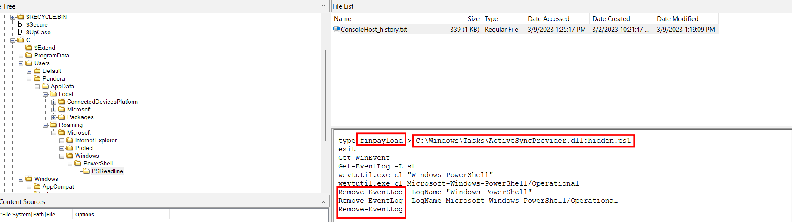
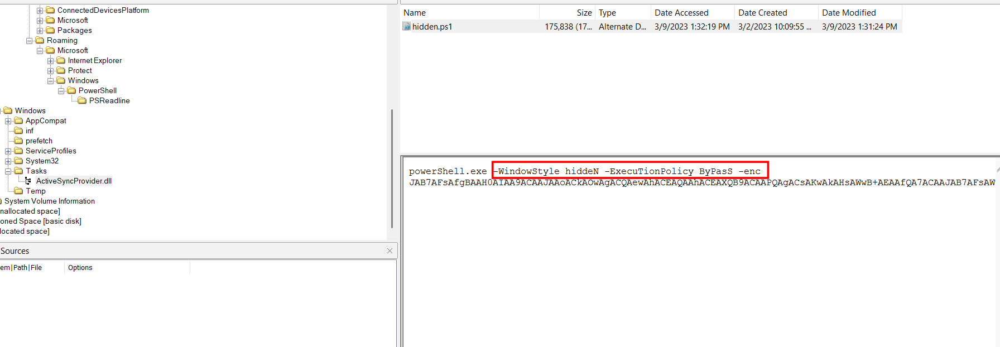
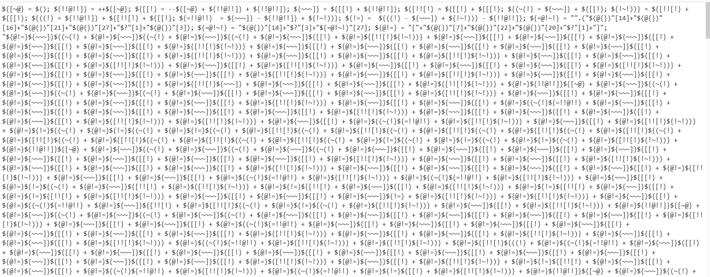
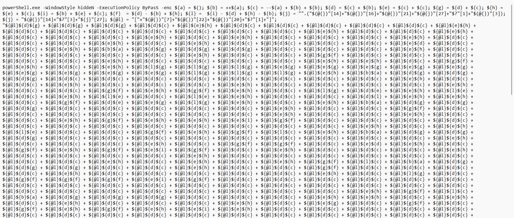
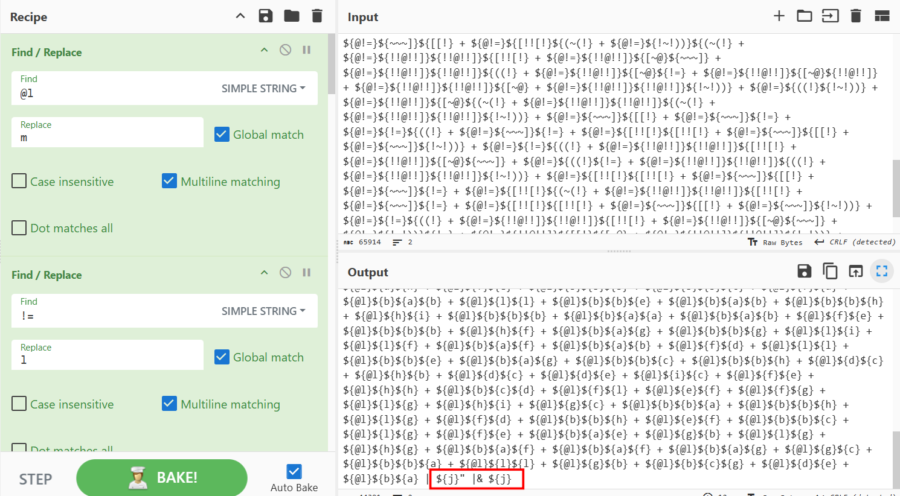
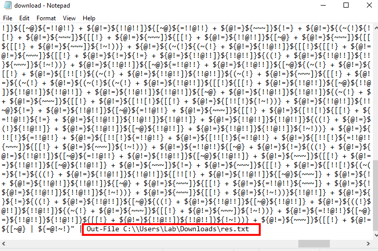
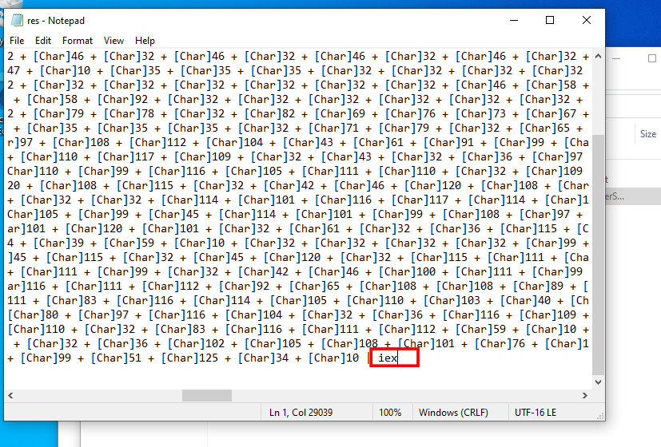
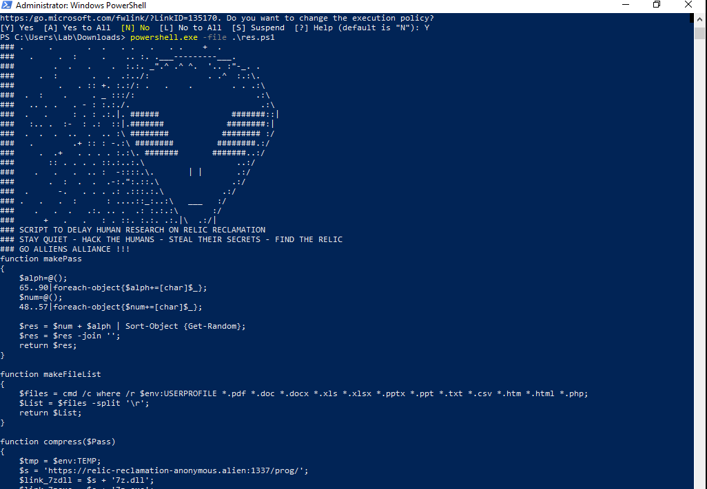
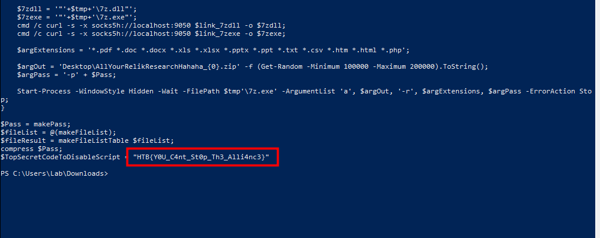

# Artifact of Dangerous Sighting

## Scenario

Pandora has been using her computer to uncover the secrets of the elusive relic. She has been relentlessly scouring through all the reports of its sightings. However, upon returning from a quick coffee break, her heart races as she notices the Windows Event Viewer tab open on the Security log. This is so strange! Immediately taking control of the situation she pulls out the network cable, takes a snapshot of her machine and shuts it down. She is determined to uncover who could be trying to sabotage her research, and the only way to do that is by diving deep down and following all traces ...

## Given artifacts

A .vhdx file, can be opened with FTK Imager

## Initial inspection with FTK Imager

Honestly, I cannot specify in advance where to look at first, I just search for everything present in the directory tree, and finally I see this red flag:

A payload is stored in ADS of a `.dll` file, note that a lot of logs are also cleared to hide their trace. Now let's head for that ADS:

A text-book payload pattern, fire powershell in hidden mode and bypass policy, the main script is very long and has been base64-encoded, let's take it to cyberchef:

I was shocked when looking at this initially, it's terribly obfuscated, I have to ask LLM to know that anything inside {} can be a variable's name, so the malware author just scares us with weird labels, rather than a super complicated encryption algorithm. I perform a sequence of find-replace to make it more readable:

Note that `$()` is considered `$null`, or 0 if treated as a number, so `$a` is initialized to 0, then `$b` is 1, `$c` is 2 ..., finally it constructs a sequence of variables with value from 0 to 9. what is more, the script also makes use of two built-in values, `@{}` is an empty hash table, but when forced to be in form of a string like `"@{}"`, it will take the value `System.Collections.Hashtable`, and `$?` is a built-in variable that checks if the last variable is successful, as the previous math is correct, it takes value `True` . 

**So let's see what is being done with `$j` and `${@l}`:**

- Initially, those characters form a word "insert", so at that line: `${j}="".("insert")`, this worths explaining more, normally, we would use it like `"some_string".insert(index,string_to_insert)`, this means : run this method. But if we just call `"".("insert")`, it will return the PSMethod Object, think of it like a signature, and the signature of that method is `string Insert(int startIndex, string value)`, that will be $j's value.

- So $j's final value is "i+e+x"=iex !

- $@l's value is [Char]

Look at this, the final command is $j, which is iex ! So we must remove it, even when executing in VM or sandboxed environment. I save the cyberchef output to a .ps1 file and transfer that to my Windows VM, then remove the iex part, and replace it by Output-File, efficiently save the decoded script into a new file:

This is the result, also the decoded script:

I will reuse this script to get the true payload, but first of all let's remove the dangerous iex, then I set all the Char... block to a variable $res, then echo $res; , run that new ps1 file, the result is as follow:

The flag is never our ultimate goal in a CTF, let's see what this script does:

- function makePass(): it takes ASCII character from 65 to 90, and 48 to 57, corresponding to A-Z and 0-9, respectively. Then completely shuffle them to make a password

- function makeFileList() utilizes windows cmd to recursively search for specific file's extensions in User Profile

- function compress() is the most crucial part, it dynamically downloads 7zip from the attacker's server and drop them into temp folder, note that they use port 9050, the default port for Tor network, efficiently hide their IP address and bypass firewall.

`Flag: HTB{Y0U_C4nt_St0p_Th3_Alli4nc3}`

## Key takeaways:

From this challenge, we first reinforce FTK imager inspection skill to find suspicious ADS, then learn a very clever obfuscation method with powershell built-in value, and this challenge also forces me to install a Windows VM, so I can reuse the attacker's script to assist the deobfuscation process.