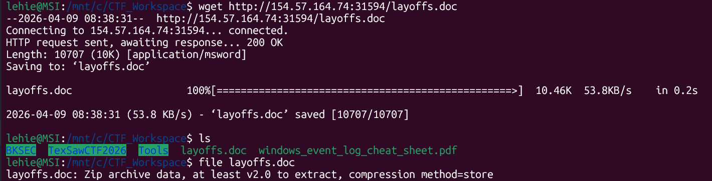
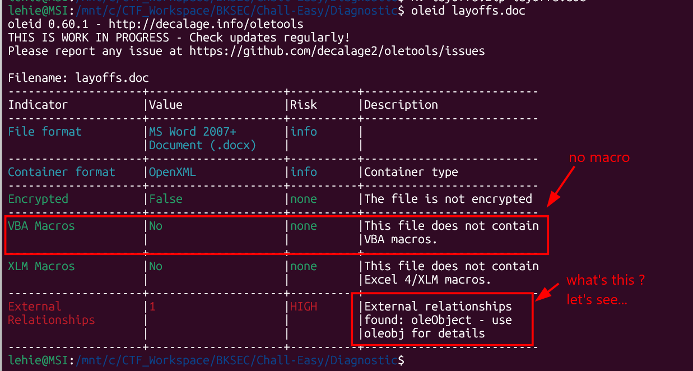
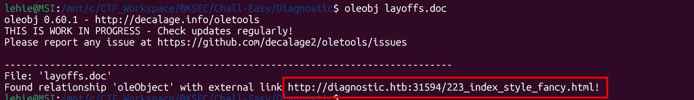
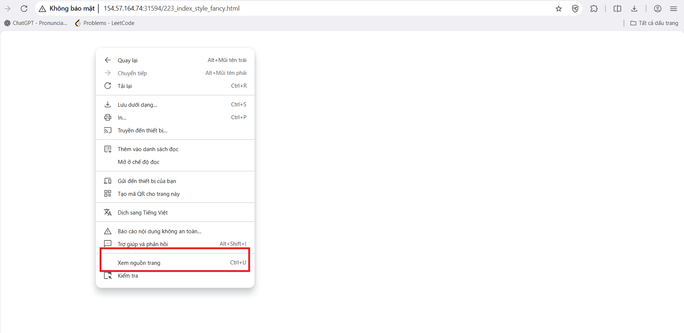
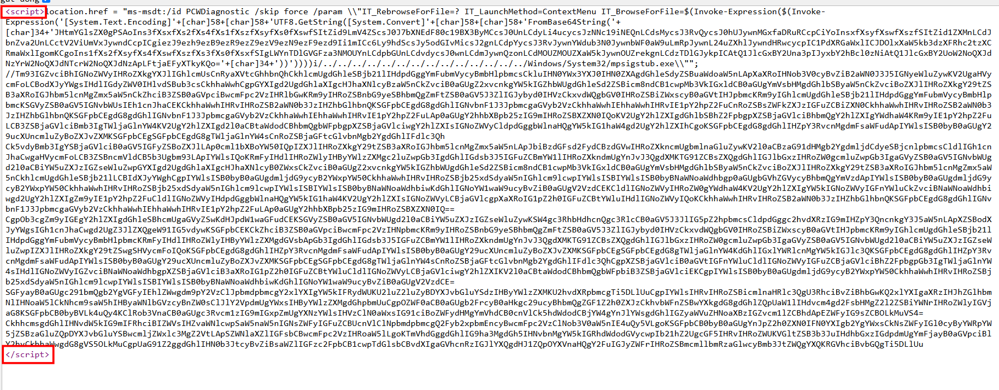
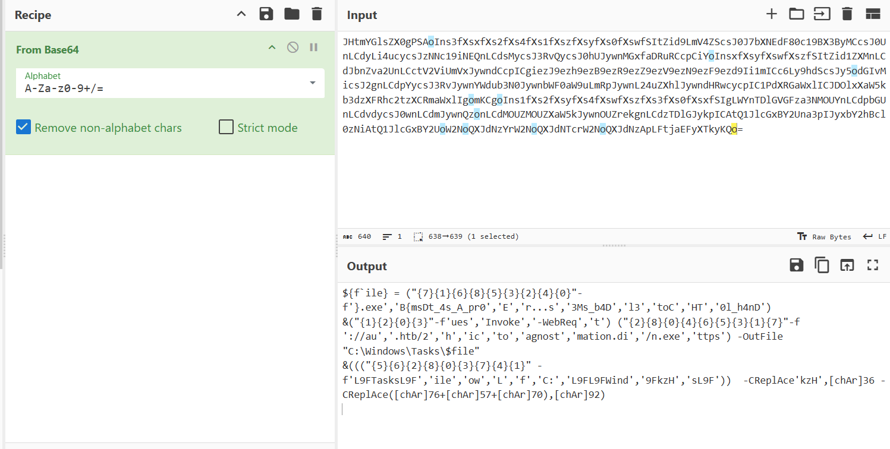
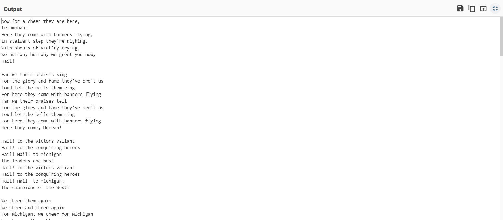
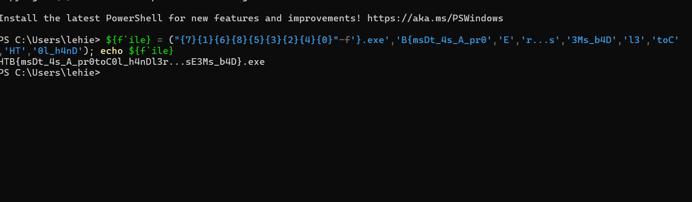

# Diagnostic

## Scenario

Our SOC has identified numerous phishing emails coming in claiming to have a document about an upcoming round of layoffs in the company. The emails all contain a link to diagnostic.htb/layoffs.doc. The DNS for that domain has since stopped resolving, but the server is still hosting the malicious document (your docker). Take a look and figure out what's going on.

## Given artifacts

A malicious document

## Solving process

At first I run olevba at it as an instinct, but there is no macro, so let's run oleid to get an overview of this document:

Here comes a new field that I have never encountered before, up to now I only know macro, anyway let's follow that command:

Replace that domain with the docker instance's IP address, we get ... a blank page, but a blank web page does not mean nothing, let's view page source:

As expected, a malicious script is hidding behind the blank page. After a few external searches, I know that this is not a miracle where powershell code can be injected into a webpage, but it is [CVE-2022-30190 "Follina"](https://vngcloud.vn/security-advisories-cve-2022-30190-zero-click-zero-day-microsoft-office-rce-) being abused. By and large, this CVE tries to exploit [Microsoft Support Diagnostic Tool (MDST)](https://en.wikipedia.org/wiki/Microsoft_Support_Diagnostic_Tool), and it worst case it may lead to RCE. It has two method of exploiting, the primary method is via malicious MS Office document like Word/RTF, it use remote template feature (Relationships attribute in XML structure that navigates Word to download some samples/resources from an URL or an IP, this is what we found with `oleid`) to pull down a malicious HTML file, and the secondary method is via direct browser like `location.href` as illustrated above, but this is scarce, no one would carve the document to get the relationship except for security people like us

Another CVE related to MSDT is [CVE-2022-34713 "DogWalk"](https://nvd.nist.gov/vuln/detail/cve-2022-34713)

Perhaps we deviated too far from this challenge, let's return. The script is rather straight-forward, no obfuscation, take two base64 strings to cyberchef:

The former is what we want, the latter is just a stupid poem, copy the string format code to powershell and remove the malicious part, just print the flag:

`Flag: HTB{msDt_4s_A_pr0toC0l_h4nDl3r...sE3Ms_b4D}`