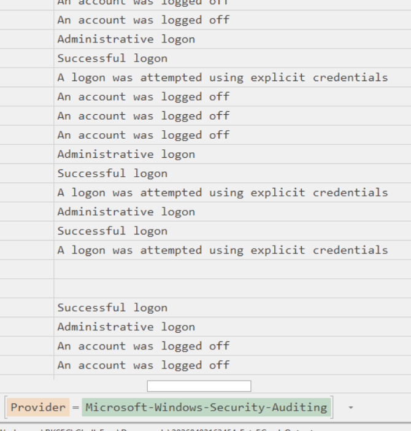
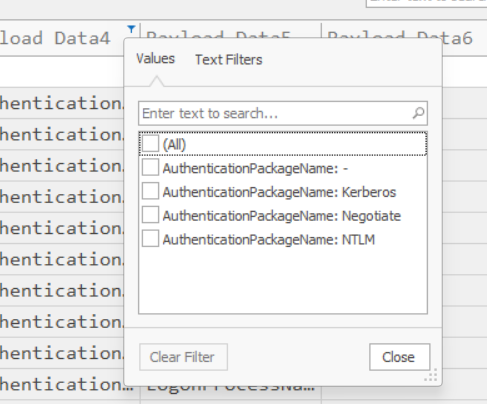
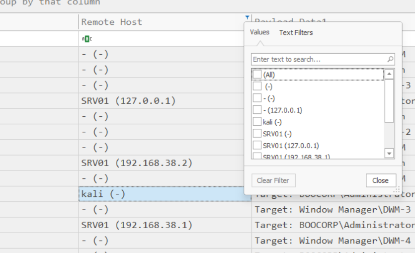
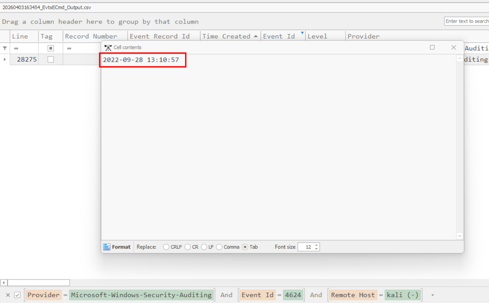

# Downgrade

## Scenario 

During recent auditing, we noticed that network authentication is not forced upon remote connections to our Windows 2012 server. That led us to investigate our system for suspicious logins further. Provided the server&#039;s event logs, can you find any suspicious successful login? To get the flag, connect to the docker service and answer the questions.

## Given artefacts

A logs folder containing Windows Event Logs, EvtxECmd's time

## Answering question

*1. Which event log contains information about logon and logoff events?*

A basic question, definitely SECURITY

**Answer: security**

*2. What is the event id for logs for a successful logon to a local computer?*

**Answer: 4624**

*3. What is the default Active Directory authentication protocol?*

No need to inspect the log, we all know that it is KEBEROS

**Answer: keberos**

*4. Looking at all the logon events, what is the AuthPackage that stands out as different from all the rest?*

There are 4 Authentication packages: NTLM, Negotiate, Keberos and -, I don't know what really means "stands out" as each of them has more than 1 log entry, I just try all and get the answer.

**Answer: NTLM**

*5. What is the timestamp of the suspicious login ?*

This is when the problem really comes, what is considered 'suspicious' ? Initially, I try looking for abnormal login time, but all login attempts are made in regular hours. So in Timeline Explorer, I try to inspect all visible columns, clicking on the filter icon in each column will yield all values available, and I see a weird remote host here, Kali is not strange for us, but for normal user, that's a red flag:

What's more, only 1 entry for this remote host, so that must be the one we need

**Answer: 2022-09-28T13:10:57**

`Flag: HTB{34sy_t0_d0_4nd_34asy_t0_d3t3ct}`