# Fake Boost

## Scenario

In the shadow of The Fray, a new test called &quot;Fake Boost&quot; whispers promises of free Discord Nitro perks. It&#039;s a trap, set in a world where nothing comes without a cost. As factions clash and alliances shift, the truth behind Fake Boost could be the key to survival or downfall. Will your faction see through the deception? KORP™ challenges you to discern reality from illusion in this cunning trial.

## Given artefacts

A packet capture file, wireshark again ! (or not ?)

## Start with wireshark

Initially, the high ubiquity of UDP makes me suspect that it is the culprit:

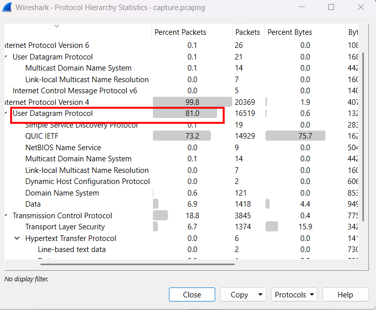

But then I realize that it is decoy, the culprit is here, a HTTP request for "free" Discord Nitro perks, in this day and age, nothing seems to be free...

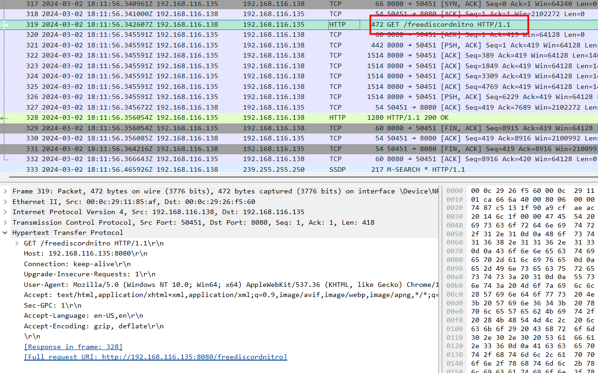

The response was indeed a `.ps` powershell code, I extract it as HTTP object, and its content is as follow:

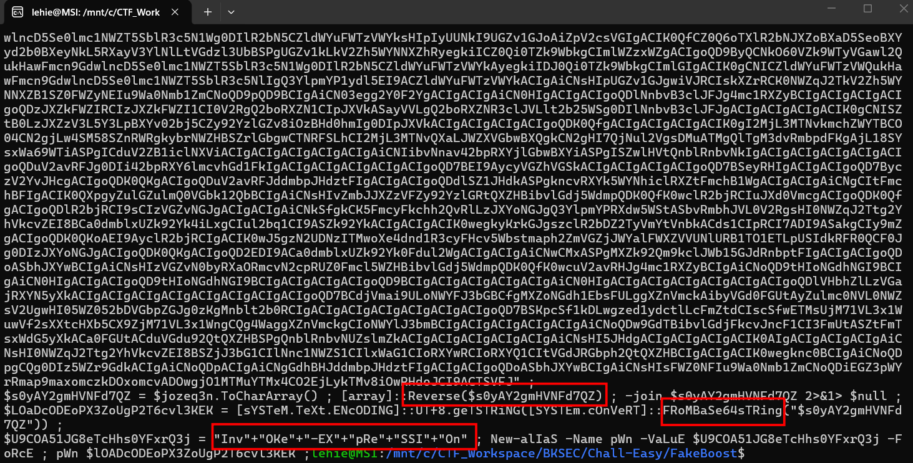

It reverses and base64-encodes the payload, and use Invoke-Expression disguised as pwn to run that script, I put that massive string to cyberchef:

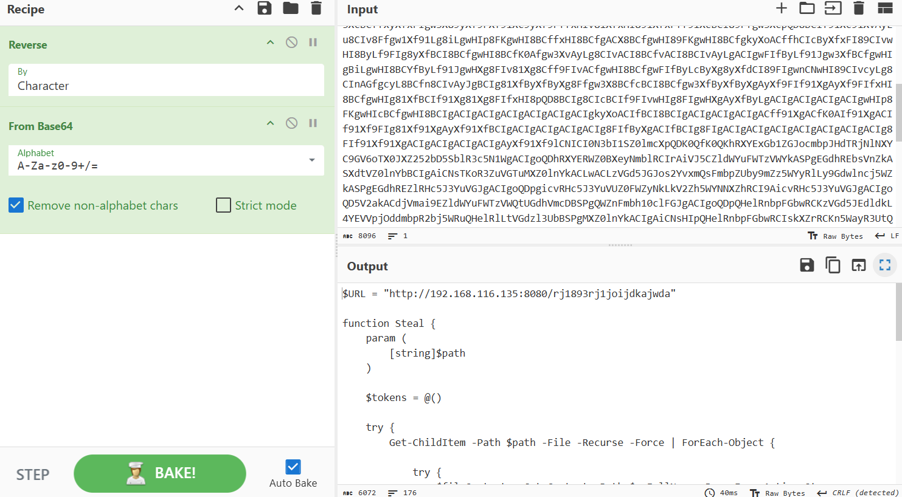

Let's break the script down:

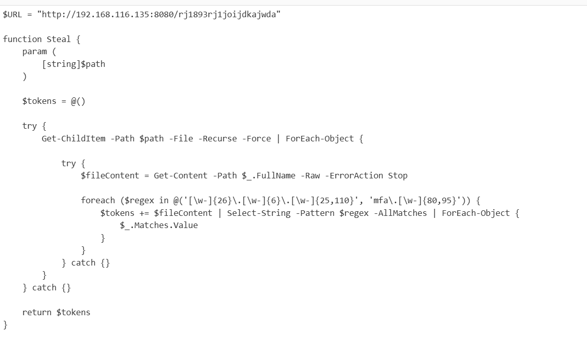

This function tries to steal user's token with a specific format defined by regex

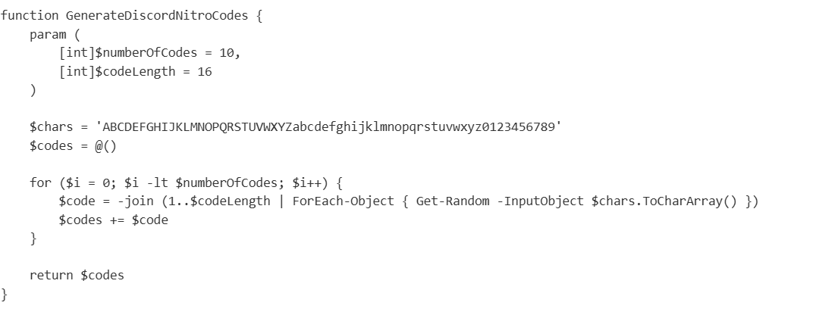

This function generates random fake Nitro code to deceive user

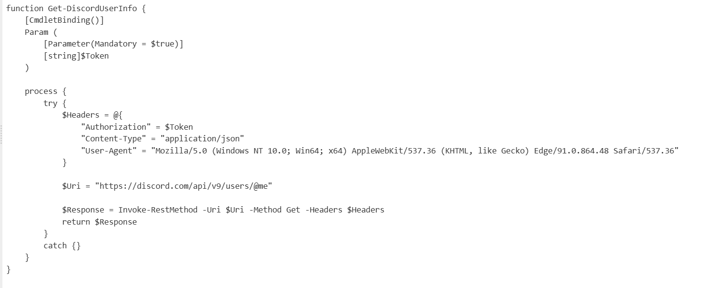

This function uses the stolen tokens to get victims' information

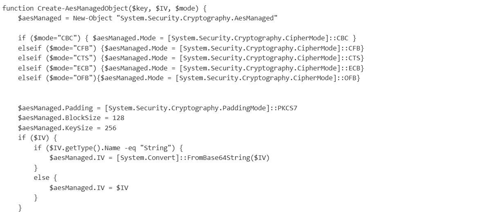

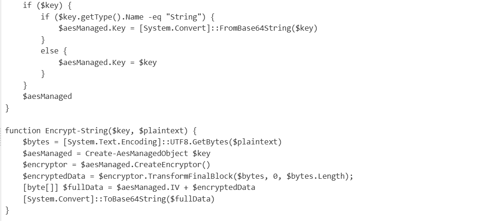

This function leverages AES to encrypt the stolen data before sending back to the attacker's server

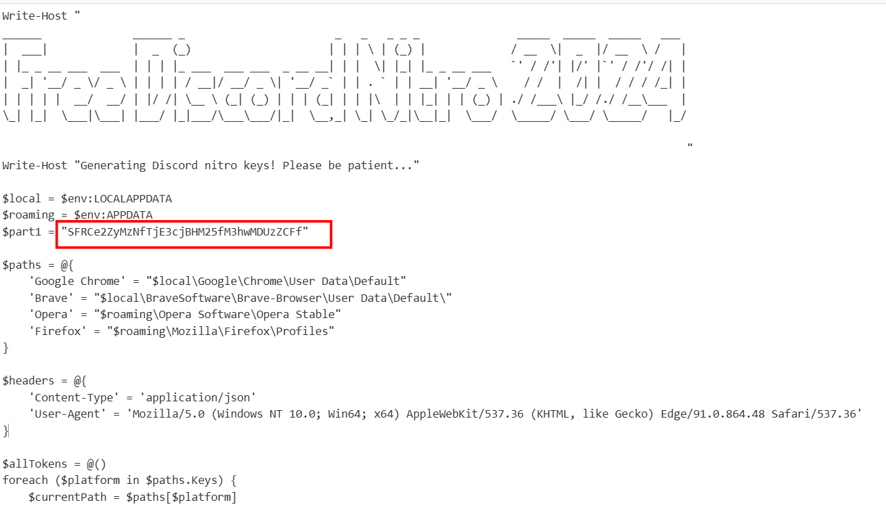

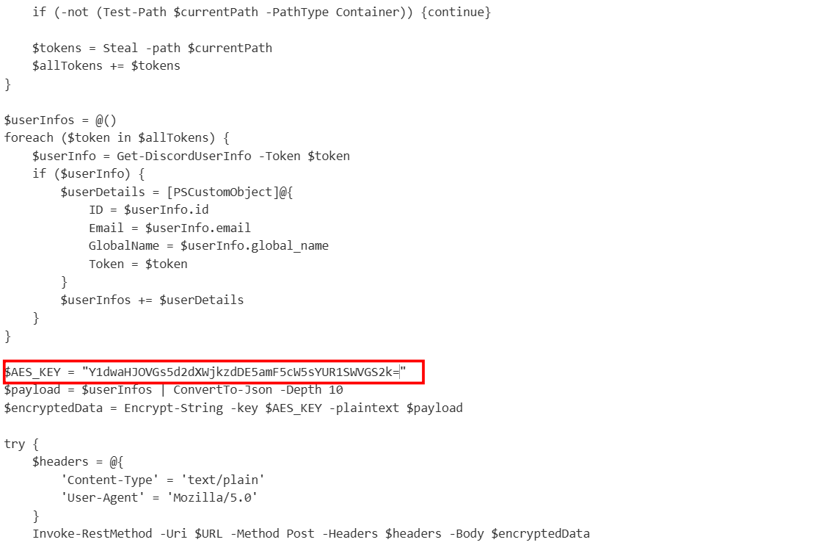

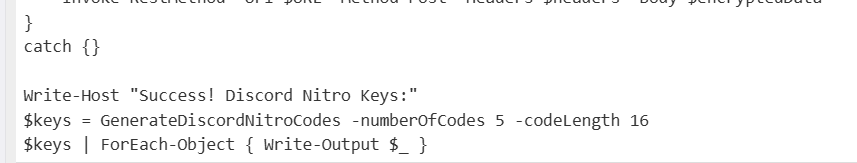

This is the main interface that victim sees, it sets up paths to steal users' tokens, and use these tokens to get their information. What's more, it also contains the first piece of flag, and the AES key used for encryption

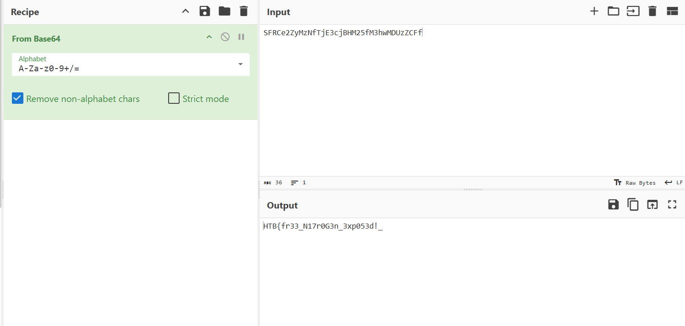

Filter for HTTP packets to find the POST request back to the attacker's server:

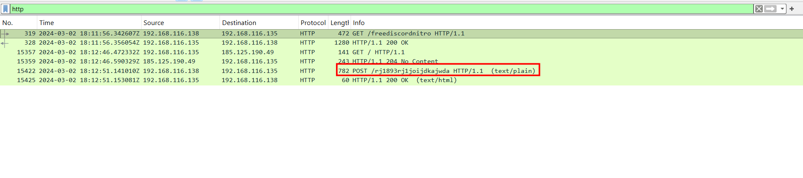

As we got the AES key, and Initialization vector is append to the head of the result, I can decode the data from that POST request using cyberchef:

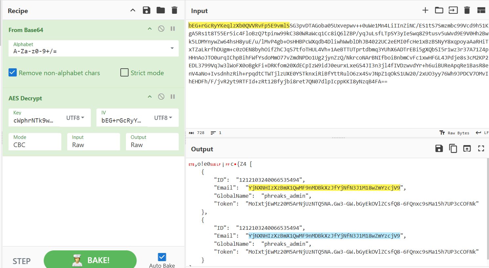

Decode that base64 chunk yields the latter part of the flag:

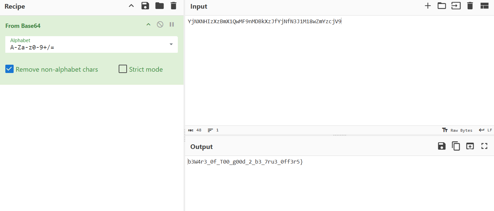

`Flag: HTB{fr33_N17r0G3n_3xp053d!_b3W4r3_0f_T00_g00d_2_b3_7ru3_0ff3r5}`

