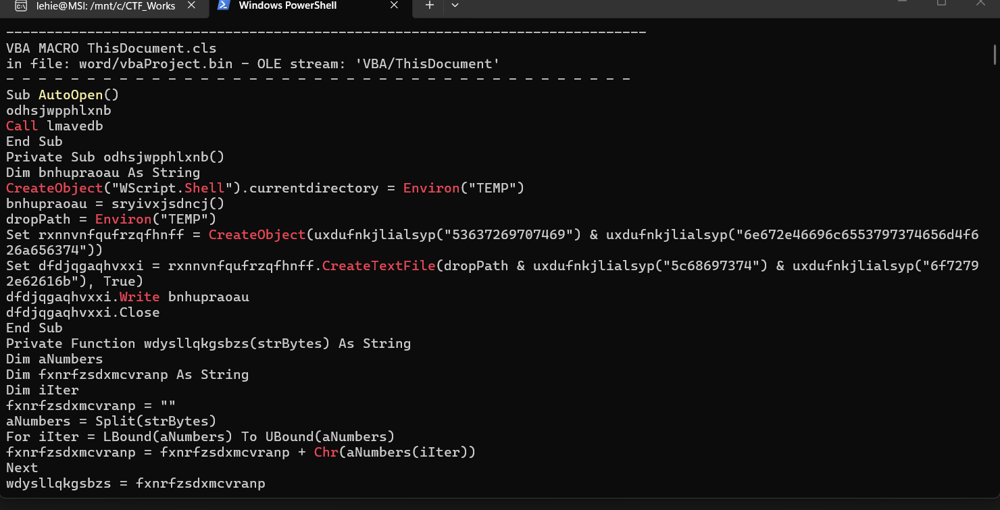
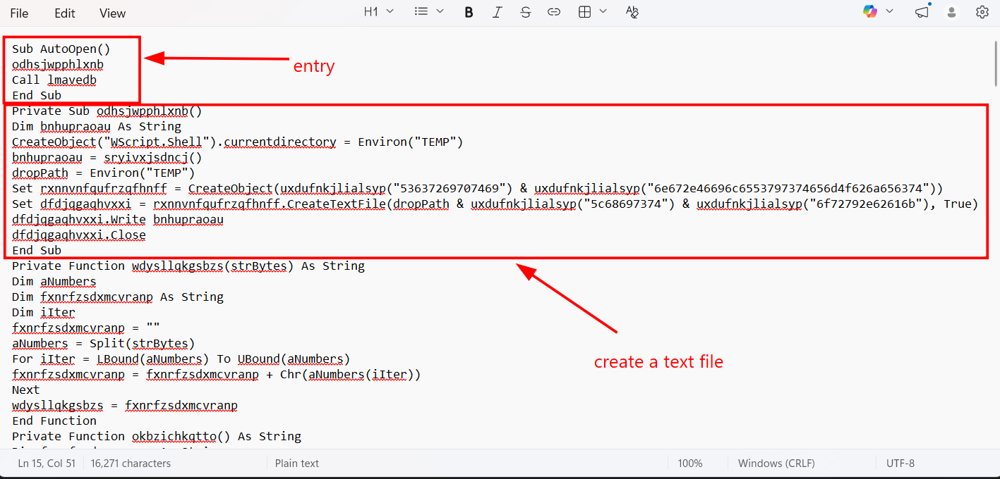
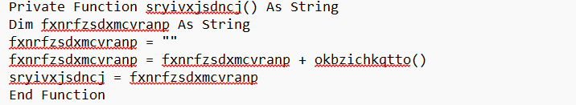
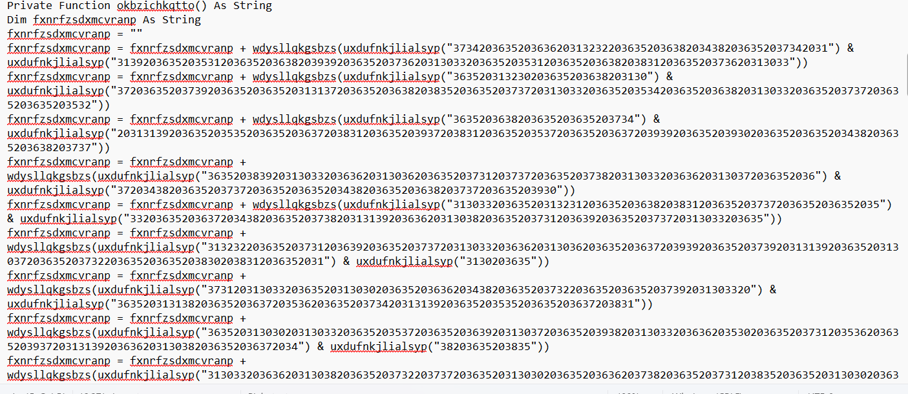
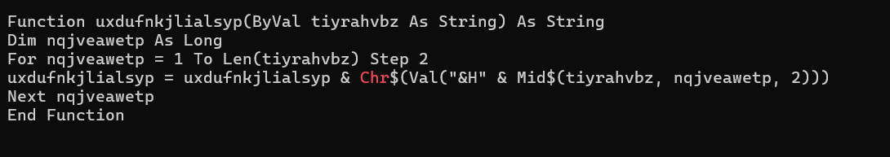
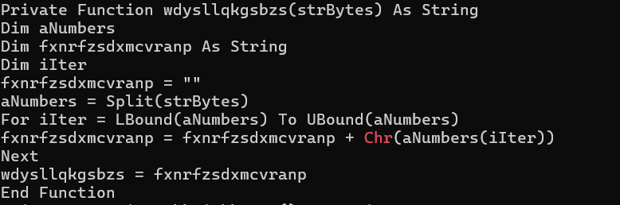
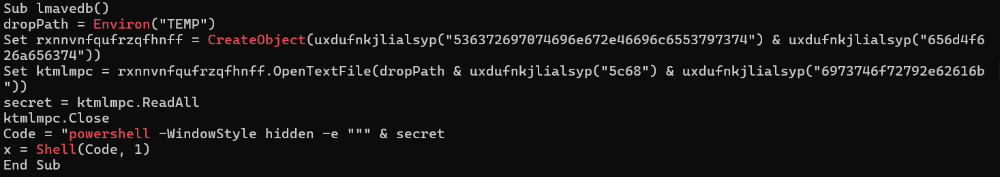
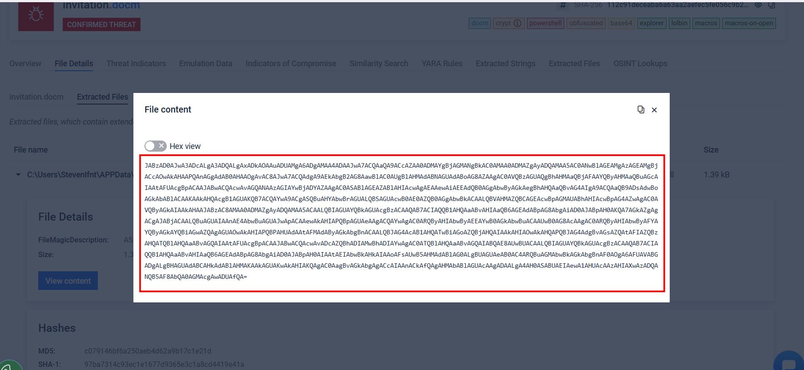
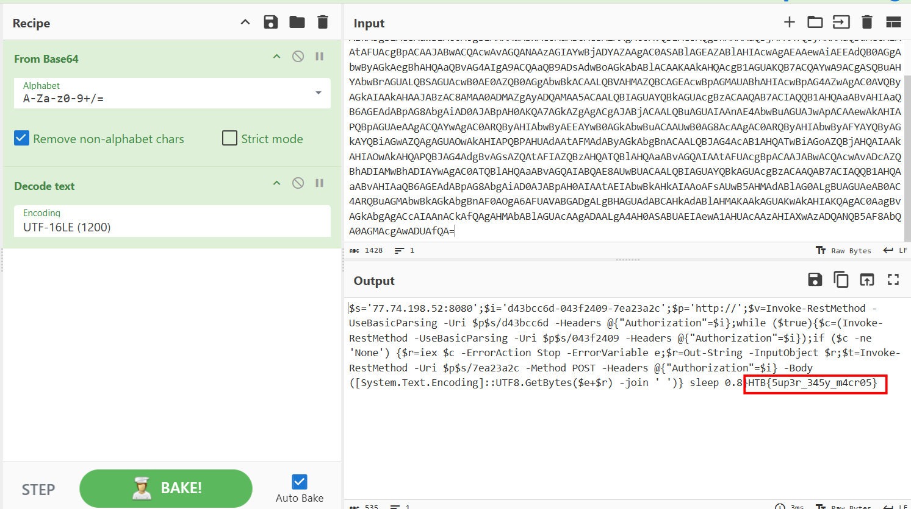

# Halloween Invitation

## Scenario

**An email notification pops up. It's from your theater group. Someone decided to throw a party. The invitation looks awesome, but there is something suspicious about this document. Maybe you should take a look before you rent your banana costume.**

## Given artefacts

A word document, a familiar sign of macro

## Solving process

Run olevba on that document, the macro malware is rather long and heavily obfuscated:

I copy it to notepad for easier navitigation

odh...() tries to create a file in %TEMP% directory, content of the file comes from sry..() function, and the path is constructed with the help of the helper function uxdu...()

sry..() function simply call okb...() and return its result as a string, let's move to that okb..() function:

Things get clear now, all the chunk of hex will be decoded to normal text with the help of two helper function: wdy...() and uxd...(), let's first rip uxd...() open, its presence is ubiquitous:

It takes a string as input, reads two character each time and appends $H (means hex in VBA) and converts that back to character, joins all character to return as a string.

It reads a list of number, split into single numbers and converts them to character, joins them to return as a string

### Now let's reconstruct the complete behaviour of this macro: 

- The uxd...() helper function is used to form the content of a text file, that file is stored in temp directory, it's also used to form the path of that file.
- The lmavedb() function reads that file and store to a variable $secret, pass it tp powershell in hidden mode to stealthly execute it

Now let's decode this using an online platform, `filescan.io`:

This is the output file that is going to be executed, and it has been base64-encoded:

Take it to cyberchef and we get the flag, but let's see what is it behaviour:

- The malware initializes three variables to construct its network requests: $s: The attacker's C2 server IP and port (77.74.198.52:8080), $i: A unique identifier (d43bcc6d-043f2409-7ea23a2c). It uses this as an Authorization header to authenticate itself to the C2 server, proving it's a valid victim.
Notice how the script cleverly breaks the $i string into three chunks and uses them as the URI paths for different stages of the attack (/d43bcc6d, /043f2409, and /7ea23a2c).
- Before doing anything else, it sends a GET request to `http://77.74.198.52:8080/d43bcc6d`. This simply registers the compromised machine with the C2 server, letting the attacker know the implant is active and ready.
- The while ($true) loop is the heartbeat of the malware : It reaches out to the C2 server (/043f2409) to ask, "Do you have any commands for me?" .If the server responds with anything other than 'None', it proceeds to execution. It runs sleep 0.8 at the end of every cycle. A sleep time of 0.8 seconds is an incredibly aggressive, noisy beacon interval, meaning the attacker wants real-time interactive control.
- When a command is received ($c), the script uses iex (Invoke-Expression). This is a massive red flag in PowerShell analysis. iex takes whatever string the C2 server sent and executes it directly in memory as PowerShell code. It also neatly captures any errors into the variable $e and the output into $r.
- Finally, it packages the command output ($r) and any error messages ($e), converts them into a UTF-8 byte array, joins them with spaces, and sends them back to the C2 server via an HTTP POST request to the third URI (/7ea23a2c).

`Flag: HTB{5up3r_345y_m4cr05}`