# Intergalactic Recovery

## Scenario

Miyuki's team stores all the evidence from important cases in a shared RAID 5 disk. Especially now that the case IMW-1337 is almost completed, evidences and clues are needed more than ever. Unfortunately for the team, an electromagnetic pulse caused by Draeger's EMP cannon has partially destroyed the disk. Can you help her and the rest of team recover the content of the failed disk?

## Given artefacts

We are given 3 disk image files, based on the description, this should be [RAID 5](https://www.techtarget.com/searchstorage/definition/RAID-5-redundant-array-of-independent-disks) disks. I will summarize noticeable features of  of this disk:

- RAID 5 is a storage configuration level that uses data striping combined with distributed parity to balance performance, data security, and cost efficiency.

- Striping: Data is broken into chunks and written across multiple drives simultaneously to increase access speed.

- Parity: Error-correction information (parity) used for data recovery is calculated and distributed across all drives in the array (rather than being stored on a single dedicated drive)

- It requires at least 3 hard drive to set up. If we have 3 drives, each has capacity 1TB, then when building a RAID 5 disk, we have 2 TB, the remaining 1TB is used to store parity data.

**Pros:** 

- Fault Tolerance: It can withstand the failure of exactly 1 drive without data loss or system downtime.

- Fast Read Speed: Data is read in parallel from multiple drives.

- Storage Efficiency: Better space utilization than RAID 1 (which loses 50% of capacity to mirroring).

**Cons**

- Slower Write Speed: Writing is slower than RAID 0 because the system must calculate parity before writing data.

- Rebuild Time: If a drive fails, rebuilding the data onto a replacement drive can take a long time and temporarily reduce system performance.

## Solving process

Given 3 drives, we can immediately recognize that this disk is corrupted based on its size:

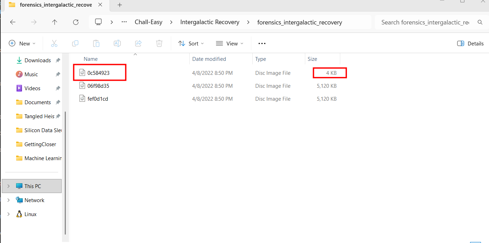

Now we will try to recover them, first I ask LLM for the principle:

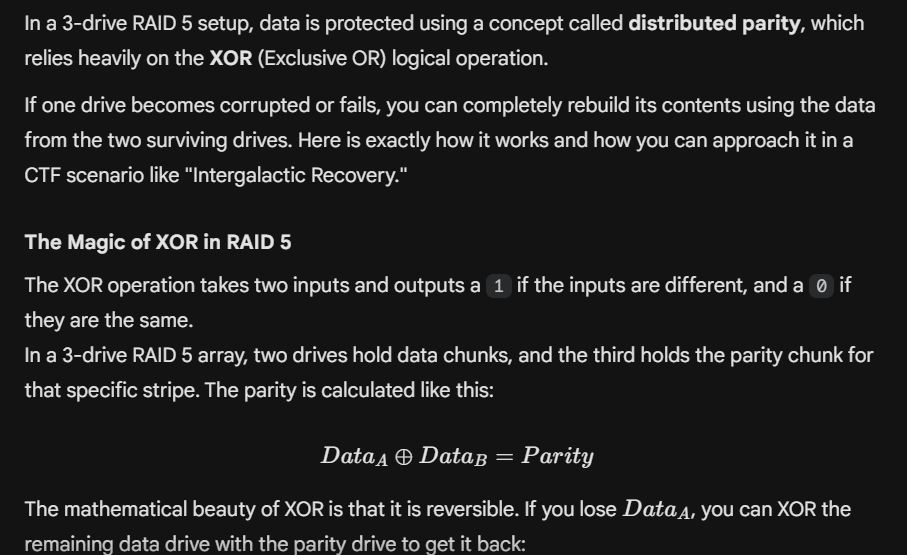

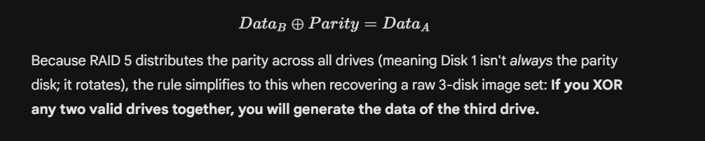

Now let's construct a python script to recover the corrupted drive, leveraging pwntools:

```python
from pwn import *
import os

os.system('clear')

disk1 = read('fef0d1cd.img')
disk2 = read('06f98d35.img')
disk3 = xor(disk1, disk2)

write('disk3.img', disk3)
```

**But now there comes the problem!** , how can we know the true order ? RAID 5 uses distributed parity, that means the parity's location will be changed for each row, hence the name Stripe. Suppose the correct order is 1->2->3:

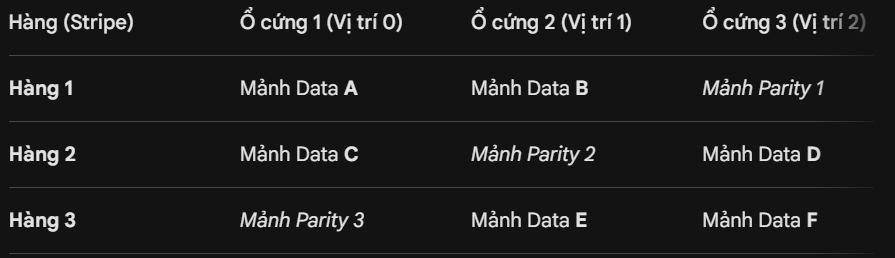

If we shuffle the drives, the operating system, Linux here, will not be able to read it properly. In principle, it will scan from right to left, top to bottom, efficiently read two blocks each row (in case of 3 drive as the example). For more drives, the parity will move from right to left, forming a diagonal (left-asynchronous). If the drive is not in the correct order, Linux may read data together with parity block, and the file system will corrupt

Hence in this case, we have to choice but to 'brute force', there are 3 drive images, thus 6 ways to sort the disks in total. First we must run `losetup` so that Linux will treat these image files as real hard drives. After that I try run `mdadm` with --assemble flag, assuming the superblock holding information about position, order, and the array's parameters for each block is still intact. However, I was too naive, the author has removed all of them:

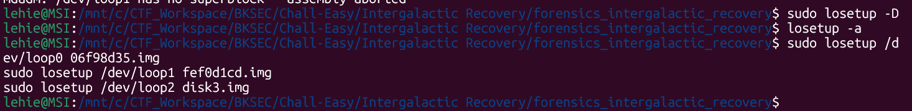

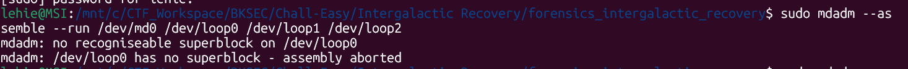

Ah, in case you don't know `mdadm` yet, it is not in the normal flow when we mount an image file. In normal case, we run `losetup` to tell Linux to treat the image file as a real hard drive, then run `mount` to mount it so we can browse like normal. But in RAID 5 disks, remember the distributed parity ? `mdadm` will handle the assemble phase, forming a complete hard drive for Linux to read before we can mount it.

Now that we cannot use --assemble flag, we need to construct the disk from scratch with --create flag, and also, the --assume-clean flag. What is --assume-clean ? Well, when we run --create, there may be chance that the OS will reformat the drive and overwrite something, when adding this flag, we ensure with the OS that these 3 drives have been perfectly formatted.

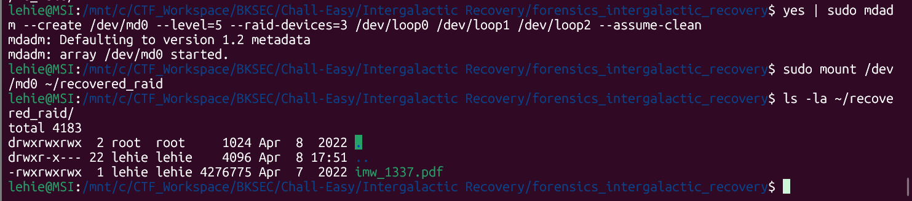

Here come a pdf file, but life is not like a dream, it's corrupted, so our order should be wrong:

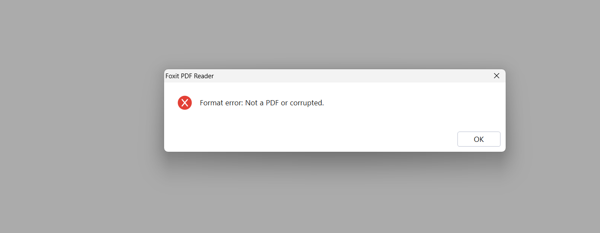

Before retrying, we need to umount the disk, and stop the array md0:

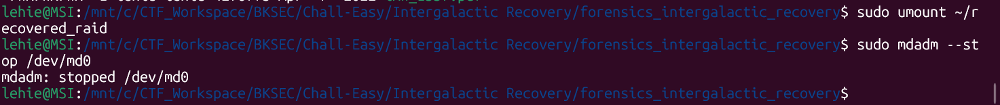

After retrying 0-2-1, the file can be opened, but it is still not visible:

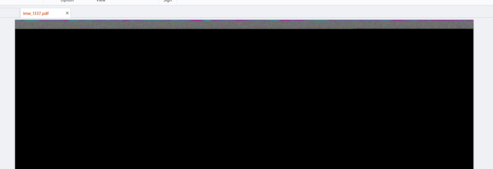

Finally, 1-2-0 is the correct order, the pdf file is recovered:

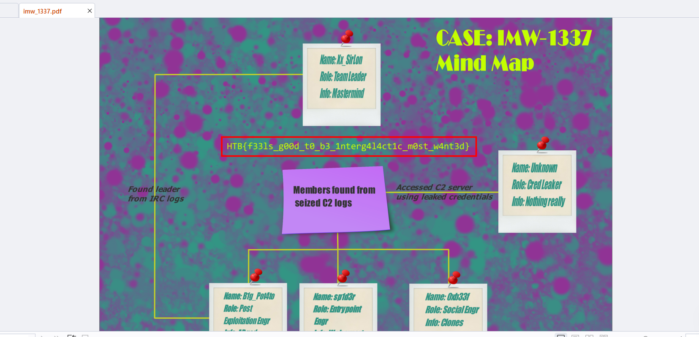

`Flag: HTB{f33ls_g00d_t0_b3_1nterg4l4ct1c_m0st_w4nt3d}`