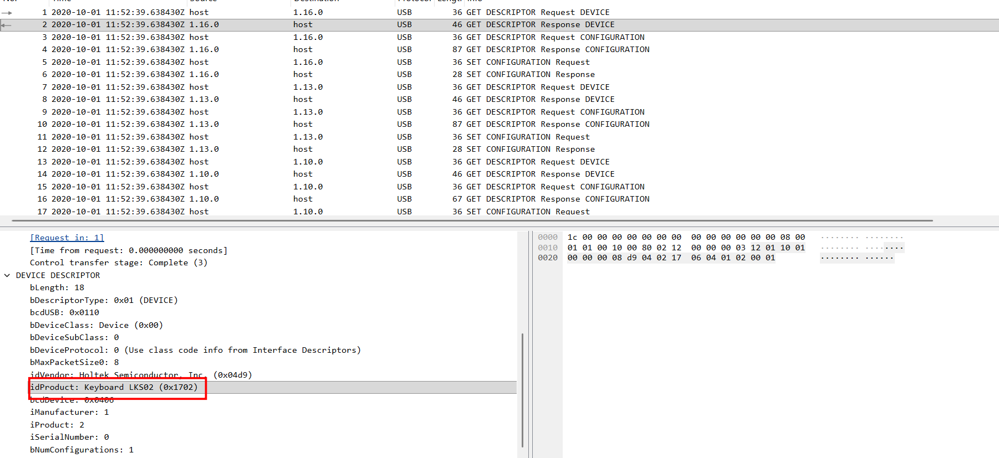
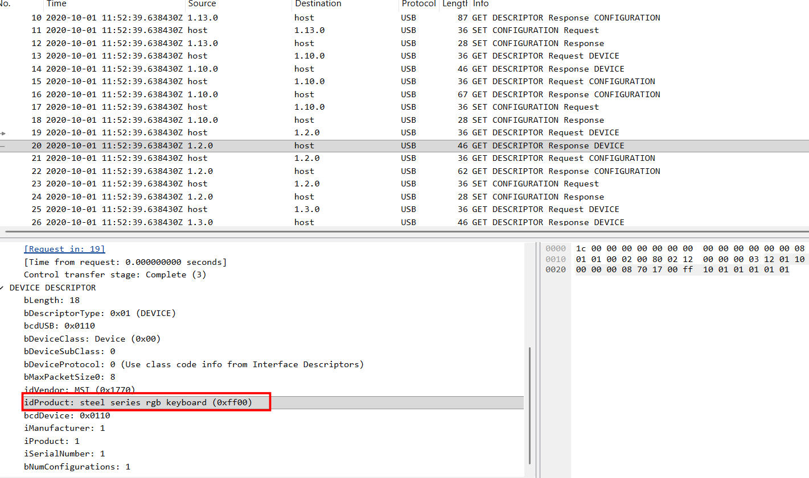
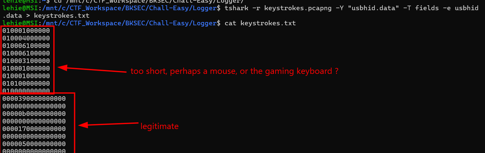
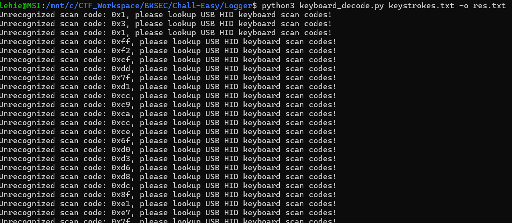
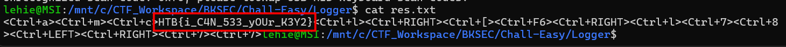

# Logger

## Scenario

**A client reported that a PC might have been infected, as it's running slow. We've collected all the evidence from the suspect workstation, and found a suspicious trace of USB traffic. Can you identify the compromised data?**

## Given artefacts

This description reminds me of **AmericanBee** from the training challenges. We are also given a pcap file with *USB* protocol.

## Solving process

Take a look at the 'GET DESCRIPTOR Response DEVICE' packets, we notice that `1.16.0` is a keyboard, `1.13.0` is a mouse, `1.10.0` is card reader

`1.2.0` is another keyboard ?, perhaps the user uses a separate keyboard along with the built-in of his MSI laptop, as gaming laptop's keyboard may use different USB code that does not follow the standard 8 bytes code, we may have to rely on the standard keyboard above.

Anyway, I use tshark to extract all usbhid.data from the capture file, the result contains some weird code, but let's try decoding them all:

As expected, a lot of lines cannot be decoded, by the standard ones still works:

`Flag: HTB{i_C4N_533_yOUr_K3Y2}`

