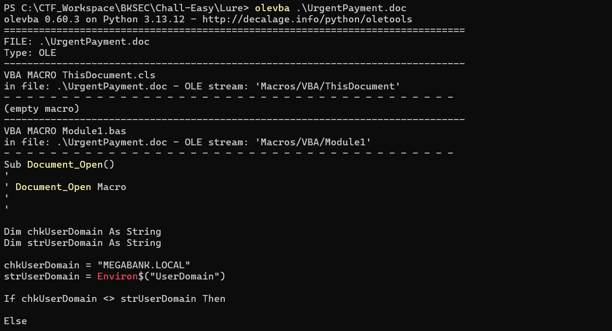
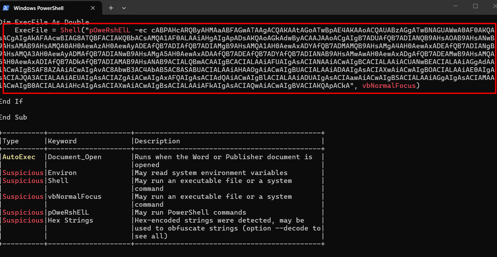
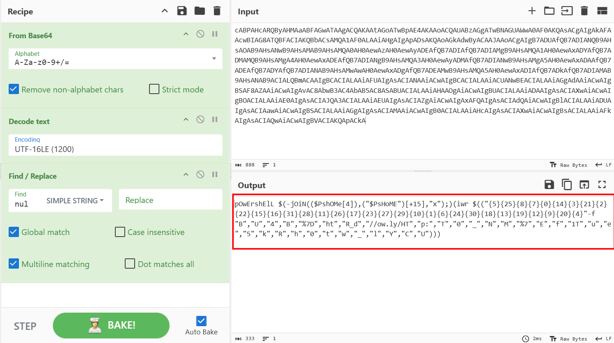

# Lure

## Scenario:

**The finance team received an important looking email containing an attached Word document. Can you take a look and confirm if it&#039;s malicious?**

## Given artefacts:

The problem description rings a bell, and the attachment confirms it, a word document, definitely the infamous macro!

## Solving process

Run olevba, a tool from dedicated oletools reveals the malicious script inside that document:

It first checks whether the user's domain matches its target, then a suspicious base64-encoded script is executed, decode that with cyberchef yields the following result:

### Let's break it down piece by piece:
- powershell is case-insensitive, so mixed casing can bypass some simple string-based detection
- Then it takes advantage of join function to stealthly call iex (invoke-expression), as if it call iex directly then it stands a good chance of triggering an alert, note that $PsHome holds PS's installation path, likely `C:Windows\System32\WindowsPowerShell\v1.0`, so the 4-th character is i, 15-th character is e.
- iwr stands for invoke-webrequest, next is the -f operator, this takes the array of strings on the right and plugs them into the numbered placeholders on the left.

- Reconstructing the url yields : `http://ow.ly/HTB{k4REfUl_w1Th_Y0UR_d0cuMeNT5}`

The flag is just for this challenge, in real attack, the actual payload will be placed here

`Flag: HTB{k4REfUl_w1Th_Y0UR_d0cuMeNT5}`