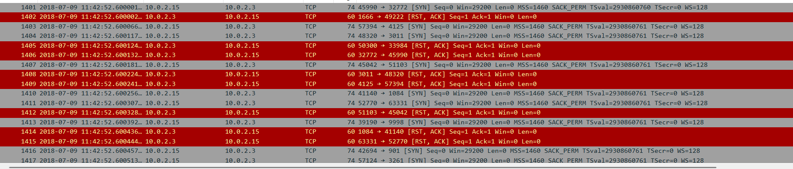
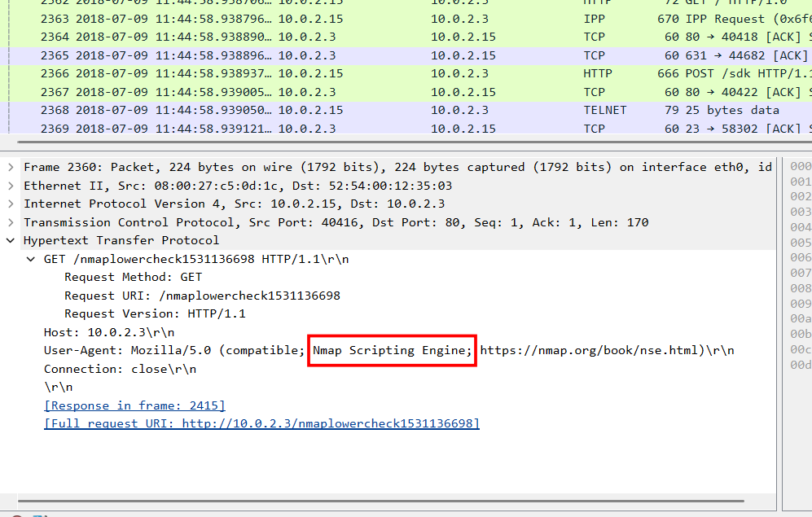
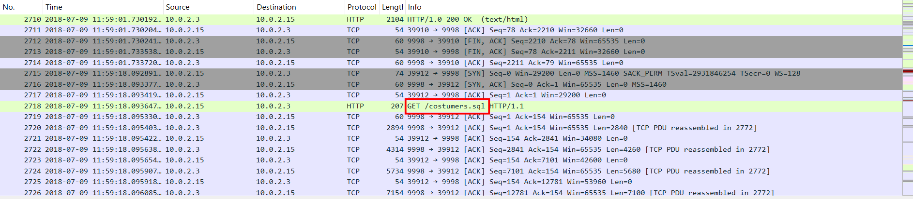
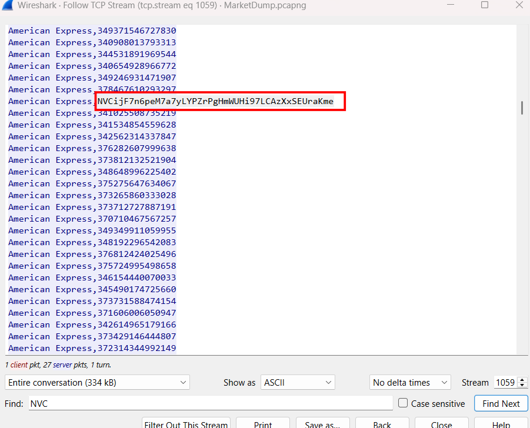
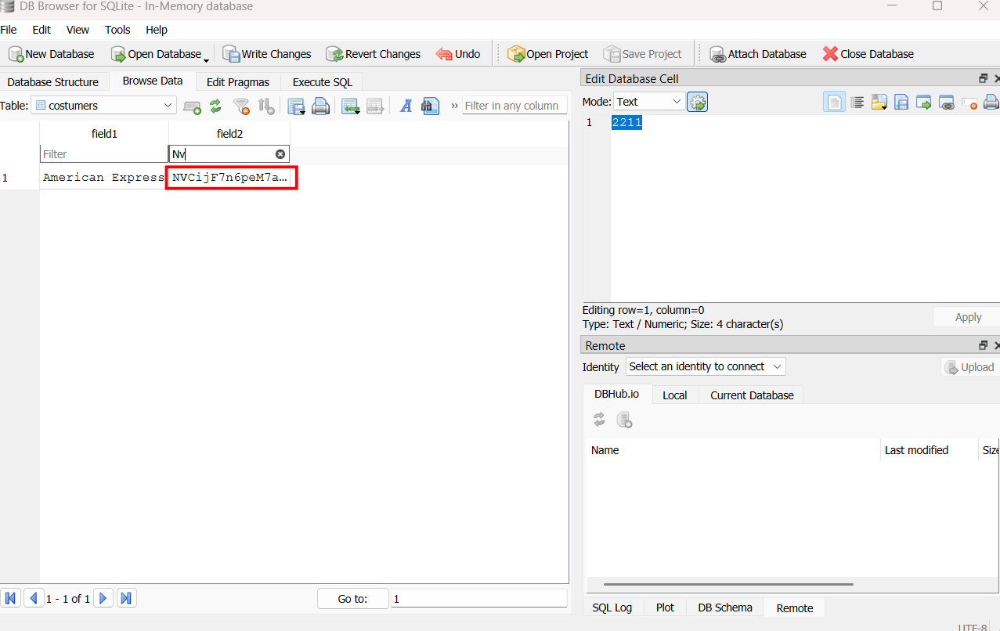
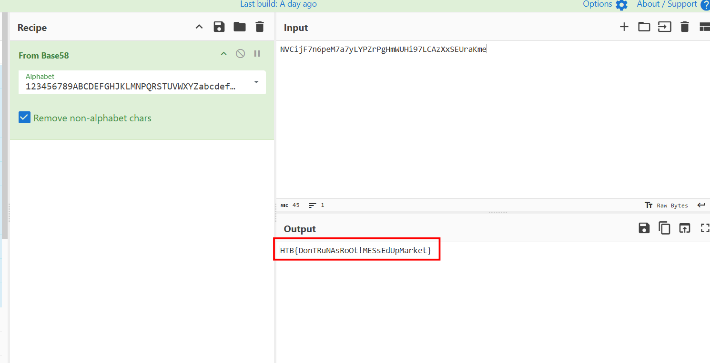

# MarketDump

## Scenario

**We have got informed that a hacker managed to get into our internal network after pivoiting through the web platform that runs in public internet. He managed to bypass our small product stocks logging platform and then he got our costumer database file. We believe that only one of our costumers was targeted. Can you find out who the customer was?**

## Given artefacts

We are given a packet capture file, wireshark is ready!

## Solving process

At first glance, we can notice that scanning attempt is made by the malicious IP, this is vertical scan, where a specific IP is targeted and multiple ports are scanned

Looking at some scan attempts where port serving http is targeted, we can see the tool used is nmap. Aften the reconaissence phase, attacker repeatedly request for the home page and some weird directory that server always answer with Bad Request or Not Found, I cannot deduce which technique they are leveraging, but then I see they can request for the sensitive database here:

Following http stream to see the response, we can notice an entry that stands out from the remaining:

Or we may as well export the sql file and open it with DB Browser:

Decode that string with cyberchef:

We get the flag, even though I'm still wondering about what they did to get access to that file...

`Flag: HTB{DonTRuNAsRoOt!MESsEdUpMarket}`