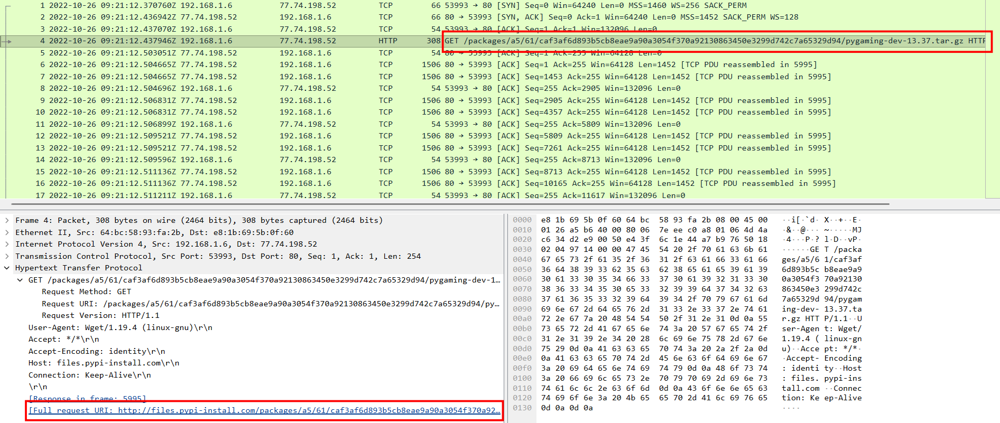
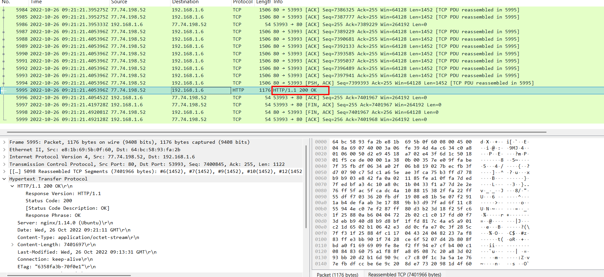
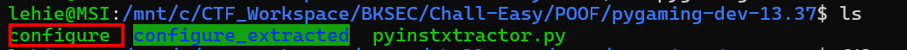
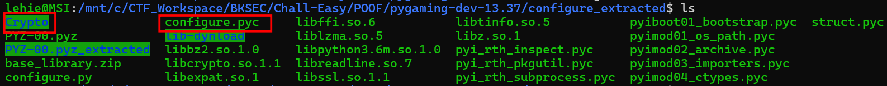
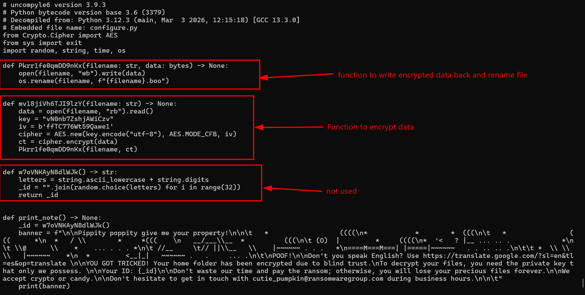
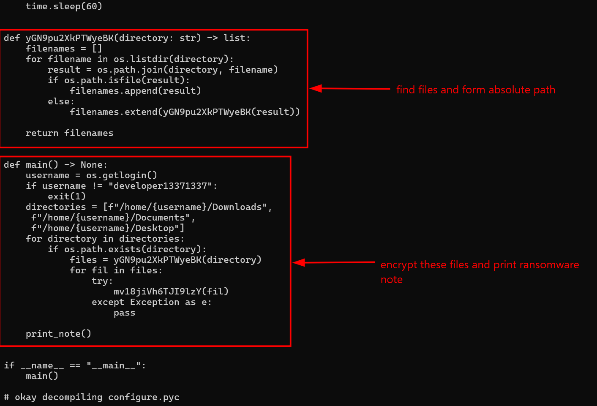
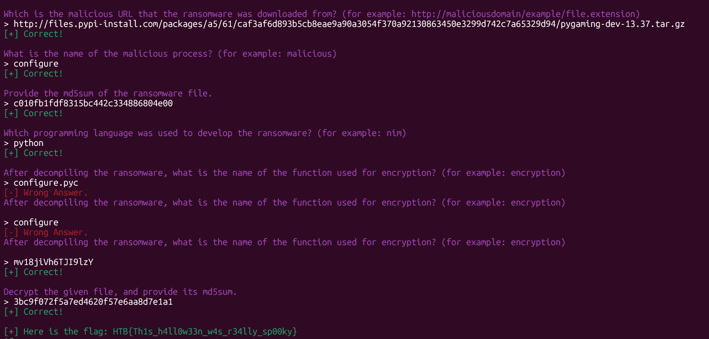
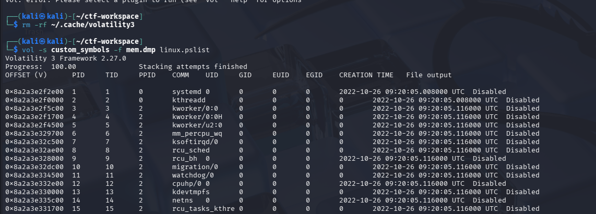
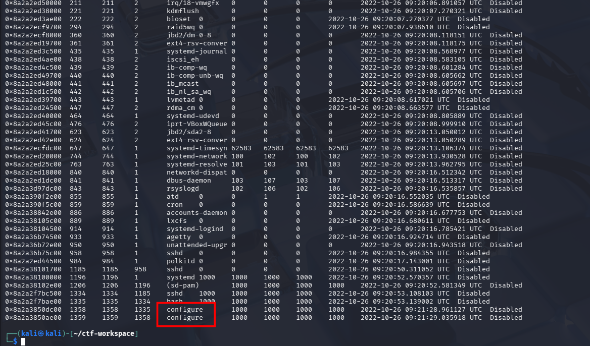

# POOF

## Scenario
**In my company, we are developing a new python game for Halloween. I'm the leader of this project; thus, I want it to be unique. So I researched the most cutting-edge python libraries for game development until I stumbled upon a private game-dev discord server. One member suggested I try a new python library that provides enhanced game development capabilities. I was excited about it until I tried it. Quite simply, all my files are encrypted now. Thankfully I manage to capture the memory and the network traffic of my Linux server during the incident. Can you analyze it and help me recover my files? To get the flag, connect to the docker service and answer the questions.**

## Given Artefact

Apart from the familiar pcap file, everything is weird file that I don't  even know what to do with it. After some external searches and LLM prompts, I know that the .boo file is simply the encrypted file, and the memory dump is from Linux, so we cannot easily inspect it with volatility like windows dump, the given directory consists of configuration details will help us inspect the dump. Anyway I do not need the dump file to solve this challenge, but I will try to figure out the way to open it.

## Getting started with Wireshark

Open the pcap file, the only thing I find valuable is the HTTP GET request and the corresponding response:





This is the "python library that provides enhanced game development capabilities" that user mentioned, I export it as HTTP object then decompress it with gunzip, then tar. That's all, we are done with wireshark now, time to inspect the python package.

## Dive into the python library

At first, looking at the file marked as ELF executable, I use ghidra to reverse-engineer it, but I cannot read anything, I should not have done this at all. Then I realize that this huge ELF is just a packages python script, the malware author used PyInstaller to bundle their Python ransomware into a standalone Linux executable.



Note that I capture this when I solve the challenge, so only pay attention to which is highlighted.

So now we will leverage `pyinstxtractor` to rip it open:

`wget https://raw.githubusercontent.com/extremecoders-re/pyinstxtractor/master/pyinstxtractor.py`

`python3 pyinsxtractor.py configure`



After loading, the script suggests us some of the possible entry point, one of them is the `configure.pyc` file, the same name as the installer. What's more, I notice the presence of Crypto module, the script must have taken advantage of this module to encrypt user's file.

Return to the `configure.pyc` file, we suspect it, but it is python bytecode, compiled and not meant for human to read, we need to use some tool to convert it back to standard .py source code. Luckily, this bytecode uses python 3.6, and I can use `uncompyle6` ao attain this goal:





It crawls Desktop, Document, Downloads folder and stores all file path to encrypt it with AES, luckily the key and initialization vector are hard-coded here. And from the function used to rename file, we know that the .boo file we are given is going to be rescued.

Using this script:

```python
from Crypto.Cipher import AES

key = b"vN0nb7ZshjAWiCzv"
iv = b"ffTC776Wt59Qawe1"

with open("candy_dungeon.pdf.boo","rb") as f:
    encrypted_data=f.read()

cipher=AES.new(key, AES.MODE_CFB, iv)

decrypted_data=cipher.decrypt(encrypted_data)

with open("candy_dungeon_decrypted","wb") as f:
    f.write(decrypted_data)

```

We successfully recover the file, without touching the dump file!



`Flag: HTB{Th1s_h4ll0w33n_w4s_r34lly_sp00ky}`

## Revisit the Linux memdump file

It still **upset** me when I cannot touch a given artefact. As I know, windows memfor is rather straightforward, Microsoft controls it, so the memory structure is strictly standardized, thus volatility and easily guess the profile and handle it. On the onther hand, Linux is open-source and anyone can compile a different kernel, so we will need to config the profile correctly for volatility to read. The standard process is troublesome, but [this repo](https://github.com/Abyss-W4tcher/volatility3-symbols) can help us a lot. From the given profile folder, we know it is Ubuntu 4.15.0-184-generic. Locate this in the aforementioned repo and download the xz-compressed json profile file. Put it into a folder that we may extend later when we encounter other linux dump files, and run this:



But perhaps the only thing we can do with this dump file is to answer question 2, which we can also guess from the python installer:



