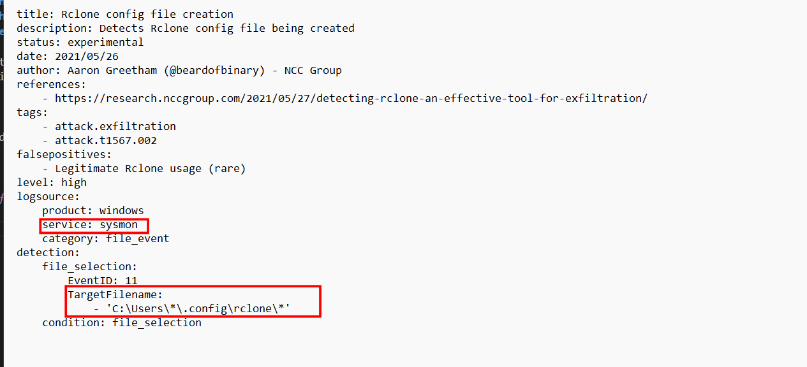
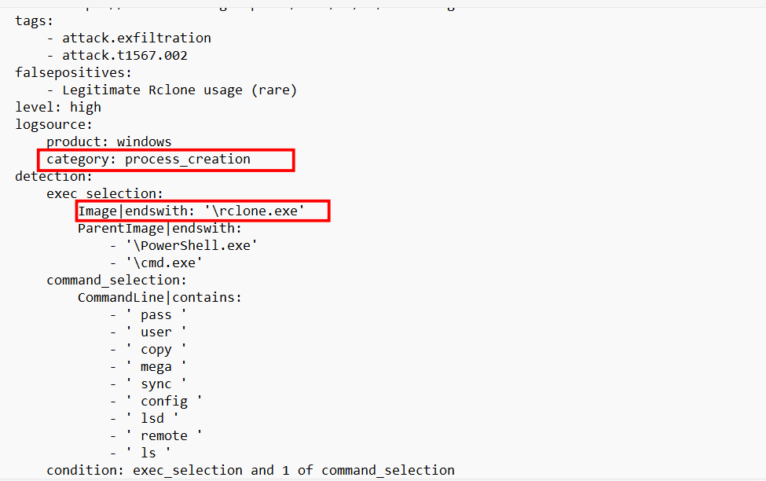
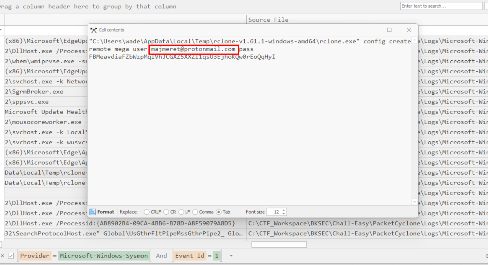
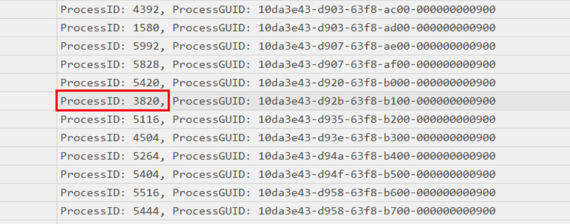
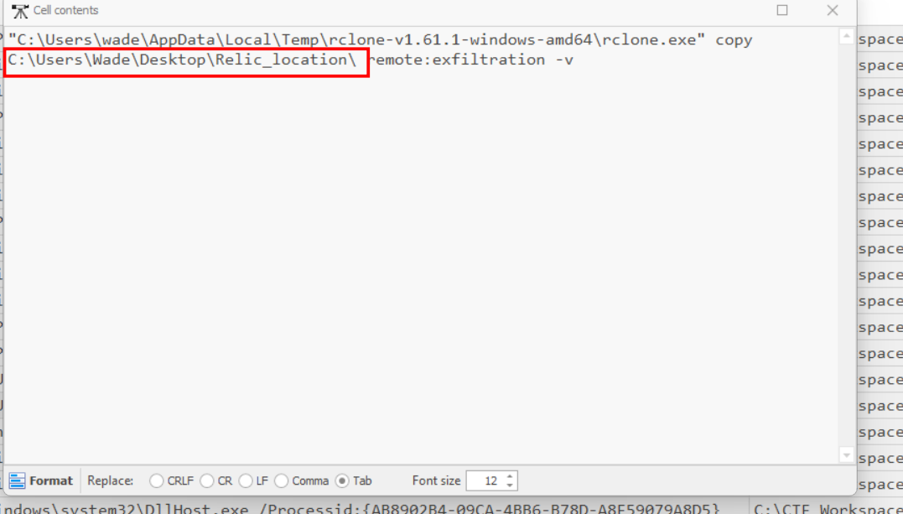
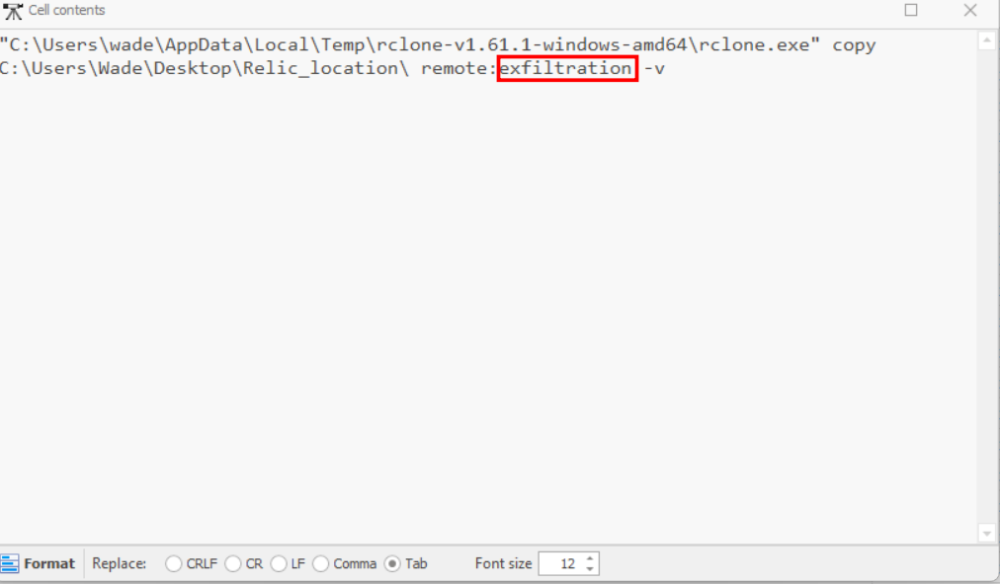
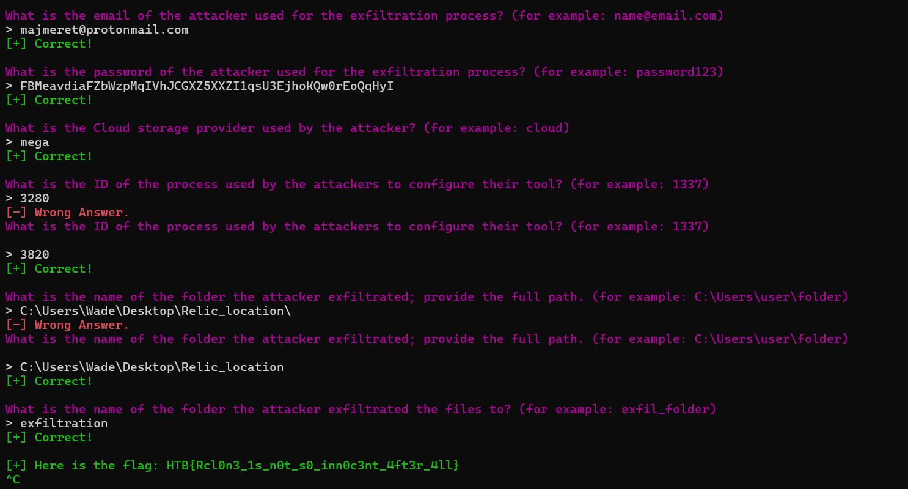

# Packet Cyclone

## Scenario

**Pandora's friend and partner, Wade, is the one that leads the investigation into the relic's location. Recently, he noticed some weird traffic coming from his host. That led him to believe that his host was compromised. After a quick investigation, his fear was confirmed. Pandora tries now to see if the attacker caused the suspicious traffic during the exfiltration phase. Pandora believes that the malicious actor used rclone to exfiltrate Wade's research to the cloud. Using the tool called "chainsaw" and the sigma rules provided, can you detect the usage of rclone from the event logs produced by Sysmon? To get the flag, you need to start and connect to the docker service and answer all the questions correctly.**

The description explicitly mentions that rclone is being used, rclone is a CLI tools used for synchronizing and backing up data between machines and cloud services. Therefore, it could easily be absued for data exfiltration, like in this challenge.

## Given artefacts

With a bunch of logs and two sigma rule files, the description tells us to use chainsaw, but I will still try to solve only with the help of EvtxECmd first.

## Question:

*1. What is the email of the attacker used for the exfiltration process?*

From the rule files, we know that we should use sysmon log, filter for process creation (id 1) and look for entries executing rclone.exe, and I find the answer here:

**Answer: `majmeret@protonmail.com`**

*2. What is the password of the attacker used for the exfiltration process?*

Answer lies in the previous image

**Answer: FBMeavdiaFZbWzpMqIVhJCGXZ5XXZI1qsU3EjhoKQw0rEoQqHyI**

*3. What is the Cloud storage provider used by the attacker?*

The previous log still works

**Answer: mega**

*4. What is the ID of the process used by the attackers to configure their tool?*

Just scroll to the PID column

**Answer: 3820**

*5. What is the name of the folder the attacker exfiltrated; provide the full path.*

After configuring, he began to exfiltrate, the log right after the previous log holds the command executed, and we get the folder here

**`Answer: C:\Users\Wade\Desktop\Relic_location\`**

*6. What is the name of the folder the attacker exfiltrated the files to?*

**Answer: exfiltration**

`Flag: HTB{Rcl0n3_1s_n0t_s0_inn0c3nt_4ft3r_4ll}`

