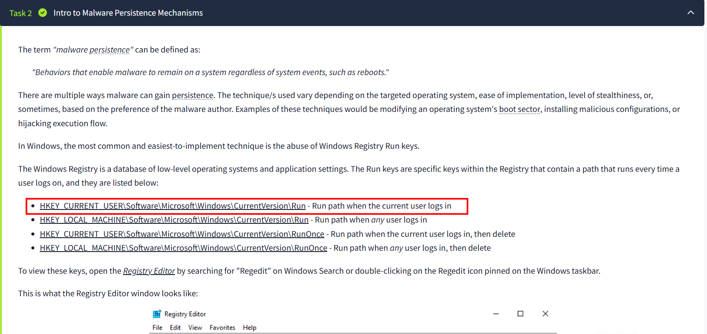
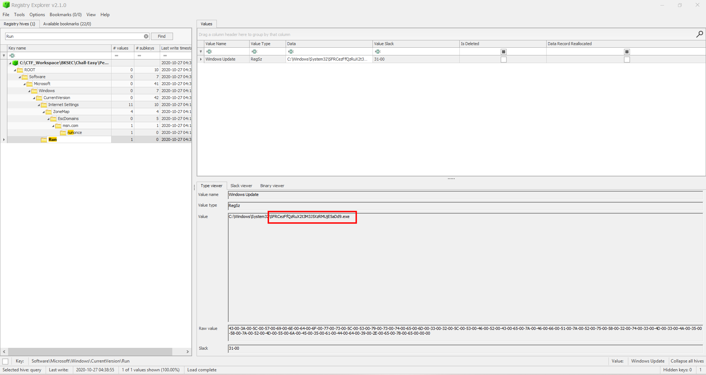
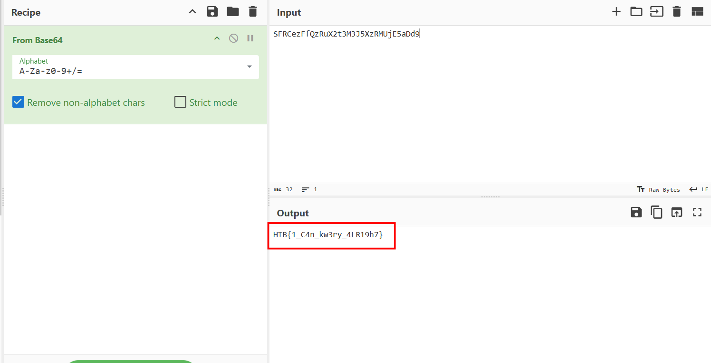

# Persistence

## Scenario

**We're noticing some strange connections from a critical PC that can't be replaced. We've run an AV scan to delete the malicious files and rebooted the box, but the connections get re-established. We've taken a backup of some critical system files, can you help us figure out what's going on?**

This description strongly suggest that the malware has successfully injected something in the registry that helps it remain persistent even after being removed and the system has been rebooted. We are also given a registry file

I opened it using another Eric Zimmerman tool: Registry Explorer. But the knowledge I have about where to search comes from this [TryHackMe room](https://tryhackme.com/room/registrypersistencedetection)

Looking into that place in the registry file:

This is a suspicious process, the name look like a base64 string so I use cyberchef to decode

To my suprise, it is right here, too fast:

`Flag: HTB{1_C4n_kw3ry_4LR19h7}`

To learn more about this topic, such as how to detect persistence via registry, and how to avoid manually checking the file by using powershell module AutoRuns, check the mentioned THM room, that room is free. 