# Silicon Data Sleuthing

## Scenario 

In the dust and sand surrounding the vault, you unearth a rusty PCB... You try to read the etched print, it says Open..W...RT, a router! You hand it over to the hardware gurus and to their surprise the ROM Chip is intact! They manage to read the data off the tarnished silicon and they give you back a firmware image. It's now your job to examine the firmware and maybe recover some useful information that will be important for unlocking and bypassing some of the vault's countermeasures!

## Given artifacts

A binary blob (.bin) file, as the problem description suggests, this is likely an [OpenWRT](https://openwrt.org/) firmware image. OpenWRT is a highly customized, lightweight Linux operating system built specifically for embedded devices, most commonly, network routers. So in this challenge, we are expected to perform forensics on a router's brain

## Intro to OpenWRT

This term is completely new to me, so I have to conduct some research to get some basic concepts of it. Running binwalk -e on the binary blob file yields the following folder:

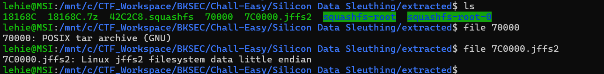

Wandering the OpenWRT's website, I encounter a page about this [specific router](https://openwrt.org/inbox/toh/xiaomi/xiaomi_mi_router_4a_gigabit_edition#flash_layout) ,
let's have a look at the layout:

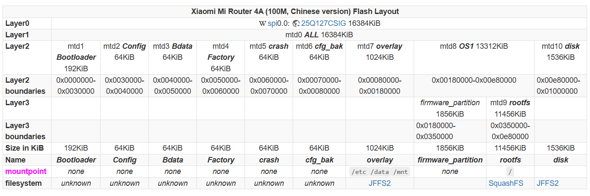

There are a lot of sections splitted into address spaces, each with its own purpose and usage.

The rootfs partition which is mounted under / contains the bare minimum for the system to be operatable and being SquashFS is read-only and highly compressed which makes sense as you'd want it to take up as little space as possible.

On the other hand, the overlay partition contains the user's configuration data and it's mounted on top of the SquashFS partition (hence the name) giving the user a transparent, writeable, configurable filesystem.

## Answering questions

### 1. What version of OpenWRT runs on the router ?

I just blindly find for possible place, at first I thought it should be here:

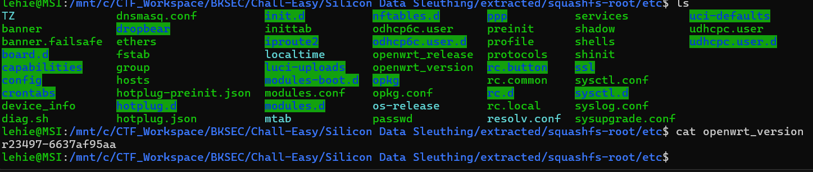

But not, it it in `openwrt_release`:

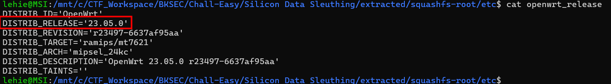

**Answer: 23.05.0**

### 2. What is the Linux kernel version ?

I was tricked again, this file's name makes me think that the answer lies in it, but not:

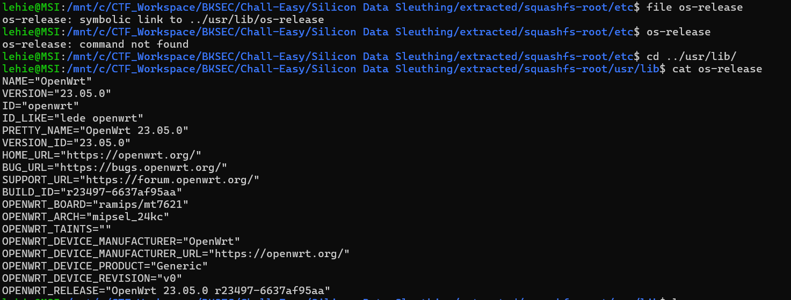

The answer lies in this directory, /lib/modules holds a folder for each kernel version on the system to house the plugins and build tools:

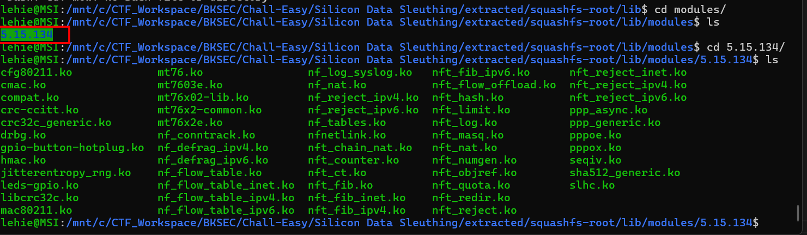

**Answer: 5.15.134**

### 3. What is the hash of the root's account password ?

Our instinct will definitely guides us to these file, but it is not correct:

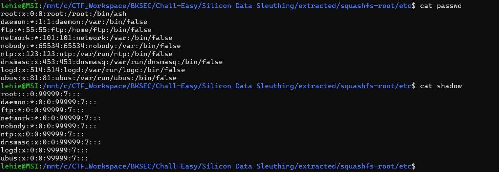

Note that SquashFS is read-only, that mean users cannot change password ? This is a bit unrational, and that's actually false. Our answer lies in the jffs-root partition, which is mounted on top of /etc as descibed in the aforementioned page, but in the given binary blob after running binwalk, I don't see any, so I have to carve it manually:

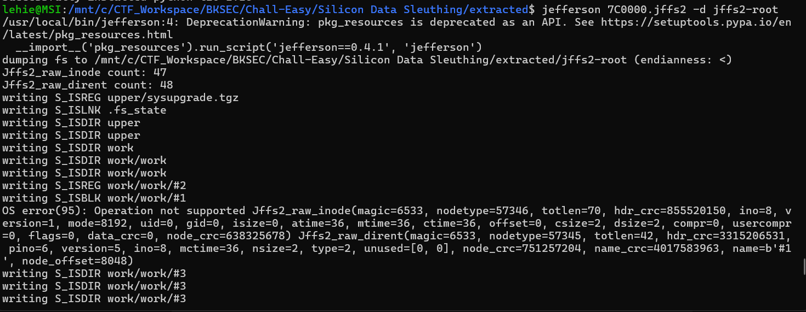

We can imagine SquashFS (read-only) as a printed textbook. You cannot erase the ink.

Now, place a clear plastic transparency sheet over the page. If we want to "edit" a sentence, we use a Sharpie to write the new sentence on the plastic sheet, right on top of the original text, that is JFFS2. SquashFS holds built-in data as the router is released from factory, and JFFS2 holds changes in configuration as users change the default ones.

I use a trick to quickly navigate in a weird folder like this jffs-root:

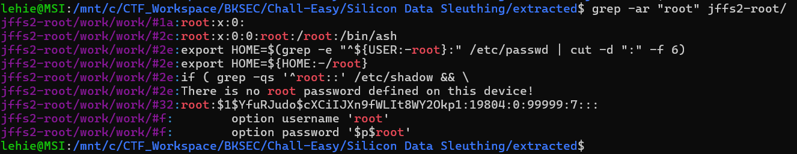

Now navigate to the exact location pointed by grep:

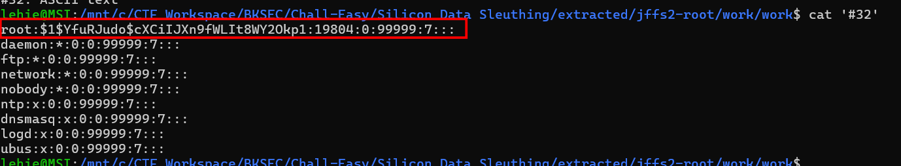

After that I find in `upper` folder there is a .tgz file, decompress it with gunzip and tar, we recover the etc/ directory, no need for the dirty grep trick:

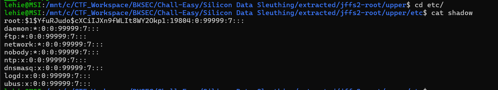

**Answer: root:$1$YfuRJudo$cXCiIJXn9fWLIt8WY2Okp1:19804:0:99999:7:::**

### 4. What is the PPPoE username ?

PPPoE definition, according to LLM:

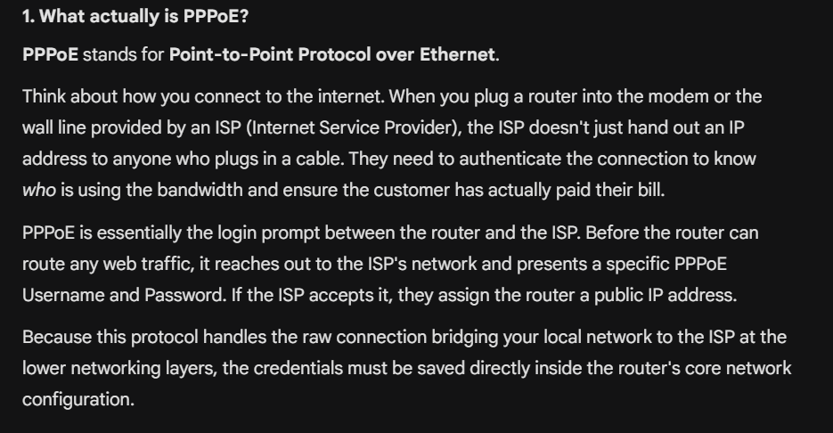

These credentials are stored in plaintext in /etc/config/network, which is a huge security flaw:

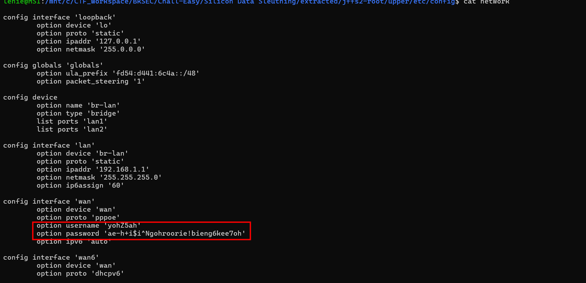

**Answer: yohZ5ah**

### 5. What is the PPPoE password

Answer lies in the previous image

**Answer: ae-h+i$i^Ngohroorie!bieng6kee7oh**

### 6. What is the WiFi SSID ?

Information about wifi SSID and password will be stored in /etc/config/wireless:

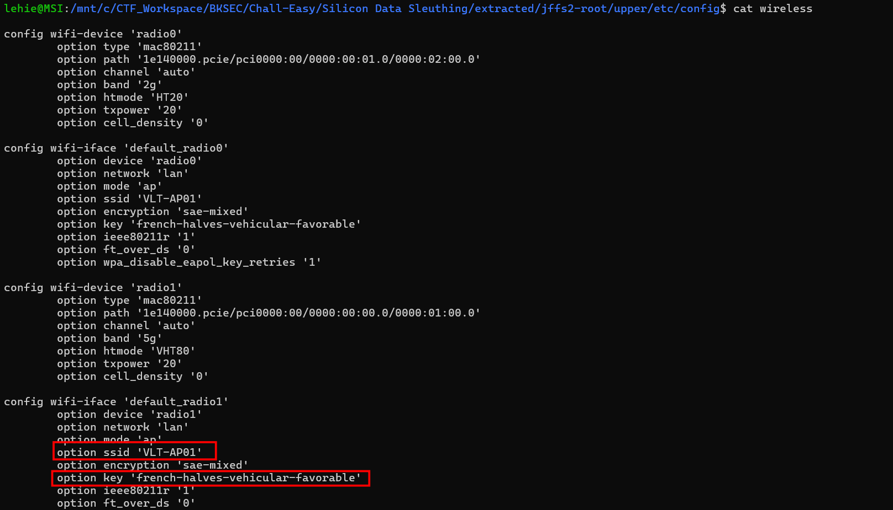

**Answer: VLT-AP01**

### 7. What is the Wi-Fi password ?

**Answer: french-halves-vehicular-favorable**

### 8. What are the 3 WAN ports that redirect traffic from WAN -> LAN ?

The answer will lie in /etc/config/firewall

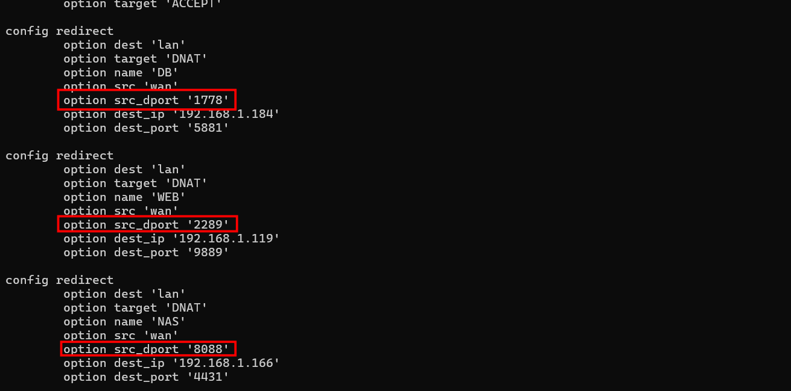

This mean when the default gateway - the router receives a packet, based on the purpose, like web, db ... it will forward the packet to those internal IPs and ports

**Answer: 1778,2289,8088**

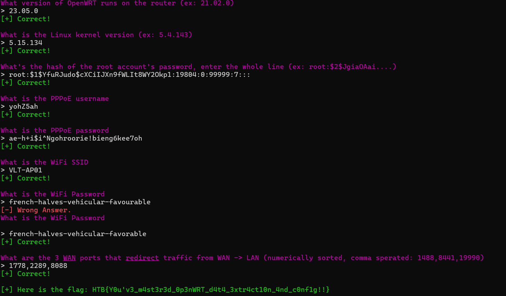

`Flag: HTB{HTB{Y0u'v3_m4st3r3d_0p3nWRT_d4t4_3xtr4ct10n_4nd_c0nf1g!!}}`