# TrueSecrets

**Challenge Scenario**

**Our cybercrime unit has been investigating a well-known APT group for several months. The group has been responsible for several high-profile attacks on corporate organizations. However, what is interesting about that case, is that they have developed a custom command & control server of their own. Fortunately, our unit was able to raid the home of the leader of the APT group and take a memory capture of his computer while it was still powered on. Analyze the capture to try to find the source code of the server.**

Given a raw memory dump file, we have no way but to use volatility. Setting up that tool in WSL is a bit troublesome, so I switch to my Kali linux VM .

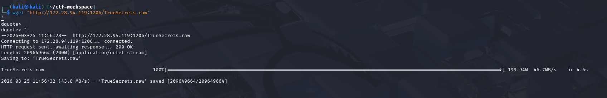

First I get some information about the machine from which the RAM is dumped, to be honest, this is just a step that I learn from the standard volatility workflow, and I don't get anything valuable here...

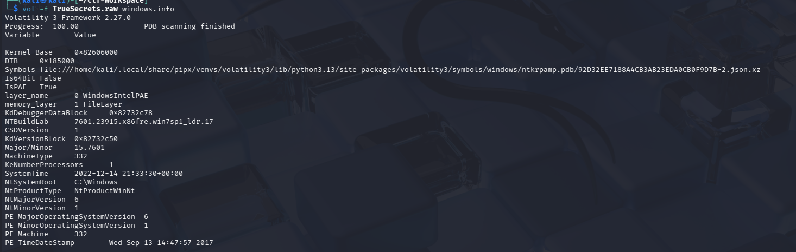

Then I intend to check for pstree and then perform filescan, but I spot a rather weird process in the pstree, so I stop to explore about it:

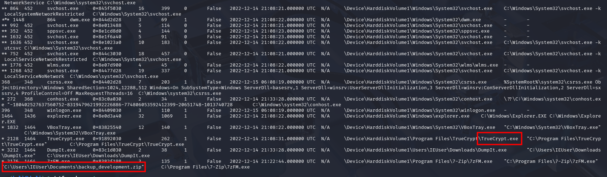

`DumpIt.exe` is the tool that is used to take snapshot of this RAM, and `TrueCrypt` initially sounds strange for me, after some search, I know that it is historically a famous tool for disk encryption, but now deprecated because of some security concerns:

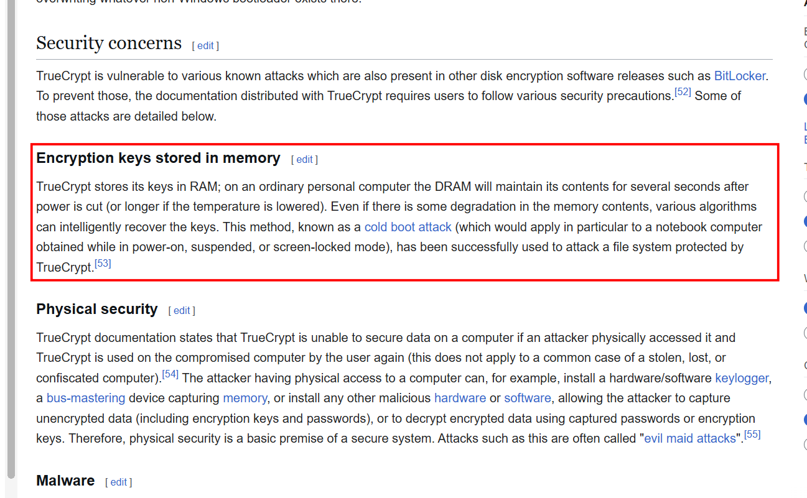

We will leverage this in our attempt to retrieve the file. As TrueCrypt stores encryption key right in RAM, I find for way to retrieve it, with the help of Gemini, I know that volatility3 even has a plugin for this flaw:

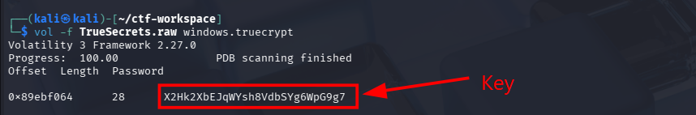

We have the key, but know we need to find what file was encrypted, as in the above snapshot I notice 7zip is doing something with a suspicious .zip file, I use filescan plugin and search for that name:

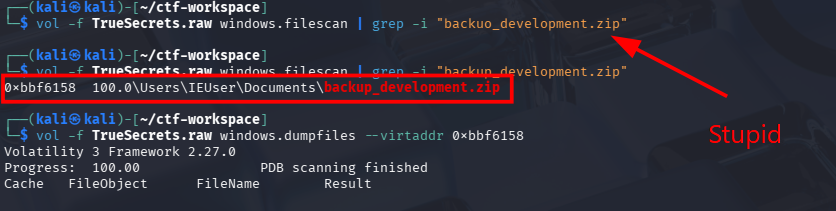

Grasp that offset and dump that file to our working directory:

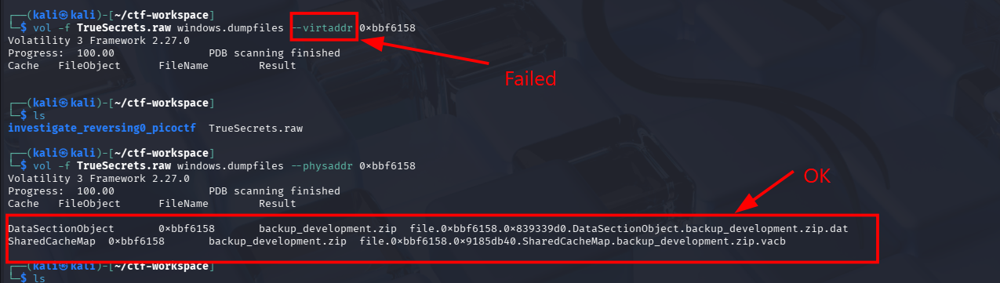

Initially I use virtual address to locate the file, but nothing is dumped, and only physical address does the work. Perhaps the offset returned by filescan is usually physical one. Note that we dumped two files, we use the .dat file as it is the complete, raw file loaded to the memory, while the .vcab file is just a cached file used to speed up read/write operations, it is incomplete, fragmented. 

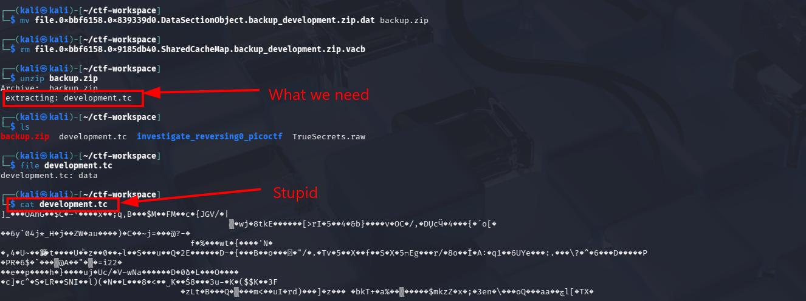

I also rename the file to make it more readable, then unzip it to get the .tc (TrueCrypt) file, in fact it does not neccessarily has .tc extension, but maybe CTF often leaves breadcrumb for us to solve. By the way, I also do a silly thing by `cat` it, and my terminal explodes...

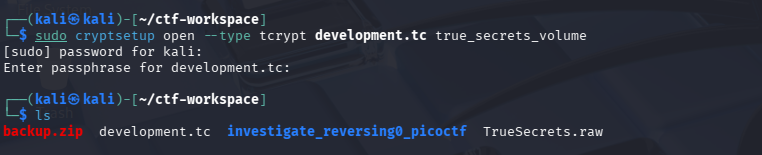

The correct way is to use `cryptosetup` with the key we pulled previously. Then mount it into /mnt

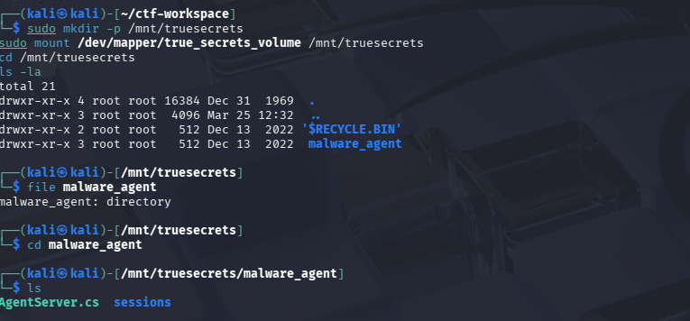

We get a C# script, and 3 encrypted C2 traffic logs, the content of the C# file is as follow:

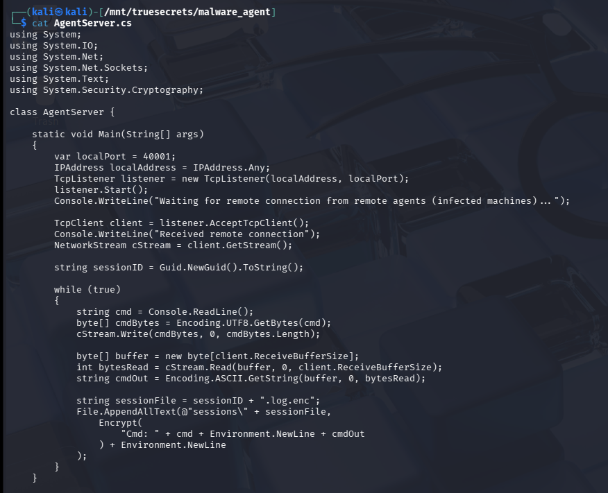

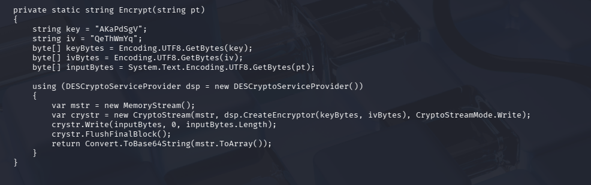

This is a typical and basic C2 listener on the attacker side. It sets up a TCP Listener and start listening on a port, create a two-way pipeline that can send commands as bytes and receive response bytes to decode back into readable ASCII text. The encrypt function leverages DES with hard-coded key and IV, then base64-encode the traffic before logging. Knowing the ecryption scheme, I head for cyberchef to decrypt the logged traffic:

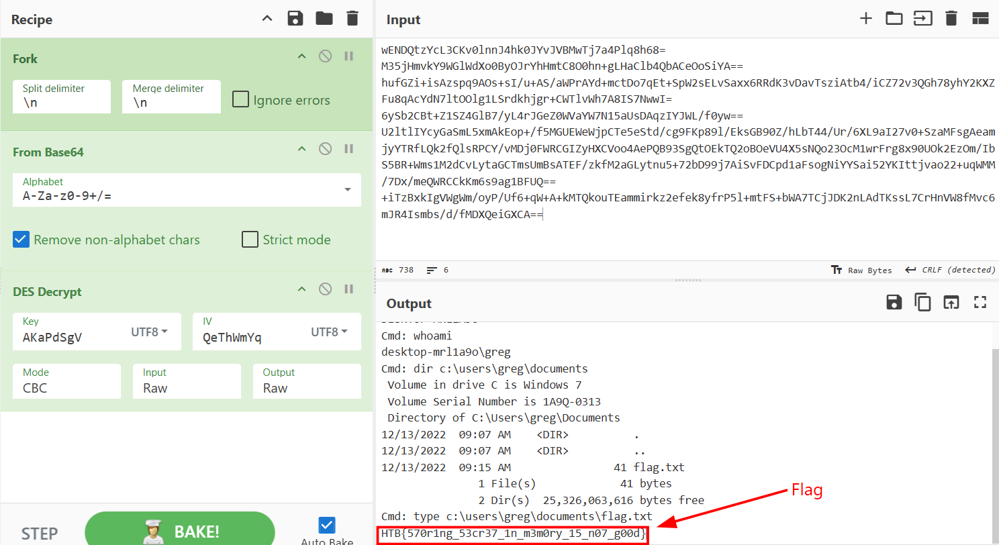

`Flag: HTB{570r1ng_53cr37_1n_m3m0ry_15_n07_g00d}`