# Valhallowen

**Challenge Scenario:**

**As I was walking the neighbor's streets for some Trick-or-Treat, a strange man approached me, saying he was dressed as "The God of Mischief!". He handed me some candy and disappeared. Among the candy bars was a USB in disguise, and when I plugged it into my computer, all my files were corrupted! First, spawn the haunted Docker instance and connect to it! Dig through the horrors that lie in the given Logs and answer whatever questions are asked of you!**

Tools like chainsaw may be helpful in this challenge, but I will inspect the logs manually to enhance my skill... , just with a little help from EvtxECMD.

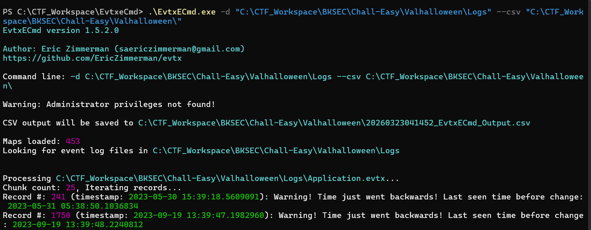

*1. What is the IP address and the port from which the malware was downloaded ?*

At first, the USB scenario tricks me into finding the timestamp of new USB inserted for a long time, but then I give up as I cannot find the exact event ID of that action. Instead, I return to the sysmon log to find whether any weird execuatable is downloaded, at this time, I just follow my instinct, filter for .exe, powershell, cmd,... in the payload data, and I finally found a strange connection to a suspicious server:

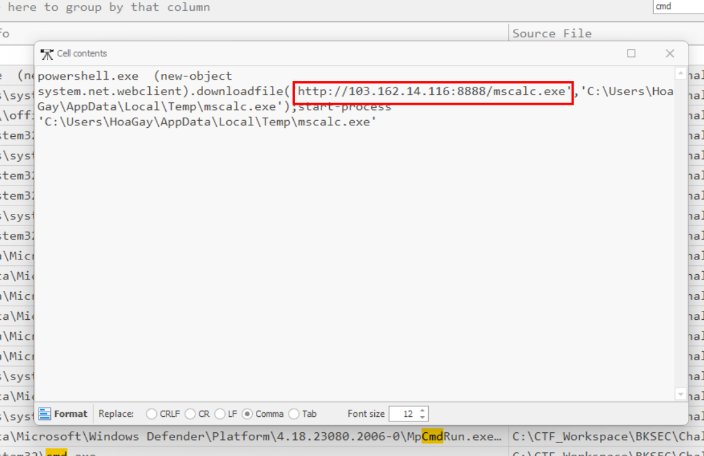

It downloads a weird file to temp folder, then executes it immediately.

**Answer: 103.162.14.116:8888**

*2. According to the sysmon log, what is the MD5 hash of the ransomware ?*

In the above question, the malware is executed with start-process from powershell, that mean it **must** be a child process of powershell.exe. So I filter event ID to 1, and search for powershell.exe in the search bar:

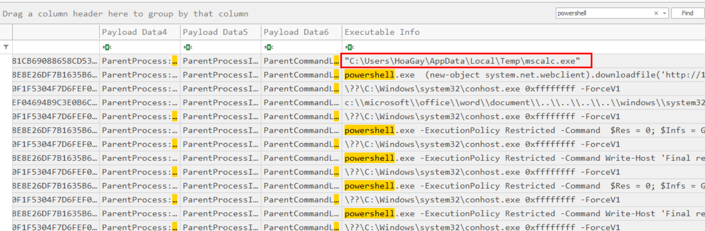

It was caught red-handed here!

Finding the hash:

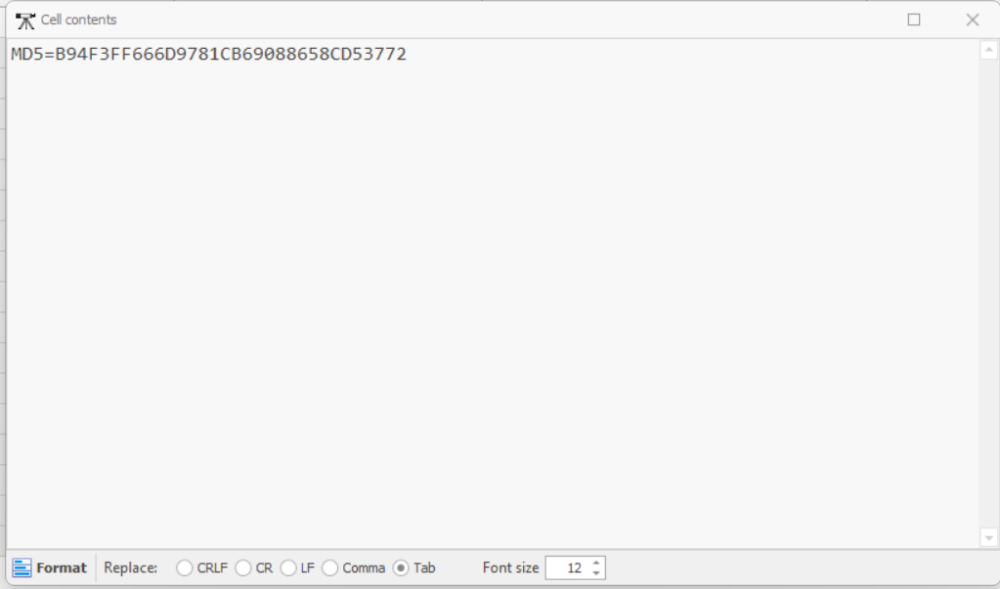

**Answer: B94F3FF666D9781CB69088658CD53772**

*3. Based on the hash found, determine the family label of the ransomware in the wild from online reports such as Virus Total, Hybrid Analysis, etc.*

Refer to the detection tab of VirusTotal and search for 'label':

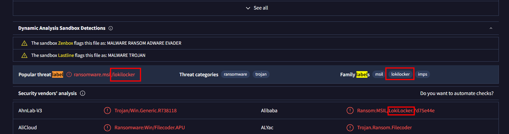

**Answer: lokilocker**

*4 .What is the name of the task scheduled by the ransomware?*

Filter for process ID 106, new scheduled task, we will see what we need:

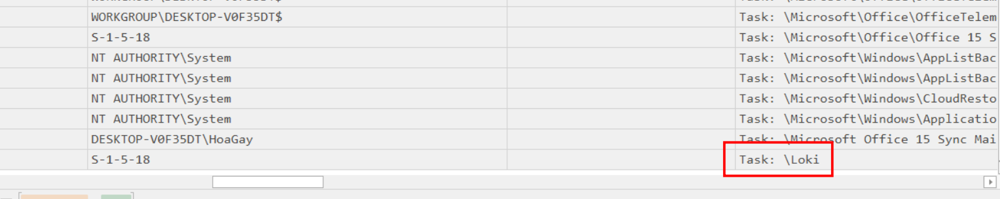 

**Answer: Loki**

*5. What is the parent process's name and ID of the ransomware ?*

I "accidentally" solve this in task 2:

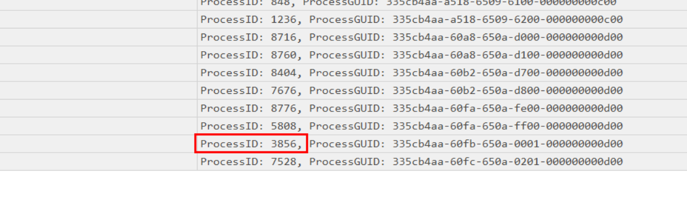

**Answer: powershell.exe_3856**

*6. Following the PPID, provide the file path of the initial stage in the infection chain.*

We need to follow up the Parent Process ID to find the root process which spawns the malware. Luckily, this can be accomplished at ease in Timeline Explorer. Find the PPID in its column, then put it into 'Payload data 1' column to filter for process ID:

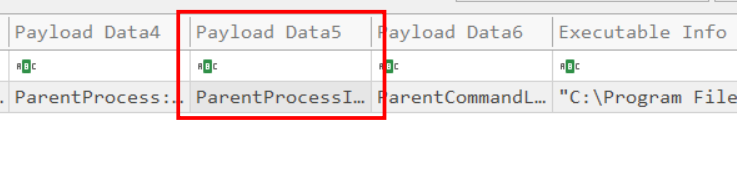

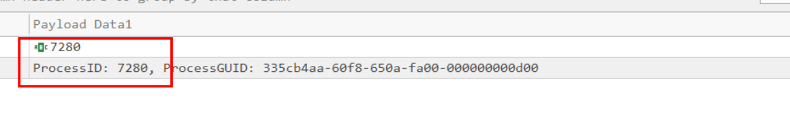

The parent process of this file is explorer.exe, that means the file opened by it is the first one in the infection chain:

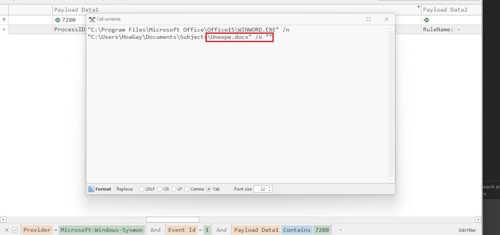

**Answer: C:\Users\HoaGay\Documents\Subjects\Unexpe.docx**

*7. When was the first file in the infection chain opened (in UTC)?*

Scroll back to the timestamp of that log entry to see the answer:

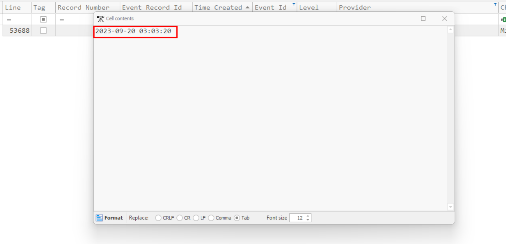

**Answer: 2023-09-20 03:03:20**

`Flag: HTB{l0k1_R4ns0mw4r3_w4s_n0t_sc4ry_en0ugh}`

You can read more about [Loki Ransomware here](https://www.pcrisk.com/removal-guides/21572-loki-locker-ransomware).