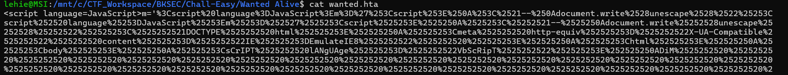
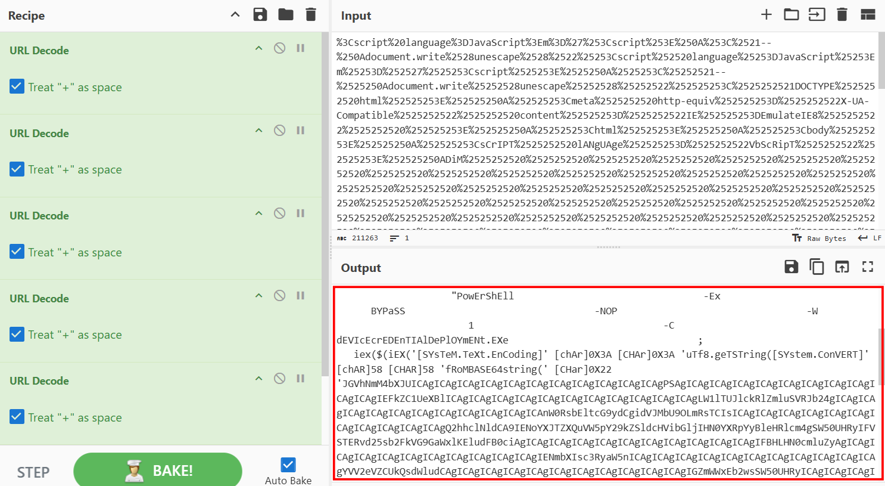
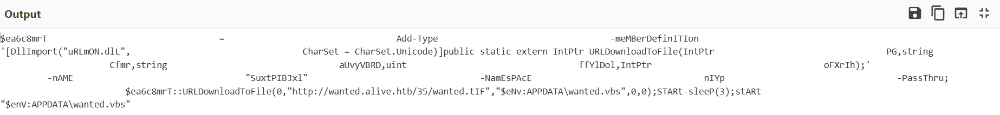
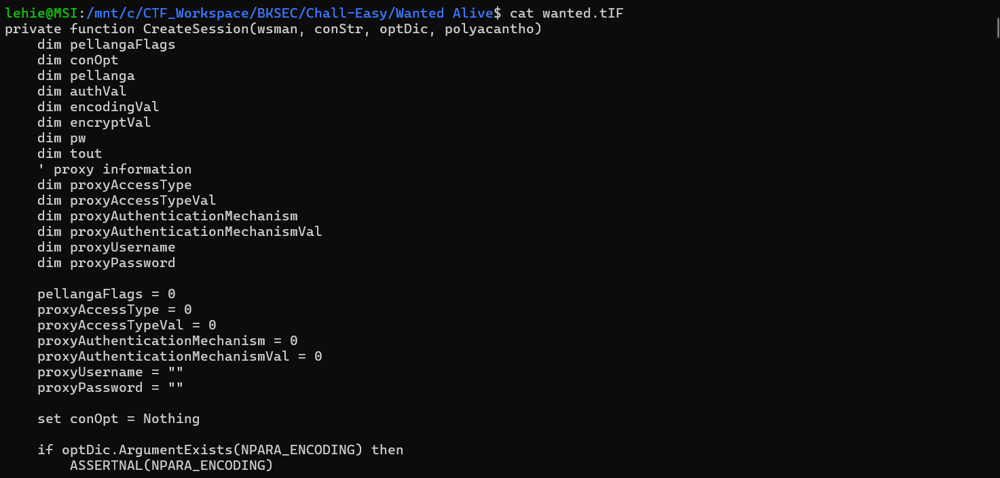
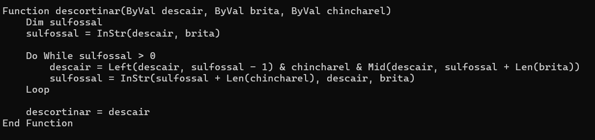
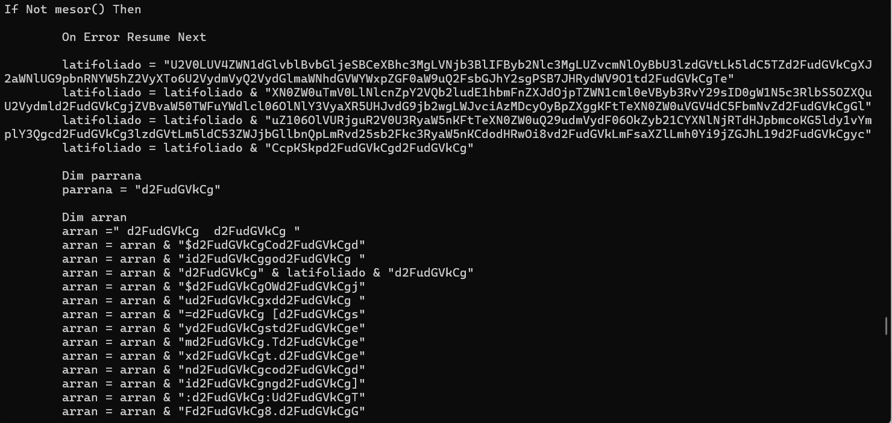
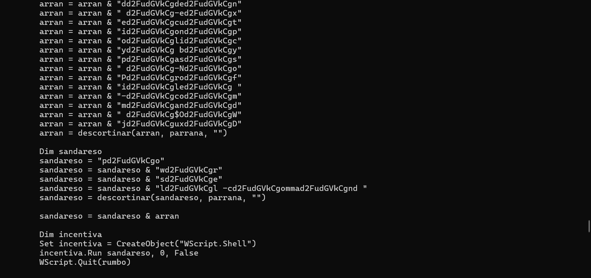
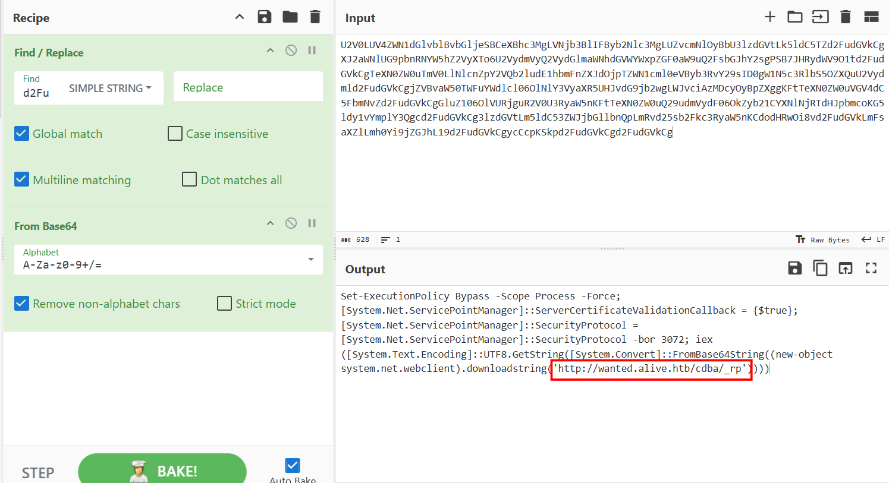
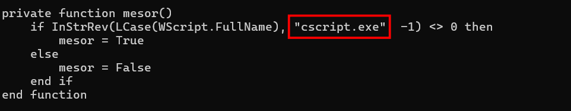
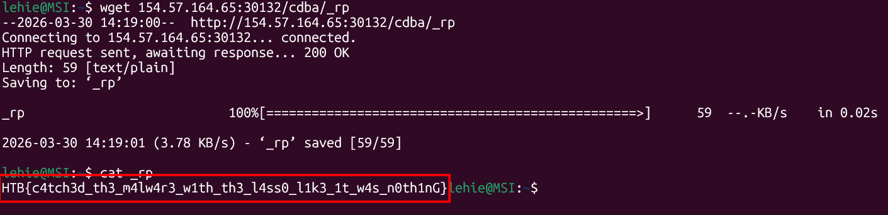

# Wanted Alive

We are given a [hta](https://en.wikipedia.org/wiki/HTML_Application) (HTML Application) file, hta is essentially a html file but with enhanced privilige, it is executed as "fully trusted" application. Skimming through the file, it's clear that the payload has been url-encoded:

So I use cyberchef to decode it, but it still looks gibberish. In fact it is encoded in 6 layers:

The script has been heavily obfuscated, variables' name are gibberish strings, but I don't pay much attention to them, what catches my eyes is the above command that spawns powershell in bypass mode, suppresses warnings and executes a base64-encoded payload. After decoding the payload, its content is as follow:

It leverages URLDownloadToFile() from urlmon.dll to download a file named wanted.tif from a remote server and saves it as a .vbs script. After a short delay, the file is executed

Replace that domain with the IP address of the instance, we get the tif file

This file is heavily obfuscated, and spending time reading the whole script should be a waste of time and still lead to nothing. The rule in analysis these scripts is to find the entry, and the function used to convert the deobfuscated command back to normal one. And I think I find it here:

This is simply a manual version of Replace() function, it takes `descair` as the original string, `brita` as the string that will be replaced, and `chincharel` replaces `brita` . Under the hood, it check for existence of `brita` inside `descair` (if not exist, InStr returns 0), if there is a match, it will replace with chincharel, as Left(a,n) returns first n character of a, Mid(a,n) returns substring of a, starts from n. Then it checks again to update `sulfossal`, preventing infinite loop, note that InStr() when taking 3 arguments, the first argument becomes start position.

Let's see how it is used:

Systematically, we should gather all pieces, but only `latifoliado` pieces decodes to this:

I think we know what to do now: get that file. But let's slow down and find where mesor(), the one that ignites these obfuscated commands, comes from:

The script first checks whether it is running under `cscript.exe` (console, stdin, stdout, no pop-up) or `wscript.exe` (gui, messsage box), if not running under `cscript.exe`, the above phase is launched, where the payload leverages powershell in hidden mode.

Return to the next file, and it's done

`Flag: HTB{c4tch3d_th3_m4lw4r3_w1th_th3_l4ss0_l1k3_1t_w4s_n0th1nG}`