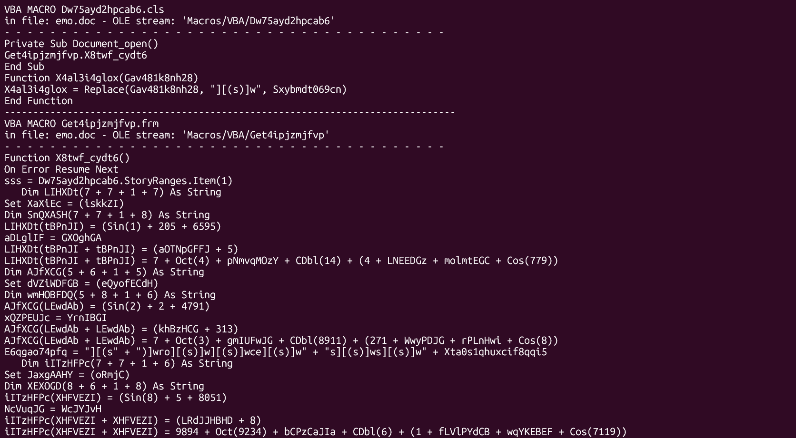
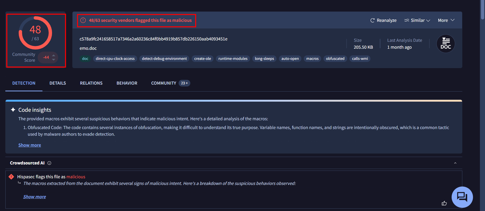
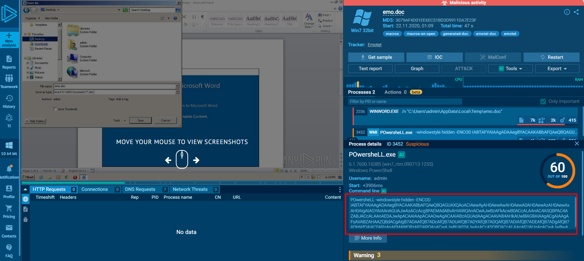
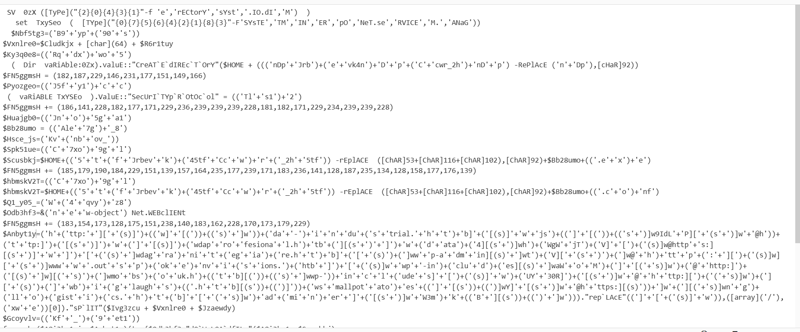
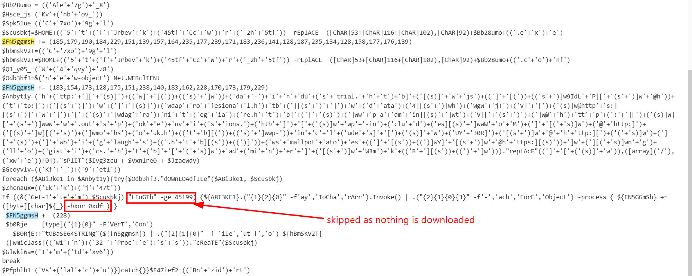
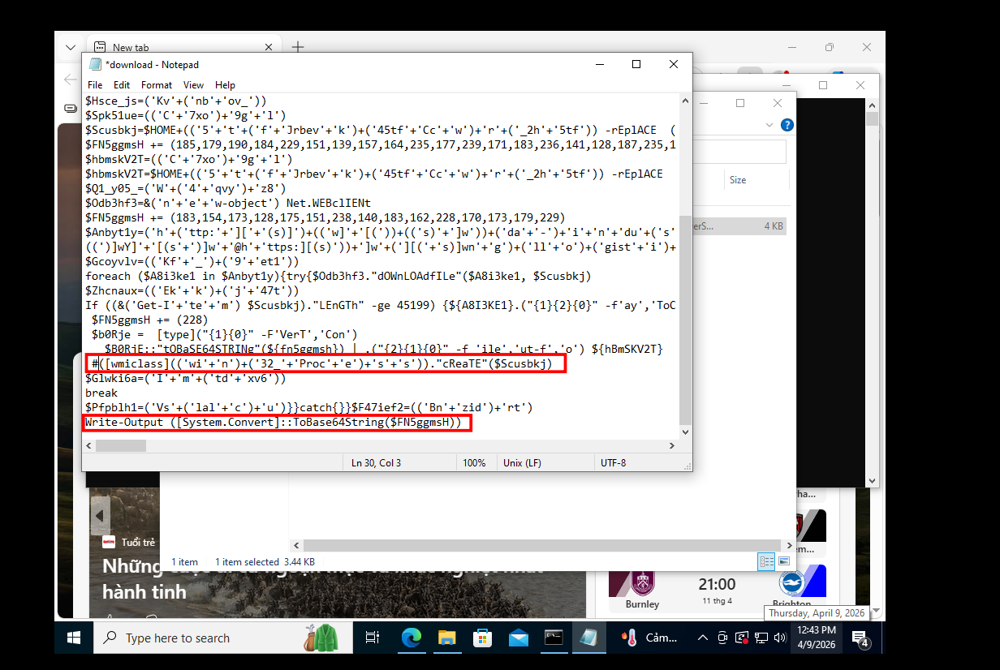
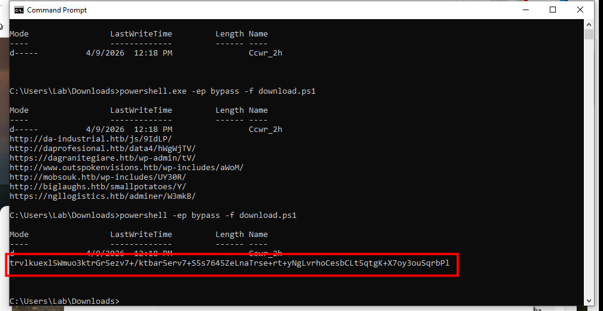
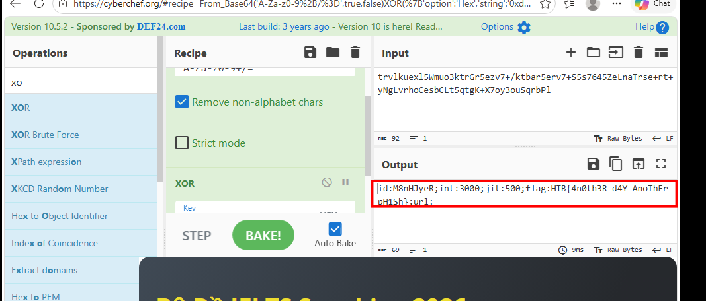

# emo

## Scenario:

WearRansom ransomware just got loose in our company. The SOC has traced the initial access to a phishing attack, a Word document with macros. Take a look at the document and see if you can find anything else about the malware and perhaps a flag.

## Given artifacts

A malicious .doc file

## Solving process 

As malicious document is commonly associated with macros, I first run olevba to check for malware:

Yah, too much, honestly, that's too much for me to de-obfuscate myself, I tried in vain to find/replace, find entry point, find decode function ..., then being desparate, I take the SHA256 hash of that file and search in VirusTotal, luckily, this file is very infamous:

Nagivate to the Community tab, I see a link connected to an [any.run report](https://app.any.run/tasks/b35e3e6a-257d-489a-8b3b-81f9d4b05c3d/), this report includes the powershell command that was executed, efficiently reduce the burden of analyzing the macro for us:

Take that massive base64 string to cyberchef:

### Let's try to analyze it:

- Notice that in the first line, it uses `-f` format string trick of powershell. Reading the indices in the curly braces and map them to the strings provided after -f yields the following string: `[Type]("system.io.directory")`

- Repeat with the second line: `[Type]("system.net.servicepointmanager)`

- There are several decoy variables, including the two abpve, they are no longer used, the author just put them there to confuse us

- Then there comes the array `$FN5ggmsH`, this array is worth noticing as it seems to hold the main payload. Another suspicious variable is `$Anbyt1y`, it holds URL that host malwares, but as these sites are private, we definitely cannot access them to get anything, so let's focus on `$FN5ggmsH` :

- The array is initialized, then the script appends value to it multiple times, notice the If clause, as that variable cannot have that length (nothing can be downloaded from a .htb domain like that) , the statement is skipped, and values inside `$FN5ggmsH` is xored with key 0xdf, then convert to base64. I will try to reuse the code to reveal the value of that string, I did it a bit redundant here when convert it to base64 before printing, it means we have to ... decode it back with cyberchef. Note that I comment out the malicious command (a good practice even though that process cannot do anything)

Now we have the base64 string:

Process it with base64 and XOR:

We get the flag! , but in practice, the aforementioned domains would be accessible, malware will be downloaded and executed, not this trivial flag

`Flag: HTB{4n0th3R_d4Y_AnoThEr_pH1Sh}`