# Decryption Strategy

## Scenario

A trusted harbor-latch mechanism is behaving erratically, processing routine transit writs with a strange, stuttering cadence. Under the cover of this mechanical distraction, an unseen hand bypassed the inner witness-marks and completely drained an Eastreach private credit-cache. Sift through the compromised latch's residual ash-logs and custody chains to track the phantom access before the stolen coin vanishes into the undercity.

## Given artifact

A packet capture file, a C drive and a procmon log `.pml` file

## Questions

### 1. What is the name of the process that originated the malicious behavior?

For a process-related question like this one, we should look at the `.pml` file. I open it in Process Monitor, then look at the process tree (`Tools/Process Tree`):

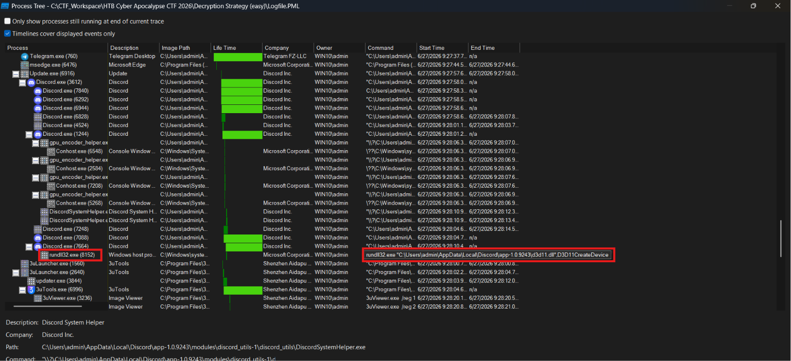

From this tree, we can notice a famous attack technique: DLL Hijacking. `d3d11.dll` (Direct3D D11 Runtime) is a legitimate, critical system file, a collection of application programming interfaces (APIs) designed to handle multimedia tasks, especially game programming and video, on Microsoft platforms

However, its correct path should be `C:\Windows\System32`, dedinitely not local app data like this, a bug about not validating dll's path must have been abused here

**Answer: Discord.exe**

### 2. What is the Unix epoch timestamp when the malicious module was loaded?

Look for `run32dll.exe`'s Load Image operation with the malicious dll as target, we can see in procmon here:

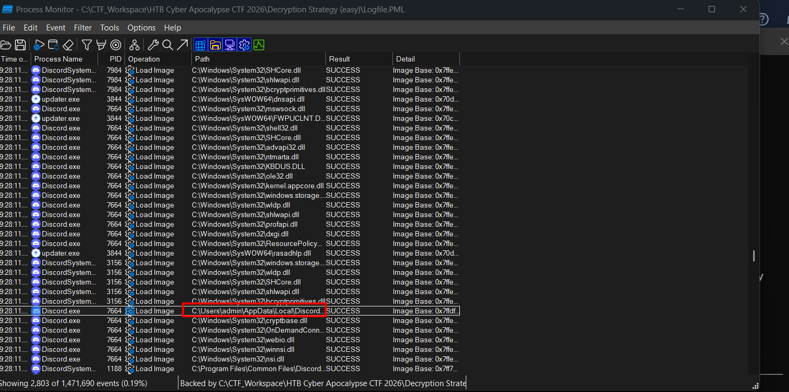

Double-click on that entry to see its details:

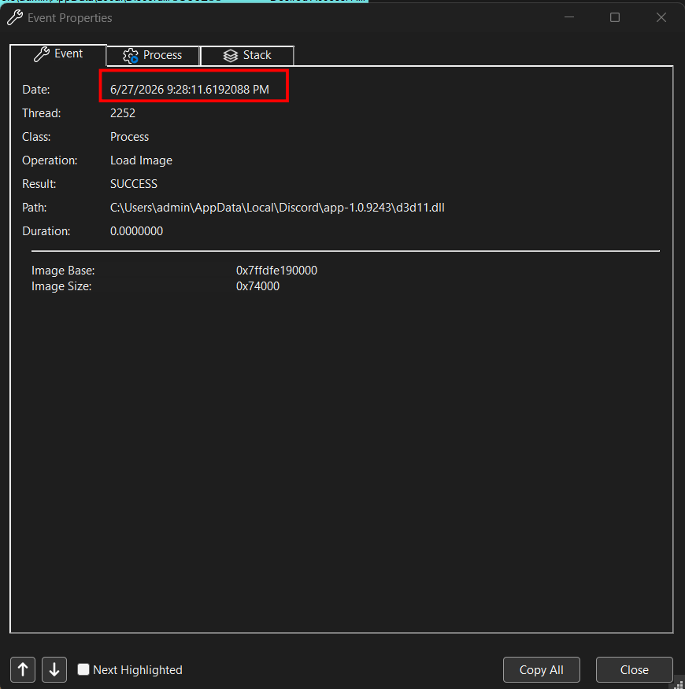

This timestamp is my local time (UTC+7) as the default display of procmon, so the event happened in `6/27/2026 2:28:11 PM UTC`. Use [this web](epochconverter.com) to convert date time into UNIX epoch:

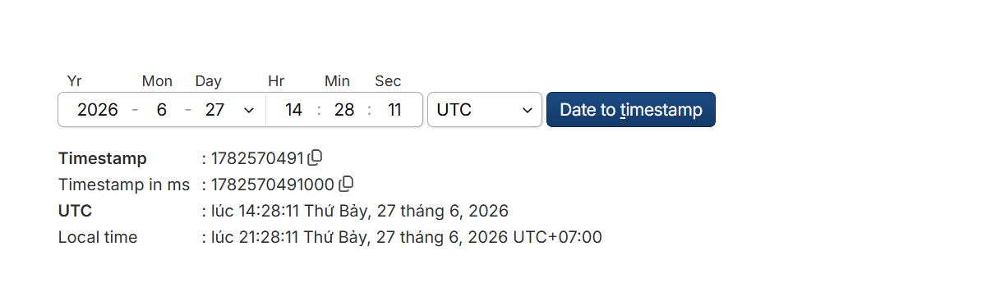

**Answer: 1782570491**

### 3. Which exported function of the malicious module was invoked later?

Look again at the commandline of `rundll32` process, we can see the invoked function right behind the module's name:

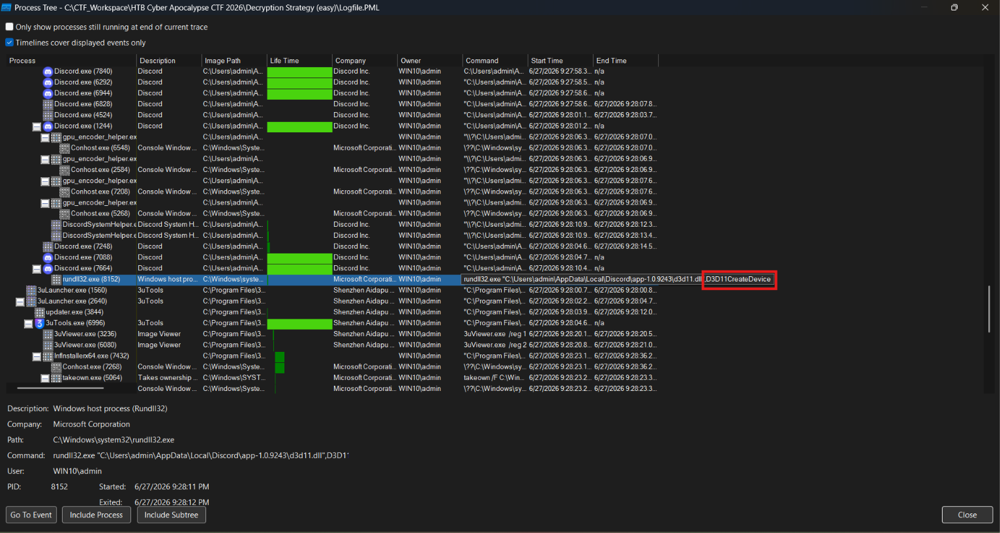

**Answer: D3D11CreateDevice**

### 4. What 16-byte registry value does the malware use to derive its RC4 key (00aa11bb...)?

We are not aware which exactly is the queried registry yet, so it's not wise to inspect all the related entries in procmon, we show actually inspect the malicious dll instead. When I run `strings` on the initial DLL inside local appdata folder, there is quite little readable strings, so I suspect that it has been packed, submitting to VirusTotal confirms my belief:

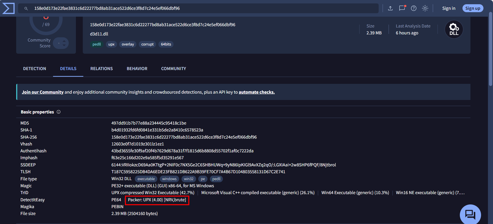

After using the GitHub UPX to unpack it, I decompile the dll using `ghidra`, here comes the aforementioned invoked function:

```c

BOOL D3D11CreateDevice(void)

{
  DWORD DVar1;
  BOOL BVar2;
  size_t sVar3;
  ulonglong uVar4;
  HMODULE hLibModule;
  int iVar5;
  undefined1 *apuStack_270 [2];
  undefined1 auStack_260 [16];
  WCHAR aWStack_250 [268];
  
                    /* 0x2600  1  D3D11CreateDevice */
  iVar5 = 1;
  hLibModule = (HMODULE)0x0;
  g_instanceMutex = CreateMutexW((LPSECURITY_ATTRIBUTES)0x0,1,L"Local\\DiscordRuntimeCache");
  BVar2 = 0;
  if (g_instanceMutex != (HANDLE)0x0) {
    DVar1 = GetLastError();
    if (DVar1 != 0xb7) {
      RunWorker();
      if (iVar5 == 1) {
        DisableThreadLibraryCalls(hLibModule);
        GetModuleFileNameW((HMODULE)0x0,aWStack_250,0x104);
        apuStack_270[0] = auStack_260;
        sVar3 = wcslen(aWStack_250);
        std::__cxx11::wstring::_M_construct<>
                  ((longlong *)apuStack_270,aWStack_250,(longlong)(aWStack_250 + sVar3));
        sVar3 = wcslen(L"rundll32");
        uVar4 = std::__cxx11::wstring::find((wstring *)apuStack_270,L"rundll32",0,sVar3);
        if (uVar4 == 0xffffffffffffffff) {
          sVar3 = wcslen(L"RUNDLL32");
          uVar4 = std::__cxx11::wstring::find((wstring *)apuStack_270,L"RUNDLL32",0,sVar3);
          if (uVar4 == 0xffffffffffffffff) {
            SpawnWorkerProcess(hLibModule);
          }
        }
        if (apuStack_270[0] != auStack_260) {
          operator.delete(apuStack_270[0]);
          return 1;
        }
      }
      return 1;
    }
    BVar2 = 0xb7;
    if (g_instanceMutex != (HANDLE)0x0) {
      BVar2 = CloseHandle(g_instanceMutex);
      g_instanceMutex = (HANDLE)0x0;
    }
  }
  return BVar2;
}
```

It first creates a mutex (mutual exclusion object, a system-level locking mechanism that malicious programs use to ensure that only one instance of the malware runs on a infected computer at any given time)

Then it checks whether it's running inside `rundll32.exe`, if not (running inside `Discord.exe`), it calls `SpawnWorkerProcess` which spawns an instance of `rundll32.exe` to execute the DLL export, else it bypasses spawning and executes `RunWorker()`

Let's look at the `RunWorker()` function:

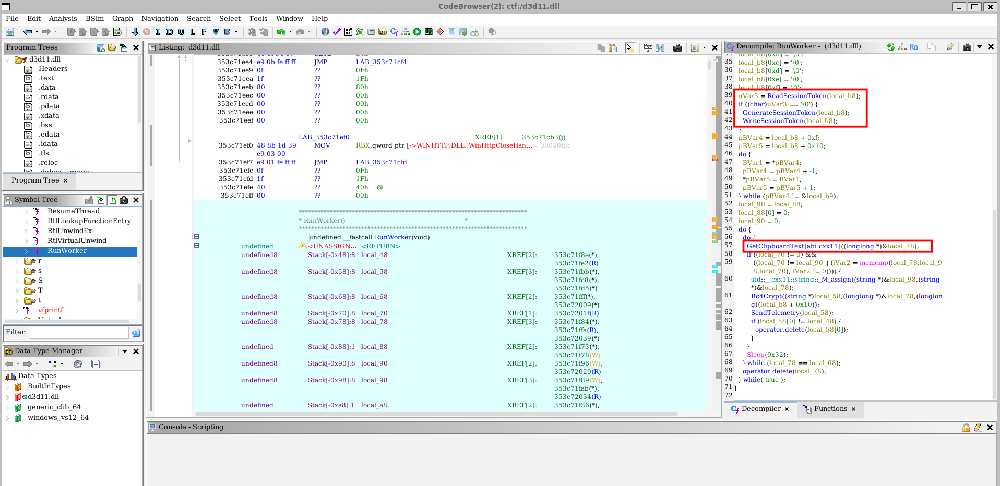

From this code, we can see clearly what the malware is trying to do: it calls `ReadSessionToken()` to retrieve a 16-byte token from the registry. If none exists, it call `GenerateSessionToken()` to produce one, then calls `WriteSessionToken()` to write that value to the registry. Then it manipulates that value to use as the key to the RC4 encryption later.

After that, the malware loops continuously, calling `GetClipboardText()` to steal whatever is copied to the user's clipboard, encrypt it with the above key, and sends to C2 server using `SendTelemetry()`

Inspecting `ReadSessionToken()` should give us the registry queried:

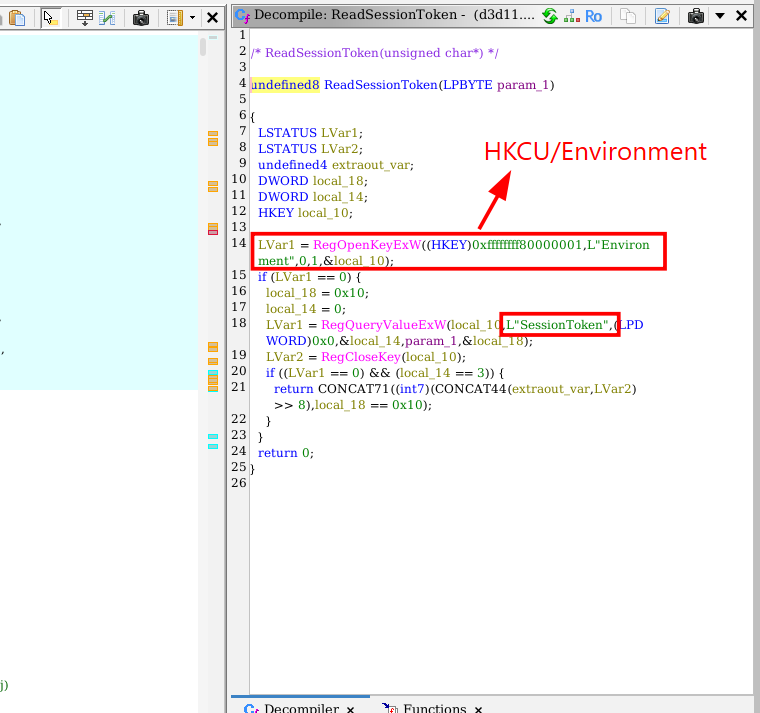

It's clear now, the registry is `HKCU\Environment` as `0xffffffff80000001` is `HKEY_CURRENT_USER`, and the registry value name is `SessionToken`. Let's filter in procmon for RegQueryValue operation with path contains SessionToken:

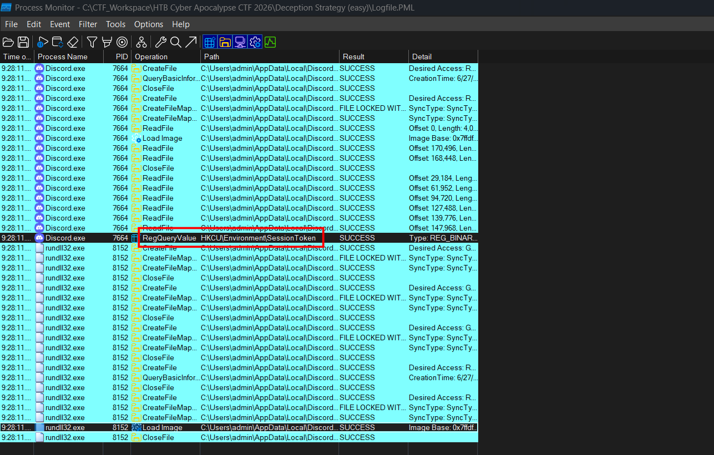

Double-click it, we will see the 16 bytes read:

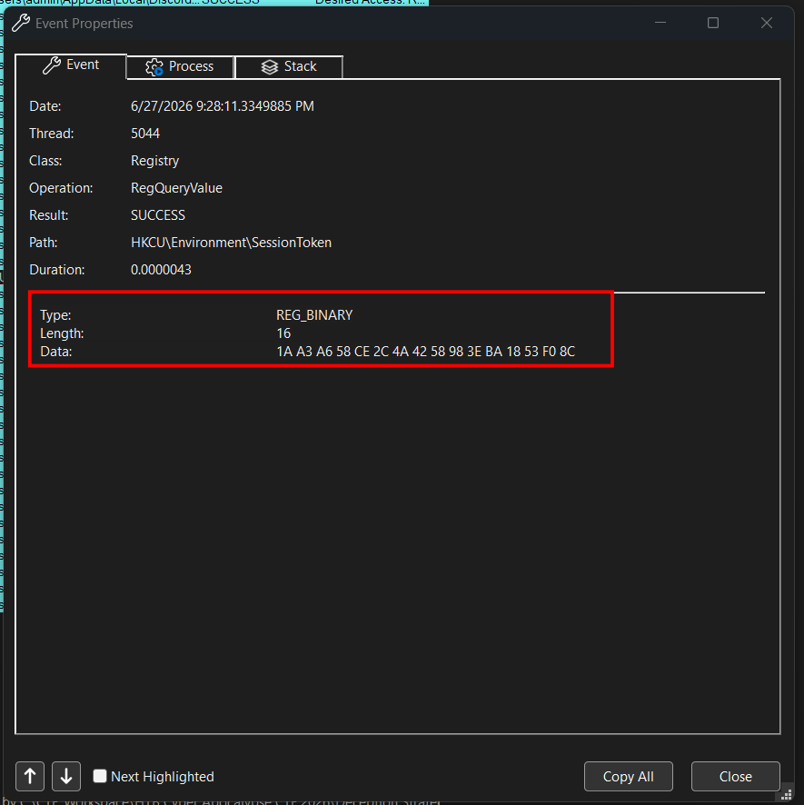

**Answer: 1aa3a658ce2c4a4258983eba1853f08c**

### 5. What is the name of the mutex created by the malware?

Already observed from the last question

**Answer: `Local\\DiscordRuntimeCache`**

### 6. What is the MITRE ATT&CK technique ID for the collection method?

The MITRE ATT&CK technique ID for Clipboard Data collection is `T1115`

**Answer: T1115**

### 7. What is the IP address of the C2 server?

Inside `SendTelemetry()`, we see a hard-coded `discord-cdn.com`:

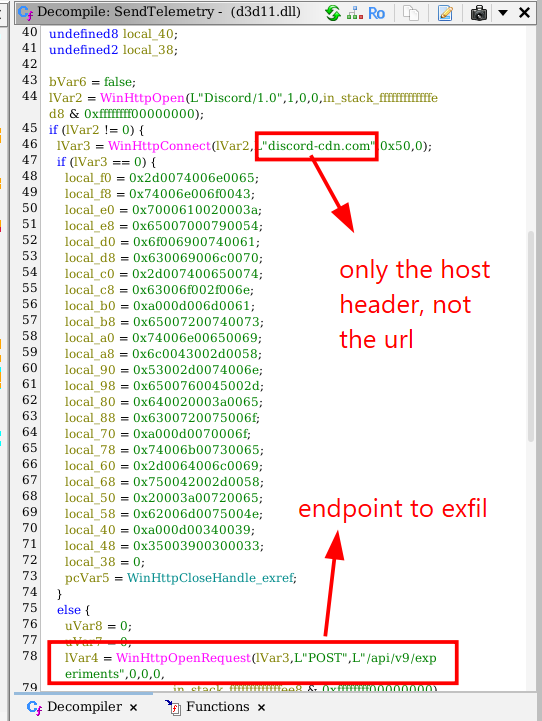

However, when checking the pcap file for any DNS query for this domain, nothing displayed. It turns out that the hard-coded string is just the HOST header, the malware appends it to make traffic looks more legitimate. But we can still leverage the endpoint to filter the pcap:

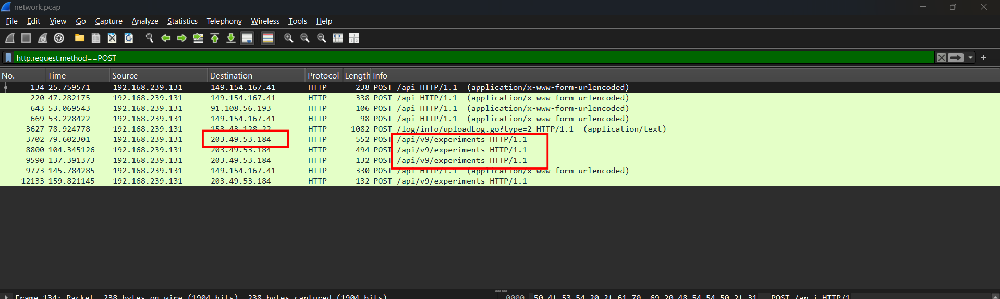

Found it here!

**Answer: 203.49.53.184**

### 8. What is the crypto wallet seed phrase stolen by the malware?

Look at this code fragment from `RunWorker()`:

```c
  uVar3 = ReadSessionToken(local_b8);
  if ((char)uVar3 == '\0') {
    GenerateSessionToken(local_b8);
    WriteSessionToken(local_b8);
  }
  pBVar4 = local_b8 + 0xf;
  pBVar5 = local_b8 + 0x10;
  do {
    BVar1 = *pBVar4;
    pBVar4 = pBVar4 + -1;
    *pBVar5 = BVar1;
    pBVar5 = pBVar5 + 1;
  } while (pBVar4 != &local_b9);
```

#### Loop Initialization:
      • pBVar4 = local_b8 + 0xf; initializes the source pointer to the last byte (index 15) of the session token.

      • pBVar5 = local_b8 + 0x10; initializes the destination pointer to the byte immediately following the session token (index 16), which serves as the destination buffer for the RC4 key.

#### Loop Logic (Reverse Copy):

      • BVar1 = *pBVar4; reads a byte from the source pointer.

      • pBVar4 = pBVar4 + -1; decrements the source pointer (moving backward from index 15 down to 0).

      • *pBVar5 = BVar1; writes the byte to the destination pointer.

      • pBVar5 = pBVar5 + 1; increments the destination pointer (moving forward from index 16 to 31).

So the RC4 key is reversed version of the bytes stored in the registry, now we can use it to decrypt all traffic to the C2 server:

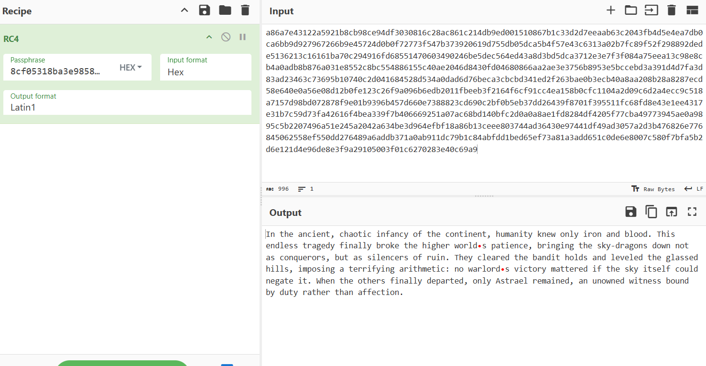

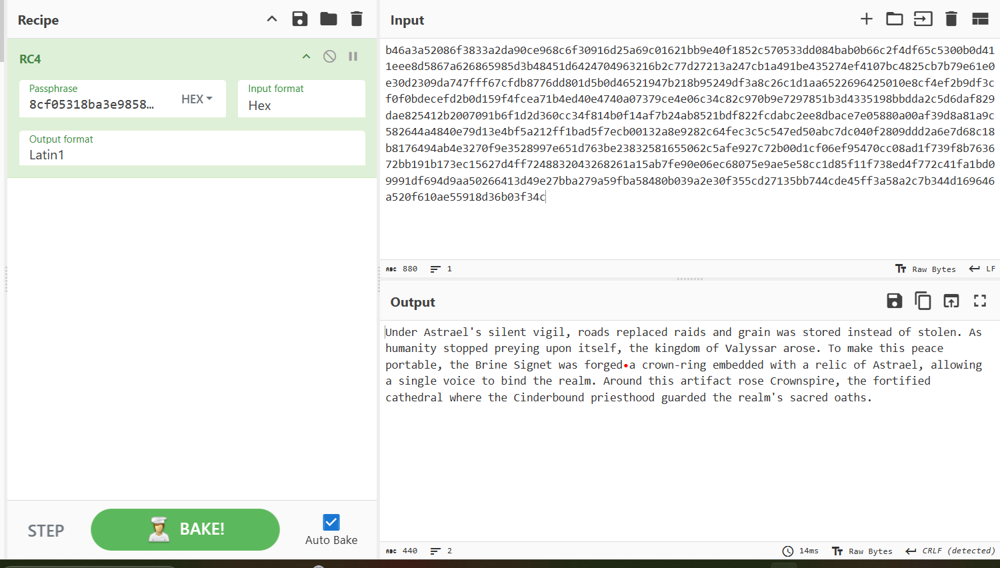

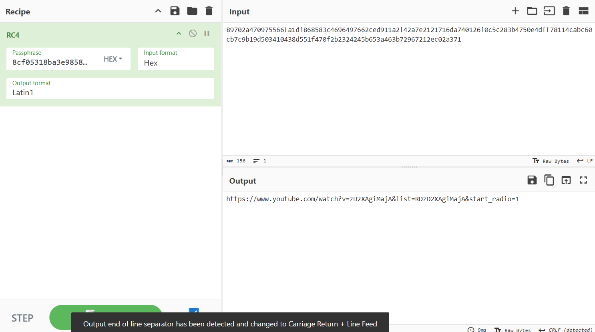

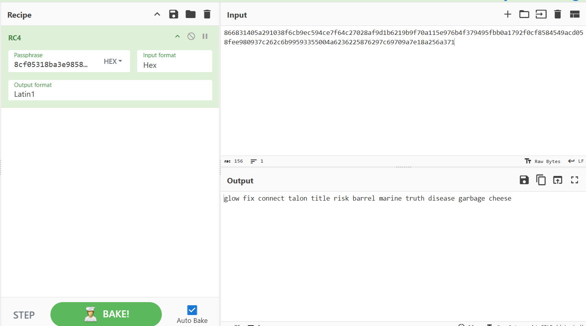

Got the seed phrase here!

**Answer: glow fix connect talon title risk barrel marine truth disease garbage cheese**