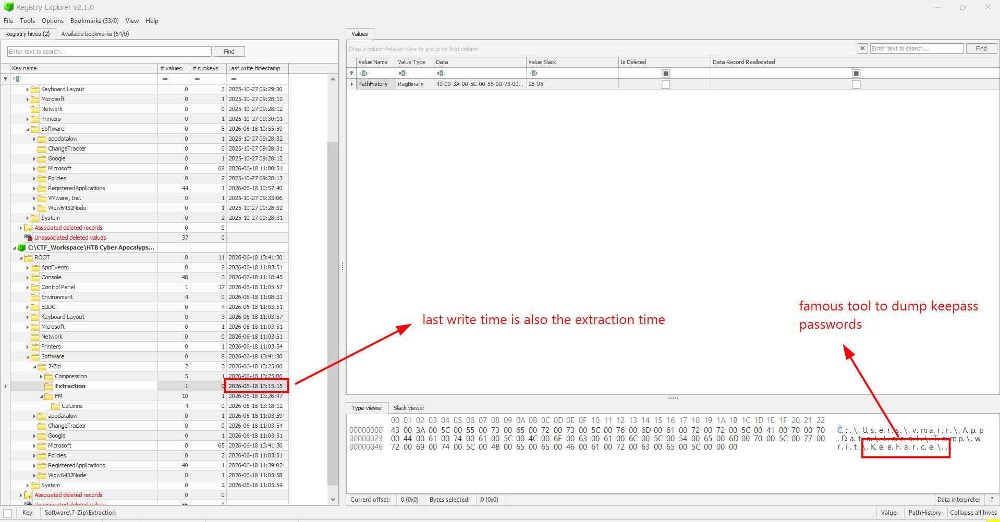
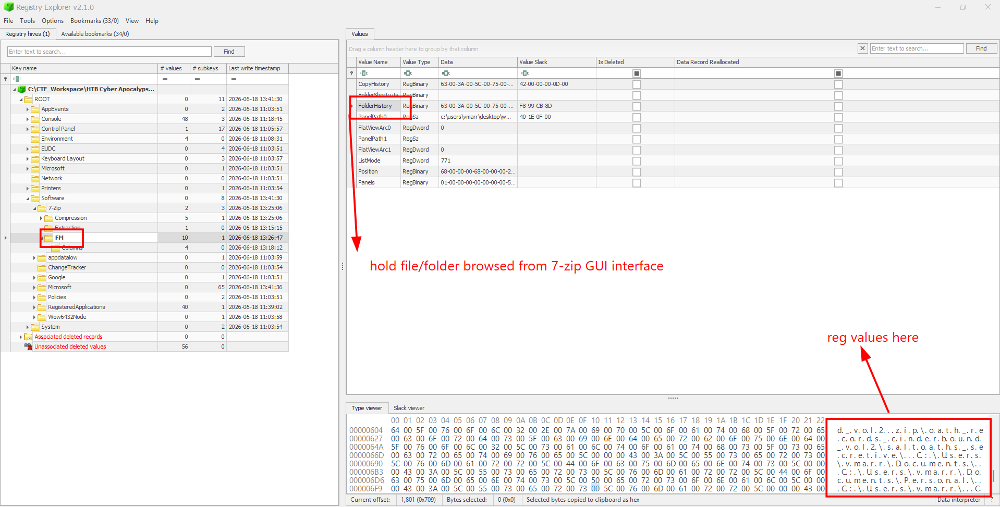
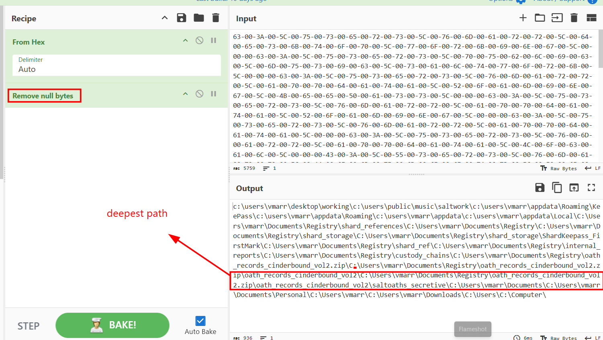
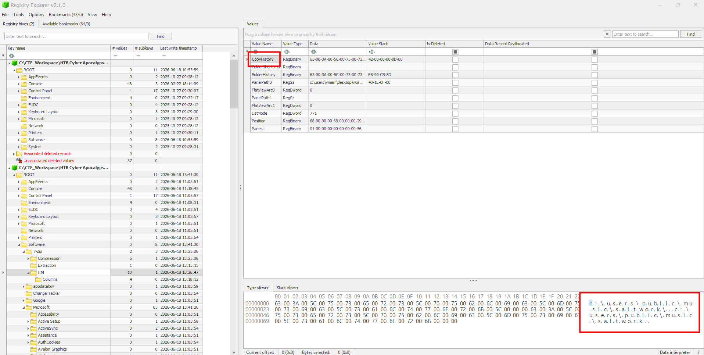
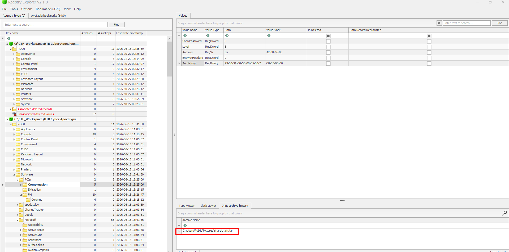
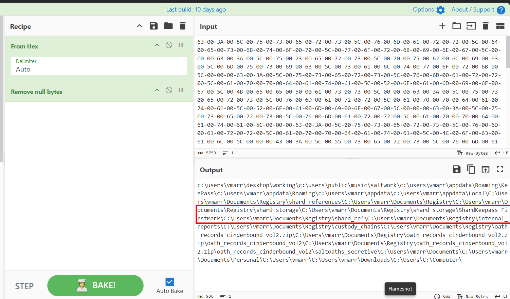
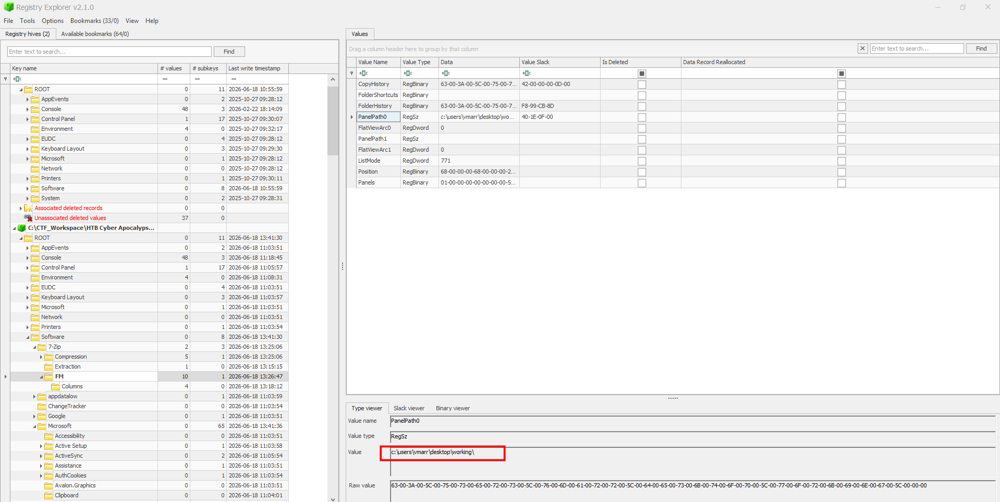

# The Compressed Truth

## Scenario

ASHVAULT was never the destination. It was the key.

The operational brief recovered from ASHVAULT's search index pointed deeper — to Veylen Marr's inner node, the machine where the Shard Reference custody chains sleep behind his personal credentials. CROWQUILL used what the brief called an unverified password — lifted through a Suncourt intermediary — to authenticate as vmarr and walk through the inner door. No forced entry. No broken locks. Just a stolen name presented at the right threshold, and the machine believed it.

What the operative found inside was worse than Cassian had hoped for. The Shard Reference 7 custody chain was there — a full record of where the Greywater Fragment had moved since the night the Signet shattered, whose hands had touched it, and where it now rested. But CROWQUILL did not stop at documents. They came hunting for something deeper: the master store of secrets that Marr kept locked behind a single password — a vault within the vault, holding the keys to every shard the Registry had ever catalogued. To reach it, the operative brought a specialized tool onto the machine, one built not to break a lock but to lift the key from a hand already holding it.

With the keys in hand and the records copied, CROWQUILL staged everything — compressed it, sealed it, prepared it for a journey through channels that do not ask questions. The source files were wiped. The tools were removed. The operative disconnected before the custody window closed. No wonder Cassian's men moved when they did. The Registry's inner vault had been standing on the assumption that the right credentials made a man trustworthy. It was a comfortable assumption. It was wrong.

The machine has been imaged and handed to you. The files are gone and the archive has left — but the registry remembers the hands that packed it. 7-Zip does not forget which folders were opened, which paths were browsed, and where the staging began. Find the trail. Recover what was taken. Understand what Cassian now holds — and what it means for every shard still in the Registry's keeping.

The archive left. Its shadow stayed.

## Given artifact

A `C` drive, but only some registry hives like users' `NTUSER.DAT`, or `DEFAULT`

## Questions

### 1. CROWQUILL did not break the lock — they took the key while it was still held. A tool was brought for one purpose: extract secrets from memory before they could be put away. What is its name?

Load vmarr's NTUSER.DAT into Eric Zimmerman's Registry Explorer and expand `SOFTWARE\7-Zip`, the `Extraction` key would hold information about extracted folder and time, from this key, we can see that the secrets-extracting tool is `KeeFarse`, a tool used to dump KeePass passwords from memory:

**Answer: KeeFarse**

### 2. The Registry keeps time as faithfully as it keeps names. The moment CROWQUILL's tool first touched the system is preserved in the artifact. When was the tool extracted? (YYYY-MM-DD hh:mm:ss)

The `Last Write Time` column in the above Registry Explorer's snapshot already answers this question

**Answer: 2026-06-18 13:15:15**

### 3. One archive file caught the operative's eye during enumeration, its contents inspected before staging began. What is the deepest folder that was enumerated inside the archive file?

When a zipped folder is browsed directly in 7-zip interface, `FolderHistory` key inside `FM` still treats the archive content as virtual subfolder and appends the virtual paths to the history value. Here we can see a zip file being browsed, but the null bytes make it hard to read:

So I copy the hex value and use cyberchef instead:

Among several paths, I notice one suspicious path involving the virtual zip folder there, and its deepest folder is our answer

**Answer: saltoaths_secretive**

### 4. Before exfiltration comes collection — files pulled from their places and gathered where the operative controls. Where did CROWQUILL stage the stolen records?

Indeed I think there is no way we can be sure where they place the files to exfiltrate, I just guess that they copy the file to that folder, and `CopyHistory` key in 7-Zip's FM shows that:

You will also see it in `ROOT\Software\Microsoft\Windows\CurrentVersion\Explorer\TypedPaths`, indicating the attacker typed that into address bar to check their staged files:

**Answer: C:\Users\Public\Music\saltwork**

### 5. The stolen records were compressed and sealed for the journey out — made small enough for channels that do not ask questions. What is the name of the archive prepared for exfiltration?

Compressed archives are logged in `ArcHistory` key of 7-Zip's Compression:

**Answer: C:\Users\Public\Pictures\shardchain.tar**

### 6. One file above all others — holding keys to every shard, every custodian, every oath. Whoever holds this holds the right to reconstruct authority older than any crown. Where was it stored?

Still in the `FolderHistory`'s values, I see a path that seems fit:

Try submitting, and it's correct!

**Answer: `C:\Users\vmarr\Documents\Registry\shard_storage\ShardKeepass_FirstMark\`**

### 7. When staging was complete and the archive sealed, the trail ends in one folder — where enumeration stopped. Where did CROWQUILL conclude their operations while using the 7zip?

When a user closes 7-Zip File Manager, the application saves the state of the interface in the registry so it can open back up in the same place next time. Inside 7-Zip's FM, we can look at `PanelPath0`, this value stores the active directory path that was open in 7-Zip's main panel when it was closed:

**Answer: C:\Users\vmarr\Desktop\working**