# COMfortable Exfiltration

## Tình huống:

Gabe Okoye bắt đầu một cuộc điều tra sau khi phát hiện các bất thường với logistics server mỗi lần khởi động. Ban đầu nó được cho là lỗi phần cứng, nhưng sau đó anh ta đã phát hiện ra đó là sự nhúng tay rất vinh vi của tổ chức Directorate 9. Mã độc này nhúng một dịch vụ ẩn vào trong quá trình boot giúp đánh cắp credentials trước khi hệ điều hành kịp khởi động. Cùng mổ xẻ tiến trình ẩn này, khôi phục những thứ đã bị đánh cắp, và loại bỏ cơ chế persistence trước khi mọi thứ trở nên không thể cứu rỗi.

## Artifact được cung cấp

Đề bài cung cấp cho chúng ta 2 file disk `.ad1` và 1 file dump bộ nhớ `.elf`. Ta sẽ sử dụng volatility3 hoặc memprocfs để dễ dàng điều tra file dump, và FTK Imager để duyệt qua file đĩa 

## Hướng giải 

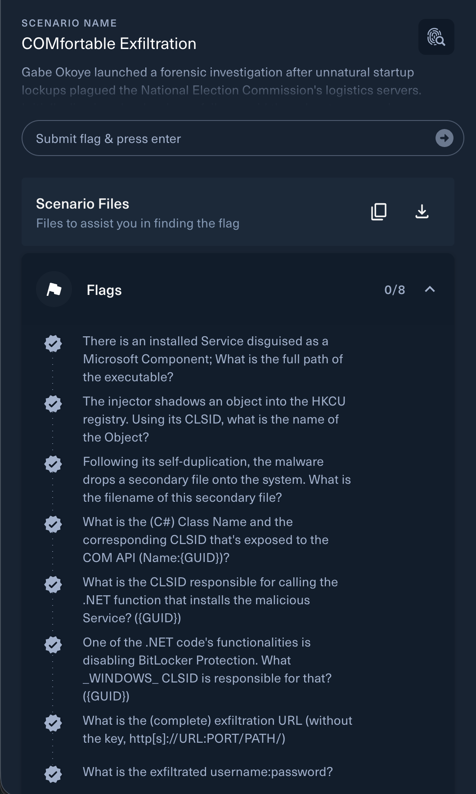

### 1. Có một dịch vụ được cài đặt để giả dạng một Microsoft Component, cho biết đường dẫn đầy đủ của file thực thi đó ?

Chúng ta cần tìm một file thực thi được cài như một dịch vụ giả dạng dịch vụ chính thống của Microsoft, ban đầu mình sử dụng volatility để quét cây tiến trình trước, tuy nhiên nó khá sạch, có lẽ mã độc không còn đang chạy khi file dump này được chụp. Vì thế mình chuyển qua memprocfs, một công cụ tuyệt vời để điều tra file dump với khả năng xây dựng lại hệ thống file và mount thành ổ M để nngười dùng có thể trực tiếp tìm kiếm. Hơn nữa, nó còn cung cấp các tính năng rất hữu ích cho một nhà điều tra số như tự trích registry, tự tạo danh sách các dịch vụ được cài, tự tìm kiếm dấu hiệu process injection thông qua quét bộ nhớ tiến trình ...

Tính năng tự xây dựng lại hệ thống service là thứ mình muốn nhắc tới ở đây, nó được lưu ở `M:\sys\services\services.txt`, ta sẽ tìm kiếm các dịch vụ có đường dẫn không nằm ở `C:\Windows`, hoặc được chạy từ user profile mà không phải SYSTEM. Đặc biệt để ý đến những file có tên giả dạng như `Microsoft...`, `Windows...`:

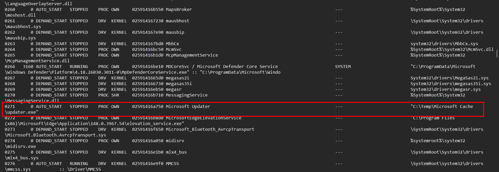

Dịch vụ này chứa tất cả đặc điểm trên, không có chương trình chính thống nào của Microsoft lại nằm ở thư mục `Temp` cả.

**Đáp án câu 1: `C:\Temp\Microsoft Cache\updater.exe`**

### 2. Injector núp bóng một object trong HKCU registry, sử dụng CSLID của nó, hãy tìm tên của object chính thống bị khai thác ?

> Trước khi đi tiếp, hãy cùng tìm hiểu về các khái niệm liên quan:
> 1. COM objects là gì ?
>
> Component Object Model là một chuẩn giao diện nhị phân được Windows tạo ra vào cuối những năm 90, nó cho phép bất kì một chương trình nào cung cấp các hàm có thể tái sử dụng của nó cho các chương trình khác, kể cả khác ngôn ngữ lập trình, vượt qua ranh giới tiến trình... Một ví dụ thường ngày là Office sử dụng COM để cho phép VBScript tự động hóa các tác vụ Word, Excel,.. hay Task Scheduler sử dụng COM để kích hoạt các tác vụ được lên lịch sẵn.
>
> 2. Vậy COM nhận diện các object như thế nào ?
>
> Mỗi COM object có một CLSID, 128-bit GUID kiểu như: `{A7A63E5C-3877-4840-8727-C1EA9D7A4D50}`
>
> Khi một chương trình muốn sử dụng một COM object, nó gọi hàm:
> ```c
> CoCreateInstance(CLSID, ...)
> ```
> Windows sẽ tra cứu CLSID đấy trong registry để tìm xem code này ở đâu.
> 
> 3. CLSID được lưu trữ ở đâu ?
>
> ```text
>HKLM\SOFTWARE\Classes\CLSID\{guid}\  ← toàn hệ thống, cần quyền Admin để sửa
>HKCU\Software\Classes\CLSID\{guid}\  ← cho mỗi người dùng, ai cũng sửa được
>```
> Dưới mỗi khóa CLSID, thường có những subkey như:
> - InprocServer32 → đường dẫn tới một DLL được load vào tiến trình gọi nó
> - LocalServer32 → đường dần tới một EXE được chạy như tiến trình mới
> 
> Giá trị (Default) trong mỗi subkey trên cho Windows biết chạy code ở đâu khi CLSID đó được kích hoạt. 
>
> 4. Thứ tự tra cứu - lỗ hổng bị khai thác
>
> Khi `CoCreateInstance({some-guid})` được gọi, Windows tìm theo thứ tự sau:
>
> ```text
> 1. HKCU\Software\Classes\CLSID\{guid}   ← check đầu tiên
> 2. HKLM\SOFTWARE\Classes\CLSID\{guid}   ← check sau
>```
> Điều này có nghĩa là nếu một CLSID tồn tại trong cả HKLM và HKCU, HKCU luôn thắng, còn gì tệ hơn việc ghi giá trị vào HKCU không cần quyền admin ?
> 
> Nó dẫn đến shadow attack hay COM hijacking attack, khi kẻ tấn công tạo ra một CLSID trong HKCU tương ứng với CLSID của một tác vụ được gọi thường xuyên trong HKLM, từ đó mỗi khi chương trình nào gọi hàm đó, Windows kiểm tra HKCU trước và load các file độc thay vì file chính thống

Kiểm tra HKCU trước, thư mục này thường sẽ **trống**, các entry ở đây đều có thể là khả nghi:

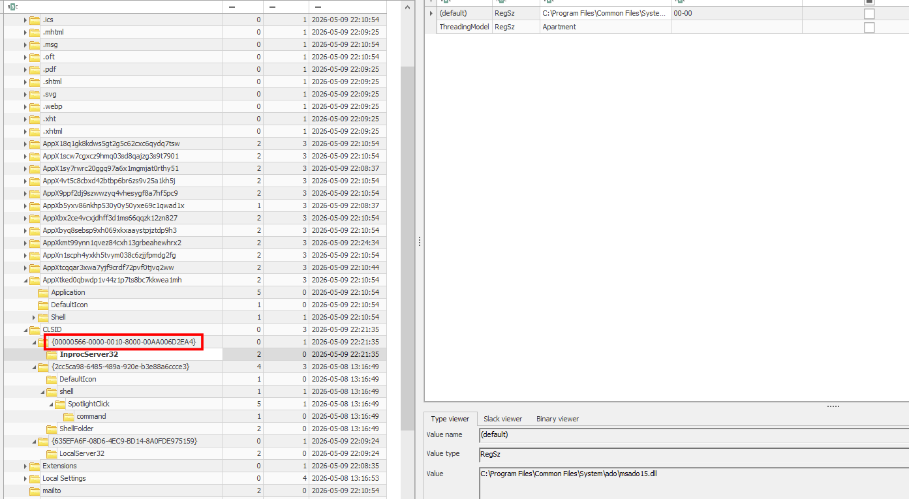

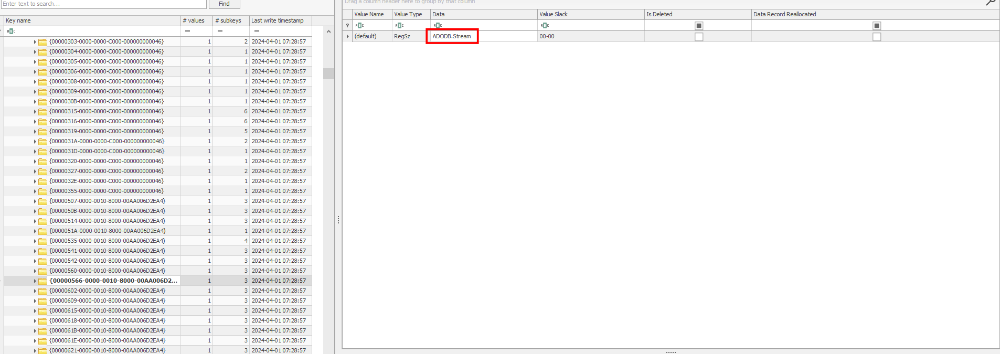

CLSID này xuất hiện trong cả HKCU và HKLM, đây chính là shadow attack mà mình đã nhắc đến. Object bị khai thác được hiển trị trong HKLM

**Đáp án câu 2: ADODB.Stream**

### 3. Sau khi tự nhân bản, mã độc sinh ra một file trên hệ thống, tên của file này là gì ?

Để điều tra thời gian thực thi và các file/thư mục được tác động, ta có thể dựa vào các file prefetch, may mắn là memprocfs đã mount được đống file này nguyên vẹn. Parse file prefetch của mã độc với PECmd, một tool của Eric Zimmerman:

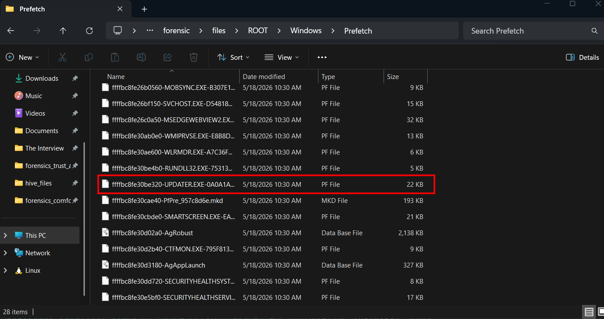

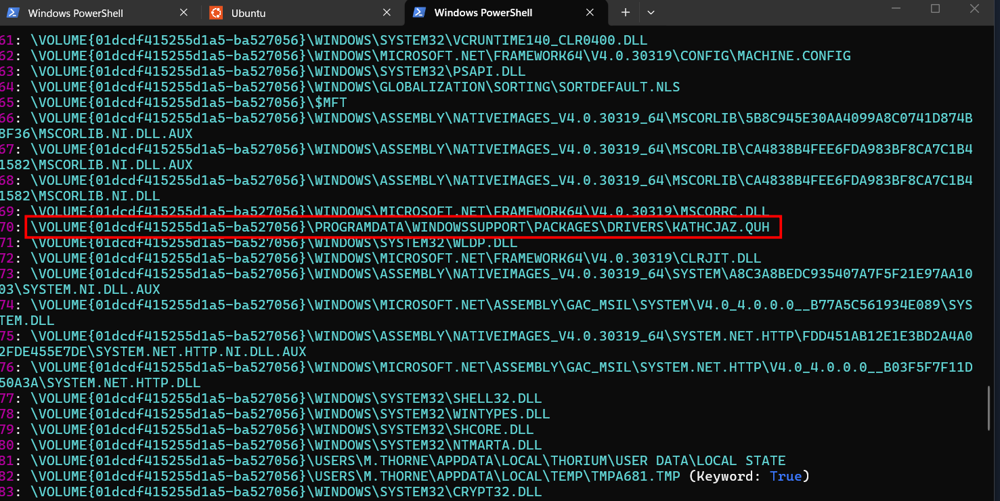

Để ý entry 70 trong file referenced, không có folder nào chính thống tên thế này cả, Microsoft sử dụng `"C:\ProgramData\Microsoft\..."`. Hơn nữa tên file trông như được sinh ngẫu nhiên, một đặc điểm của malware, đây chính là file ta cần tìm

**Đáp án câu 3: kathcjaz.quh**

### 4. Tên lớp (C#) và CLSID tương ứng được cung cấp với COM API ? (Name:{GUID})

Mã độc được thả ở câu trên là một file thực thi .NET, dùng dnSpy để dịch ngược về code C#, trong C#, một lớp được cung cấp cho COM API sử dụng những thuộc tính sau:

```c#
[ComVisible(true)]
[Guid("xxxxxxxx-xxxx-xxxx-xxxx-xxxxxxxxxxxx")]
[ClassInterface(ClassInterfaceType.None)]
public class SomeClassName
{
    ...
}
```

Nhìn vào các lớp được dịch ngược trong dnSpy, thấy ngay lớp này được cung cấp cho COM API:

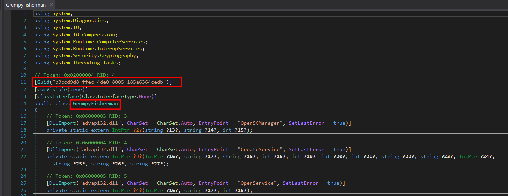

**Đáp án câu 4: GrumpyFisherman:{b3ccd9d8-ffec-4de0-8005-185a6364cedb}**

### 5. CLSID nào chịu trách nhiệm gọi hàm .NET cài đặt dịch vụ độc hại ?

Hàm cài đặt dịch vụ độc hại là hàm này, nằm trong class `GrumpyFisherman`:

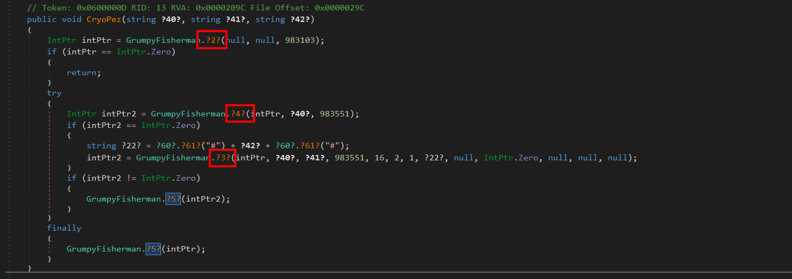

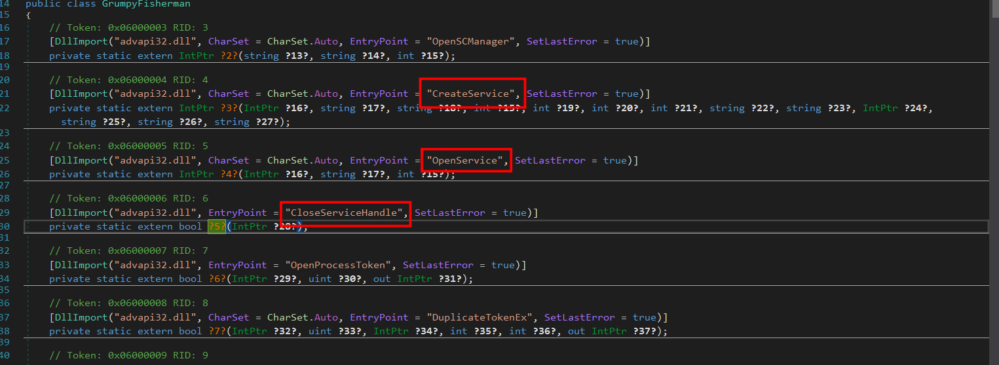

Nó gọi `OpenService`, `CreateService` thông qua `advapi32.dll`, các tham số được truyền vào lần lượt là tên dịch vụ, tên hiển thị và đường dẫn đến file nhị phân. Vậy đây chính là hàm mà câu hỏi đang yêu cầu, vì nó nằm trong mã độc .NET kia, ta sẽ tìm trong `SOFTWARE` HKCU, HKLM xem CLSID nào trỏ về file `.quh` đó. HKCU có khá ít CLSID, mình đã nhìn qua và không có gì, còn HKLM có rất nhiều, việc nhìn bằng mắt là không khả thi, ta dùng python để giúp quét nhanh qua HKLM, sử dụng module `regipy` để parse hive:

```python
from regipy.registry import RegistryHive
import sys

SOFTWARE_HIVE = sys.argv[1] if len(sys.argv) > 1 else "SOFTWARE"

target="kathcjaz.quh"

def is_suspicious(path, target):
    if not path:
        return False
    p = path.lower()
    # đánh dấu nếu dính mã độc ta tìm thấy
    if target in p:
        return True
    return False

hive = RegistryHive(SOFTWARE_HIVE)
base = r'\Classes\CLSID'
root = hive.get_key(base)

found = []

for clsid_key in root.iter_subkeys():
    clsid = clsid_key.name
    inproc_path = None
    dotnet_class = None
    dotnet_codebase = None
    is_dotnet = False

    for sub in clsid_key.iter_subkeys():
        if sub.name.lower() in ('inprocserver32', 'localserver32'):
            for val in sub.get_values():
                name_lower = val.name.lower()
                # kiểm tra xem có phải .NET COM object
                if name_lower == '(default)' and val.value:
                    inproc_path = str(val.value)
                    if 'mscoree' in inproc_path.lower():
                        is_dotnet = True
                if name_lower == 'class':
                    dotnet_class = str(val.value)
                if name_lower == 'codebase':
                    dotnet_codebase = str(val.value)

    # đánh dấu nếu là com object có codebase là mã độc kia
    if is_dotnet and dotnet_codebase and is_suspicious(dotnet_codebase, target):
        found.append({
            'clsid': clsid,
            'server': inproc_path,
            'class': dotnet_class,
            'codebase': dotnet_codebase
        })

if found:
    print(f"[!] Tìm thấy {len(found)} .NET COM registration khả nghi :\n")
    for entry in found:
        print(f"  CLSID    : {entry['clsid']}")
        print(f"  Server   : {entry['server']}")
        print(f"  Class    : {entry['class']}")
        print(f"  CodeBase : {entry['codebase']}")
        print()
```

Kết quả cho ra 3 CLSID như sau:

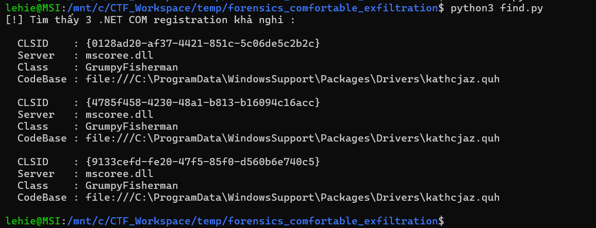

Khi kiểm tra lại với Registry Explorer, chỉ có CLSID này thực sự trỏ đến mã độc:

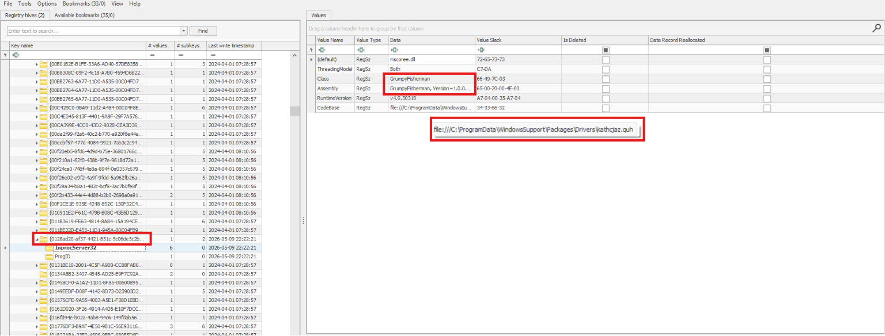

**Đáp án câu 5: {0128ad20-af37-4421-851c-5c06de5c2b2c}**

### 6. Một trong các hàm của mã độc .NET có mục đích vô hiệu hóa bảo vệ BitLocker, đâu là _WINDOWS_ CLISD của nó ?

Hãy chú ý đến hàm này trong lớp `GrumpyFisherman`, nó khởi tạo `FveUi`, ép kiểu về `IFveUiDispatch` và gọi hàm `DoTurnOffDeviceEncryption()`:

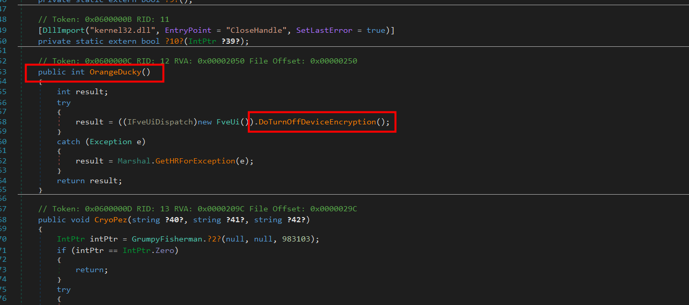

`FveUi` là một COM object có sẵn trong Windows, là hàm xử lý BitLocket UI, FVE viết tắt của Full Volume Encryption, chính là BitLocker, đây là một CLSID chính thống đã bị khai thác.

Ta có thể dùng một đoạn mã tương tự câu trên để tìm FveUi trong HKLM, nhưng may mắn là FveUi xuất hiện ngay trong mã độc được dịch ngược, ta có thể lấy ngay CLSID của nó:

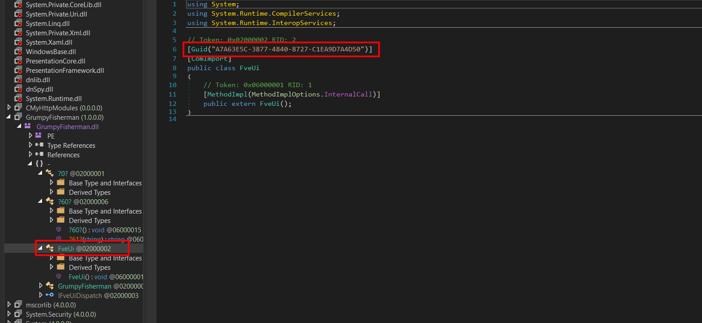

Check lại với HKLM để chắc chắn:

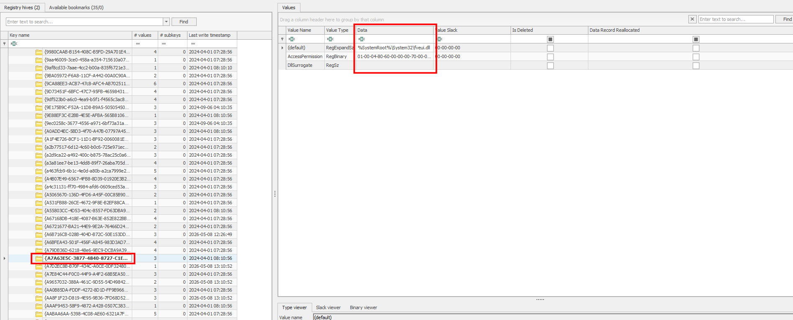

**Đáp án câu 6: {A7A63E5C-3877-4840-8727-C1EA9D7A4D50}**

### 7. URL đầy đủ được dùng để đánh cắp dữ liệu là gì ? 

Hàm này chính là hàm đánh cắp dữ liệu chính:

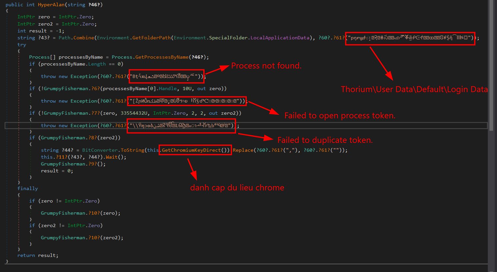

Các kí hiệu kì dị được decode bởi hàm này:

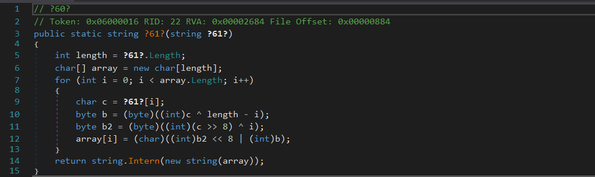

Mình giải mã nó bằng 1 script python đơn giản:

```python
def decrypt(s):
    length = len(s)
    result = []
    for i, c in enumerate(s):
        c = ord(c)
        low  = (c       ^ (length - i)) & 0xFF
        high = ((c >> 8) ^ i           ) & 0xFF
        result.append(chr((high << 8) | low))
    return ''.join(result)
```

Nhìn vào hàm `HyperAlan()` ở trên, ta thấy rõ ý đồ của mã độc, nó đánh cắp thông tin đăng nhập trên Chrome bằng cách truy cập vào `Login Data`, sau đó gọi hàm `GetChromiumKeyDirect()` bẻ khóa DPAPI với Login State:

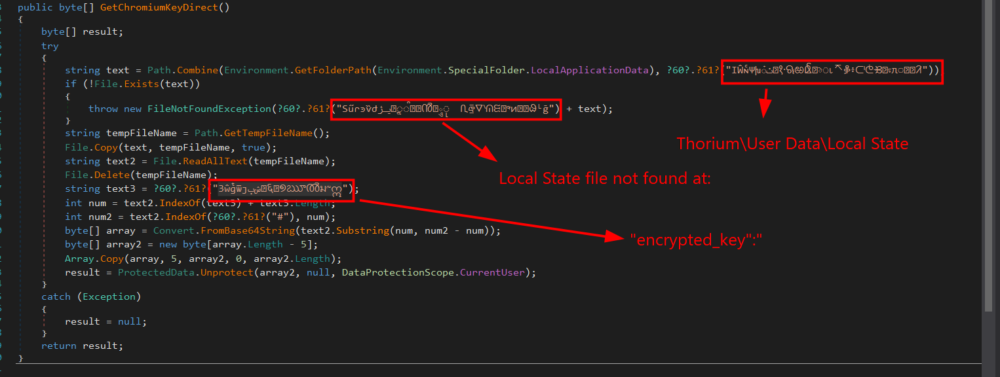

Mình sẽ nói về DPAPI ở câu sau, bây giờ hãy để ý cách mà mã độc đánh cắp thông tin, trong `HyperAlan()` có dùng Task này để truy cập file cũng như gửi về máy chủ kẻ tấn công:

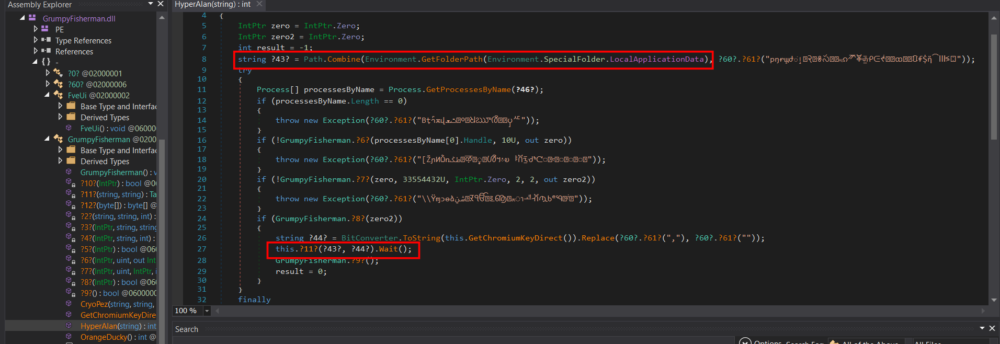

Lần theo dấu vết Task đó bằng cách nhấn đúp, dnSpy sẽ đưa ta đến:

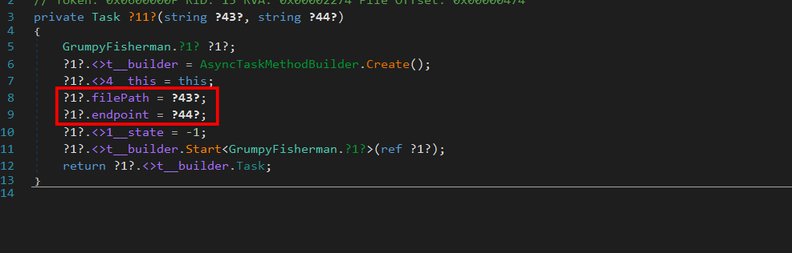

Tham số thứ 2 được truyền vào là `endpoint`, điều này làm mình lầm tưởng rằng đấy chính là URL được dùng để gửi thông tin về, nhưng hóa ra không phải. Trong quá trình tìm tham số `?44?` đấy, nhận thấy nó được sinh ra từ kết quả của hàm bẻ khóa DPAPI chrome.

> DPAPI là cơ chế mã hóa của Windows dùng để lưu trữ các thông tin nhạy cảm, bất kì ứng dụng nào cũng có thể gọi hàm `CryptProtectData()` để nhận về một blob được mã hóa bằng mật khẩu máy tính và SID của người dùng hiện tại, và gọi hàm `CryptUnprotectData()` để nhận về dữ liệu gốc, nhưng chỉ khi gọi hàm **dưới phiên của người dùng đó, và máy đó**
> Vậy để bẻ được DPAPI, ta cần mật khẩu và SID của người dùng, đơn giản khi ta đã có toàn bộ SAM, SECURITY, SYSTEM hive của người đó trong đĩa `ad1` và cả ổ cứng mount bởi memprocfs.

Sử dụng `impacket-secretsdump` để dump hash của người dùng ra, hash được lưu trong SAM, mã hóa bởi bootkey trong SYSTEM:

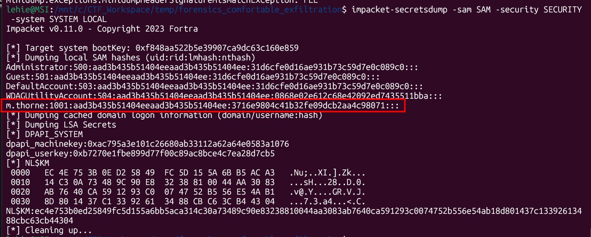

Có hash, bẻ mật khẩu với crackstation:

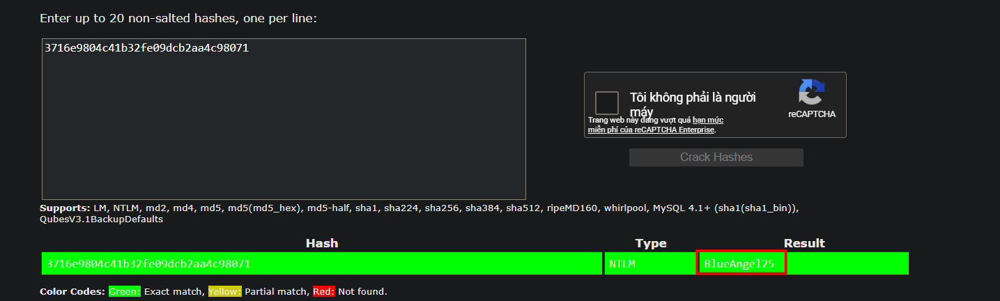

Thành công! Giờ tới lượt masterkey

> Mật khẩu và SID sẽ được mã hóa thành pre-key, sau đó unwrap thành masterkey, mỗi masterkey được lưu trong `Protect\<SID>\<GUID>`, Windows sẽ đổi GUID sau 1 khoảng thời gian, trong SID có 1 file Preferrer trỏ đến active guid, tuy nhiên ở đây ta chỉ có 1 GUID nên không cần phải đoán nữa.

Dùng `dpapi.py` để bẻ masterkey:

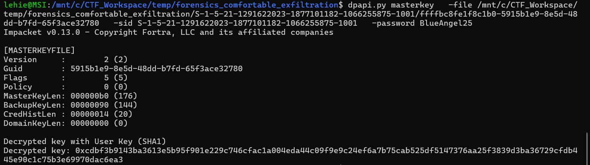

Tất cả đã xong, Chrome sử dụng DPAPI để mã hóa dữ liệu trong Login Data, ta có thể dùng ngay python để bẻ khóa cơ sở dữ liệu đó sử dụng masterkey đã có:

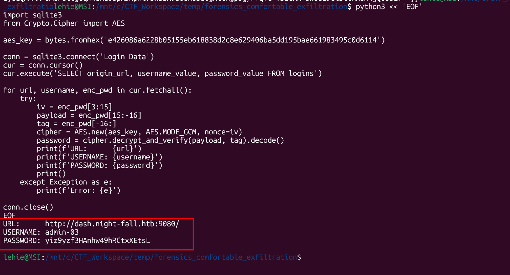

Hoặc sử dụng `mimikatz`, công cụ khét tiếng nếu bạn không cần biết logic phía sau nó, khi đó sẽ cần export thêm Local State từ file `ad1`. Một điều nữa cần lưu ý nếu bạn dùng `mimikatz`, nó quét Local State để tìm đúng pattern này:

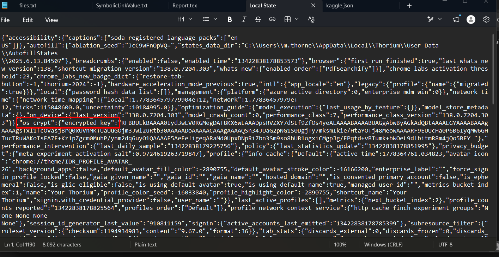

Tuy nhiên cấu trúc mới của Chrome đã thay đổi, bạn nên kiểm tra lại Local State và xóa đi những trường phía trước `encrypted_key`, mình đã xóa sẵn rồi:

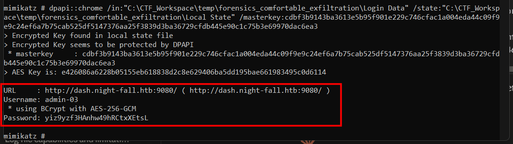

Sau đó dùng `dpapi::chrome`, mode chuyên biệt của mimikatz cho Chrome, ta được kết quả tương tự.

Tuy nhiên URL này lại không phải URL để gửi thông tin đánh cắp về, vậy chắc hẳn nó phải được hard-code đâu đó trong mã độc, do chúng ta đã tìm hiểu tất cả các hàm của nó, không hề có hàm nào sinh URL động cả, nhưng dnSpy bằng cách nào đó không hiển thị hết, chỉ khi dùng `dotPeek` mình mới thấy chuỗi lạ này:

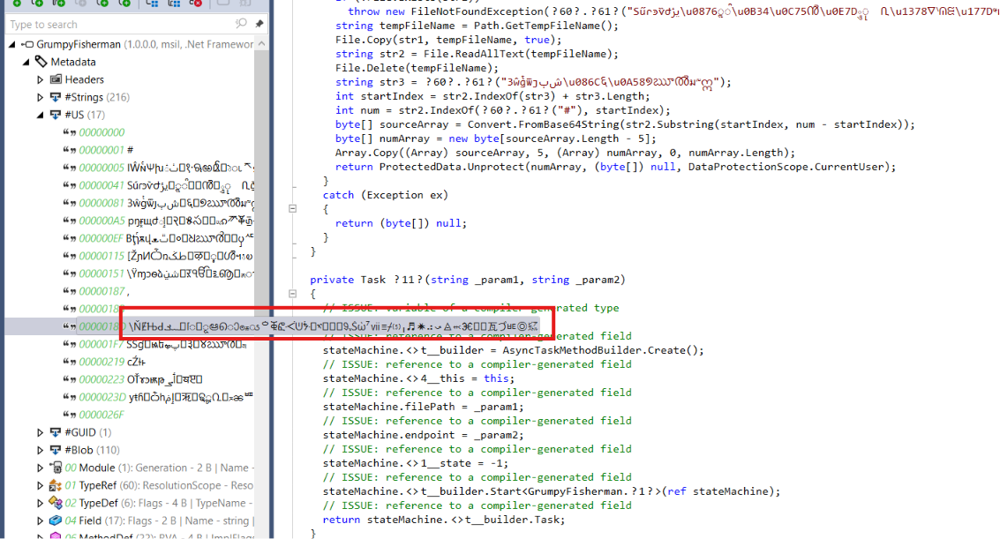

Nó nằm trong US Heap, vẫn trỏ vào Task ?11?, tuy nhiên malware đã giấu nó đi, decrypt nó với hàm `?61?`, ta tìm được URL thực sự mà thông tin đánh cắp được gửi về

**Đáp án câu 7: `http://check.microsoftcloudservices.htb:8000/update/`**

### 8. Thông tin đăng nhập đã bị đánh cắp ?

Ta đã 'vô tình' tìm ra ở câu trên :D

**Đáp án câu 8: admin-03:yiz9yzf3HAnhw49hRCtxXEtsL**
