# COMfortable Exfiltration

## Tình huống:

Gabe Okoye bắt đầu một cuộc điều tra sau khi phát hiện các bất thường trên logistics server mỗi lần khởi động. Ban đầu nó được cho là lỗi phần cứng, nhưng sau đó anh ta đã phát hiện ra đó là sự nhúng tay rất tinh vi của tổ chức Directorate 9. Mã độc này nhúng một dịch vụ ẩn vào hệ thống, lợi dụng cơ chế COM để chạy lén và đánh cắp credentials trước khi bị phát hiện. Cùng mổ xẻ tiến trình ẩn này, khôi phục những thứ đã bị đánh cắp, và loại bỏ cơ chế persistence trước khi mọi thứ trở nên không thể cứu rỗi.

## Artifact được cung cấp

Đề bài cung cấp cho chúng ta 2 file ảnh đĩa `.ad1` và 1 file dump bộ nhớ `.elf`. Ta sẽ sử dụng volatility3 hoặc memprocfs để điều tra file dump dễ hơn, và FTK Imager để duyệt qua ảnh đĩa.

## Hướng giải

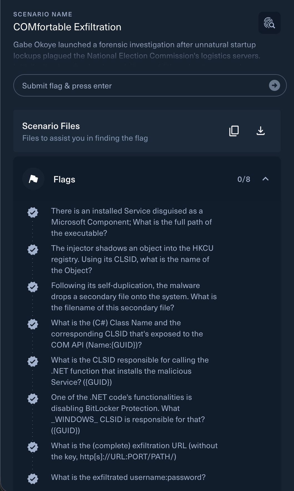

### 1. Có một dịch vụ được cài đặt để giả dạng một Microsoft Component, cho biết đường dẫn đầy đủ của file thực thi đó ?

Chúng ta cần tìm một file thực thi được cài như một dịch vụ giả dạng dịch vụ chính thống của Microsoft, ban đầu mình sử dụng volatility để quét cây tiến trình trước, tuy nhiên nó khá sạch, có lẽ mã độc không còn đang chạy khi file dump này được chụp. Vì thế mình chuyển qua memprocfs, một công cụ tuyệt vời để điều tra file dump với khả năng xây dựng lại hệ thống file và mount thành ổ M để người dùng có thể trực tiếp tìm kiếm. Hơn nữa, nó còn cung cấp các tính năng rất hữu ích cho một nhà điều tra số như tự trích registry, tự tạo danh sách các dịch vụ được cài, tự tìm kiếm dấu hiệu process injection thông qua quét bộ nhớ tiến trình...

Tính năng tự dựng lại danh sách service là thứ mình muốn nhắc tới ở đây, nó được lưu ở `M:\sys\services\services.txt`, ta sẽ tìm các dịch vụ có đường dẫn nằm ngoài các vị trí hệ thống quen thuộc như `C:\Windows`, `C:\Program Files`, hoặc được chạy từ user profile/Temp một cách bất thường. Đặc biệt để ý đến những file có tên giả dạng như `Microsoft...`, `Windows...`:

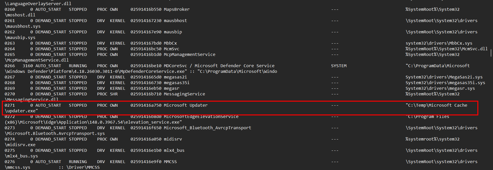

Dịch vụ này chứa tất cả đặc điểm trên, không có chương trình chính thống nào của Microsoft lại nằm ở thư mục `Temp` cả.

**Đáp án câu 1: `C:\Temp\Microsoft Cache\updater.exe`**

### 2. Injector núp bóng một object trong HKCU registry, sử dụng CLSID của nó, hãy tìm tên của object chính thống bị khai thác ?

> Trước khi đi tiếp, hãy cùng tìm hiểu về các khái niệm liên quan:
> 1. COM object là gì?
>
> Component Object Model là một chuẩn giao diện nhị phân của Microsoft, có từ thời Windows 9x/NT, nó cho phép bất kỳ chương trình nào cung cấp các hàm có thể tái sử dụng của nó cho các chương trình khác, kể cả khác ngôn ngữ lập trình, vượt qua ranh giới tiến trình... Một ví dụ thường ngày là Office sử dụng COM để cho phép VBScript tự động hóa các tác vụ Word, Excel,... hay Task Scheduler sử dụng COM để kích hoạt các tác vụ được lên lịch sẵn.
>
> 2. Vậy COM nhận diện object như thế nào?
>
> Mỗi COM class có một CLSID, 128-bit GUID kiểu như: `{A7A63E5C-3877-4840-8727-C1EA9D7A4D50}`
>
> Khi một chương trình muốn sử dụng một COM object, nó gọi hàm:
> ```c
> CoCreateInstance(CLSID, ...)
> ```
> Windows sẽ tra cứu CLSID đó trong registry để tìm xem phần code tương ứng nằm ở đâu.
> 
> 3. CLSID được lưu trữ ở đâu?
>
> ```text
>HKLM\SOFTWARE\Classes\CLSID\{guid}\  ← toàn hệ thống, cần quyền Admin để sửa
>HKCU\Software\Classes\CLSID\{guid}\  ← cho mỗi người dùng, ai cũng sửa được
>```
> Dưới mỗi khóa CLSID, thường có những subkey như:
> - InprocServer32 → thường là đường dẫn tới DLL được load vào tiến trình gọi nó. Riêng với .NET COM object, `(Default)` thường trỏ tới `mscoree.dll` - CLR loader; assembly thật lại nằm ở các giá trị như `Class`, `Assembly`, `RuntimeVersion`, `CodeBase`. Đây là lý do về sau script của mình không chỉ nhìn `(Default)`, mà còn check cả `CodeBase`.
> - LocalServer32 → đường dẫn tới một EXE được chạy như tiến trình mới
> 
> Giá trị (Default) trong mỗi subkey trên cho Windows biết chạy code ở đâu khi CLSID đó được kích hoạt. 
>
> 4. Thứ tự tra cứu - điểm bị khai thác
>
> Nói chính xác hơn, `HKCR` là merged view của `HKCU\Software\Classes` và `HKLM\SOFTWARE\Classes`; phần HKCU sẽ che phần HKLM nếu trùng key. Nên khi `CoCreateInstance({some-guid})` được gọi, kết quả thực tế giống như Windows ưu tiên:
>
> ```text
> 1. HKCU\Software\Classes\CLSID\{guid}   ← kiểm tra đầu tiên
> 2. HKLM\SOFTWARE\Classes\CLSID\{guid}   ← kiểm tra sau
>```
> Điều này có nghĩa là nếu một CLSID tồn tại trong cả HKLM và HKCU, HKCU luôn thắng, vấn đề là ghi giá trị vào HKCU thường không cần quyền admin.
> 
> Nó dẫn đến **COM Hijacking** (MITRE T1546.015), cụ thể ở đây là kiểu registry shadowing: kẻ tấn công tạo một CLSID trong HKCU trùng với CLSID chính thống ở HKLM. Khi chương trình gọi CLSID đó, phần HKCU che phần HKLM và Windows load file độc thay vì file chính thống.

Kiểm tra HKCU trước, thư mục này thường sẽ **trống**, các entry ở đây đều có thể là khả nghi:

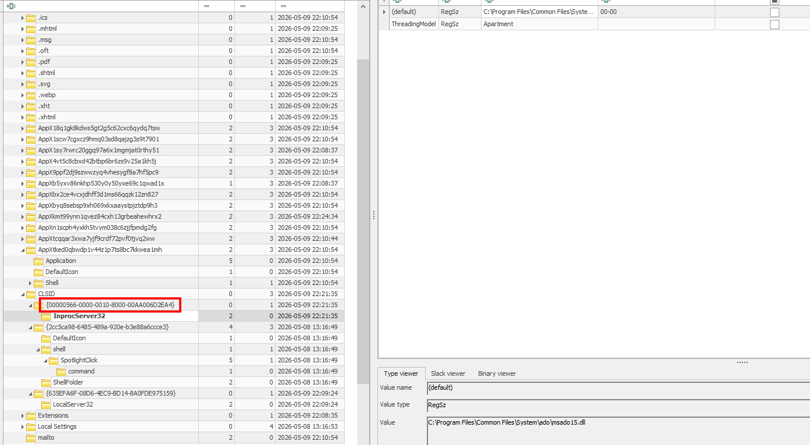

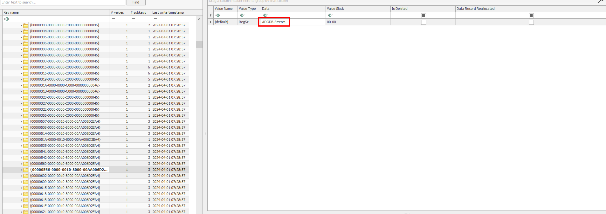

CLSID này xuất hiện trong cả HKCU và HKLM, đây chính là COM Hijacking/registry shadowing mà mình đã nhắc đến. COM class chính thống bị che bởi entry HKCU được hiển thị trong HKLM

**Đáp án câu 2: ADODB.Stream**

### 3. Sau khi tự nhân bản, mã độc sinh ra một file trên hệ thống, tên của file này là gì ?

Để điều tra thời điểm thực thi và các file/thư mục được tác động, ta có thể dựa vào các file prefetch, may mắn là memprocfs đã mount được đống file này nguyên vẹn. Parse file prefetch của mã độc với PECmd, một tool của Eric Zimmerman:

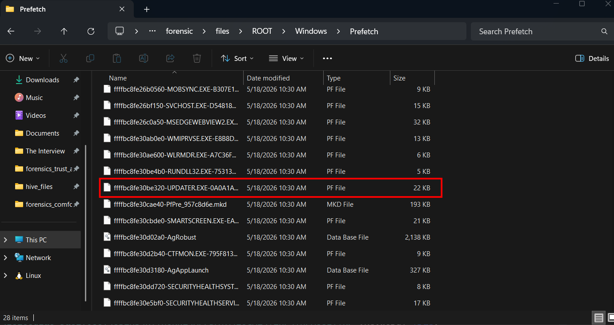

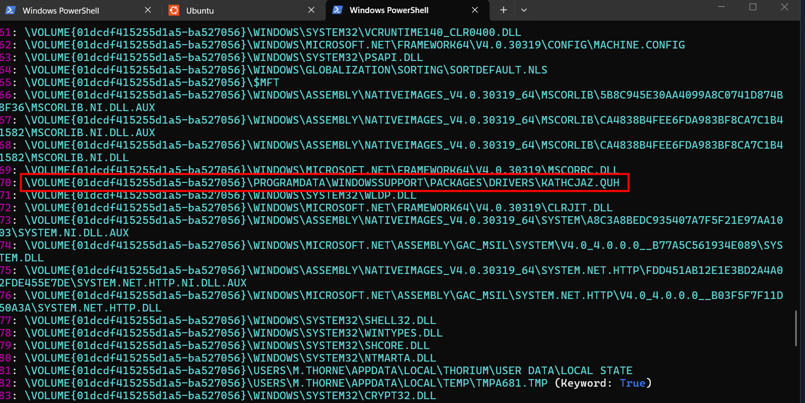

Để ý entry 70 trong mục referenced files, không có folder chính thống nào tên thế này cả, Microsoft thường dùng đường dẫn kiểu `C:\ProgramData\Microsoft\...`. Hơn nữa tên file trông như được sinh ngẫu nhiên, một đặc điểm của malware, đây chính là file ta cần tìm

**Đáp án câu 3: kathcjaz.quh**

### 4. Tên lớp (C#) và CLSID tương ứng được expose qua COM API ? (Name:{GUID})

Mã độc được thả ở câu trên là một file thực thi .NET, dùng dnSpy để dịch ngược về code C#, trong C#, một lớp được expose cho COM API sử dụng những thuộc tính sau:

```c#
[ComVisible(true)]
[Guid("xxxxxxxx-xxxx-xxxx-xxxx-xxxxxxxxxxxx")]
[ClassInterface(ClassInterfaceType.None)]
public class SomeClassName
{
    ...
}
```

Nhìn vào các lớp được dịch ngược trong dnSpy, thấy ngay lớp này được expose cho COM API:

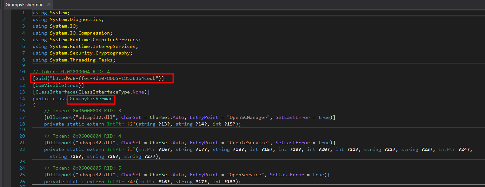

**Đáp án câu 4: GrumpyFisherman:{b3ccd9d8-ffec-4de0-8005-185a6364cedb}**

### 5. CLSID nào chịu trách nhiệm gọi hàm .NET cài đặt dịch vụ độc hại?

Hàm cài đặt dịch vụ độc hại là hàm này, nằm trong class `GrumpyFisherman`:

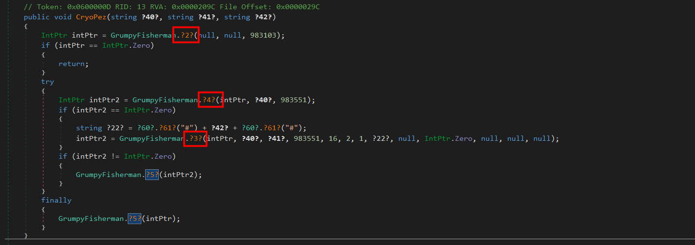

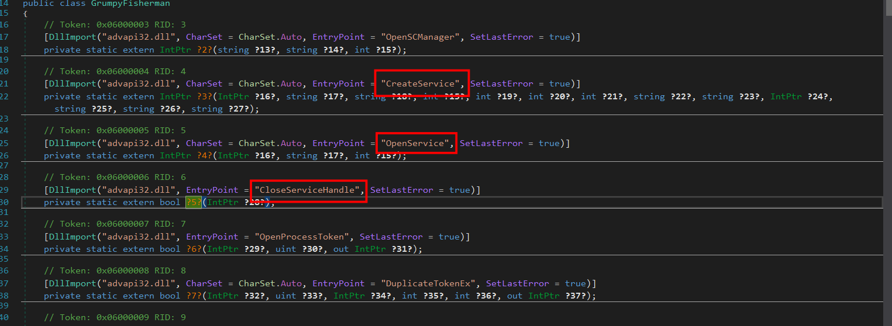

Nó gọi `OpenService`, `CreateService` thông qua `advapi32.dll`; `CreateService` thực tế có khá nhiều tham số, nhưng những tham số quan trọng ở đây là tên dịch vụ, tên hiển thị và đường dẫn đến file nhị phân. Vậy đây chính là hàm mà câu hỏi đang yêu cầu, vì nó nằm trong mã độc .NET kia, ta sẽ tìm trong `SOFTWARE` HKCU, HKLM xem CLSID nào trỏ về file `.quh` đó. HKCU có khá ít CLSID, mình đã nhìn qua và không có gì, còn HKLM có rất nhiều, việc nhìn bằng mắt là không khả thi, ta dùng python để giúp quét nhanh qua HKLM, sử dụng module `regipy` để parse hive:

```python
from regipy.registry import RegistryHive
import sys

SOFTWARE_HIVE = sys.argv[1] if len(sys.argv) > 1 else "SOFTWARE"

target="kathcjaz.quh"

def is_suspicious(path, target):
    if not path:
        return False
    p = path.lower()
    # đánh dấu nếu dính mã độc ta tìm thấy
    if target in p:
        return True
    return False

hive = RegistryHive(SOFTWARE_HIVE)
base = r'\Classes\CLSID'
root = hive.get_key(base)

found = []

for clsid_key in root.iter_subkeys():
    clsid = clsid_key.name
    inproc_path = None
    dotnet_class = None
    dotnet_codebase = None
    is_dotnet = False

    for sub in clsid_key.iter_subkeys():
        if sub.name.lower() in ('inprocserver32', 'localserver32'):
            for val in sub.get_values():
                name_lower = val.name.lower()
                # kiểm tra xem có phải .NET COM object
                if name_lower == '(default)' and val.value:
                    inproc_path = str(val.value)
                    if 'mscoree' in inproc_path.lower():
                        is_dotnet = True
                if name_lower == 'class':
                    dotnet_class = str(val.value)
                if name_lower == 'codebase':
                    dotnet_codebase = str(val.value)

    # đánh dấu nếu là com object có codebase là mã độc kia
    if is_dotnet and dotnet_codebase and is_suspicious(dotnet_codebase, target):
        found.append({
            'clsid': clsid,
            'server': inproc_path,
            'class': dotnet_class,
            'codebase': dotnet_codebase
        })

if found:
    print(f"[!] Tìm thấy {len(found)} .NET COM registration khả nghi :\n")
    for entry in found:
        print(f"  CLSID    : {entry['clsid']}")
        print(f"  Server   : {entry['server']}")
        print(f"  Class    : {entry['class']}")
        print(f"  CodeBase : {entry['codebase']}")
        print()
```

Script này chỉ dùng để triage nhanh, không phải parser registry siêu bền vững: nếu hive/key lỗi thì cần bọc thêm `try/except`. Phần `target in p` cố tình để match cả đường dẫn thường, `file:///...`, hoặc khác hoa/thường.

Kết quả cho ra 3 CLSID như sau:

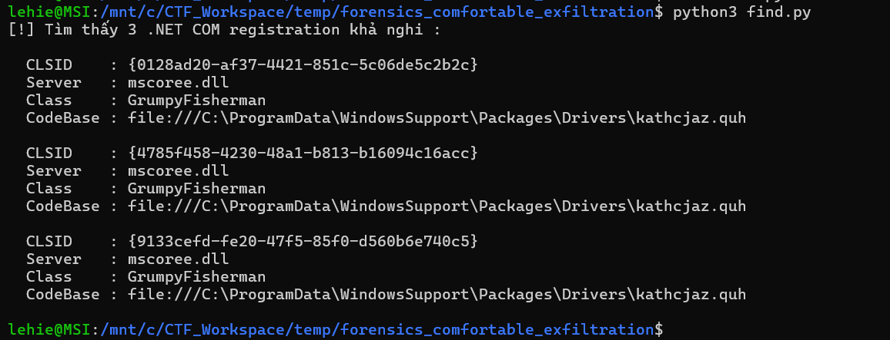

Khi kiểm tra lại với Registry Explorer, chỉ có CLSID này thực sự trỏ đến mã độc:

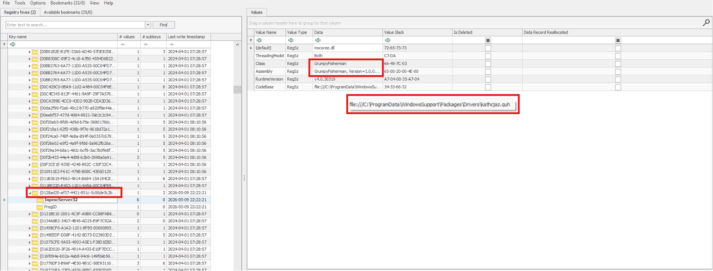

**Đáp án câu 5: {0128ad20-af37-4421-851c-5c06de5c2b2c}**

### 6. Một trong các hàm của mã độc .NET có mục đích vô hiệu hóa bảo vệ BitLocker, đâu là _WINDOWS_ CLSID của nó?

Hãy chú ý đến hàm này trong lớp `GrumpyFisherman`, nó khởi tạo `FveUi`, ép kiểu về `IFveUiDispatch` và gọi hàm `DoTurnOffDeviceEncryption()`:

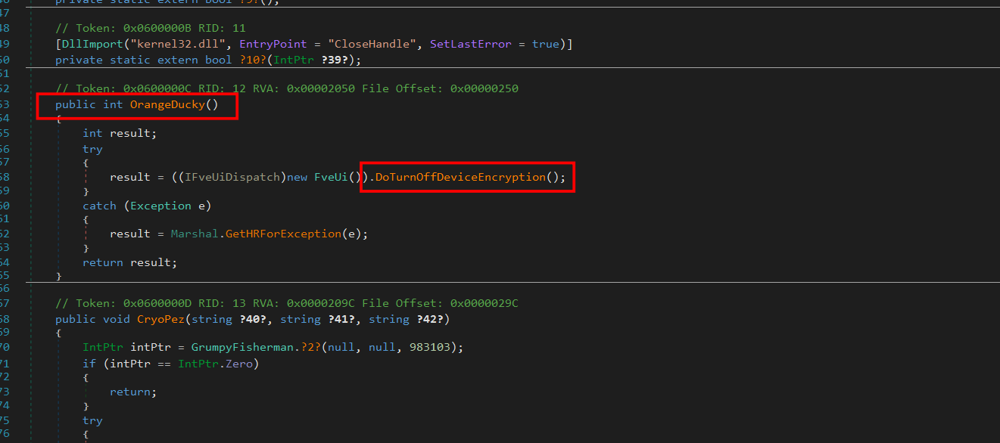

`FveUi` là một COM class có sẵn trong Windows, expose interface `IFveUiDispatch`; method bị gọi là `DoTurnOffDeviceEncryption()`. FVE viết tắt của Full Volume Encryption, chính là BitLocker. Điểm cần phân biệt: câu này là malware **abuse** một COM class hợp pháp của Windows, không phải hijack CLSID như ADODB.Stream ở câu 2.

Ta có thể dùng một đoạn mã tương tự câu trên để tìm FveUi trong HKLM, nhưng may mắn là FveUi xuất hiện ngay trong mã độc được dịch ngược, ta có thể lấy ngay CLSID của nó:

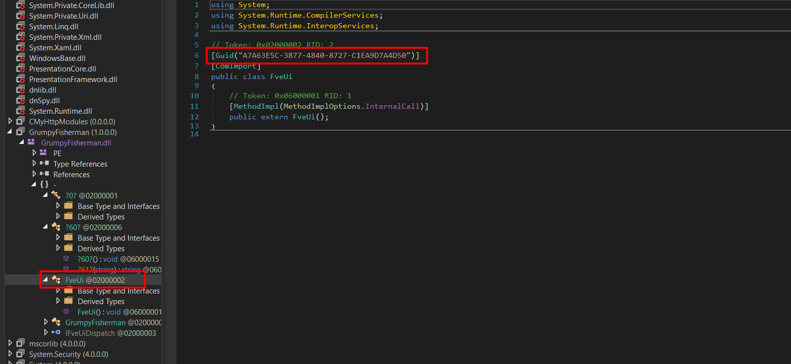

Kiểm tra lại với HKLM để chắc chắn:

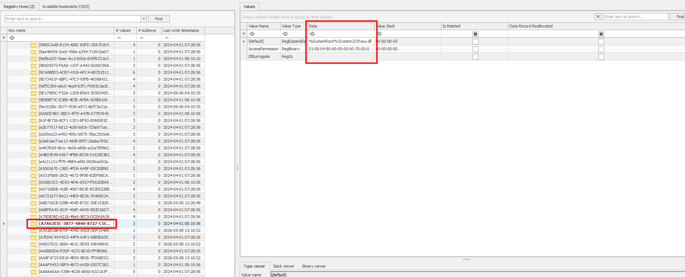

**Đáp án câu 6: {A7A63E5C-3877-4840-8727-C1EA9D7A4D50}**

### 7. URL đầy đủ được dùng để đánh cắp dữ liệu là gì? 

Hàm này chính là hàm đánh cắp dữ liệu chính:

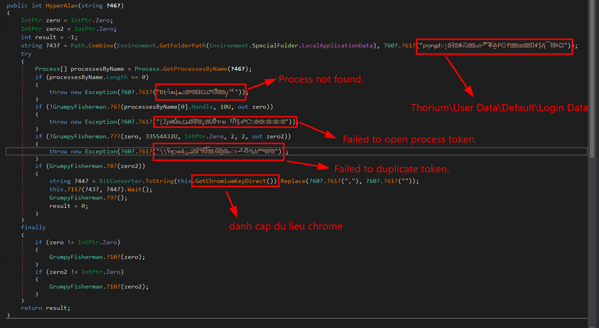

Các ký hiệu kì dị được decode bởi hàm này:

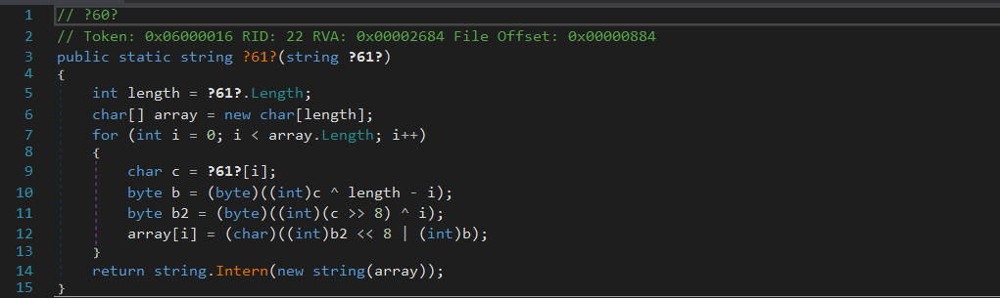

Mình giải mã nó bằng 1 script python đơn giản:

```python
def decrypt(s):
    length = len(s)
    result = []
    for i, c in enumerate(s):
        c = ord(c)
        low  = (c       ^ (length - i)) & 0xFF
        high = ((c >> 8) ^ i           ) & 0xFF
        result.append(chr((high << 8) | low))
    return ''.join(result)
```

Nhìn vào hàm `HyperAlan()` ở trên, ta thấy rõ ý đồ của mã độc, nó đánh cắp thông tin đăng nhập trên Chrome bằng cách truy cập vào `Login Data`, sau đó gọi hàm `GetChromiumKeyDirect()` lấy Chrome key từ `Local State` bằng DPAPI:

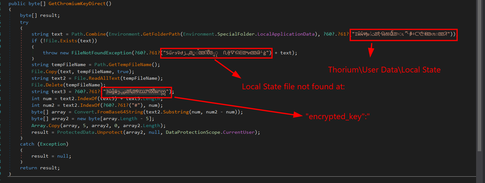

Mình sẽ nói về DPAPI ở ngay bên dưới, bây giờ hãy để ý cách mà mã độc đánh cắp thông tin. Trong `HyperAlan()` có một luồng xử lý dạng `Task`/async để đọc file và gửi dữ liệu về máy chủ kẻ tấn công:

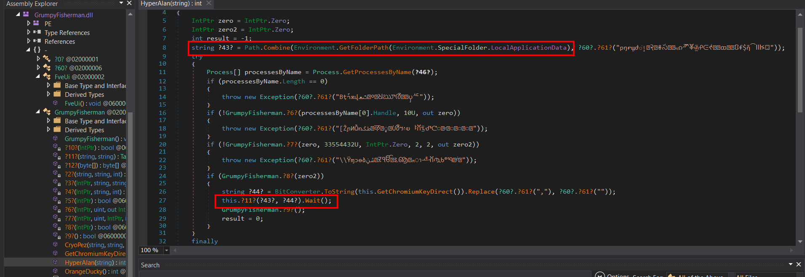

Lần theo call/reference của nhánh `Task` đó trong dnSpy, ta đến được đoạn xử lý request:

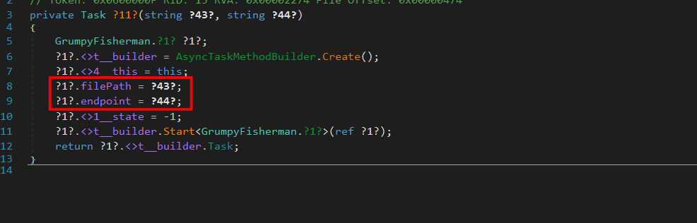

Tham số thứ 2 được truyền vào là `endpoint`, điều này làm mình lầm tưởng rằng đấy chính là URL được dùng để gửi thông tin về, nhưng hóa ra không phải. Trong quá trình tìm tham số `?44?` đấy, nhận thấy nó được sinh ra từ kết quả của hàm bẻ khóa DPAPI chrome.

> DPAPI là cơ chế bảo vệ dữ liệu nhạy cảm của Windows. Ứng dụng có thể gọi `CryptProtectData()` để nhận về một blob đã được mã hóa/protect theo context người dùng hoặc máy, rồi gọi `CryptUnprotectData()` để lấy dữ liệu gốc khi chạy đúng context đó. Với **user DPAPI**, masterkey được bảo vệ bằng key dẫn xuất từ credential của user (password/NTLM hash), SID và salt trong masterkey file.
> 
> API gốc thường yêu cầu chạy đúng context user, nhưng về mặt forensic thì không bắt buộc phải boot đúng máy đó lên: nếu có SID, password hoặc NTLM hash, masterkey blob và các hive cần thiết như SAM/SYSTEM/SECURITY, ta vẫn có thể unwrap masterkey offline. Ở case này ta có toàn bộ dữ liệu từ ảnh đĩa `.ad1` và phần hệ thống được memprocfs mount ra, nên việc unwrap masterkey là khả thi.

Sử dụng `impacket-secretsdump` để dump hash của người dùng ra. Nói gọn thì NT hash nằm trong SAM và cần SYSTEM để lấy bootkey/syskey; chi tiết hơn là bootkey được dùng để mở khóa HBootKey trong SAM, rồi HBootKey mới decrypt hash từng user:

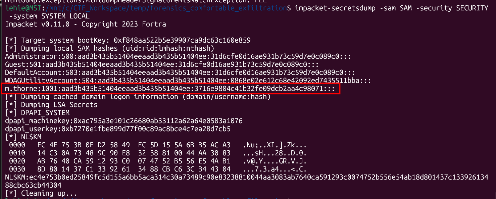

Có hash, bẻ mật khẩu với CrackStation. Cách này chỉ ăn nếu NTLM hash nằm trong wordlist của nó; thực tế hơn có thể fallback sang `hashcat/john the ripper` + `rockyou.txt`:

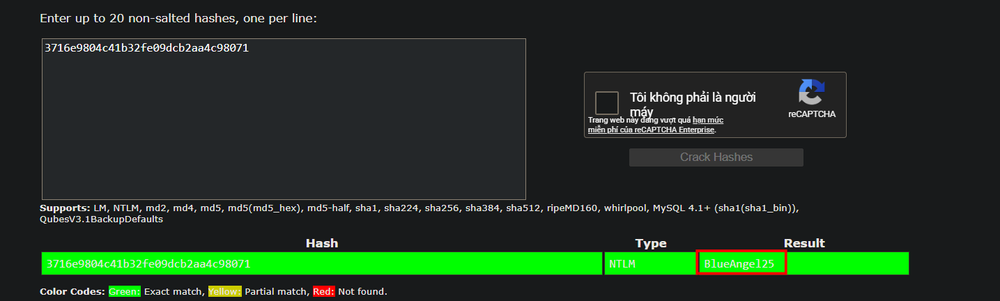

Thành công! Giờ tới lượt masterkey

> Với user DPAPI, password/NTLM hash, SID và salt trong masterkey file được đưa qua KDF để sinh pre-key; pre-key này dùng để decrypt/unwrap masterkey blob trong `Protect\<SID>\<GUID>`. Masterkey thường được rotate theo thời gian (hay gặp khoảng 90 ngày), nên trong thư mục `Protect\<SID>\` sẽ có file `Preferred` trỏ tới GUID đang được ưu tiên dùng. Ở đây ta chỉ có 1 GUID nên không cần phải đoán nữa.

Dùng `dpapi.py` để bẻ masterkey:

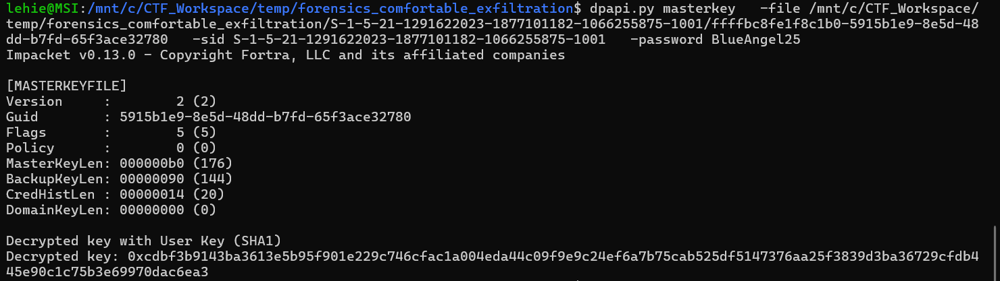

Tất cả đã xong, Chrome thường dùng DPAPI để bảo vệ khóa AES trong `Local State`; còn mật khẩu trong `Login Data` được mã hóa bằng khóa AES đó, ta có thể dùng ngay python để bẻ khóa cơ sở dữ liệu đó sử dụng masterkey đã có:

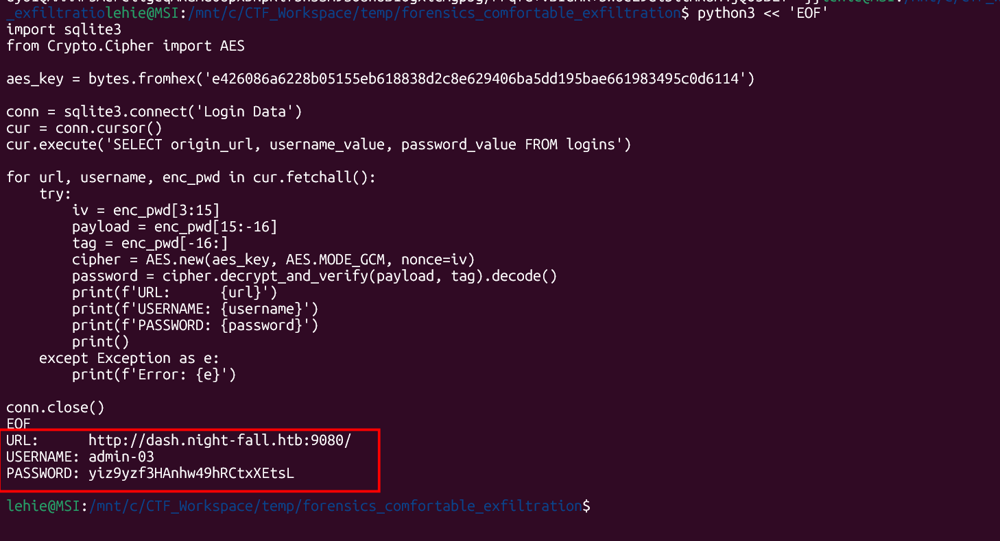

Hoặc sử dụng `mimikatz`, công cụ khét tiếng nếu bạn không cần biết logic phía sau nó, khi đó sẽ cần export thêm `Local State` từ file `ad1`. Một điều nữa cần lưu ý nếu bạn dùng `mimikatz`, nó quét Local State để tìm đúng pattern này:

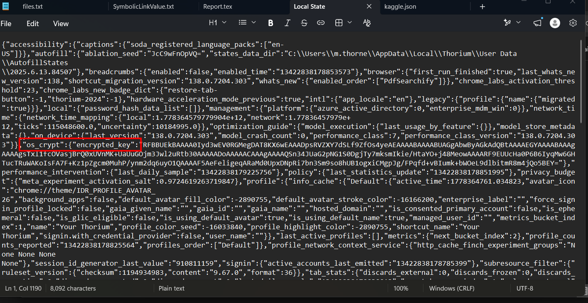

Tuy nhiên Chrome mới có App-Bound Encryption (ABE, từ Chrome 127) và `Local State` có thể có thêm `app_bound_encrypted_key`. Mẫu trong challenge vẫn dùng luồng cũ với `encrypted_key`, nên khi dùng mimikatz bạn nên kiểm tra lại `Local State` và xóa các trường gây lệch pattern phía trước `encrypted_key`; mình đã xóa sẵn phần thừa rồi:

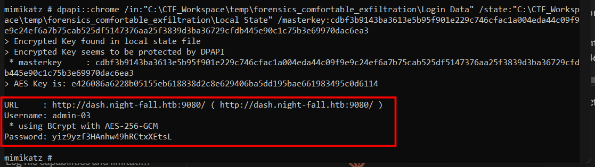

Sau đó dùng `dpapi::chrome`, module chuyên biệt của mimikatz cho Chrome, ta được kết quả tương tự.

Tuy nhiên URL này lại không phải URL để gửi thông tin đánh cắp về, vậy chắc hẳn nó phải được hard-code đâu đó trong mã độc, vì chúng ta đã tìm hiểu các hàm chính và không thấy hàm nào sinh URL động cả. Điểm làm mình hơi lú ở đây là dnSpy đang cố dịch ngược IL về C# cho dễ đọc, đặc biệt với `Task`/`async` thì code C# ban đầu đã bị compiler biến thành state machine trong IL. Vì thế view C# của dnSpy có thể làm mất/ngụy trang bớt luồng tham chiếu thật, chứ không nhất thiết là malware chủ động giấu URL.

Chuyển qua xem metadata/string hoặc dùng thêm `dotPeek`, mình mới thấy chuỗi lạ này:

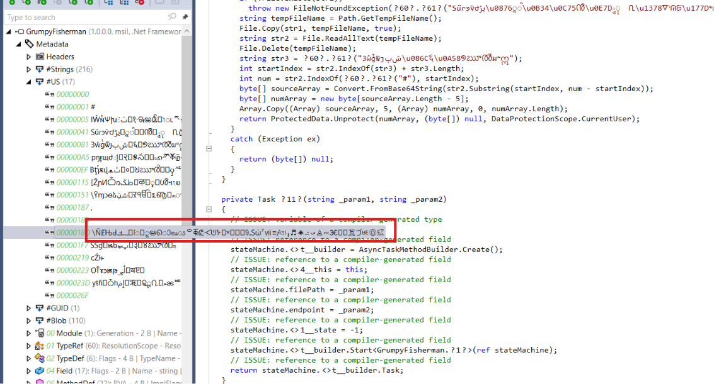

Nó nằm trong `#US` heap, tức User Strings heap của metadata .NET, nơi chứa string literal. Điểm gây lú là chuỗi có thể tồn tại trong metadata nhưng dnSpy không render ra ngay trong C# decompiled nếu luồng IL/state machine không tham chiếu trực tiếp theo cách nó nhận ra. Vì vậy mình chuyển sang nhìn metadata/string bằng tool khác, thấy nó vẫn liên quan tới Task `?11?`. Decrypt chuỗi đó với hàm `?61?`, ta tìm được URL thực sự mà thông tin đánh cắp được gửi về.

**Đáp án câu 7: `http://check.microsoftcloudservices.htb:8000/update/`**

### 8. Thông tin đăng nhập đã bị đánh cắp?

Ta đã 'vô tình' tìm ra ở câu trên :D

**Đáp án câu 8: admin-03:yiz9yzf3HAnhw49hRCtxXEtsL**
