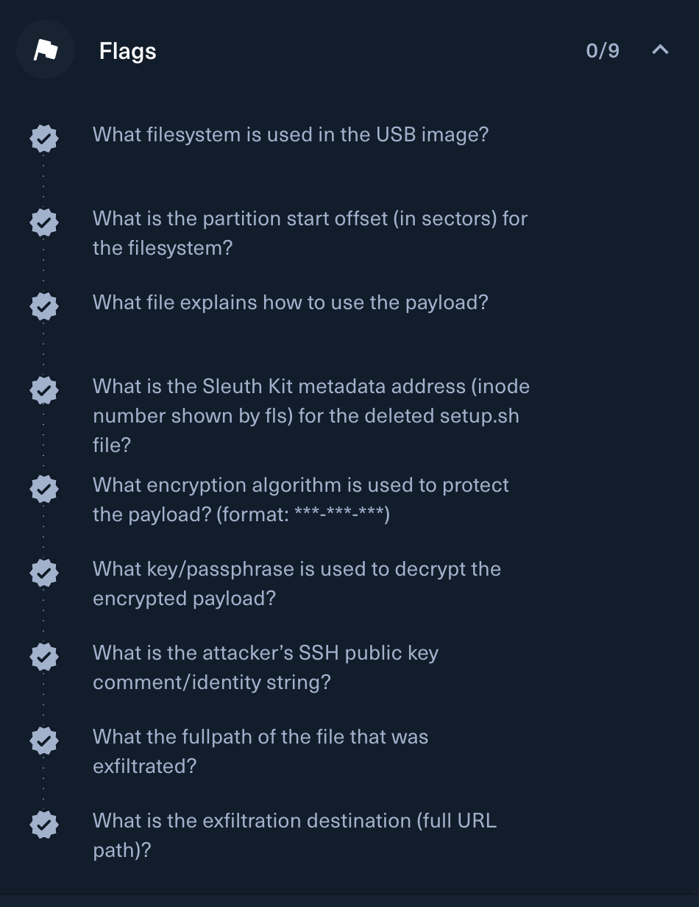
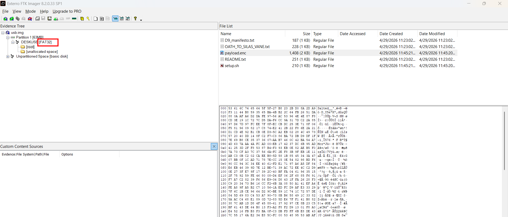
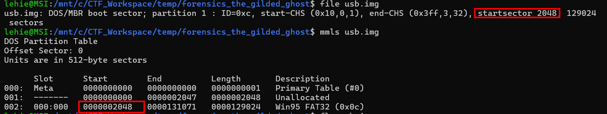
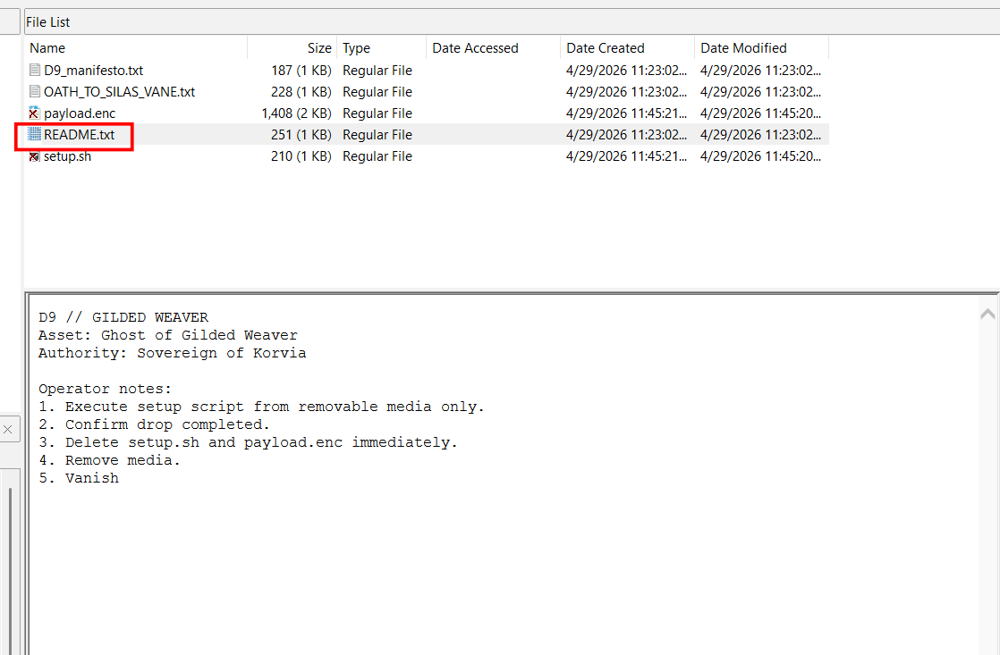
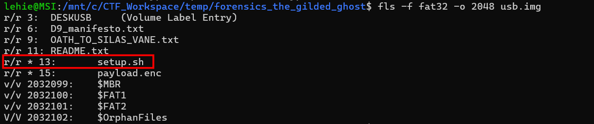
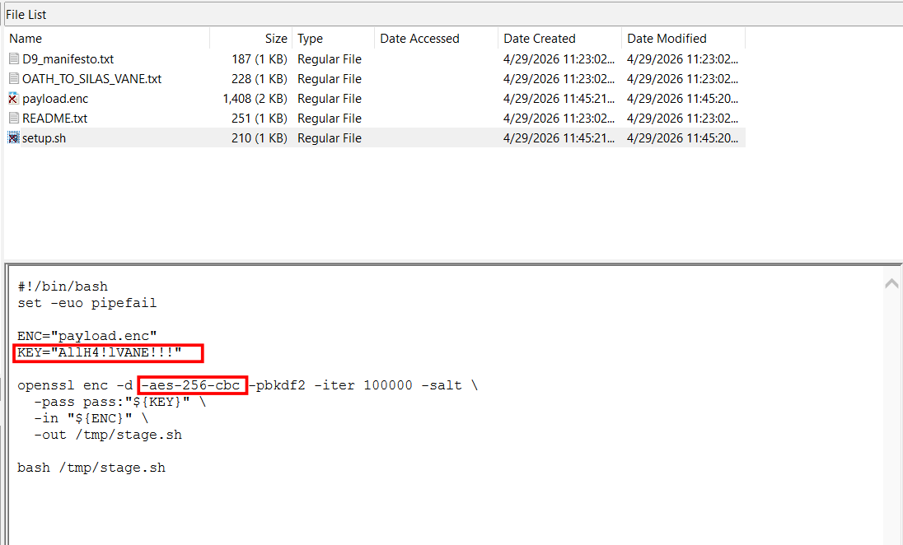
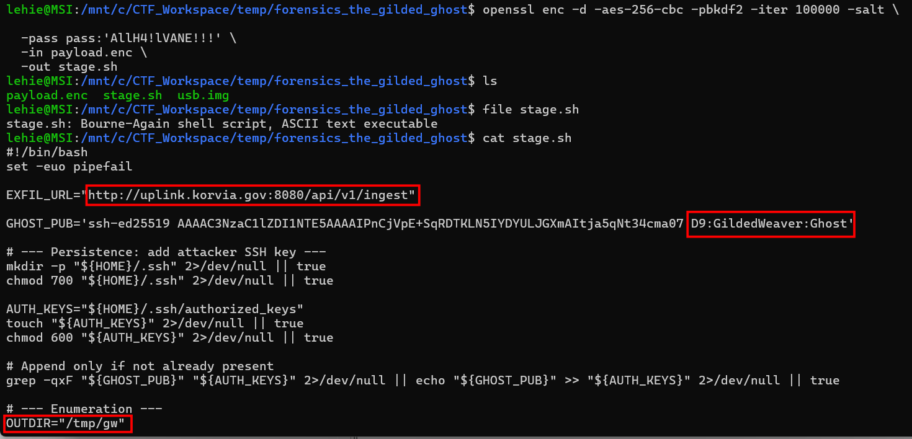
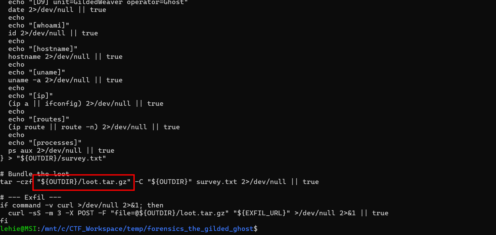

# The Gilded Host

## Scenario

Gabe received a late-night call: the city’s water filtration system had triggered alerts consistent with unauthorized access. When the team reviewed surveillance footage, they spotted a figure moving through the facility—keeping to the shadows, avoiding cameras, and heading straight for an operator workstation. The attacker was in and out within minutes. No tools were left behind at the workstation, no obvious malware was found, and the trail went cold—until the final camera angle caught something odd. As the intruder exited, they tossed a small object into the dumpster behind the building. An intern was voluntold to perform “high-impact evidence recovery” and climbed in to search. They surfaced with a single item: a USB drive. You’ve been provided a disk image of the USB. Determine what was on it and what the attacker intended to do—ASAP.

## Given artifact

A USB disk image file

## Solving processs

### 1. What filesystem is used in the USB image ?

Open the image file in FTK Imager, we it automatically identifies the filesystem for us:

**Answer: FAT32**

### 2. What is the partition start offset (in sectors) of the filesystem?

Running `file` command on the disk yields the answer:

MBR is an old system used to index memory region, the smallest unit is sector, which is typically 512 bytes, and the FAT32 filesystem is marked as starting from the 2048-th sector.

**Answer: 2048**

### 3. What file explains how to use the payload ?

Reading all files in FTK Imager, it's trivial to notice that this file contains the guideline:

**Answer: README.txt**

### 4. What is the Sleuth Kit metadata address (inode number shown by fls) for the deleted setup.sh file?

FTK Imager can only efficiently assist us to browse file as a mounted disk, but to find metadate like inode number (think of it like an index to each file in the filesystem so that we can read with `icat` even when the file has been deleted in some cases), we must still fall back to Sleuth Kit:

`-f` option is used to specify the filesystem, `-o` speficies the start offset.

**Anser: 13**

### 5. What encryption algorithm is used to protect the payload? (format: `***-***-***`)

Read the `setup.sh` file with `icat` in terminal Sleuth Kit, or more comfortably reading it directly in FTK imager:

The encryption schema is hard-coded here

**Answer: aes-256-cbc**

### 6. What key/passphrase is used to decrypt the encrypted payload?

Answer already disclosed in the previous question

**Answer: AllH4!lVANE!!!**

### 7. What is the attacker's SSH public key comment/identity string?

Using the similar logic in the sh file to decrypt the payload, we can get its content:

The SSH key comment/identity string is placed at the end of the key

**Answer: D9:GildedWeaver:Ghost**

### 8. What the fullpath of the file that was exfiltrated?

Out directory has already been specified in the previous question, and at the end of the payload, we see the actual file that is appended to the out dir:

**Answer: /tmp/gw/loot.tar.gz**

### 9. What is the exfiltration destination (full URL path)?

Already uncovered previously

**Answer: `http://uplink.korvia.gov:8080/api/v1/ingest`**