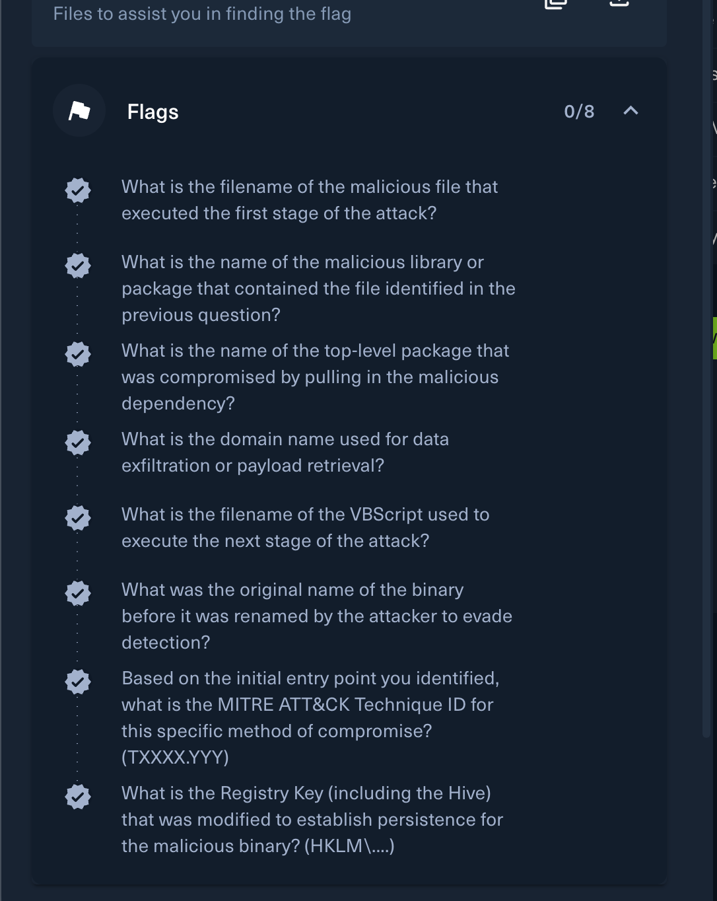
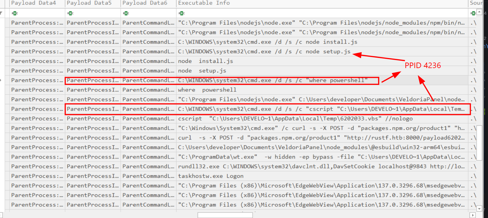
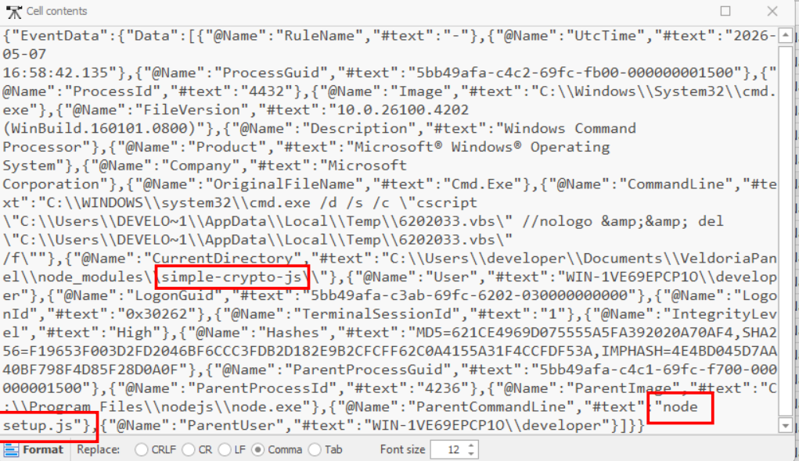
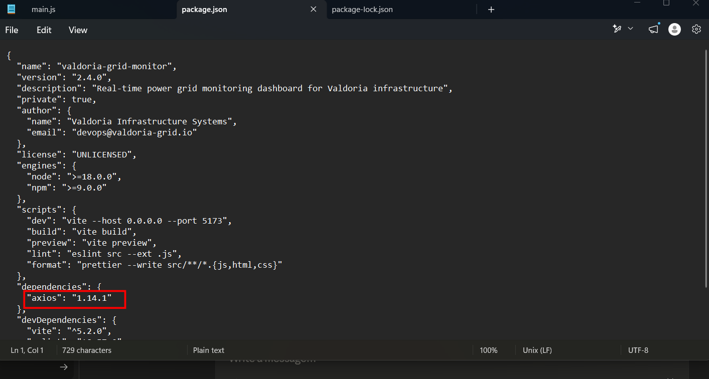
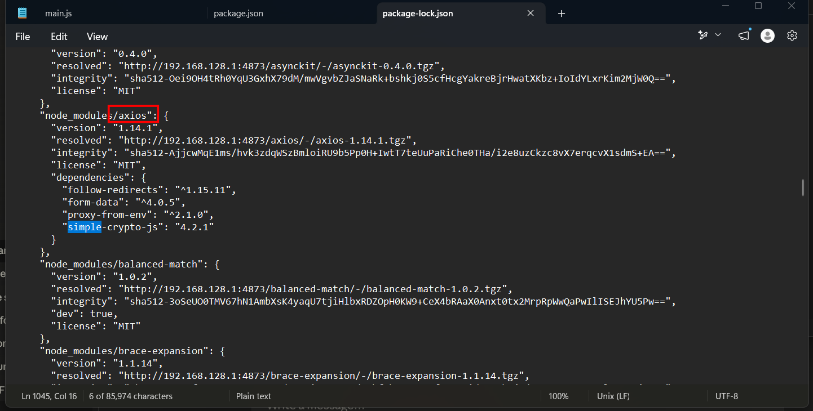
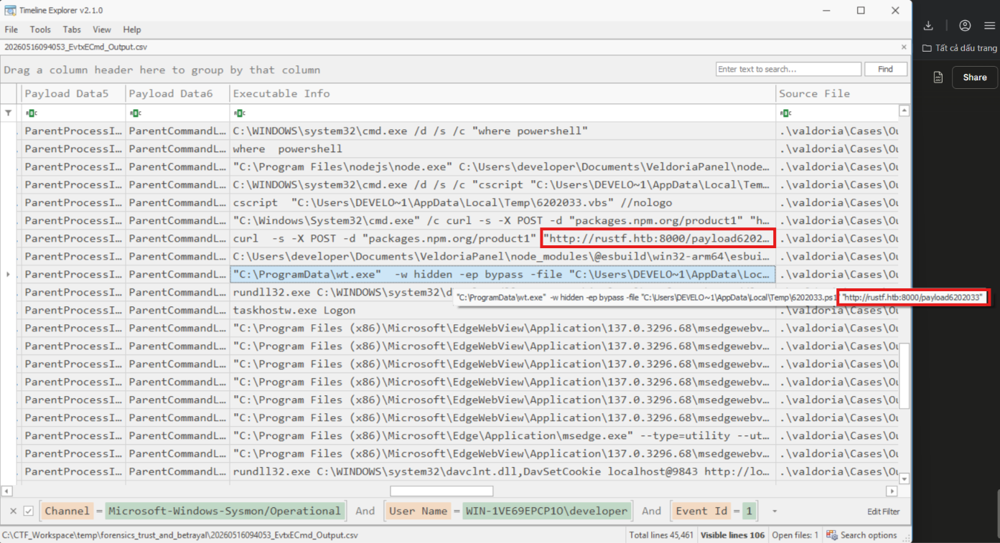
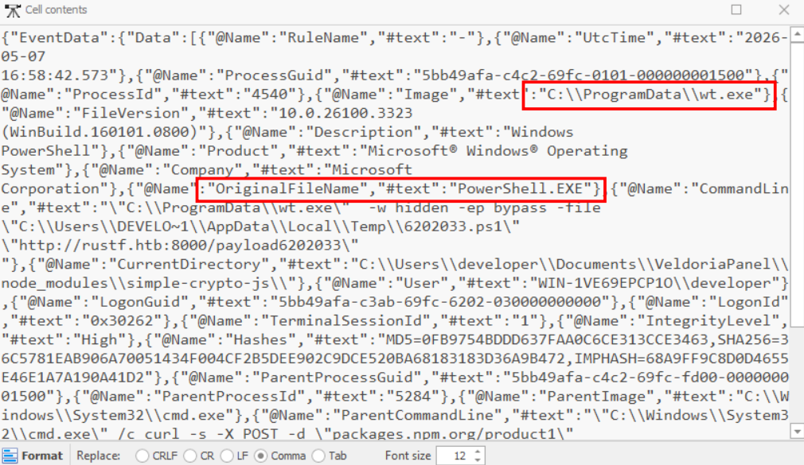
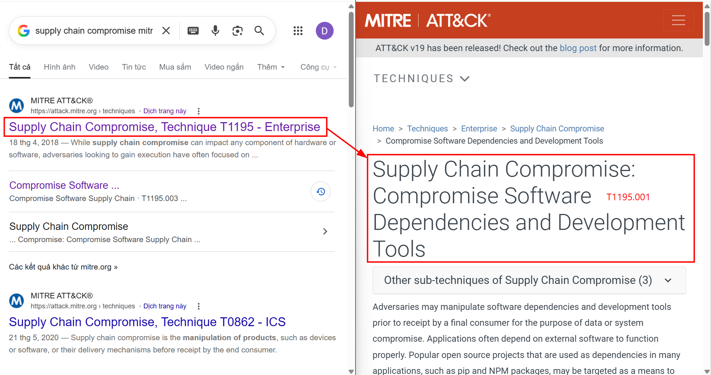
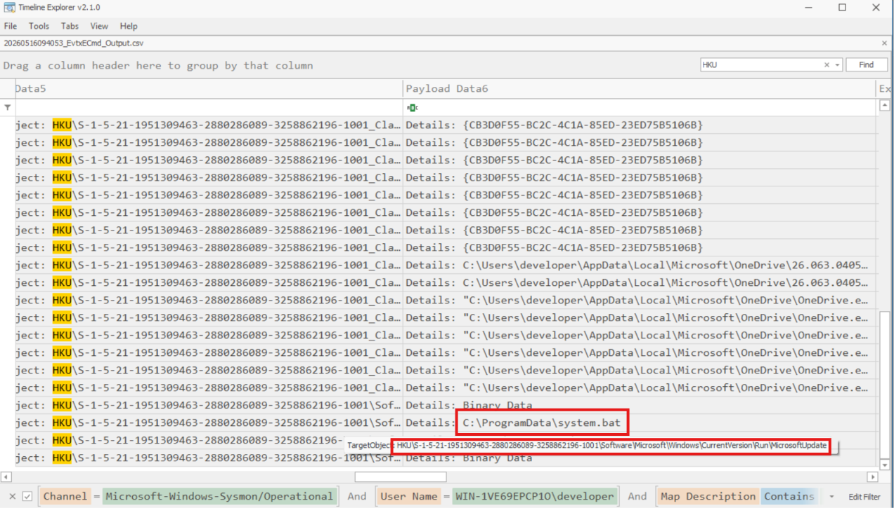

# Trust And Betrayal

## Scenario

Gabe Okoye has flagged a disturbing shift in our systems' lineage immediately following the deployment of VeldoriaPanel, an application we built internally with security in mind. Although the panel is a trusted service, its installation coincides with the appearance of malicious activity that feels too disciplined to be random. We need you to determine if this internal tool has been nudged to create a silent opening for the adversary. Your mission is to uncover if our own secure development path has been compromised to grant Silas Vane the permanent, quiet access he requires.

## Given artifact

A `C:\` drive and some logs containing the artifact collection procedure with KAPE

## Solving process



We can see that in the log of evidence collecting process, most of them are about `.evtx` Windows Events Log, so I will start from these log as source of evidence. First I use Eric Zimmerman's `EvtxECmd` to convert those raw logs to clean CSV, then use his Timeline Explorer to open.

As Sysmon is available, try to use it as much as possible.

### 1. What is the filename of the malicious file that executed the first stage of the attack?

Filter for Sysmon ID 1 first to see all created process, the malicious must be one of them. Then I sort ascending by time to track for the first suspicious process, everything seems normal before these commands, querying for powershell and running cscript.exe is an unusual thing a developer would do:



```text
node "npm-cli.js" install   (PID 3272)
  ├── cmd /d /s /c node install.js   →   node install.js  →  esbuild --version       ← benign
  └── cmd /d /s /c node setup.js     →   node setup.js    →  (1) cmd /c where powershell
                                                              (2) cmd /c cscript ...6202033.vbs ... && del ...
```

So that javascript file is the source of trouble

**Answer: setup.js**

### 2. What is the name of the malicious library or package that contained the file identified in the previous question?

Before digging in, let me provide some foundational knowledge about `npm install` mechanism:

> In general, when a user runs `npm install` inside a project, it will read the `package.json` file inside that directory to know the list of dependent libraries, then check `package-lock.json` to know the exact version and hash (verify integrity) 

In the details column of the child process entry in question 1 (the cscript.exe one), we can see the package containing it:



Let's check the dependency in `VeldoriaPanel\package.json`:



So [axios](https://github.com/axios/axios) is the dependency of this project, it is a promised-based HTTP client for the browser and `node.js`

Inside axios's own `package.json` or `VeldoriaPanel\package-lock.json`, we can see its child dependencies here, and the mentioned package is present:



**Answer: simple-crypto-js**

### 3. What is the name of the top-level package that was compromised by pulling in the malicious dependency?

As I have noted, axios is a HTTP client, so it has nothing to fo with cryptography, this package must have been compromised

**Answer: axios**

### 4. What is the domain name used for data exfiltration or payload retrieval?

Still look at Sysmon EID 1, I notice these process:



They are both child processes of the VBScript malware, the `curl` one makes a POST request to download a PowerShell payload from an URL, it looks like exfiltration at first glance, but the `-d` option is the request body, so it seems to be a **disguiser, or C2 selector**, and the `wt.exe` (in fact just copied PowerShell, you will see later) executes that `ps1` file, the URL is passed as a parameter, perhaps this is true exfilatration.

**Answer: rustf.htb**

### 5. What is the filename of the VBScript used to execute the next stage of the attack?

It's the VBScript executed by `csript.exe`, already mentioned

**Answer: 6202033.vbs**

### 6. What was the original name of the binary before it was renamed by the attacker to evade detection?

It's the fake `wt.exe` that executes the `ps1` payload, inside the details column of its corresponding process, we can see its original file name:



**Answer: PowerShell.EXE**

### 7. Based on the initial entry point you identified, what is the MITRE ATT&CK Technique ID for this specific method of compromise? (TXXXX.YYY)

Relying on dependencies to infect, this is definitely `Supply chain compromise` technique, particularly `Compromise Software Dependencies and Development Tools.`



**Answer: T1195.001**

### 8. What is the Registry Key (including the Hive) that was modified to establish persistence for the malicious binary? (HKLM....)

To hunt for action tampering registry, let's filter for Sysmon EID 13 (RegistryEvent-Value set) :



This registration seems bad, it disguises itself as a legitimate Microsoft Component, but the value points to a suspicious bat script

**Answer: HKU\S-1-5-21-1951309463-2880286089-3258862196-1001\Software\Microsoft\Windows\CurrentVersion\Run\MicrosoftUpdate**