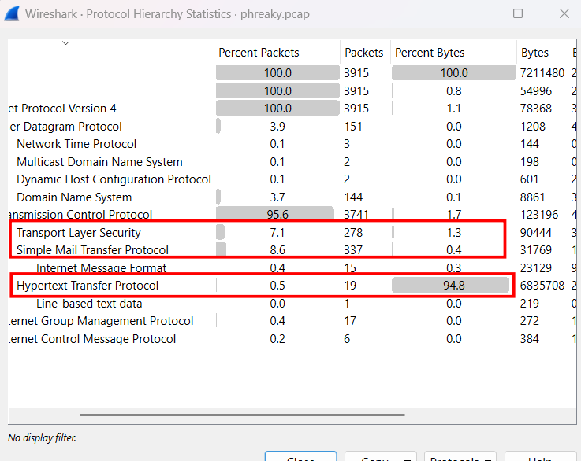
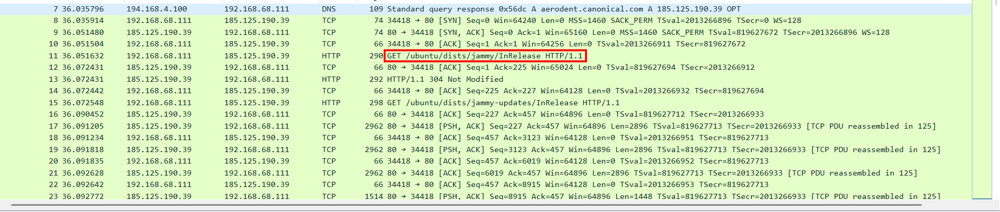
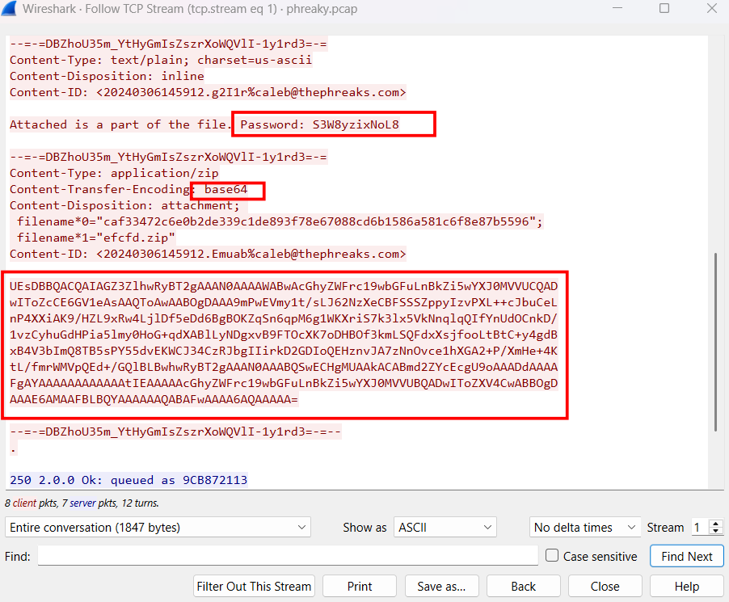
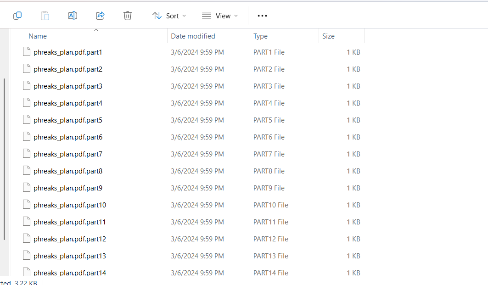
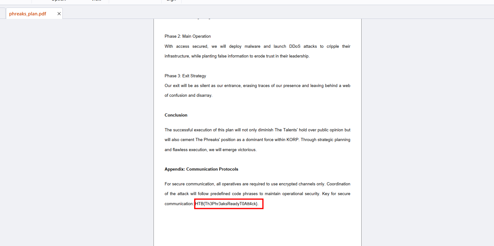

# Phreaky

## Scenario

In the shadowed realm where the Phreaks hold sway, A mole lurks within leading them astray. Sending keys to the Talents, so sly and so slick, A network packet capture must reveal the trick. Through data and bytes, the sleuth seeks the sign, Decrypting messages, crossing the line. The traitor unveiled, with nowhere to hide, Betrayal confirmed, they'd no longer abide.

## Given artifact

A single packet capture file

## Solving process

Skimming through the protocol hierarchy, it's clear that a huge amount of data was sent through HTTP despite the number of HTTP packets is small, besides are quite many TLS/SMTP packets:



However, the huge amount of HTTP bytes appear to be benign Ubuntu update, so it's not worth bothering anymore:



While following subsequent TCP streams, I realize that some files are being sent through SMTP:



Take it to cyberchef, decode base64 and download, it's a zip file and can be unzipped with the given password. However, it's only a part, and we need to repeat this procedure 15 times. Were there be more fragments, this approach would become infeasible, perhaps we will need to construct a bash script for automating task, but I'm not thinking about it know:



After collecting all fragments, I run this to merge all into a complete PDF file:

```bash
cat phreaks_plan.pdf.part{1..15} > phreaks_plan.pdf
```

The flag lies in the second page of that pdf file (don't need to read the remaining, such non-sense!)



`Flag: HTB{Th3Phr3aksReadyT0Att4ck}`