# Rogue

## Scenario

SecCorp has reached us about a recent cyber security incident. They are confident that a malicious entity has managed to access a shared folder that stores confidential files. Our threat intel informed us about an active dark web forum where disgruntled employees offer to give access to their employer's internal network for a financial reward. In this forum, one of SecCorp's employees offers to provide access to a low-privileged domain-joined user for 10K in cryptocurrency. Your task is to find out how they managed to gain access to the folder and what corporate secrets did they steal.

## Given artifacts

A packet capture file

## Solving process

Our task is not to find out why they can escalate to a high-privilege user, but to clarify how can they get access to the folder, and the file itself. So let's ignore the myth about how they can run this command when only start with a low-privilege user:

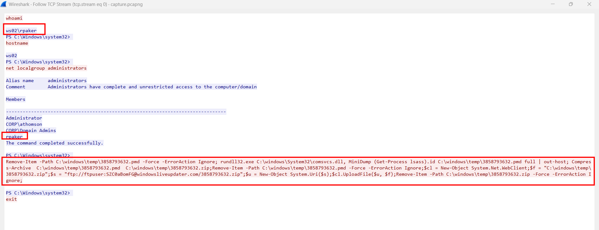

**I think we should clarify some concepts first:**

1. `comsvcs.dll` is a legitimate, built-in Microsoft Windows system file that stands for COM+ Services. Its primary purpose is to provide the underlying infrastructure for managing COM+ components, which include services like distributed transactions, security, and object pooling for applications. While it is a standard part of the operating system, it is frequently discussed in security contexts because of a specific function it contains: MiniDump

Because comsvcs.dll is signed by Microsoft and always present on Windows systems, security researchers and attackers often refer to it as a LOLBin (Living off the Land Binary). Adversaries may abuse the MiniDump function to capture sensitive information from the LSASS.exe (Local Security Authority Subsystem Service) process, which stores user credentials and hashes. This allows them to steal passwords without needing to download external hacking tools, often by running a command similar to: 

```powershell
rundll32.exe C:\windows\system32\comsvcs.dll, MiniDump <LSASS_PID> <Dump_File_Path> full 
```
2. COM stands for Component Object Model. It is a Microsoft technology introduced in 1993 that acts as a "bridge" to help different software parts talk to each other, even if they were written in different programming languages. 

**Now return to our problem**

The above command requires some prilivege to execute, but we will stop wondering why the attacker get it. Let's see what he did: first he removes that file name just in case it already exist, then takes Mini Dump of `lssas.exe` and saves to that file name, compresses it to a `.zip` file to send to the his server, then remove both files, covering their trace.

The file is transferred through FTP, and more than 13000 packets are used to complete that process... We can get that file by exporting FTP objects:

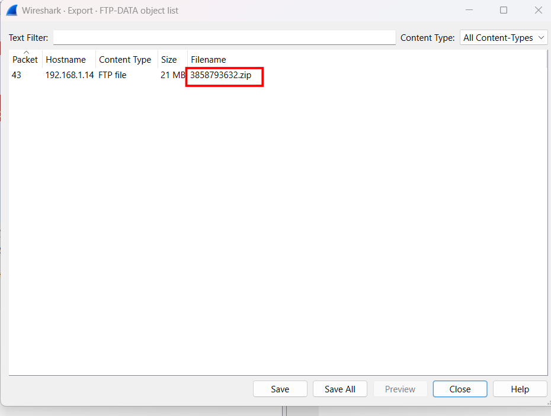

Decompress it with `unzip` yields the `.pmd` file.

The next step, I intended to use `mimikatz` on that lssas dump, but somehow the 64-bit version is missing, perhaps Window Defender ate it when I extract the file ? So why the 32-bit version still survives ? Anyway let's forget it, we have an equivalent tool written in python: `pypykatz`

**The LSSAS memory mechanism**

When a user logs into Windows, the OS needs a way to verify their identity for accessing network shares, websites, or applications without asking them to type their password every five minutes.

To achieve this, Windows passes the credentials to the Local Security Authority Subsystem Service (lsass.exe). LSASS caches these credentials in its heavily protected memory space using different "Security Packages" (like WDigest, MSV1_0, and Kerberos).

**How does mimikatz/pypykatz work?**

Windows doesn't just leave these hashes sitting in plain text in memory. LSASS encrypts the credentials using a master key called the LSA Key, which is generated at boot.

When we feed a minidump to pypykatz, it acts like a forensic surgeon. It doesn't read the file like a text document; it maps the file as a raw memory structure.

1. Locate the LSA Key: It searches the memory dump for specific byte signatures to find where the encrypted LSA Key is stored, and uses built-in Windows APIs (for mimikatz) or Python equivalents in pypykatz to decrypt it.

2. Walk the Linked Lists: It finds the memory structures for the logon sessions (the LogonSessionList) and follows the pointers in memory to find the specific authentication packages (like MSV1_0).

3. Decrypt the Payload: It takes the decrypted LSA Key, applies it to the ciphertext found in the MSV1_0 package, and decrypts it to reveal the raw NT Hash (and sometimes the plaintext password, if WDigest is fully enabled).

```bash
pypykatz lsa minidump 3858793632.pmd
```

Run the above command, in the output I notice that this user is not the account that the attacker already gained access to, also, if we look back at the output of `net localgroup administrator` from the first image, user `athomson` comes from the `CORP` domain, it is possible that the attacker will abuse Pass the Hash attack to gain access to this user in later SMB packets:

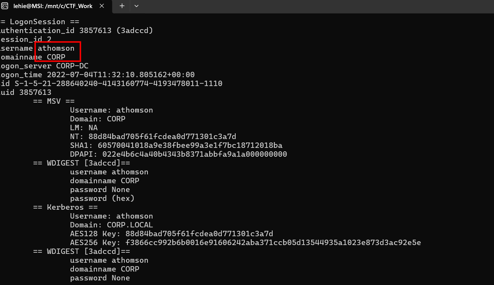

Let's validate our hypothesis, filter for SMB2 protocol, I see that user is actually used here:

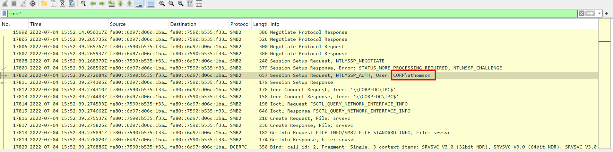

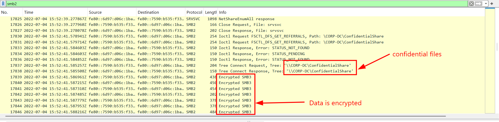

However, the original data transmitted over SMB is encrypted, and we must find our way to reverse the machanism

**The SMB and NTLMv2 mechanism**

Once the attacker had the NT Hash, they used it to authenticate to the server. But because they didn't have the plaintext password, they performed a Pass-the-Hash (PtH) attack.

When the attacker connected to the ConfidentialShare, the server challenged them using the NTLMv2 protocol. NTLMv2 is a Challenge-Response mechanism designed to prove you know the password (or the hash) without ever transmitting it over the network.

Here is the exact mathematical chain that occurred between the client and the server:

1. The Server Challenge: The server sends a random 8-byte string to the client.

2. The Client Challenge `NTProofStr`: The client generates its own random string, combined with a timestamp and the target domain info.

3. The Proof `ResponseKeyNT`: The client takes the stolen NT Hash and hashes it together with the Username and Domain Name using HMAC-MD5.

4. The Key Exchange Key: The client takes that `ResponseKeyNT` and hashes it together with the `NTProofStr`. This creates a unique, one-time cryptographic key specifically for this exact login session.

5. The Final Session Key: The client generates a random 16-byte key that will be used to encrypt the actual files over SMB3. But the server needs this key too! So, the client encrypts this 16-byte Session Key using the Key Exchange Key (via the RC4 cipher) and sends it across the wire.

**Collect the needed ingredients**

Wireshark natively knows how to do all of the aforementioned math, but **only if** we give it the plaintext password to start step 1. Because we only had the NT Hash, Wireshark threw its hands up.

So we need to manually reverse the chain using a python script, but first and foremost, we need to collect enough ingredients: the NT hash has already been collected with pypykatz, the `NTProofStr` to recreate Key exchange Key and the Encrypted Session Key will be retrieved from the packet now:

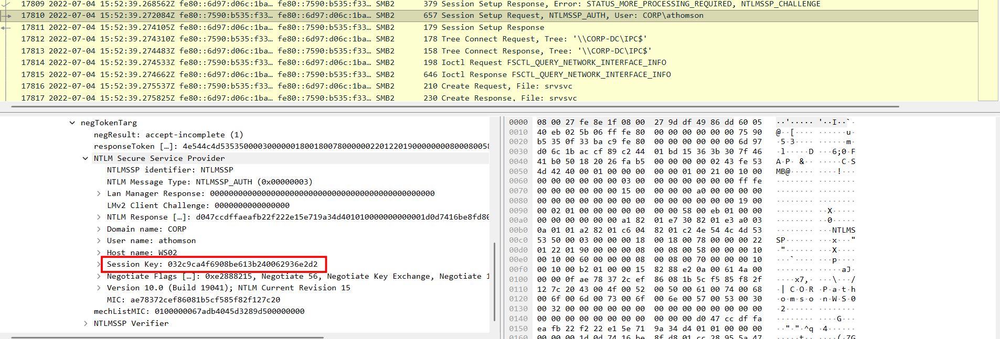

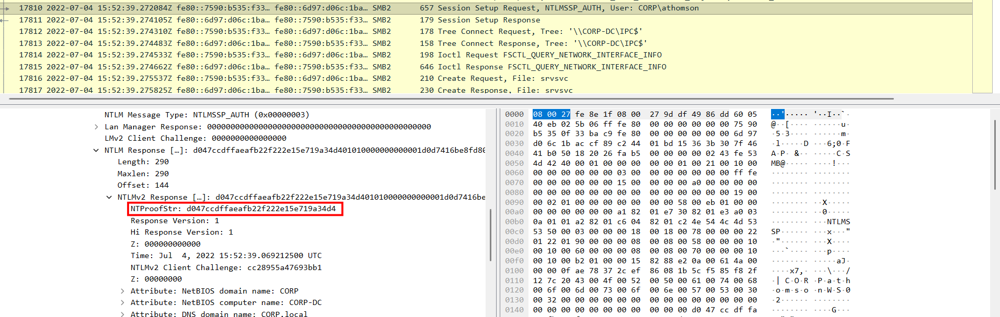

Now let's construct a python script to simulate the process:

```python
import hashlib
import hmac
from Crypto.Cipher import ARC4

nt_hash = bytes.fromhex("88d84bad705f61fcdea0d771301c3a7d")
user = "athomson".upper()
domain = "CORP".upper()
user_domain = (user + domain).encode("utf-16-le")

ntproofstr = bytes.fromhex("d047ccdffaeafb22f222e15e719a34d4")
encrypted_session_key = bytes.fromhex("032c9ca4f6908be613b240062936e2d2")

# Calculate ResponseKeyNT
response_key_nt = hmac.new(nt_hash, user_domain, hashlib.md5).digest()

# Calculate KeyExchangeKey using NTProofStr
key_exchange_key = hmac.new(response_key_nt, ntproofstr, hashlib.md5).digest()

# Decrypt the Session Key using ARC4
cipher = ARC4.new(key_exchange_key)
decrypted_session_key = cipher.decrypt(encrypted_session_key)

print(f"Decrypted SMB Session Key: {decrypted_session_key.hex()}")
```

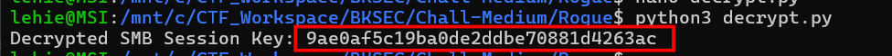

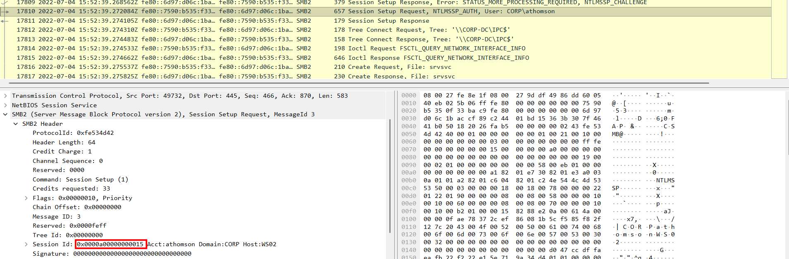

Okay, let's finish this, provide Wireshark with this key and the session ID of that authentication, and the original data will be decrypted:

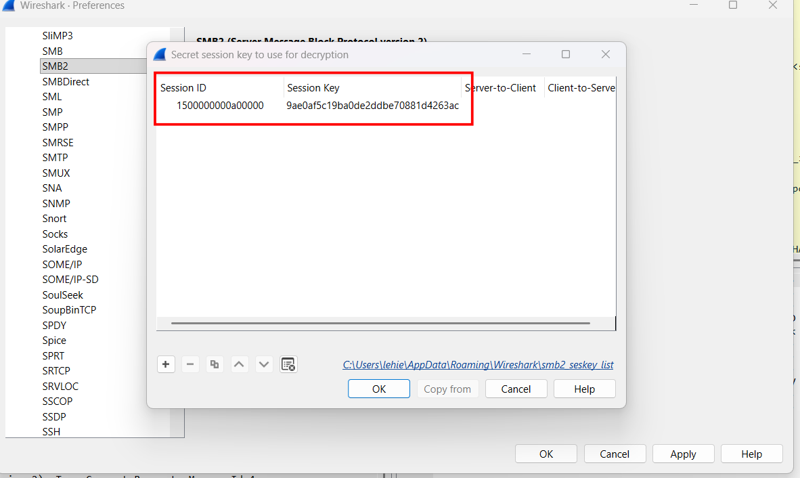

Note that the session ID must be reversed due to the opposite endianness.

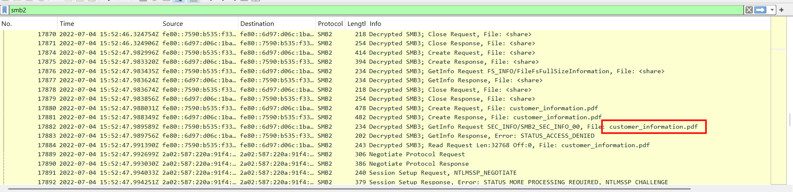

The transfered data is now in plaintext, let's extract it:

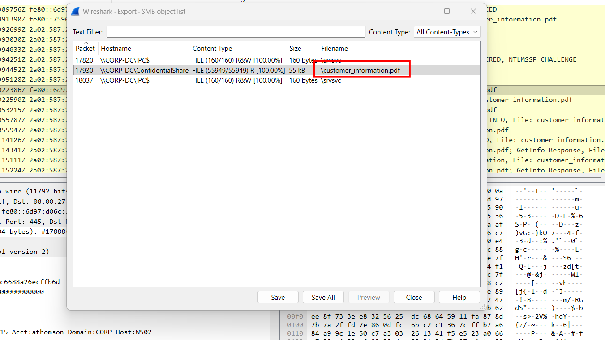

The flag lies in the third page:

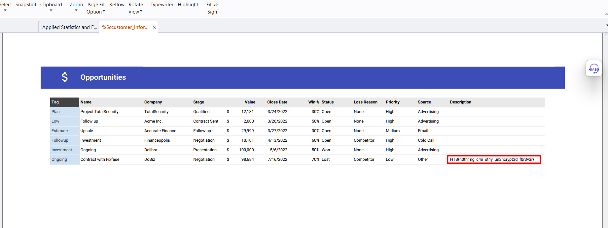


`Flag: HTB{n0th1ng_c4n_st4y_un3ncrypt3d_f0r3v3r}`