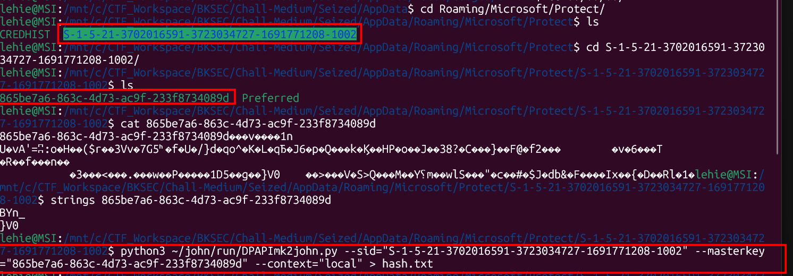
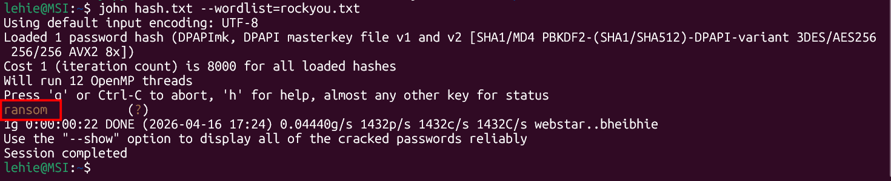
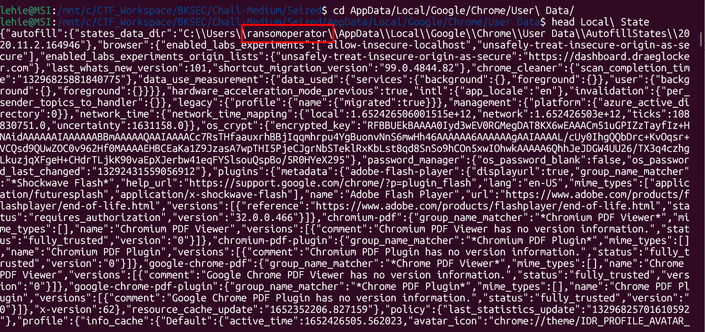
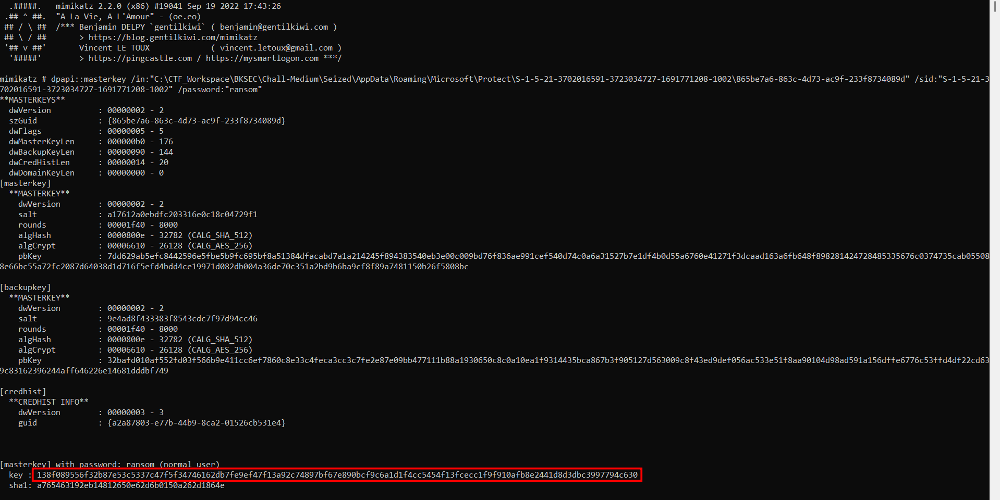
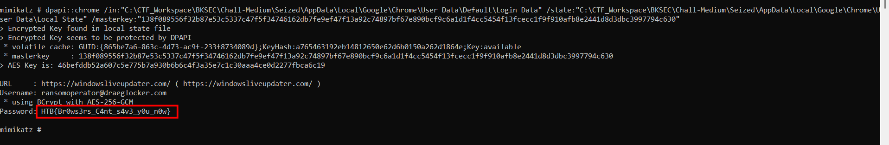

# Seized

## Scenario

Miyuki is now after a newly formed ransomware division which works for Longhir. This division's goal is to target any critical infrastructure and cause financial losses to their opponents. They never restore the encrypted files, even if the victim pays the ransom. This case is the number one priority for the team at the moment. Miyuki has seized the hard-drive of one of the members and it is believed that inside of which there may be credentials for the Ransomware's Dashboard. Given the AppData folder, can you retrieve the wanted credentials?

## Given artifacts

The whole AppData folder of that member, given AppData and require to find credentials ? This reminds me of the challenge using mimikatz to dump browser's credentials, but in that challenge, we are given the desktop password...

## Solving process

Why bothering about no password given while we can crack it ourselves ?! John the ripperrrr

Before diving into any command or tool, let me provide foundational knowledge about the mechanism of how Windows anf Chrome build the cryptographic mechanism.

**The foundation: Windows DPAPI**

At the core of this is the Windows Data Protection API (DPAPI). Developers (like the team behind Chrome) need a way to store secrets locally without prompting the user for a password every single time.

DPAPI provides a function called `CryptProtectData`. When a program calls this, Windows encrypts the data using a Master Key.

Windows generates this Master Key for the user and stores it in the Protect\<SID> directory.

To ensure nobody else can read this Master Key, Windows encrypts it using a key derived directly from the user's Windows logon password.

**So how does John handle it?**

When we use `DPAPImk2john.py` on the Master Key file, it cannot extract the password itself, instead it extract the cryptographic metadata needed to derive the key

Inside the Master Key file, Windows stores:
1. The Salt
2. The number of hashing rounds (Iterations)
3. The hashing algorithm used (e.g., SHA-512)
4. The encrypted Master Key blob itself

The derivation relies on standard cryptographic functions: `EncryptionKey` = PBKDF2(HashAlgorithm, WindowsPassword, Salt, Iterations)

Now that the hashing algorithm, salt and iterations are known, John the Ripper simply takes every password in `rockyou.txt`, run the exact PBKDF2 formula, and check if the returned key successfully decrypts the master key blob:

So we successfully retrieve the desktop password of this user, about the username, it's not required for mimikatz, but we can deduce it from the `Local State`(I will explain this file later) file:

**Chrome's two-tier encrytion**

Chrome doesn't trust DPAPI to encrypt your actual website passwords directly, largely because reading/writing via DPAPI for every single database query is slow. Instead, Chrome uses a two-tier system:

1. The AES Key: When you install Chrome, it generates a random, highly secure AES-256 key. This key is used to encrypt and decrypt your website passwords.

2. Protecting the AES Key: Chrome takes that random AES key, hands it to Windows DPAPI (CryptProtectData), and says, "Encrypt this for me." Chrome then takes the resulting encrypted blob, base64-encodes it, and saves it in the `Local State` JSON file under `os_crypt.encrypted_key`.

3. Storing the Credentials: When you log into a website, Chrome uses the raw AES key to encrypt the website password and stores it in the Login Data SQLite database (specifically in the logins table under the password_value column).

**So how does mimikatz break the chain?**

Mimikatz is just walking this chain backwards using the cracked Windows password we provided. Here is exactly what happened when we ran that final mega-command:

1. Derive the User Key: Mimikatz takes the password "ransom", reads the salt/rounds from the Master Key file, and calculates the math to recreate the user's decryption key.

2. Unlock the Master Key: It uses that derived key to decrypt the DPAPI Master Key file, holding the raw Master Key in memory.

3. Unlock Chrome's AES Key: It parses the Local State JSON file, grabs the base64-encoded encrypted AES key, and uses the raw DPAPI Master Key (via CryptUnprotectData) to decrypt it.

4. Unlock the Vault: Finally, it connects to the Login Data SQLite database, iterates through the logins table, and uses Chrome's now-decrypted AES-256 key to decrypt every single password_value blob, printing the plaintext to your terminal.

We successfully retrieve the password, which is also our flag!

`Flag: HTB{Br0ws3rs_C4nt_s4v3_y0u_n0w}`