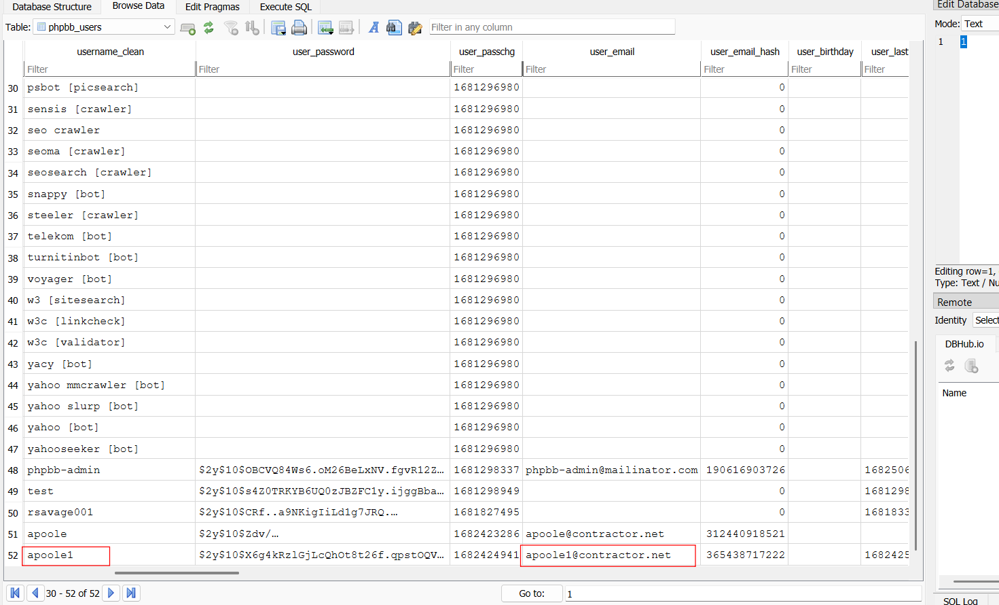
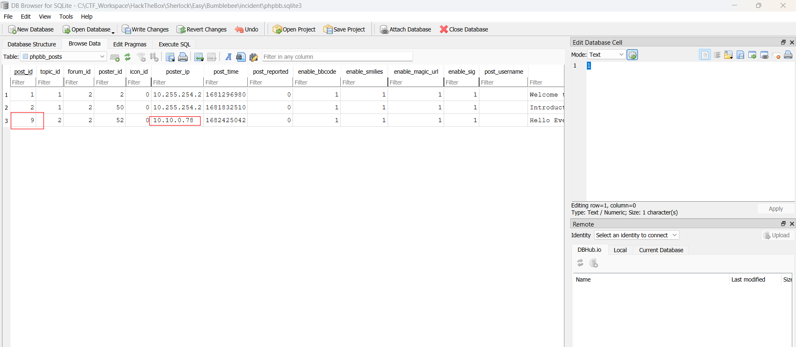
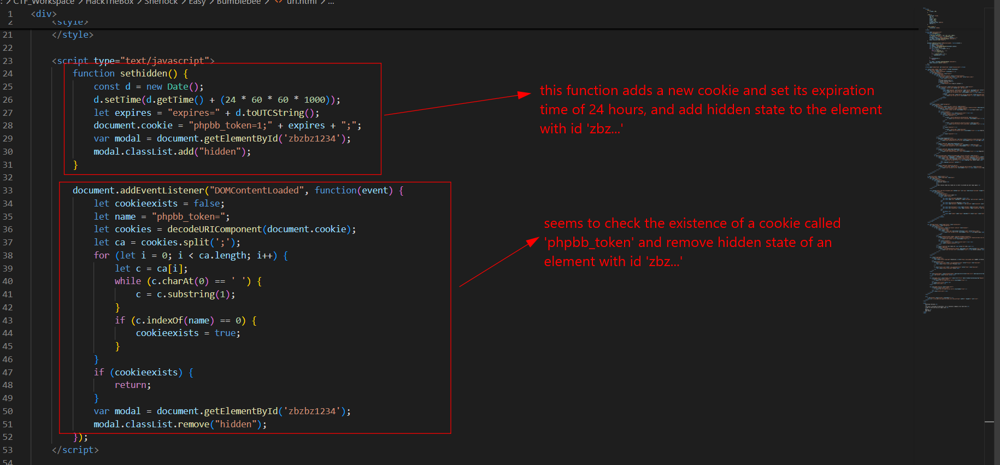
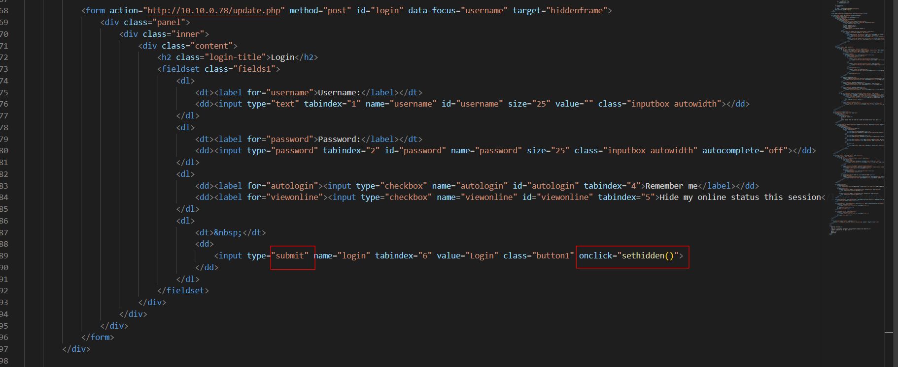
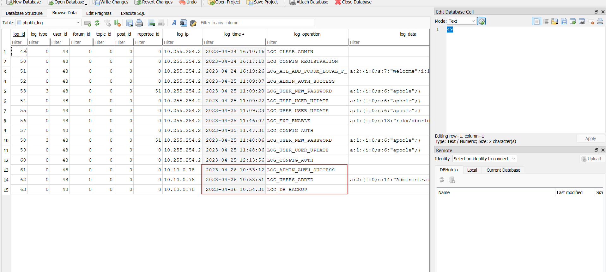
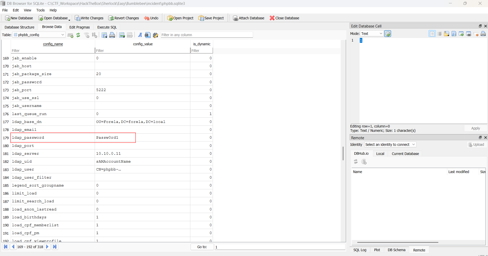
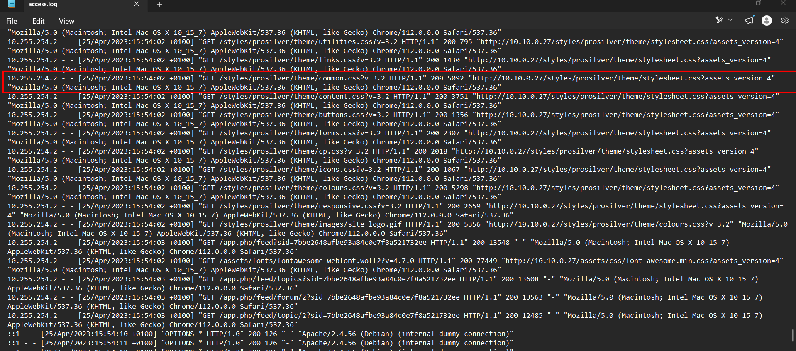
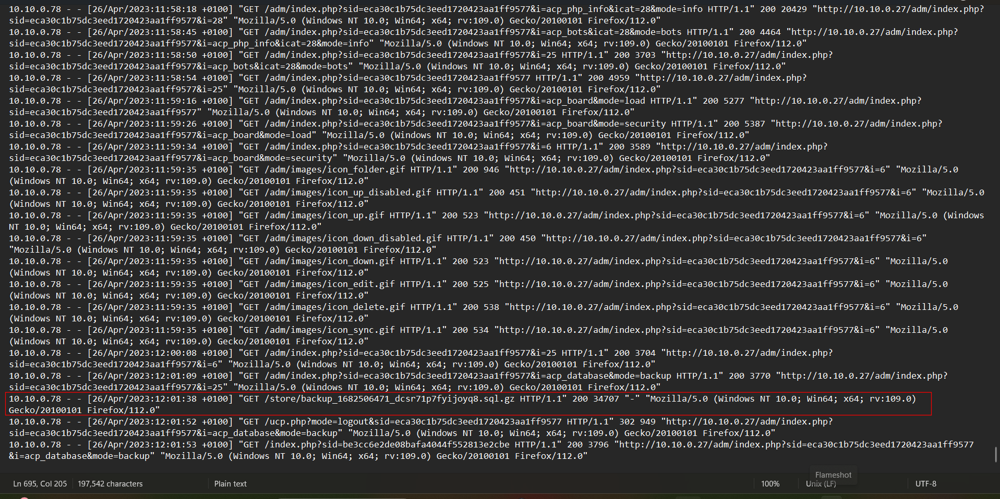

# Bumblebee

## Sherlock scenario

An external contractor has accessed the internal forum here at Forela via the Guest Wi-Fi, and they appear to have stolen credentials for the administrative user! We have attached some logs from the forum and a full database dump in sqlite3 format to help you in your investigation.

## Given artifact

Access log for the forum web and a sqlite3 database `phpbb.sqlite3`. phpBB is a widely used, open-source forum software.

## Questions

### 1. What was the username of the external contractor?

Open `phpbb_users` table in the DB, we can see two contractor accounts, but only this one seems to be active:

**Answer: apoole1**

### 2. What IP address did the contractor use to create their account?

Scroll left to see it

**Answer: 10.10.0.78**

### 3. What is the post_id of the malicious post that the contractor made?

Open `phpbb_posts` to see:

**Answer: 9**

### 4. What is the full URI that the credential stealer sends its data to?

The post text seems to be a strange web page, upon inspecting its source, we can see this script element:

Continue exploring to see where it's called, we will see this form, definitely used to harvest credentials:

The destination of stolen data can be seen in the snapshot

**Answer: `http://10.10.0.78/update.php`**

### 5. When did the contractor log into the forum as the administrator? (UTC)

Move to table `phpbb_log`, this holds the answer to 2 questions:

The attacker logs in as Administrator, add the contractor user to administrator group, and create a backup database for exfiltration

**Answer: 26/04/2023 10:53:12**

### 6. In the forum there are plaintext credentials for the LDAP connection, what is the password?

See in `phpbb_config`:

**Answer: Passw0rd1**

### 7. What is the user agent of the Administrator user?

From the `phpbb_log` table, we know the true IP of the real Administrator is `10.255.254.2`, filter for that in access log:

**Answer: Mozilla/5.0 (Macintosh; Intel Mac OS X 10_15_7) AppleWebKit/537.36 (KHTML, like Gecko) Chrome/112.0.0.0 Safari/537.36**

### 8. What time did the contractor add themselves to the Administrator group? (UTC)

See in the log snapshot

**Answer: 26/04/2023 10:53:51**

### 9. What time did the contractor download the database backup? (UTC)

See in access log:

**Answer: 26/04/2023 11:01:38**

### 10. What was the size in bytes of the database backup as stated by access.log?

In previous screenshot

**Answer: 34707**
