# Enduring Echo

## Sherlock Scenario

LeStrade passes a disk image to Holmes. It's one of the identified breach points, now showing abnormal CPU activity and anomalies in process logs.

## Given artifacts

The C's drive of infected machine

## Foundational knowledge

### WMI and how it is abused here

**WMI (Windows Management Instrumentation)** is a built-in Windows management framework. It exposes information and management actions for many parts of the OS—processes, services, disks, network configuration, and so on—to local or remote management tools. `wmic`, PowerShell WMI/CIM commands, and Impacket's `wmiexec.py` are all clients that can interact with this framework; they are not WMI itself.

The important capability for this Sherlock is that WMI can **create a process remotely**. An authorized remote user can invoke the `Win32_Process.Create()` method and ask the target to launch a command. The request is handled by the WMI Provider Host, `C:\Windows\System32\wbem\WmiPrvSE.exe`, so a remotely created process may appear in the process tree like:

```text
remote WMI request
        ↓
WmiPrvSE.exe
        ↓
cmd.exe /c <command>
```

This is not an exploit of a WMI vulnerability. The attacker already has credentials and **abuses a legitimate remote-administration feature** to execute commands on the victim.

In this case, the attacker uses Impacket's `wmiexec.py`. WMI itself does not provide an interactive shell or conveniently return stdout, so `wmiexec.py` makes the target run commands through `cmd.exe`, redirects stdout/stderr to a temporary file in the `ADMIN$` share, then retrieves that file over SMB. Therefore this combination is a strong clue for `wmiexec.py`:

```text
WmiPrvSE.exe → cmd.exe /Q /c <command>
                         ↓
        stdout/stderr → ADMIN$\__<temporary file>
                         ↓
              retrieved by the attacker over SMB
```

WMI can be abused for other purposes too, including discovery and even persistence through permanent event subscriptions, but **that is not the persistence mechanism used here**. In this Sherlock, WMI is the remote-execution mechanism; persistence is established later with a scheduled task running `JM.ps1`.

## Questions

### 1. What was the first (non cd) command executed by the attacker on the host?

Initially I check the Powershell Operational log, but no clearly malicious trace is left. They look more like legitimate system script. Then I continue to check the `PSReadline` of both Werni and Administrator, but again, no malicious command, seem to be script run by the sherlock author for his artifact collection and system setup instead.

Therefore, I turn to `Security` log, filter for ID 4688 for created processes, hoping there will be some commands being executed through `cmd.exe`. And finally I find them here:

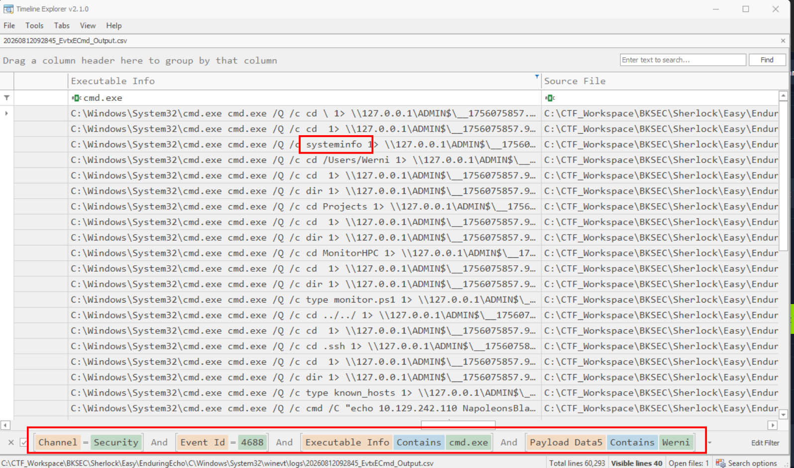

**Answer: systeminfo**

## 2. Which parent process (full path) spawned the attacker’s commands?

It's easy to see, however, we can infer a lot about the utilized technique from here:

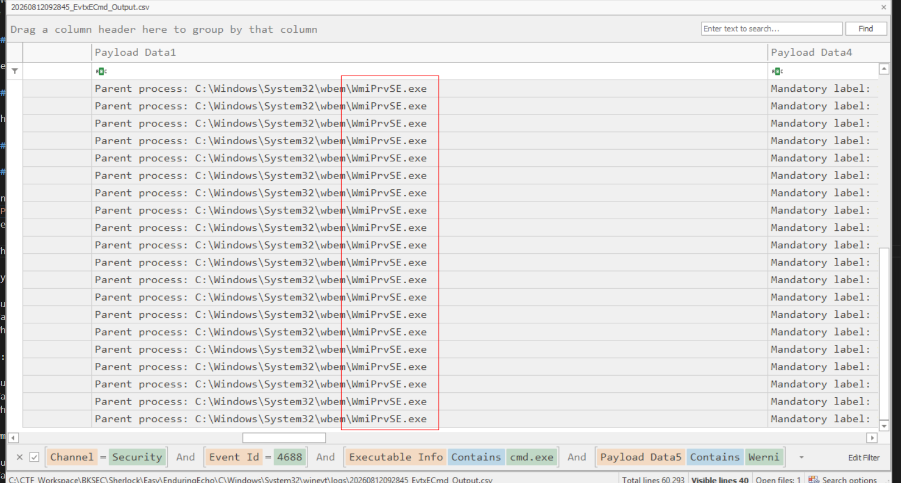

It's clear that WMI is abused here, I have talked about it in the foundational knowledge section

**Answer: C:\Windows\System32\wbem\WmiPrvSE.exe**

## 3. Which remote-execution tool was most likely used for the attack?

This question is, somehow bad, to be honest. Whether you can answer it or not rely entirely on experience. Remember that the action of redirecting stdout, stderr to a ramdom file in `ADMIN$`, waiting to be transferred back to attackers through SMB, is the signature of `impacket-wmiexec`. Aka the `wmiexec.py` inside [impacket](https://github.com/fortra/impacket) module. You may have not used `impacket-wmiexec` yet, but I'm quite sure you should have used `impacket-secretsdump` at least one time, and even if not, we will use it right in this sherlock

**Answer: wmiexec.py**

## 4. What was the attacker’s IP address?

We have two ways to derive the answer. First we may filter for events with ID 4624 (sucessful logon), repeated login attempt with type 3 (network logon) is recorded:

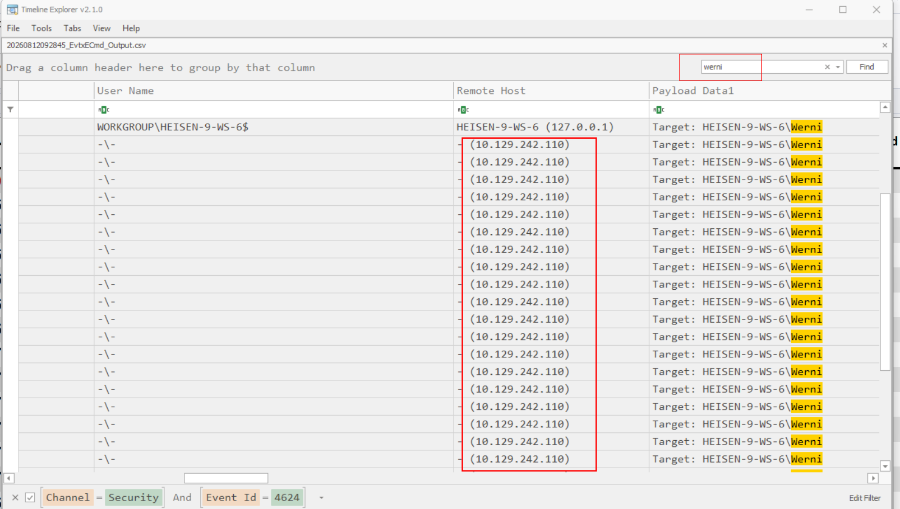

We may as well look at one command executed by `cmd.exe` in the filtered log:

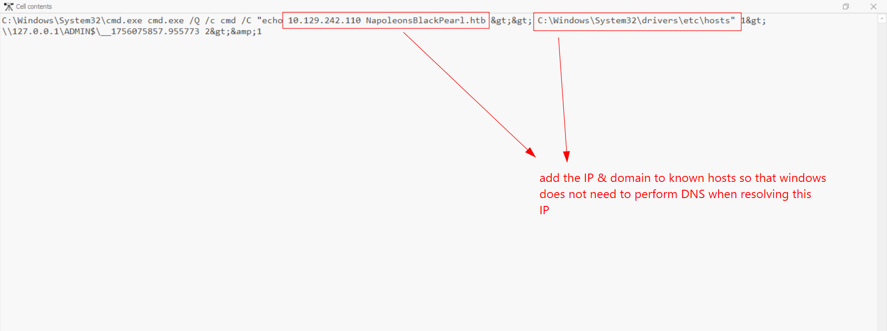

**Answer: 10.129.242.110**

## 5. The attacker established multiple persistence mechanisms. What is set as the name of the earliest one created?

Look at one entry in the filtered log of `cmd.exe`, we may see a scheduled task being abused:

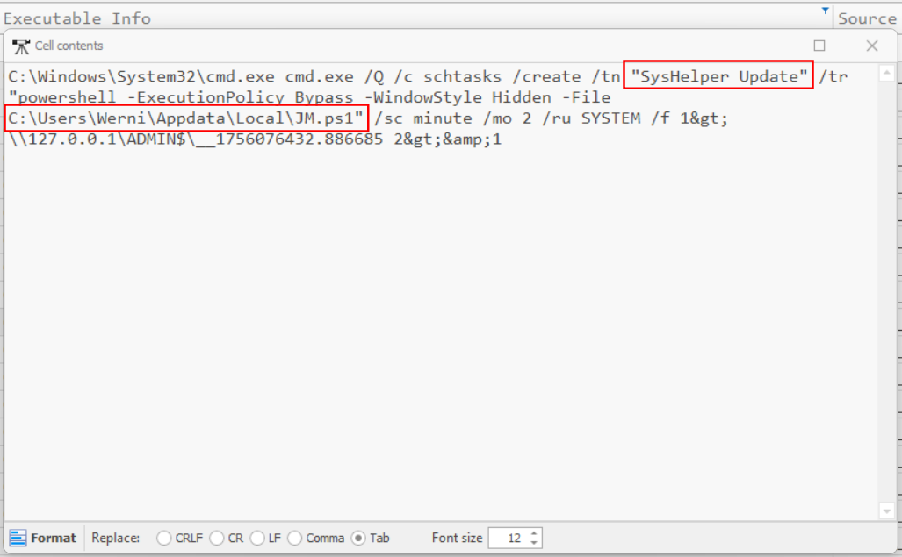

Its name is displayed there

**Answer: SysHelper Update**

## 6. Identify the script executed by the persistence mechanism.

Can be seen from previous question

**Answer: C:\Users\Werni\AppData\Local\JM.ps1**

## 7. What local account did the attacker create?

Looking at the powershell script to grasp its core mission:

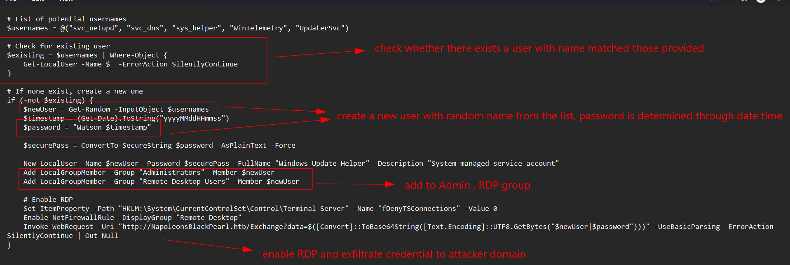

Then return to `Security` log with ID 4720 (A new user was added) to determine the chosen username:

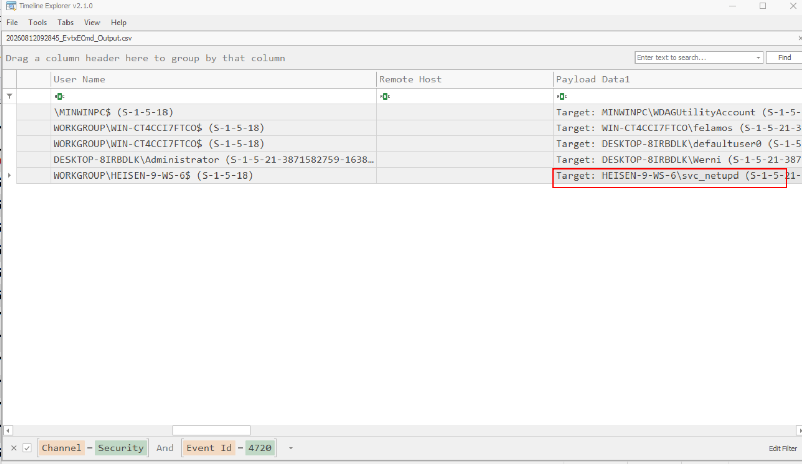

**Answer: svc_netupd**

## 8. What domain name did the attacker use for credential exfiltration?

Seen in the previous question

**Answer: NapoleonsBlackPearl.htb**

## 9. What password did the attacker's script generate for the newly created user?

Here comes the tricky part. You may think the password is deterministic so we just look at the timestamp of user creation event to reconstruct it, right ? But no, the logged time is in UTC, but `Get-Date` returns local time, so there would be a mismatch. You may also think we can find the web log somewhere to obtain the HTTP request, but it's not available either. 

Then there comes the least preferred option - brute-force. However, it's not so bad as we know the exact form of that password, there are only 6 uncertain digits, thus 10^6 possibilities, very cheap for a computer.

First we need to get the hash from hives, use the aforementioned `impacket-secretsdump` tool, then brute-force with a mask using `john the ripper` (or `hashcat` if you want):

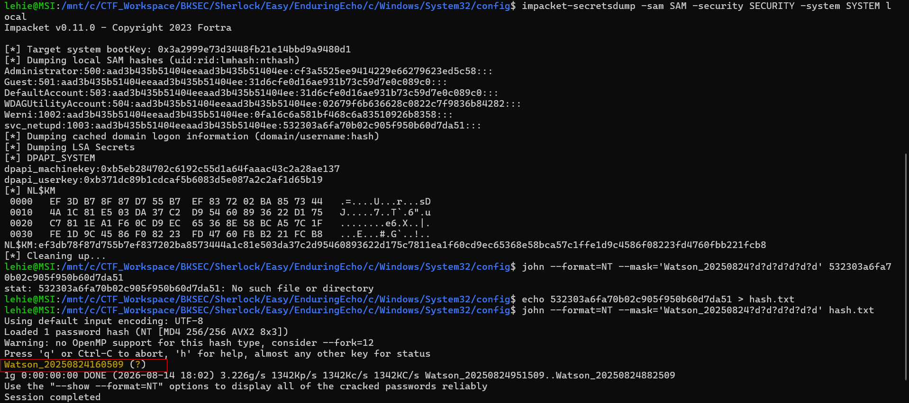

We see that the date is the same as in Event Log, but the hour is exact 7 hours later that UTC, due to local timezone.

**Answer: Watson_20250824160509**

## 10. What was the IP address of the internal system the attacker pivoted to?

Follow the next commands in `Security` log, I see a batch script being executed, the next entry shows `netsh.exe` being spawned to create a `portproxy` to an internal IP:

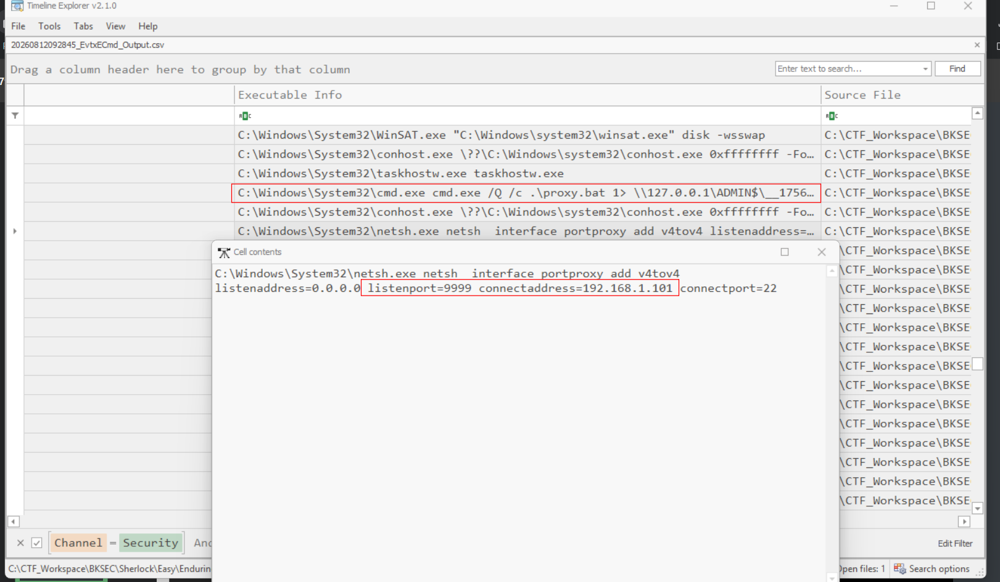

Anything going to the machine (all interfaces 0.0.0.0) port 9999 is forwarded to that internal IP port 22, then the response is redirected to the original sender.

**Answer: 192.168.1.101**

### 11. Which TCP port on the victim was forwarded to enable the pivot?

Visible in previous question

**Answer: 9999**

### 12. What is the full registry path that stores persistent IPv4→IPv4 TCP listener-to-target mappings?

`PortProxy` is a legitimate interface, its data is saved in this hive:

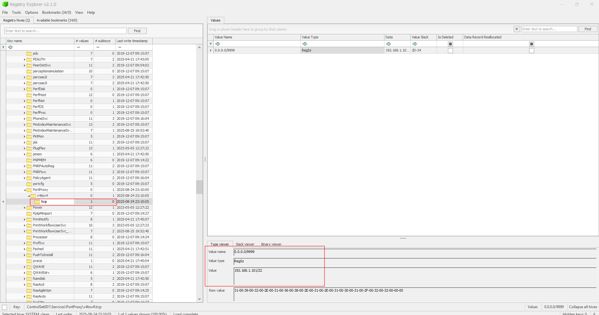

Don't worry if you don't know, initially I don't neither, knowing how to look up for it is still a good progress, right?...

**Answer: HKLM\SYSTEM\CurrentControlSet\Services\PortProxy\v4tov4\tcp**

## 13. What is the MITRE ATT&CK ID associated with the previous technique used by the attacker to pivot to the internal system?

That's it, in Command and Control section:

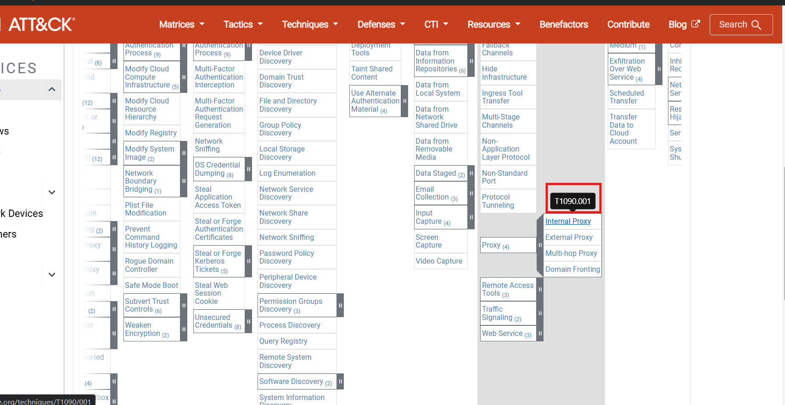

**Answer: T1090.001**

## 14. Before the attack, the administrator configured Windows to capture command line details in the event logs. What command did they run to achieve this?

The powershell history is finally useful, I said that it seems to be the author's preparation instead of malicious action, and that's true:

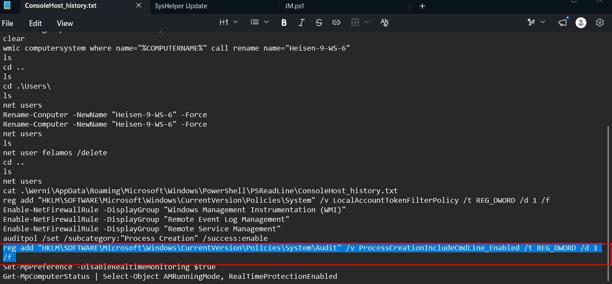

**Answer: reg add "HKLM\SOFTWARE\Microsoft\Windows\CurrentVersion\Policies\System\Audit" /v ProcessCreationIncludeCmdLine_Enabled /t REG_DWORD /d 1 /f**
