# Fruitzy

## Sherlock Scenario

CyberJunkie started out as a junior QA Analyst at his friend's startup. He called the CEO of the startup because he believed he had mistakenly downloaded something malicious. The CEO sought help from you, his friend in the cybersecurity field. You sent him a guide on collecting evidence from the machine using KAPE. Now you have been given the forensic image so you can analyze and help your friends, as they cannot afford to hire an MSSP.

## Given artifact

An email and a disk image file

## Questions

## 1. What is the Subject/topic of the Phishing email?

The topic is also the name of that email file:

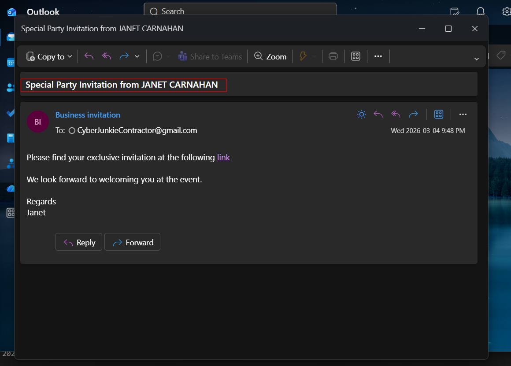

**Answer: Special Party Invitation from JANET CARNAHAN**

## 2. What is the malicious URI that the malicious link redirected to?

In the email we only see the original link, which contains some kinds of token and the actual destination page will be redirected to later. As we know the victim clicked it, we can find in the browser's history in `AppData \ Local \ Microsoft \ Edge \ User Data \ Default \ History`. This is a SQLite database, so I use DBrowser to query it:

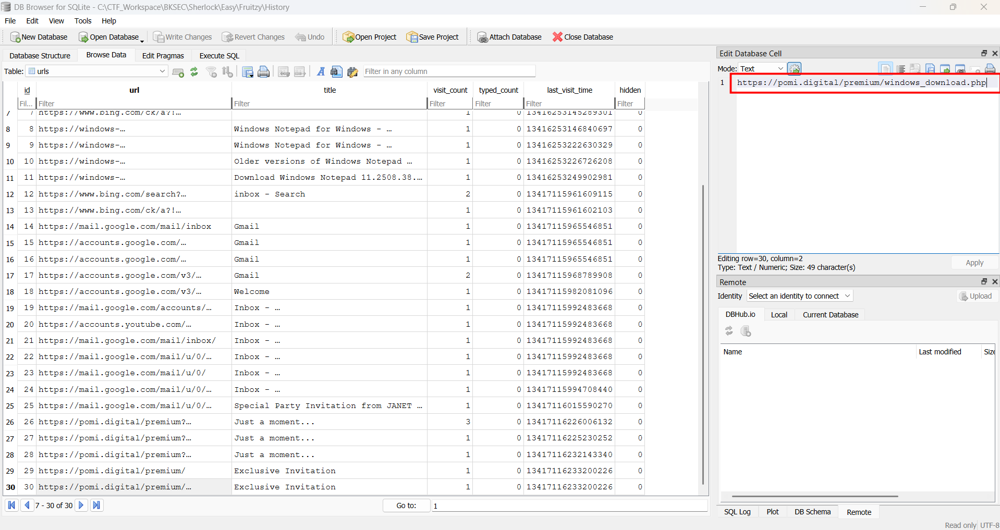

In the `urls` table, we can see the final URI 

**Answer: `https://pomi.digital/premium/windows_download.php`**

## 3. What is the name of the downloaded file?

Pivot to the `downloads` table, we can see this suspicious exe:

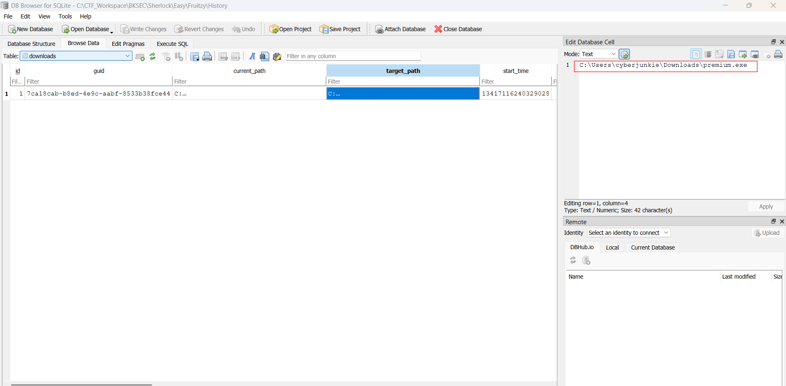

**Answer: premium.exe**

## 4. When was the downloaded file executed by the victim according to Amcache?

Indeed I solved this question by leveraging prefetch because it is faster:

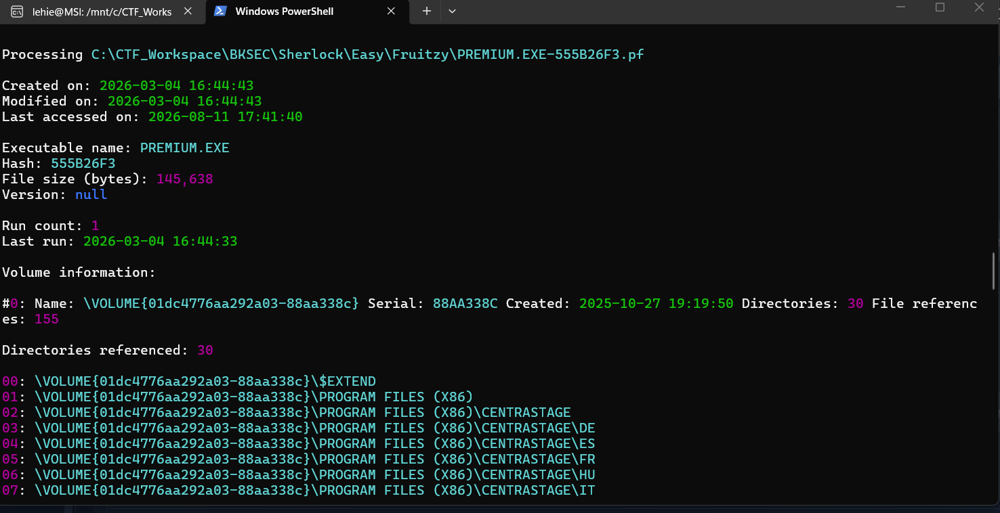

And if we want to follow the question's guide, use Eric Zimmerman's `AmcacheParser`, locate the hive `C:\Windows\appcompat\Programs\Amcache.hve` in FTK Imager and export it. There will be severals CSVs for the result, here is the summary according to LLM:

1. `_UnassociatedFileEntries.csv`
 
- What it supplies: A list of executable files (.exe, .dll, .sys) that were present on the file system and executed, but are not tied to a traditional, MSI-installed application.
- Forensic Value: This is your primary hunting ground for malware. Attackers rarely use standard installers. Instead, they drop standalone binaries or web shells into temp folders.

   Key Columns:

- Path: Look for executions out of suspicious directories like `C:\Users\*\AppData\Local\Temp\` or `C:\Windows\PerfLogs\`.
- FileSHA1: The cryptographic hash you can plug into VirusTotal.
- CompilationTimestamp: Tells you when the file was compiled. Malware authors often forget to alter this, allowing you to spot brand-new files.

2. `_ProgramEntries.csv`

- What it supplies: Information on fully installed software packages on the operating system (programs that usually appear in "Add/Remove Programs").
- Forensic Value: Helps establish the baseline environment of the victim machine and identifies unauthorized software installed by an attacker or a malicious insider (e.g., dual-use administration tools like network scanners, WinRAR, or unauthorized VPN clients).
- Key Columns: ProgramName, Publisher, Version, and UninstallString.

3. `_AssociatedFileEntries.csv`

- What it supplies: The files that belong explicitly to the software packages listed in `_ProgramEntries.csv`.
- Forensic Value: If you find a suspicious program entry, this file maps out every supporting executable and DLL associated with that application. It helps confirm if a legitimate piece of software was subverted or replaced.

4. `_DriverEntries.csv`

- What it supplies: A record of hardware and software drivers (.sys files) that have been registered or loaded by the system.
- Forensic Value: Essential for uncovering Rootkits or malicious drivers used to bypass Endpoint Detection and Response (EDR) agents (known as "Bring Your Own Vulnerable Driver" attacks).
- Key Columns: DriverName, DriverVersion, and DriverCompany.

5. `_Shortcuts.csv`

- What it supplies: Information about shortcut structures and application links tracked by the Application Compatibility engine.
- Forensic Value: It provides context regarding user interaction. It can prove whether a user or script actively launched a specific target shortcut, tracking the file paths involved.

6. `_DeviceContainers.csv & _DevicePnp.csv`

- What it supplies: Metadata about hardware devices that have been connected to the system, utilizing Plug-and-Play (PnP).
- Forensic Value: Great for insider threat investigations. While it won't give you a full USB history like the dedicated SYSTEM registry keys, it provides supplementary evidence of external media or hardware being attached to the machine around the time an event occurred

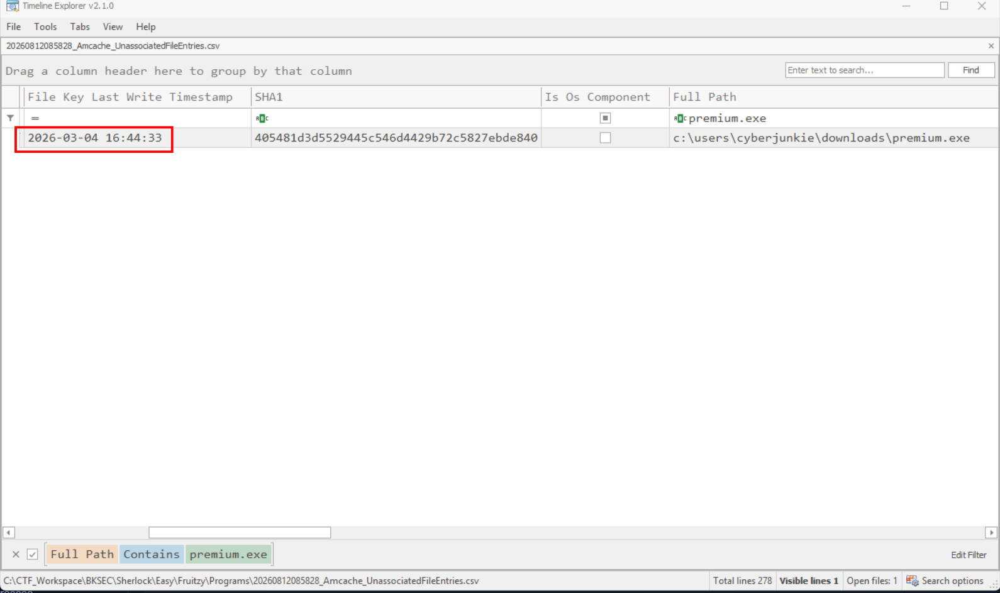

**Answer: 2026-03-04 16:44:33**

## 5. What is the SHA256 hash of the malicious executable downloaded from the phishing Website?

Take that SHA1 and submit to VirusTotal, we will get the corresponding SHA256:

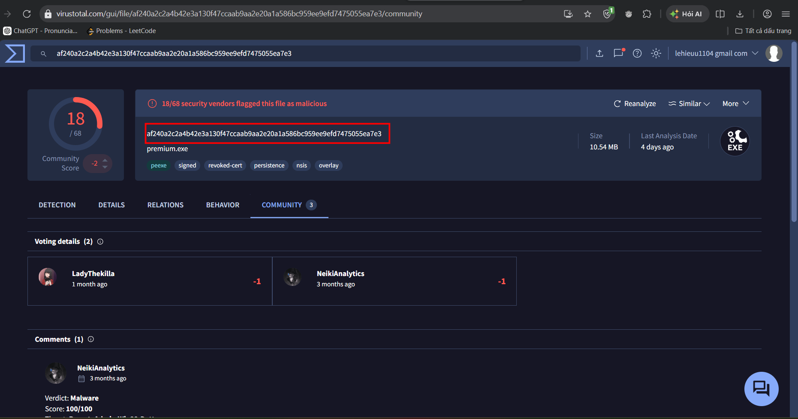

**Answer: af240a2c2a4b42e3a130f47ccaab9aa2e20a1a586bc959ee9efd7475055ea7e3**

## 6. The user executed the file, but no invitation appeared or was found. They then used Microsoft Defender to scan the file. When was this scan initiated ?

Export the Event Logs from FTK Imager and parse them with EvtxECmd, then filter for Windows Defender logs. I search for `premium.exe` and get this entry with ID 1000 ( means an anti-malware scan was conducted):

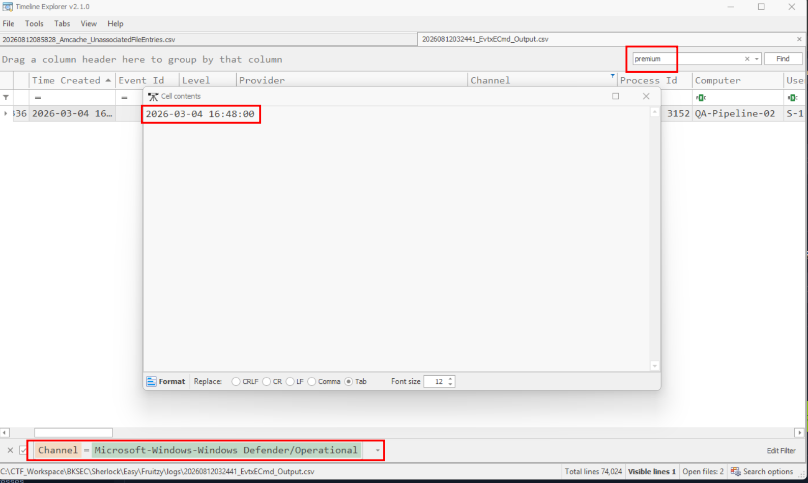

**Answer: 2026-03-04 16:48:00**

## 7. The malware installed a Remote Monitoring and Management (RMM) tool as a backdoor for potential remote access. What was the service name?

In the result of `premium.exe`'s prefetch, we can see it referring to a CentraStage, now known as Datto RMM:

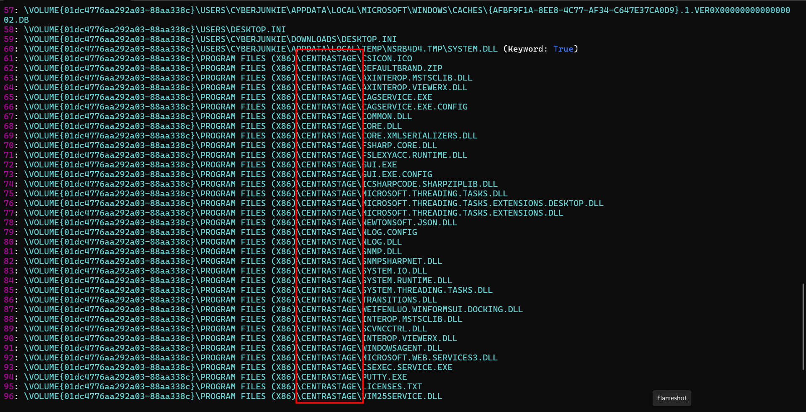

**Answer: CentraStage**

## 8. The malicious backdoor installation time stomped the RMM executables. What was the modified timestamp set to these executables?

We know that in the master file table, the Standard Information (0x10) is frequently abused by attackers to spoof timestamp, while the File Name (0x30) is nearly impossible, or very difficult for them to modify. Bear in mind that the main exe of CentraStage is `CagService.exe`, I parse the MFT using MFTECmd and open in timeline explorer:

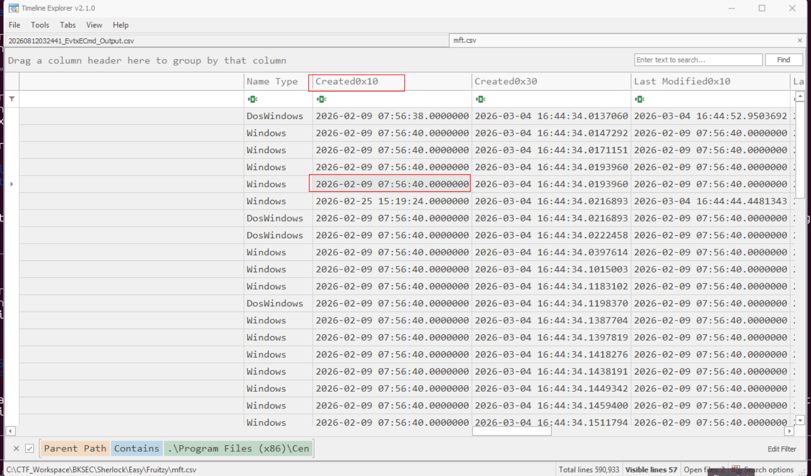

The date has been modified backwards

**Answer: 2026-02-09 07:56:40**

## 9. What is the name of the company whose product is the RMM tool?

According to what I read, the tool initially does not belong to this company, it has been bought later

**Answer: Datto**

## 10 Pivoting back to the malicious link, when was the domain registered?

Use ICANN search page:

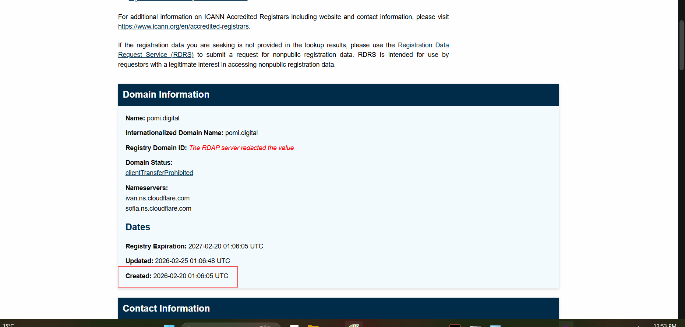

**Answer: 2026-02-20 01:06:05**

## 11. Utilizing threat intelligence sources, what is another name for the executable that was initially downloaded?

In details tab in VirusTotal, we can see its other names:

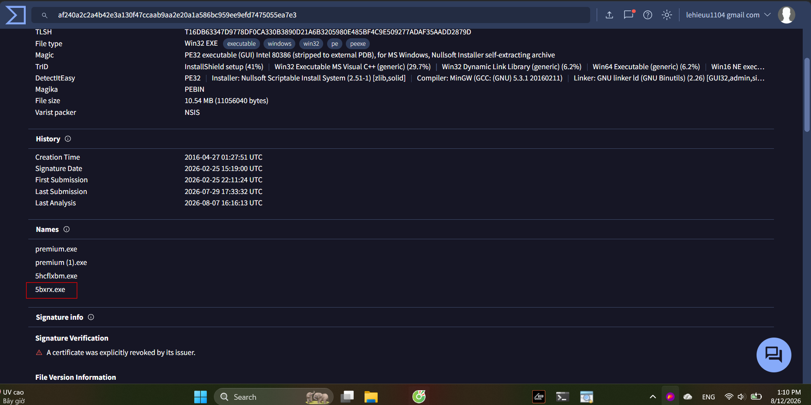

**Answer: 5bxrx.exe**
