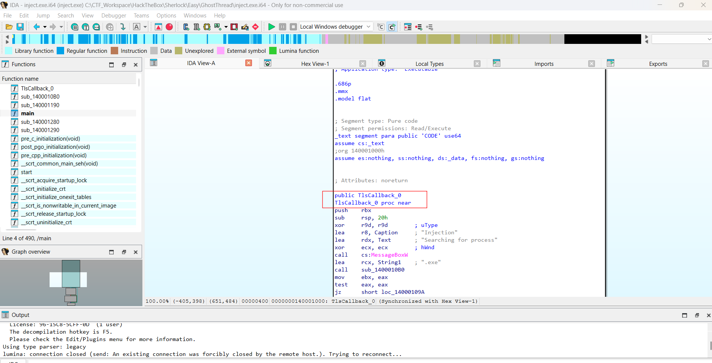
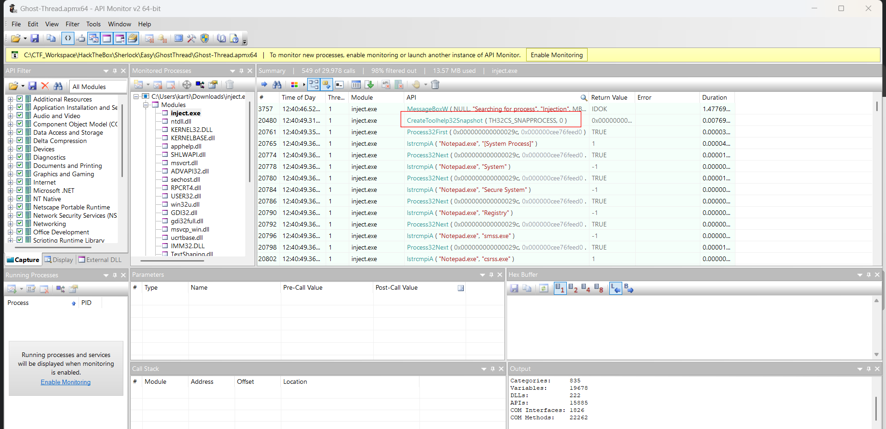
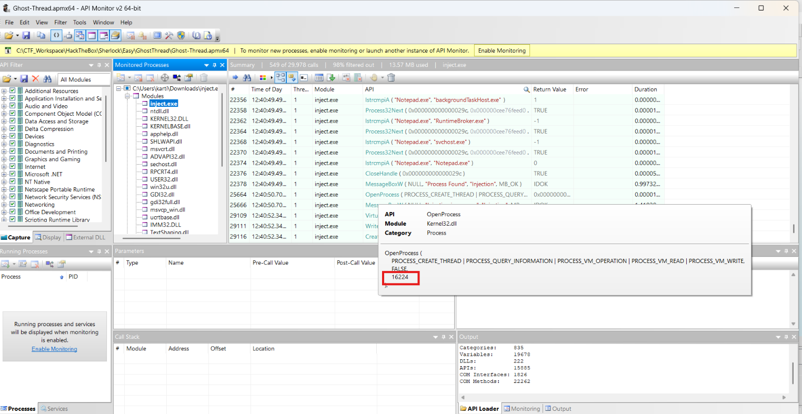
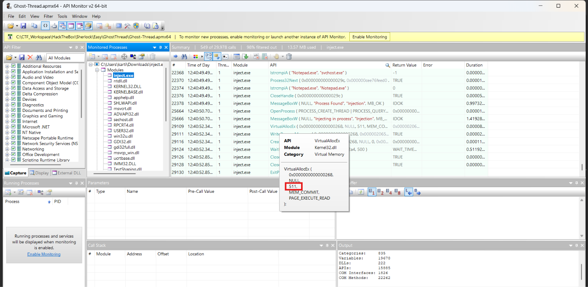

# Ghost Thread

## Sherlock scenario

Byte Doctor suspects the attacker used a process injection technique to run malicious code within a legitimate process, leaving minimal traces on the file system. The logs reveal Win32 API calls that hint at a specific injection method used in the attack. 

Your task is to analyze these logs using a tool called API Monitor to uncover the injection technique and identify which legitimate process was targeted.

## Given artefacts

An API monitor `.apmx64` file and the IDA database file for the malicious exe that performs process injection.

## Foundational knowledge
* **Thread Local Storage (TLS) Callbacks**: A mechanism in Windows intended to allow developers to initialize variables unique to individual threads. Attackers heavily abuse this feature because the Windows operating system executes TLS callbacks **before** the program's normal entry point (`main()` or `WinMain()`). This allows malware to run its malicious logic (such as unpacking or process injection) before traditional debuggers or analysts even begin monitoring the primary execution flow.
* **Win32 APIs for Process Enumeration & Injection**:
  * `CreateToolhelp32Snapshot` & `Process32Next`: Used to scan and iterate through currently running processes. Malware uses this to find a suitable target for injection (like a benign process) or to search for and evade analysis tools (like Wireshark).
  * `OpenProcess`: Secures a handle (with specific permissions) to the remote target process, allowing the malware to interact with it.
  * `VirtualAllocEx`: Allocates an empty block of memory within the remote, legitimate process.
  * `WriteProcessMemory`: Writes the malicious payload (shellcode) into the block of memory allocated in the previous step.
  * `CreateRemoteThread`: Commands the remote process to spawn a new thread that begins executing the injected shellcode.
* **`ExitProcess`**: A Win32 API used to cleanly terminate a process. In the context of TLS callback injection, an attacker will often call `ExitProcess` at the end of the callback. This ensures the program terminates early and never reaches `main()`, avoiding crashes or unwanted attention that might arise if the program continued normal execution.

## Questions

### 1. What process injection technique did the attacker use?

Open the `.i64` file in IDA, we can see the presence of the aforementioned TLS callback function:

**Answer: Thread Local Storage**

### 2. Which Win32 API was used to take snapshots of all processes and threads on the system?

Open API Monitor:

After display the message box, it calls this API to grasp all running processes

**Answer: CreateToolhelp32Snapshot**

### 3. Which process is the attacker's binary attempting to locate for payload injection?

We can see the malware repeatedly compare current process name with notepad.exe, indicating it was trying to find a running instance of that process

**Answer: notepad.exe**

### 4. What is the process ID of the identified process?

After it catches a running `notepad.exe`, it calls `OpenProcess()` to get a handle, look at the parameters, we can see its PID:

**Answer: 16224**

### 5. What is the size of the shellcode?

After having access to the process, it allocates a memory region of size 511 bytes:

**Answer: 511**

### 6. Which Win32 API was used to execute the injected payload in the identified process?

After that, it calls `CreateRemoteThread()` to spawn a new thread pointing right at the allocated region. Note that this API is heavily monitored in modern EDR, attackers often use other techniques

**Answer: CreateRemoteThread**

### 7. The injection method used by the attacker executes before the main() function is called. Which Win32 API is responsible for terminating the program before main() runs?

Right below, we see `ExitProcess()` being called

**Answer: ExitProcess**
