# Log Jammer

## Sherlock Scenario

You have been presented with the opportunity to work as a junior DFIR consultant for a big consultancy. However, they have provided a technical assessment for you to complete. The consultancy Forela-Security would like to gauge your knowledge of Windows Event Log Analysis. Please analyse and report back on the questions they have asked.

## Given artefacts

Some Windows Event Log

## Questions

I first parse the log with Eric Zimmerman's EvtxECmd and open it in Timeline Explorer

### 1. When did the cyberjunkie user first successfully log into his computer? (UTC)

Filter for successful logon with ID 4628 and look for user cyberjunkie:

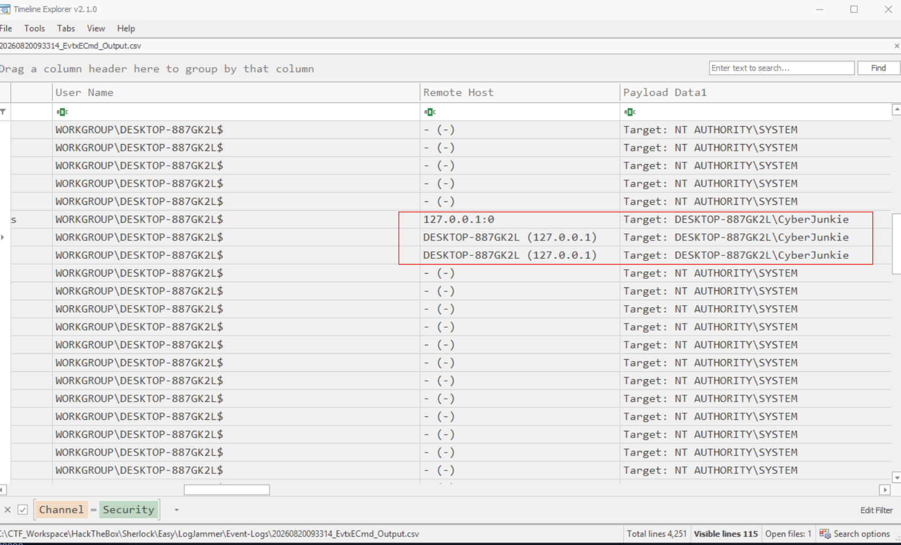

Scroll left for the answer

**Answer: 27/03/2023 14:37:09**

### 2. The user tampered with firewall settings on the system. Analyze the firewall event logs to find out the Name of the firewall rule added?

Filter the time for that day only and switch to the Firewall log, we will see this rule being added to exception list:

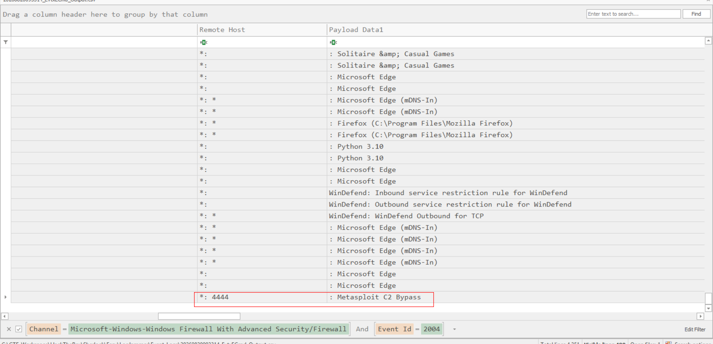

**Answer: Metasploit C2 Bypass**

### 3. Whats the direction of the firewall rule?

It allows traffic to go out from port 4444, thus an Outbound rule

**Answer: Outbound**

### 4. The user changed audit policy of the computer. Whats the Subcategory of this changed policy?

There is only one event regarding audit policy change in the given log, however, EvtxECMD won't display the actual subcategory, only its ID is given:

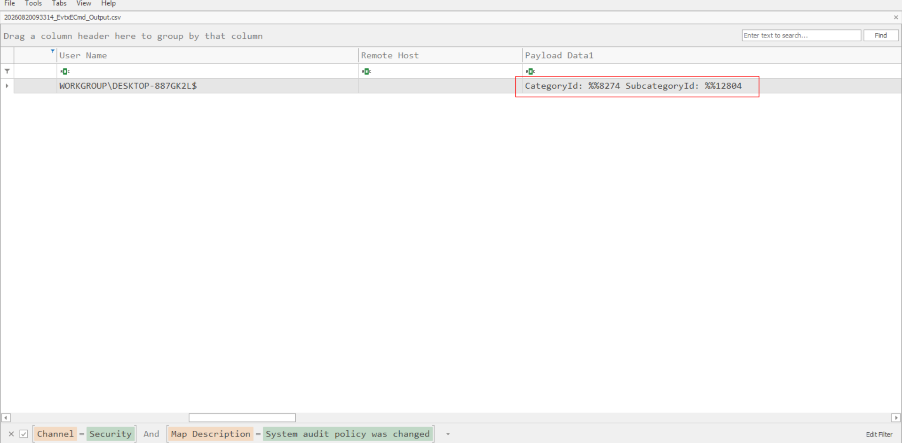

So I open it in Event Viewer instead to see the explicit subcategory:

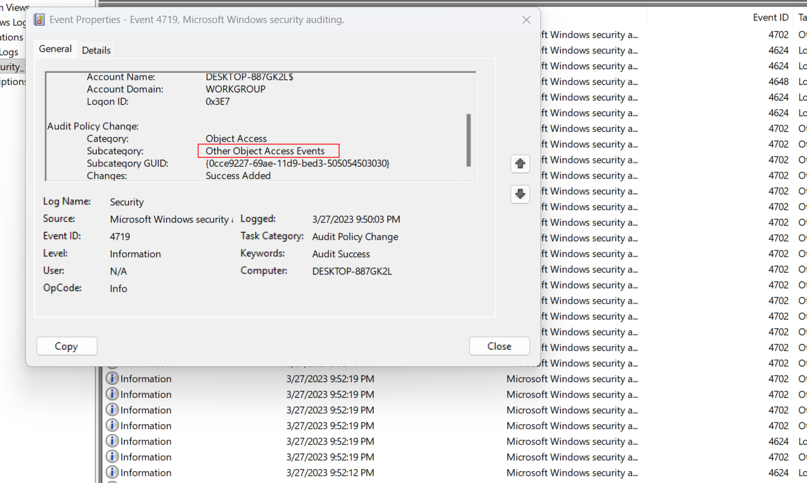

**Answer: Other Object Access Events**

### 5. The user "cyberjunkie" created a scheduled task. Whats the name of this task?

Right after the above event, we see cyberjunkie adds a scheduled task:

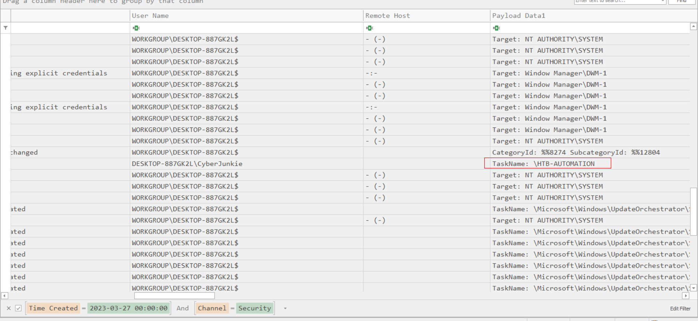

**Answer: HTB-AUTOMATION**

### 6. Whats the full path of the file which was scheduled for the task?

Copy the content of that scheduled task and use cyberchef to beautify it (From HTML Entity then XML Beautify):

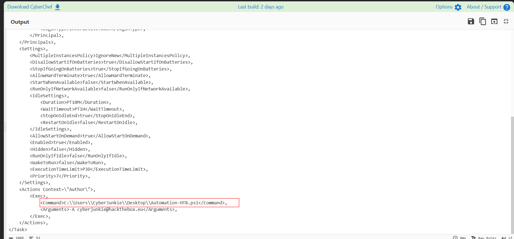

We can see the command that triggers a ps1 script

**Answer: C:\Users\CyberJunkie\Desktop\Automation-HTB.ps1**

### 7. What are the arguments of the command?

In the previous snapshot

**Answer: -A cyberjunkie@hackthebox.eu**

### 8. The antivirus running on the system identified a threat and performed actions on it. Which tool was identified as malware by antivirus?

Move to Defender log:

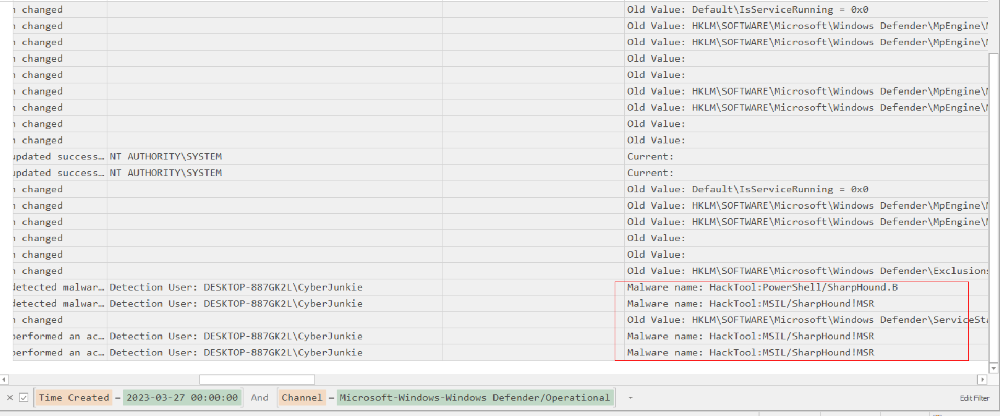

**Answer: Sharphound**

### 9. Whats the full path of the malware which raised the alert?

Look at the file path column:

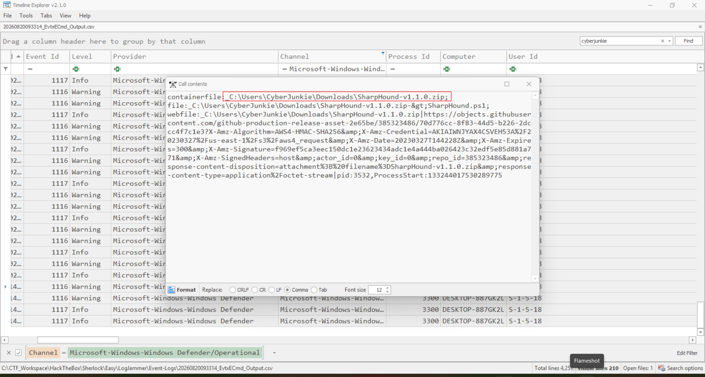

**Answer: C:\Users\CyberJunkie\Downloads\SharpHound-v1.1.0.zip**

### 10. What action was taken by the antivirus?

Look at the details column of the event with ID 1117 (action performed):

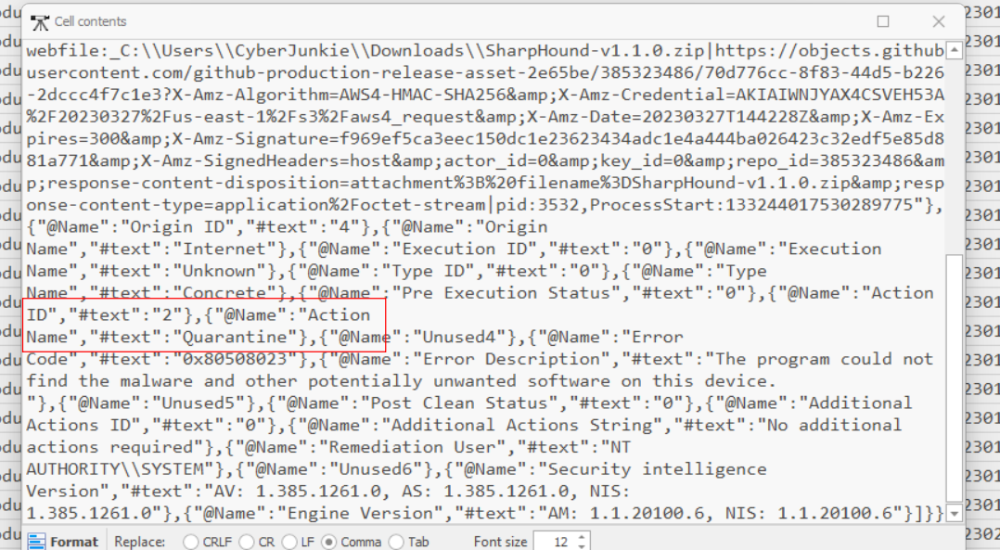

**Answer: Quarantine**

### 11. The user used Powershell to execute commands. What command was executed by the user?

Go to Powershell/Operational log:

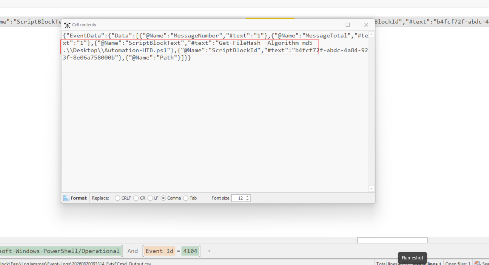

**ANswer: Get-FileHash -Algorithm md5 .\Desktop\Automation-HTB.ps1**

### 12. We suspect the user deleted some event logs. Which Event log file was cleared?

Go to System log and filter for ID 104 to inspect log removed:

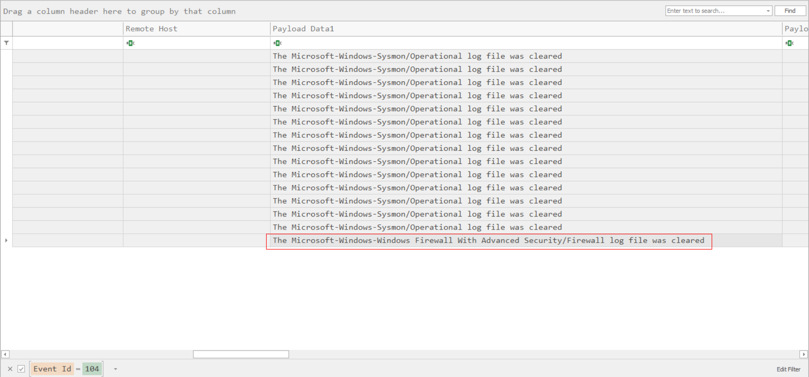

**Answer: Microsoft-Windows-Windows Firewall With Advanced Security/Firewall**
