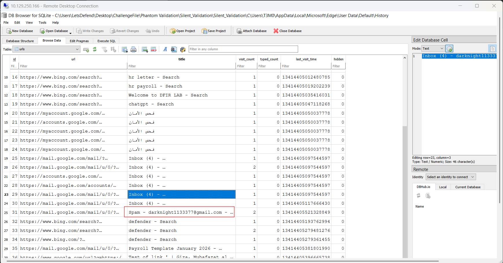
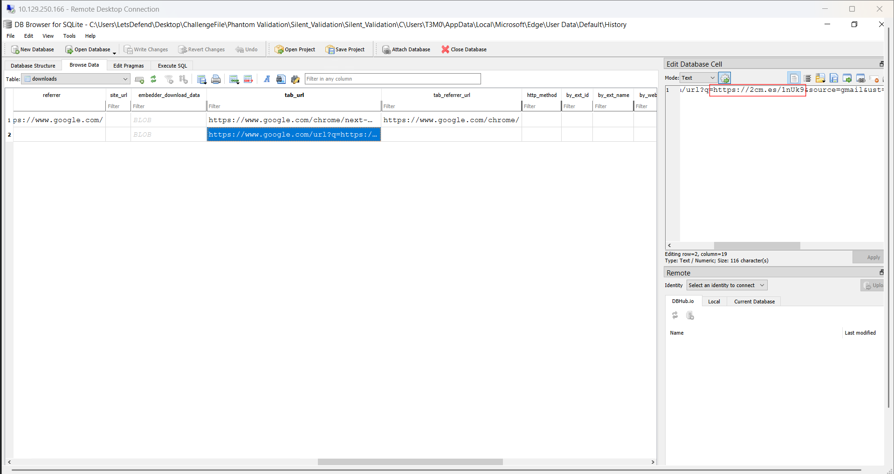
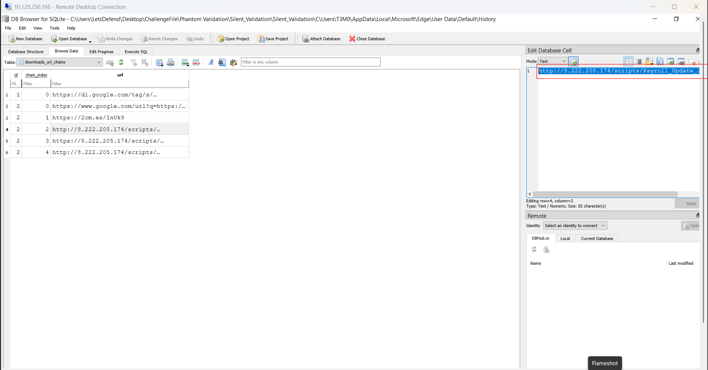
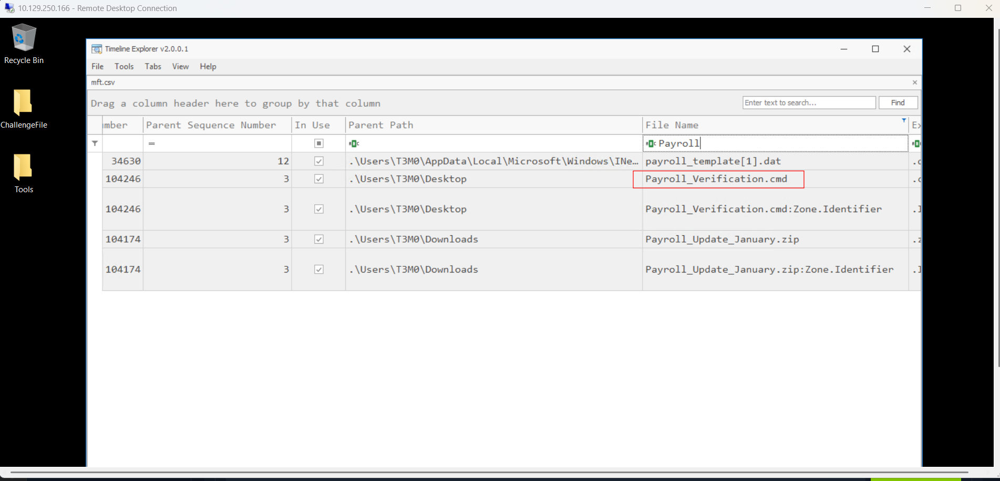
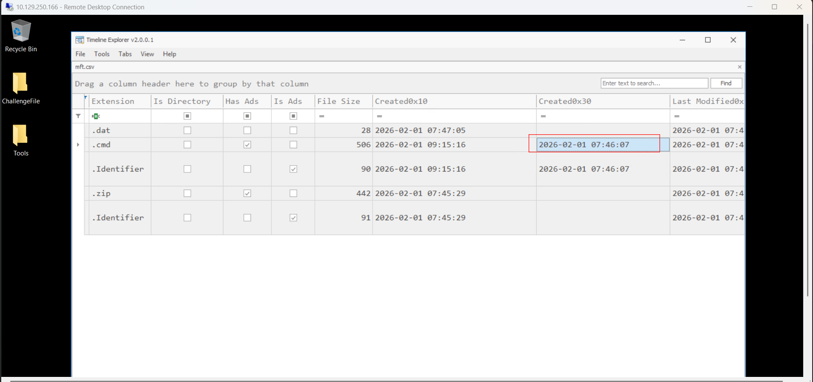
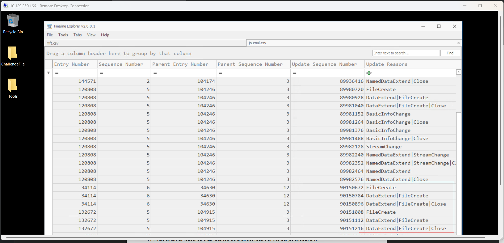
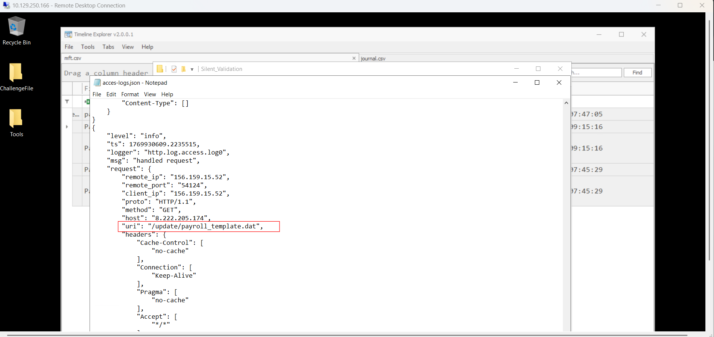
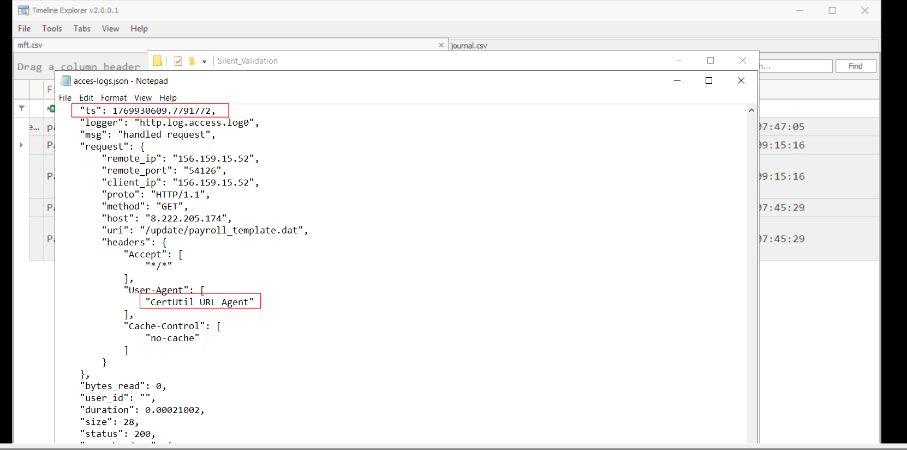

# Phantom Validation

## Sherlock scenario

A routine payroll-related communication triggered a series of user interactions on a corporate workstation. Following this activity, questions arose regarding external access, file handling, and system-level traces.

You are assigned to analyze the available artifacts and determine the nature and sequence of events.

## Given artifact

Kape triage collection of victim's C drive and a log file, seems to be access log, but we must connect to the instance from RDP, very troublesome

## Questions

### 1. Which email address was associated with the user account that interacted with the payroll communication initiating this incident?

Open the Edge's History database in DBBrowser, navigate to the `urls` table, we will see the user visiting Gmail, and his email address is in plain sight:

**Answer :`darknight1133377@gmail.com`**

### 2. What shortened URL was used to conceal the true destination of the payroll resource before redirection occurred?

Go to `downloads` table to inspect the shortened URL for the archive:

**Answer: `https://2cm.es/1nUk9`**

### 3. After resolving the redirection, what was the actual URL hosting the payroll archive retrieved during the investigation?

Go to `download_url_chains` table, we will see the redirection chain:

**Answer: `http://8.222.205.174/scripts/Payroll_Update_January.zip`**

### 4. Which file on disk initiated the execution chain that led to the retrieval of external content?

Knowing the malicious archive's name, I parse the C's $MFT and search for 'Payroll..':

A suspicious file stands out, maybe it's a batch script

**Answer: Payroll_Verification.cmd**

### 5. At what exact time was the execution script first created on disk according to NTFS change records?

Scroll right for the Standard Information creation time (0x30), the File Name 0x10 record is easy to be changed by attacker:

**Answer: 2026-02-01 07:46:07**

### 6. Which externally sourced file exhibited a create-and-delete lifecycle within the same execution window?

We are looking for a file which is created, modified and deleted in a short time frame. One way to find is to look at UsnJournal, parse it with MFTECmd then open in Timeline Explorer, I look for file operations around the drop time, and the pattern we expect can be observed:

Scroll left for its name

**Answer: payroll_template.dat**

### 7. What external resource was fetched as a direct result of the script execution?

Note that we are also given something like the access log of the attacker web server, scroll to the incident's time, we see a request for the `.dat` file:

**Answer: `http://8.222.205.174/update/payroll_template.dat`**

### 8. At what exact timestamp did the system successfully retrieve the external execution-related content?

Still in the log, I search for an entry with complete user-agent string, which is also our answer for task 9, the timestamp is in epoch, we can use an online converter to obtain the UTC format:

**Answer: 2026-02-01 07:23:29**

### 9. Which native Windows utility was leveraged to retrieve the external resource without introducing third-party tools?

Covered in task 8

**Answer: certutil**
