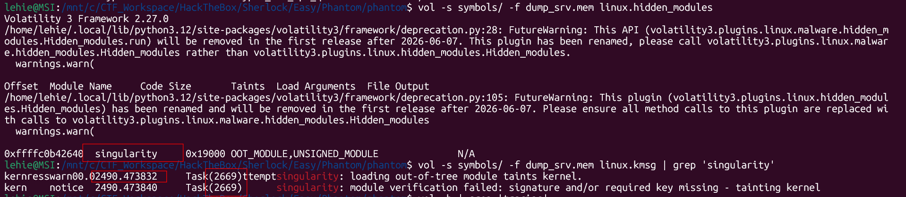
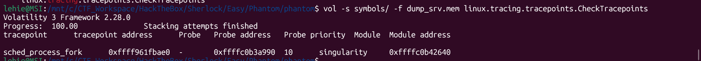
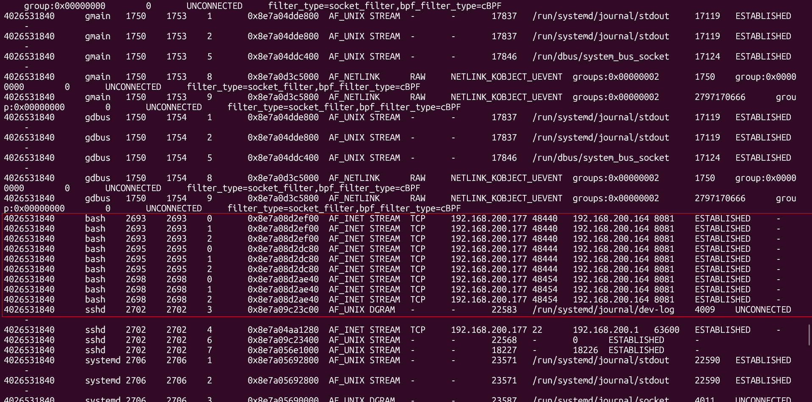
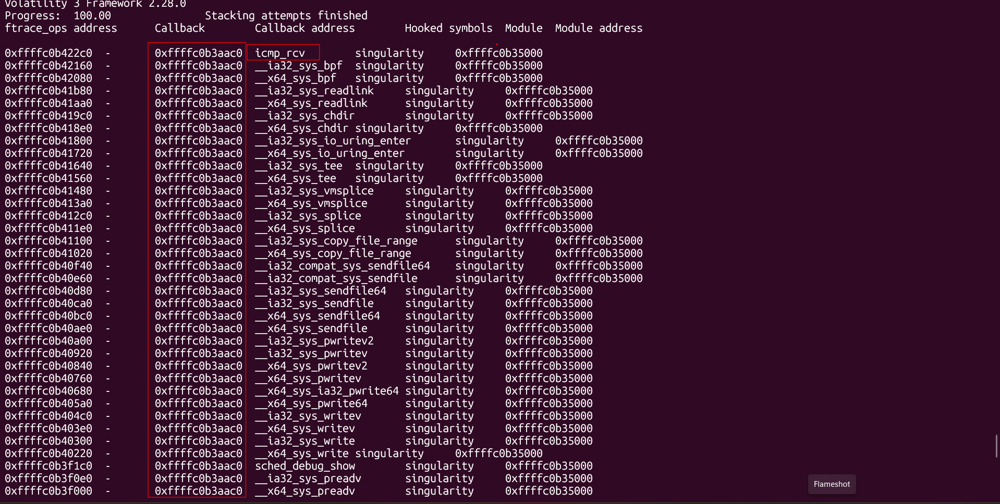
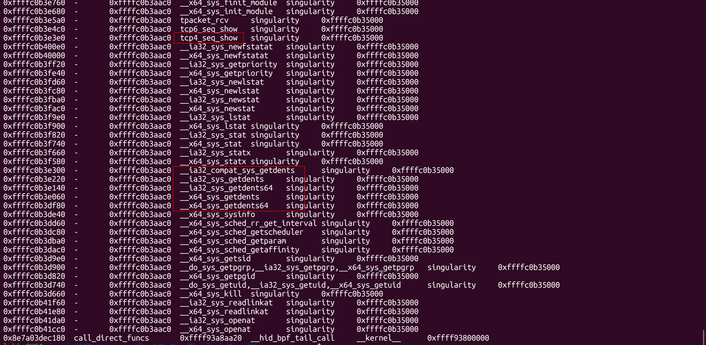
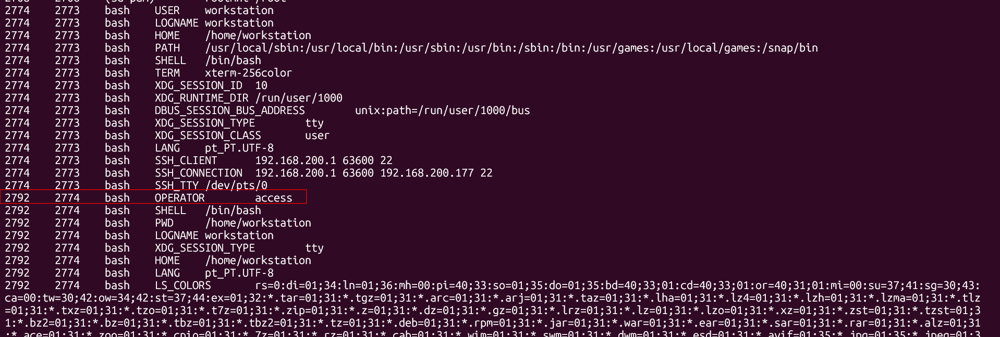

# Phantom

## Sherlock scenario
A Linux server in your organization has been exhibiting suspicious behavior. Network monitoring detected unusual outbound connections to an unknown IP address, and system administrators noticed that several standard diagnostic commands were returning incomplete information. A memory dump was captured from the compromised server before isolation. Your task is to analyze this memory dump to uncover evidence of a sophisticated rootkit infection, map its capabilities, and document all indicators of compromise.

## Given artefacts

## Foundational knowledge

### 1. Linux Kernel Modules (LKMs) & Hidden Modules
The Linux kernel can be dynamically extended using Loadable Kernel Modules (LKMs), which operate with the highest system privileges (Ring 0). When loaded, the kernel tracks these modules in a doubly linked list. Rootkits achieve stealth by modifying this kernel memory structure to unlink themselves from the list. Because standard tools like `lsmod` rely on this linked list, the module becomes "hidden" from the system administrator, despite its code remaining fully functional and resident in memory.

### 2. Ftrace and Tracepoints (Hooking)
Modern Linux rootkits often avoid directly overwriting the System Call Table (which is easily detected) and instead abuse built-in tracing frameworks like **ftrace** and **tracepoints**. These frameworks were designed for debugging and performance monitoring, providing legitimate hooks throughout the kernel source code. A rootkit can register malicious callback functions to these hooks. For example, hooking `tcp4_seq_show` allows the rootkit to filter out its own IP addresses before the system returns network statistics, while hooking `sched_process_fork` allows it to intercept every time a new process is created.

### 3. Magic Pings (ICMP Covert Channels)
A covert channel allows an attacker to communicate with the compromised machine undetected. By hooking the kernel function `icmp_rcv` (which processes incoming ICMP ping packets), a rootkit can inspect the payload of every ping before the normal network stack or firewalls see it. If a ping contains a specific secret password (a "magic" ping), the rootkit intercepts it, drops the packet so it goes unlogged, and executes a hidden action (like spawning a reverse shell or granting root access).

### 4. Reverse Shells & File Descriptors
In Linux, every process uses three standard file descriptors: `0` (stdin), `1` (stdout), and `2` (stderr). During a reverse shell attack, the attacker executes a shell (like `bash`) and redirects all three of these file descriptors to an active network socket connected back to their Command and Control (C2) server. This allows the attacker to type commands over the network directly into `stdin` and receive the output from `stdout`/`stderr`.

### 5. Volatility 3 Linux Plugins Used
* **`linux.hidden_modules`**: Scans memory for kernel module structures that have been unlinked from the standard module list.
* **`linux.kmsg`**: Extracts the kernel ring buffer logs (similar to `dmesg`), which can reveal module loading events, timestamps, and the PIDs of the processes that triggered them.
* **`linux.tracing.tracepoints.CheckTracepoints`**: Scans the kernel for registered tracepoints that point to suspicious or untrusted memory addresses.
* **`linux.sockstat`**: Reads socket structures directly from kernel memory to identify network connections, bypassing user-space hooks designed to hide them.
* **`linux.tracing.ftrace.CheckFtrace`**: Identifies functions that have been intercepted using the ftrace framework and reveals the address of the malicious callback function.
* **`linux.envars`**: Dumps the environment variables for processes in memory, which can reveal custom backdoor triggers or variables used for privilege escalation.

## Questions

### 1. What is the name of the hidden kernel module?

Run `hidden_modules` plugin to scan for unliked LKM:

**Answer: singularity**

### 2. What kernel taint flags are set for the rootkit module? (comma-separated, alphabetical order)

Look closer in the volatility's output, we can see the `Taint` column. When a module is loaded that isn't standard, open-source, or properly signed, the Linux kernel marks itself as "tainted" to warn developers that a third-party module is doing things they can't vouch for

**Answer: OOT_MODULE,UNSIGNED_MODULE**

### 3. At what exact time (in seconds since boot) was the rootkit module loaded

In the above screenshot, I also used `kmsg` plugin to get internal messages from the kernel and grep for the module name. We can see the load time and PID of the process loading it as well

**Answer: 2490.473832**

### 4. What was the PID of the process that loaded the rootkit module?

Covered in task 3

**Answer: 2669**

### 5. Which kernel tracepoint is hooked by the rootkit

Use `tracing.tracepoints.CheckTracepoints` :

With this hook, everytime a process is spawned then the rootkit can intercept it, obtaining full visibility

**Answer: sched_process_fork**

### 6. What is the IP address of the command and control server?

Use `sockstat` plugin:

It's plain as the nose on your face now, a bash session is transformed into a reverse shell by changing its FD, we now got the answer for task 6, 7 and 8 as well

**Answer: 192.168.200.164**

### 7. What port is the C2 server listening on?

Covered in task 6

**Answer: 8081**

### 8. What are the PIDs of the compromised bash processes connected to the C2 server? (comma-separated, ascending order)

Covered in task 6

**Answer: 2693,2695,2698**

### 9. How many hooks has the rootkit installed?

First of all you should distinguish this from the kernel tracepoint in previous question:

  • Tracepoints (e.g., sched_process_fork): These are static, pre-defined hooks explicitly placed by Linux kernel developers. They are hardcoded into the
  kernel source code at specific, important events (like right when a process forks). The rootkit simply says, "Hey kernel, when this tracepoint fires,
  run my code too."
  
  • Ftrace Hooks (the 82 hooks): Ftrace is a dynamic tracing framework. It doesn't rely on pre-defined hooks. Instead, ftrace has the ability to
  dynamically modify the actual machine code at the very beginning of almost any function in the kernel. The rootkit abused the ftrace API to tell the
  kernel, "Go to the start of tcp4_seq_show, sys_getdents, etc., and inject a jump instruction that redirects to my malicious callback function
  (0xffffc0b3aac0)."

Use `tracing.ftrace.CheckFtrace` plugin:

Count them (grep for `singularity` and pipe to wc is better)

**Answer: 82**

### 10. Which function is hooked to hide IPv4 network connections?

When a user runs netstat or ss, the tool reads from `/proc/net/tcp`. The kernel function that generates this file's output is `tcp4_seq_show` (see in previous snapshot). By hooking this, the rootkit can filter out its own C2 connections before the user ever sees them

**Answer: tcp4_seq_show**

### 11. How many variants of getdents syscalls are hooked?

The getdents (Get Directory Entries) syscall is what ls uses to list files. Rootkits hook it to hide their own files. If we look closely at the output, we'll see 5 different variants of this syscall hooked (`__ia32_compat_sys_getdents,__ia32_sys_getdents, __ia32_sys_getdents64, __x64_sys_getdents, __x64_sys_getdents64`).

**Answer: 5**

### 12. Which function is hooked to enable an ICMP-based covert channel?

This is the `magic ping` I mentioned

**Answer: icmp_rcv**

### 13. What is the memory address of the centralized callback function? (Format:0x************)

Every hook points to this memory address

**Answer: 0xffffc0b3aac0**

### 14. What is the value of the suspicious environment variable which leads to the escalation of privileges?

Use `envars` plugin:

Take a look at the OPERATOR env, OPERATOR is not a standard Linux environment variable. Rootkits often hook standard execution syscalls (like execve) and check the environment variables of the calling process. If the rootkit sees a secret variable like `OPERATOR=access`, it intercepts the call and silently elevates that process to root!

**Answer: access**
