# Easy Money

## Sherlock Scenario

John is an employee at a mid-sized tech company. He works as a Senior IT support specialist, but his true passion is finding ways to make extra money. John is always on the lookout for giveaways, discounts, and any opportunity to earn a quick buck. He’s not particularly tech-savvy when it comes to cybersecurity, but he’s resourceful and knows how to follow online tutorials.

Recently, John came across an enticing giveaway that promised exciting rewards. However, when he opened the giveaway, he didn’t find or win anything. This made him suspicious that something might have gone wrong with his machine. Concerned about the unusual behavior, John has reached out to you, the investigator, to uncover what happened and whether his system has been compromised.

## Given artifacts

The whole C drive of user John, however, it is captured by KAPE and only retains some important system files, many necceassy files are not available.

## Answering question 

### Task 1: At what exact time did the user execute the malicious shortcut file?

This question takes me a lot of time, not only am I a bit skeptical, but hte problem itself is somehow tricky. There are two files that stand out as a lure for greedy people like John, one lies in AppData/Roaming/Microsoft/Windows/Recent, the other lies in plain sight at the Downloads folder:

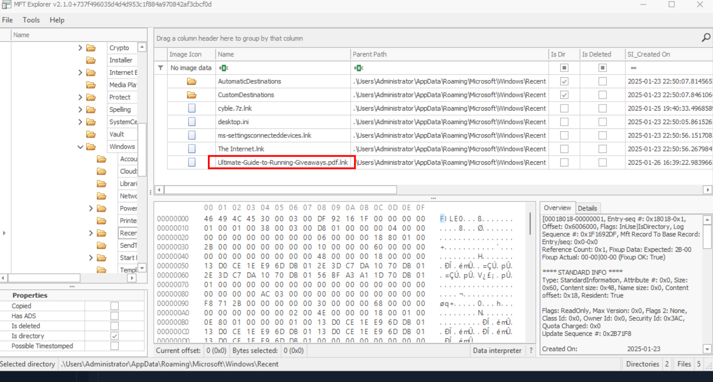

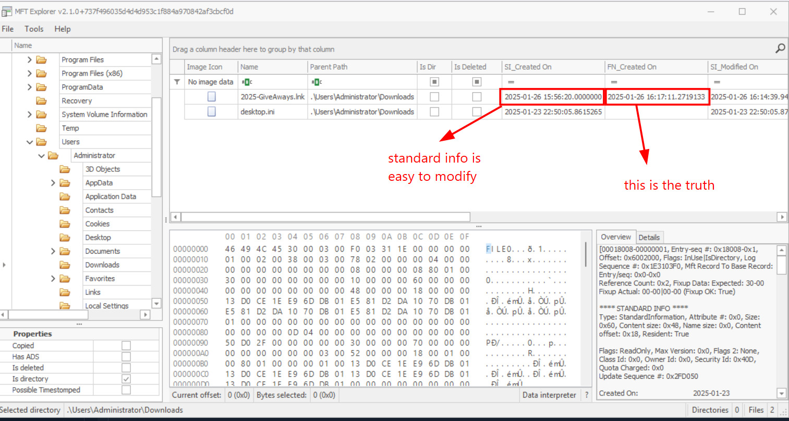

At first, I think the one at Downloads folder should be decoy, the harder it is to find, the more likely it is the answer, but nah... just take it as simple as possible. The `2025-GiveAways.lnk` is the culprit. However, the timestamp in MFTExplorer does not reflect the true moment John double-clicked that file, it just record the time when that file is created, or downloaded. And we need to make use of another Windows artifact: `prefetch` file.

**So what is `prefetch` file and its role in Digital Forensics ?**

In Digital Forensics and Incident Response (DFIR), Windows Prefetch files (.pf) are critical evidence of execution artifacts. They provide a reliable record of which applications were run, when they were executed, and where they were located, even if the original executable has since been deleted. (cite Google)

A famous tool to analyze `.pf` file is another Eric Zimmerman's tool: `PECmd.exe`. This lnk file possibly executes a powershell or cmd command, I guess by reading the Task 2 question, so in prefetch folder I look for powershell prefetch, and parse it wit PECmd:

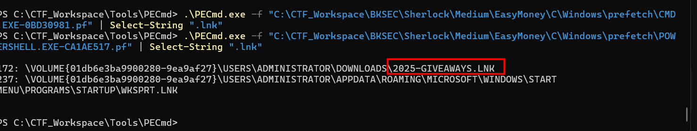

It truly does reference to the `lnk` file. Now let's inspect the run time, the file is downloaded at the 11-th second, so the 15-th second runtime should be the moment John click the shortcut file:

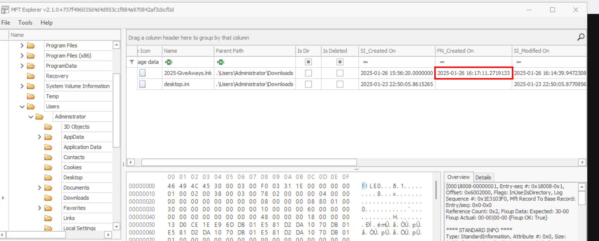

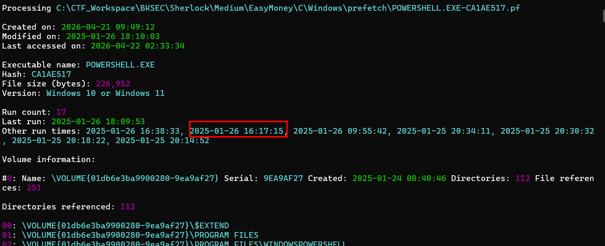

**Answer: 2025-01-26 16:17:15**

### Task 2: The previous malicious file executed an initial payload. What is the full path of this payload?

Still from the powershell pf, we can see an abnormal executable here, a fake version of `svchost.exe`:

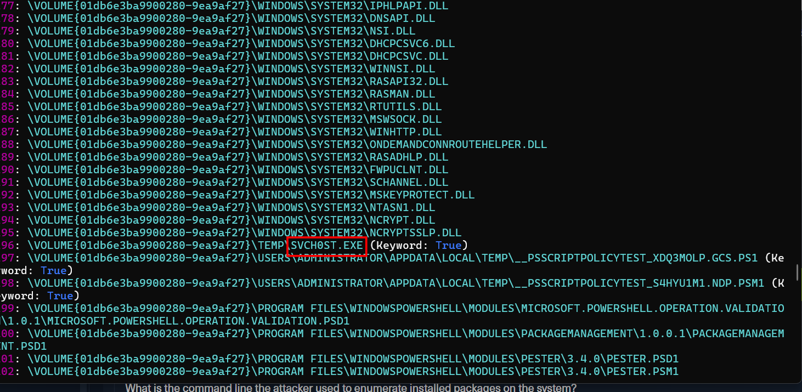

**Answer: C:\Temp\svch0st.exe**

### Task 3: At what timestamp did the payload execute and grant the attacker shell access?

The execution of that fake svch0st is definitely recorded in prefetch:

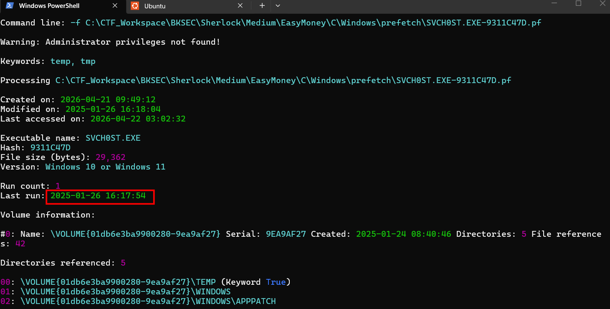

Its payload can also be seen in powershell log, it downloads a fake version from Github and places in temp folder:

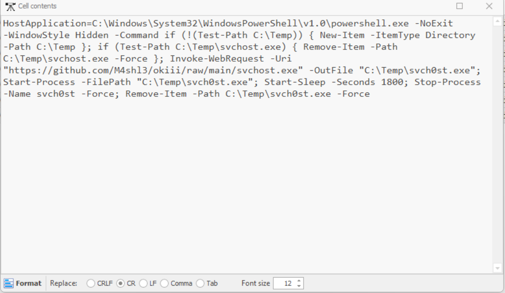

**Answer: 2025-01-26 16:17:54**

### Task 4: What is the command line the attacker used to enumerate installed packages on the system?

Yah, this is the only question where I can take advantage of the Events Log, still in Powershell log, nagivate to event ID 400:

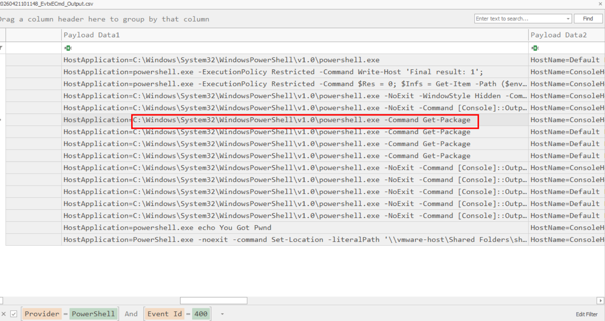

**Answer: C:\Windows\System32\WindowsPowerShell\v1.0\powershell.exe -Command Get-Package**

### Task 5: Which application did the attacker identify as vulnerable?

This question is also tricky for me, indeed, I don't know how to systematically find for the anaswer, I have to guess, and even OSINT, external search ... But all the software listed in SOFTWARE hive when I open by Registry Explorer do not match the length of the format given by Sherlock. After that, I realize those are just 64-bit softwares, and in the folder for 32-bit software, only this is found, luckily, its length also matches the format:

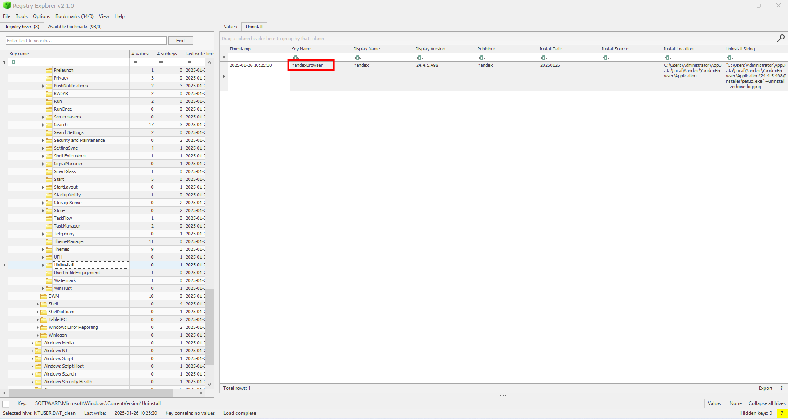

**Answer: YandexBrowser**

### Task 6: What version of that vulnerable application did the attacker identify?

The answer also lies in the previous screenshot:

**Answer: 24.4.5.498**

### Task 7: What is the CVE associated with this vulnerability?

Perform a simple search with the Yandex version, we can get the CVE:

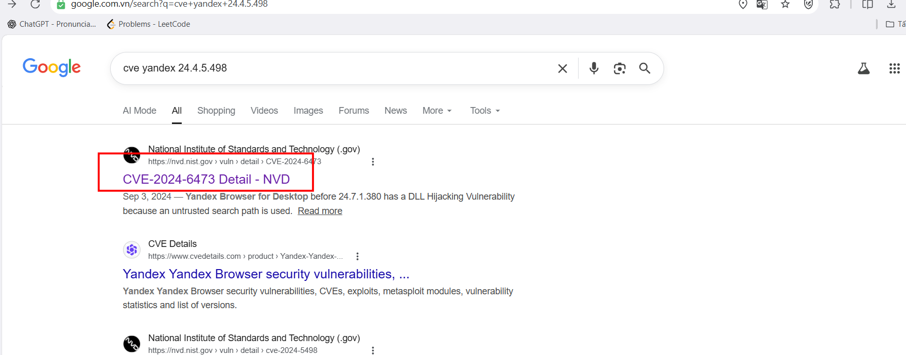

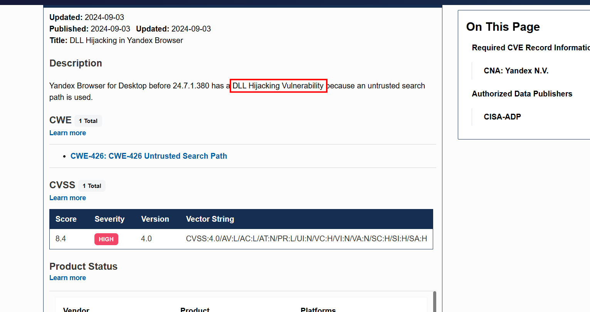

**Answer: CVE-2024-6473**

### Task 8: What is the name of the legitimate binary that the attacker used to deliver the malicious payload and establish persistence on the compromised system?

While inspecting the pf folder for suspicious file gets executed in that time range(the time shifts because my computer is set as UTC+7), I see the presence of `certutil.exe`, a binary used to get file from the Internet, try submitting and it is actually correct:

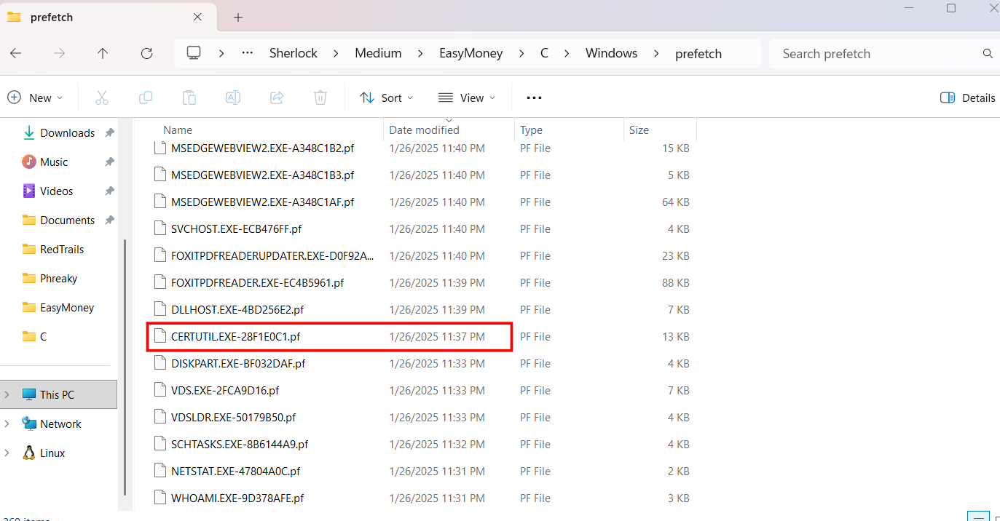

**Answer: certutil.exe**

### Task 9: What is the name of the malicious Portable Executable (PE) file that enabled him to accomplish his objective?

Before lauching PECmd with the certutil.exe pf, we should recall to the CVE description that it is a **DLL hijacking** vulnerability. That means, when browser.exe, or some updater.exe ... of Yandex gets executed, instead of loading the legitimate DLL, it may blindly load for a fake, malicious one with the same name in the same folder without checking the path

Now the result of PECmd confirms our hypothesis:

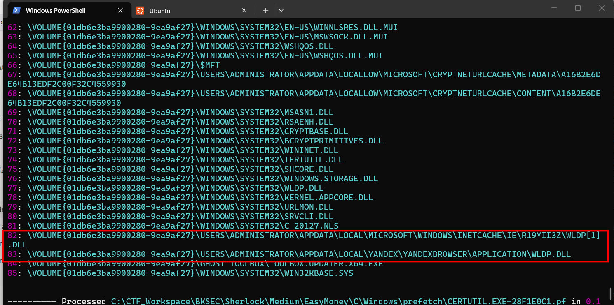

**Answer: wldp.dll**

### Task 10: What is the SHA-256 hash of that malicious file?

However, these two files, both the file and its cache is not included in the artifact, the investigator (and KAPE) does not include it in the C drive before handing to us. But remember that the file is downloaded with `certutil`, that means there is another cache in `%LOCALAPPDATA%\Microsoft\CryptnetUrlCache\Content\`, note the 68-th entry, that is exactly the fake `wldp.dll` we need:

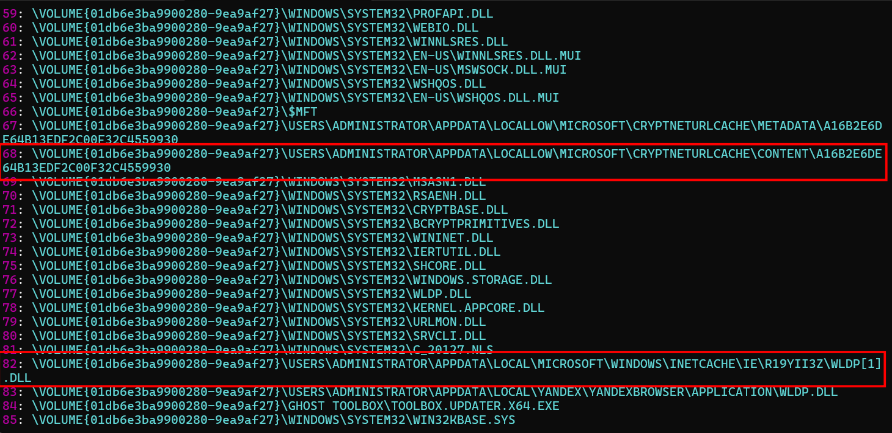

The file is still in the C drive, we can easily take its hash

**Answer: A1A17EBD90610D808E761811D17DA3143F3DE0D4CC5EE92BD66000DCA87D9270**

### Task 11: How many milliseconds of cumulative coded sleep delays occurred before the C2 binary provided a shell after the vulnerable application was launched?

I rename the file (actually that name is the hash of the url created by certutil) to wldp.dll and throw it to ghidra for decompiling. It spills out a lot of functions, I notice that the Sleep function is imported from kernel32.dll, for I right-click it and tell ghidra to show references to where it is used. Then the possibly main function appears, and this dll turns out to be just a **downloader/dropper**:

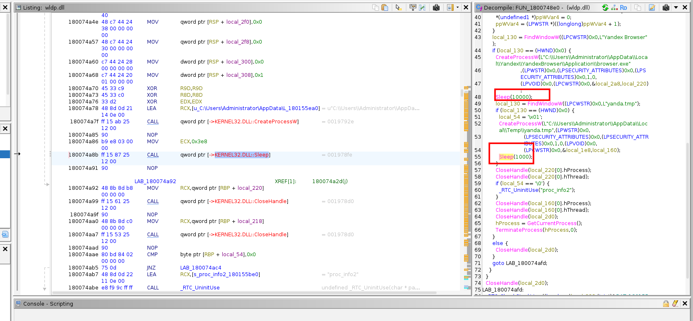

**Answer: 11000**

### Task 12: What is the mutex name used to ensure only one instance of the C2 binary runs at a time?

The answer lies in the previous function, but **what is mutex ?** :

Mutex stands for Mutual Exclusion. It's a Windows kernel object used to prevent two instances of the same program running simultaneously. In malware context this is important because it:

- Prevents double infection on the same machine
- Avoids noisy duplicate connections to C2 that might trigger alerts
- Used by analysts as an IOC (Indicator of Compromise) - if you see this mutex on another machine, it's infected

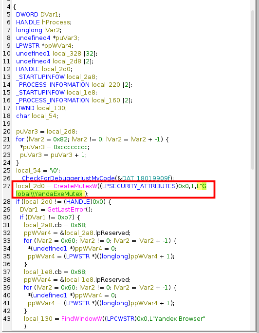

**Answer: Global\\YandaExeMutex**

### Task 13: What is the full path of the Command and Control (C2) Binary?

Still in the previous function, this is the main payload that `wldp.dll` downloads and executes:

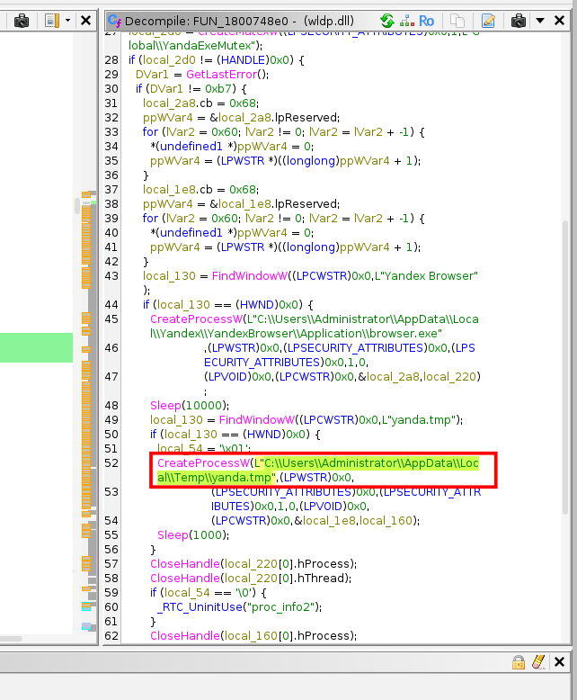

**Answer: C:\Users\Administrator\AppData\Local\Temp\yanda.tmp**

### Task 14: What is the name of the C2 framework used by the attacker?

The file does exist in MFT table, but it is nowhere to be seen in the C drive. However, it should be downloaded by the malicious dll dropper, so I check for the cache as in the previous task. Notice a file stands out as it size is about 15MB! I rename it for further analysis:

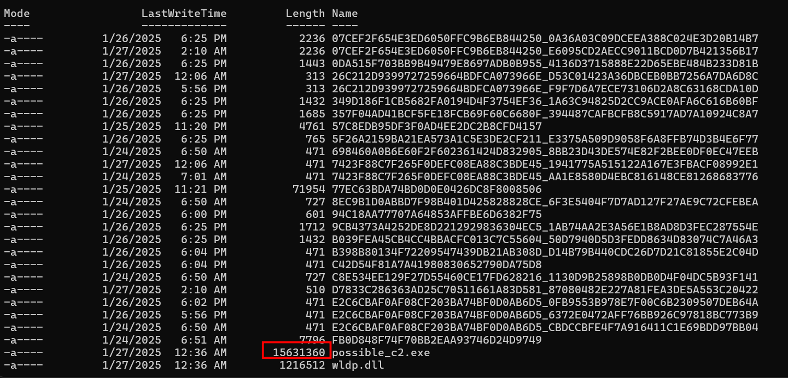

Try taking its hash and submit to VirusTotal, I immediately see the framework used, also our answer:

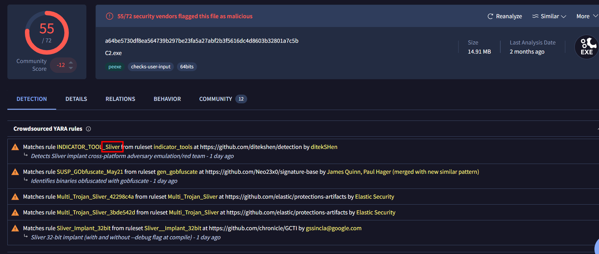

**Answer: sliver**

### Task 15: What is the IP address and port number of the malicious C2 server used by the attacker?

To be honest, I want to try decompiling it, but there are very very many functions inside, a true malware, so I think I'd better refer to VirusTotal for ready meal:

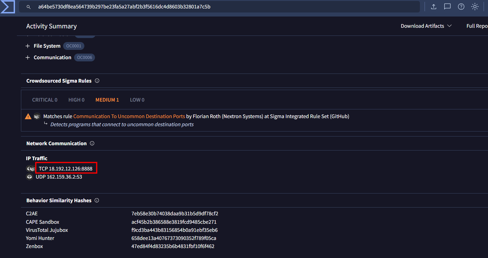

**Answer: 18.192.12.126:8888**

## Summary of the attack chain:

1. Initial Access
The attacker delivered a malicious shortcut file 2025Giveaway.lnk from the Downloads folder. The victim executed it at 2025-01-26 16:17:15.

2. Initial Payload Execution
The LNK file dropped and executed C:\Temp\svch0st.exe - a fake svchost binary - which granted the attacker shell access at 2025-01-26 16:17:54.

3. Reconnaissance
Through the shell, the attacker ran:

```powershell
C:\Windows\System32\WindowsPowerShell\v1.0\powershell.exe -Command Get-Package
```

This enumerated all installed software, identifying YandexBrowser version 24.4.5.498 as vulnerable to CVE-2024-6473 - a DLL hijacking vulnerability in the Yandex Browser update service.

4. Payload Preparation
The attacker had previously downloaded cyble.7z (saved in Recent as cyble.7z.lnk) - a PoC toolkit from CYBLE's CVE-2024-6473 research - and extracted it to `C:\Users\Administrator\Desktop\CYBLE-DLL\`
This folder contained MOVEFILE.EXE and the malicious DLL.

5. DLL Hijacking via CVE-2024-6473
Using certutil.exe at 2025-01-26 16:36, the attacker downloaded a malicious wldp.dll (a Sliver implant compiled as a ProxyDll - PDB: ProxyDll\distrib\03_lolnope\x64_debug\version.pdb) and planted it at `C:\Users\Administrator\AppData\Local\Yandex\YandexBrowser\Application\wldp.dll`
The file was cached by Windows in `C:\Users\Administrator\AppData\LocalLow\Microsoft\CryptnetUrlCache\Content\A16B2E6DE64B13EDF2C00F32C4559930`

6. Execution via DLL Hijack
When SERVICE_UPDATE.EXE from the Yandex Browser directory ran, it loaded the malicious wldp.dll instead of the legitimate Windows Lockdown Policy DLL — executing the attacker's code with the privileges of the updater.

7. C2 Staging
wldp.dll acted as a stager. It:

- Created mutex Global\YandaExeMutex to ensure single execution
- Launched browser.exe and waited 10,000ms
- Then executed the real Sliver C2 implant yanda.tmp from `C:\Users\Administrator\AppData\Local\Temp\yanda.tmp`
- Waited an additional 1,000ms (total coded sleep: 11,000ms)

8. C2 Communication
yanda.tmp was the actual Sliver C2 beacon (15MB implant), connecting back to the attacker's C2 server. The attacker used the Sliver C2 framework for post-exploitation.
Persistence
Three scheduled tasks were registered to maintain persistence:

- SYSTEM UPDATE FOR YANDEX BROWSER.JOB
- REPAIRING YANDEX BROWSER UPDATE SERVICE.JOB
- UPDATE FOR YANDEX BROWSER.JOB