# Log Forge

## Sherlock scenario

At AcmeSys Corp, employee John Miller reported unusual PC behavior after installing a Chrome update and running a command in File Explorer. You have been provided with a triage image with KAPE for investigation.

## Given artifact

KAPE triage of the C drive

## Questions

### 1. When was the user's last successful login to the system?

Use Security log, filter for ID 4624 and look for the last entry of user `user`:

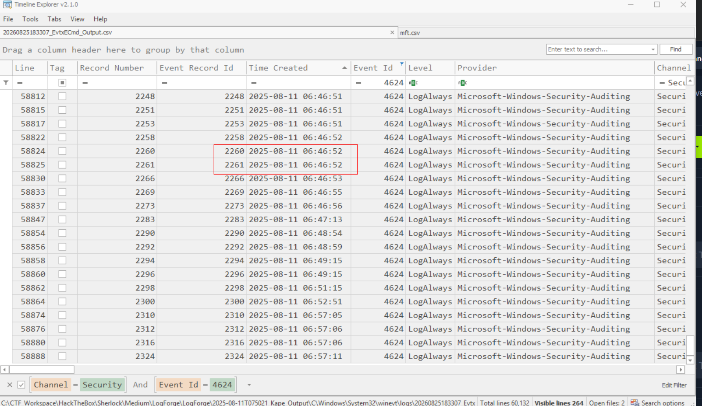

**Answer: 2025-08-11 06:46:52**

### 2. When did the victim last open the browser they regularly used on the system?

From the triage Local AppData, I can see his regular browser is Chrome, then I use its prefetch to get timestamp:

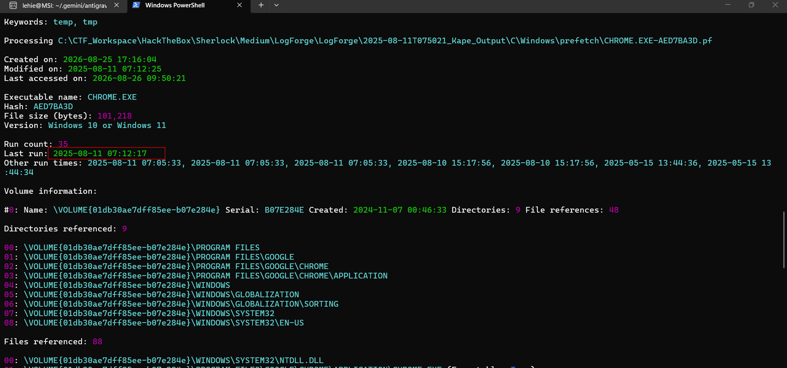

**Answer: 2025-08-11 07:12:17**

### 3. The user accessed a malicious website as a result of phishing attempt. What is the URL?

Using History database of Chrome:

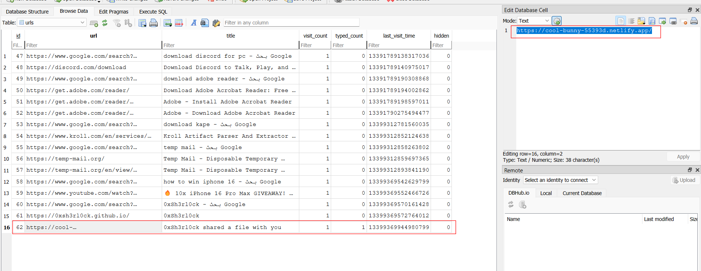

**Answer: `https://cool-bunny-55393d.netlify.app/`**

### 4. After the user visited the website, they were directed to copy a command from the website and enter it into the File Explorer search bar. Shortly after, strange behavior was noticed. What is the full URL that installed the reverse shell on the victim's device?

To see path typed into File Explorer search bar, we use the NTUSER.dat registry hive, look for this key:

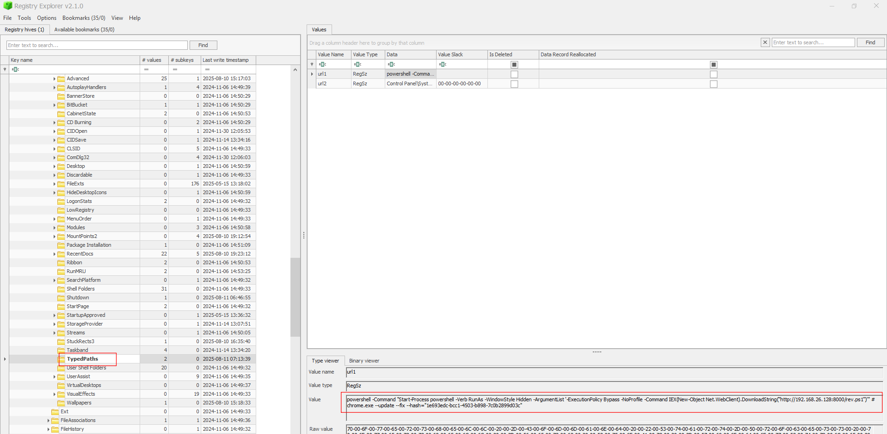

**Answer: `http://192.168.26.128:8000/rev.ps1`**

### 5. This attack preys on non-technical users by luring them into traps and manipulating them into unknowingly executing commands on the system. Based on the analysis of the previously identified command, what is this type of attack called?

Fake verification page often asks user to paste command to the Run dialog (Windows+R), that is clickfix, and this attempt tricks user to use the File Explorer search bar, that is Filefix

**Answer: FileFix**

### 6. After the attack, the user noticed that Notepad had opened with a message left by the attacker. What is the email address of the attacker?

Use notepad's prefetch, we see this text file is being referenced:

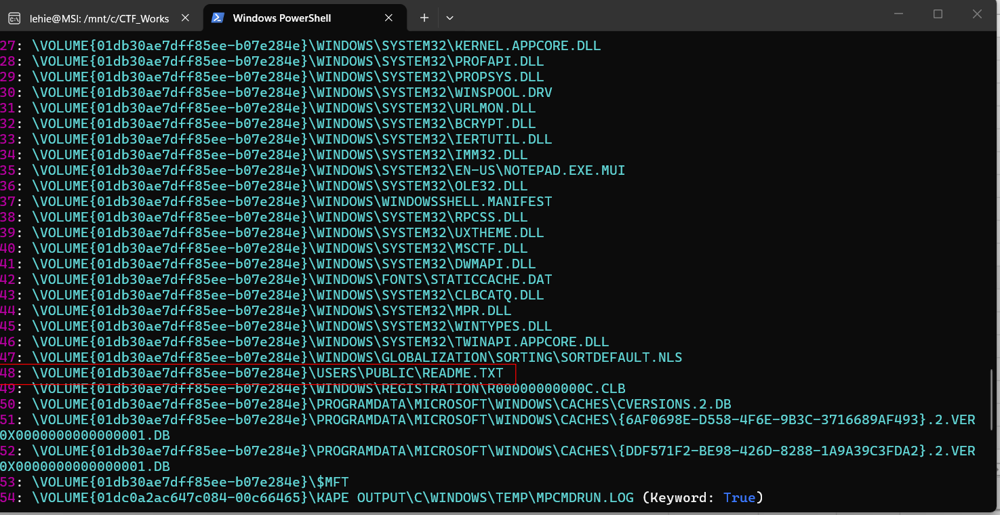

Parse the MFT and search for that file, great it is resident, let's grab its entry number:

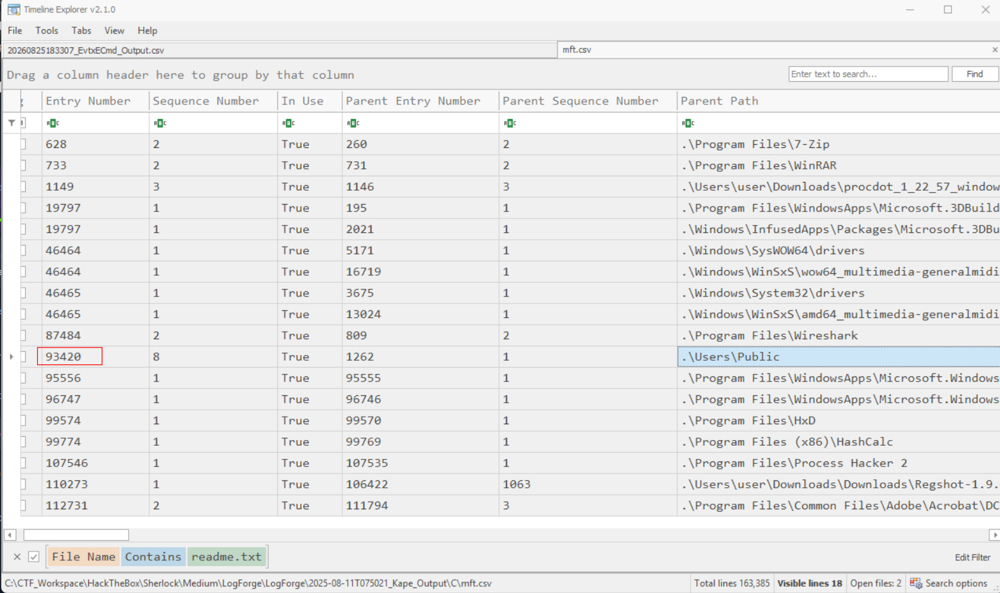

Use a script to carve its content, note that we must use UTF-16LE encoding:

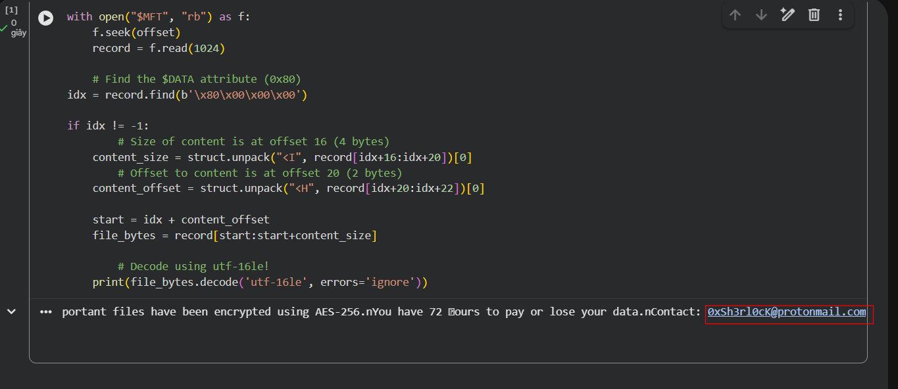

**Answer: 0xSh3rl0cK@protonmail.com**

### 7. The attacker downloaded malware to infect the victim's device. What is the full path of the malicious malware file?

Filter for Sysmon event ID 1 (process creation), and filter for parent commandline containing the malicious ps1 we discovered:

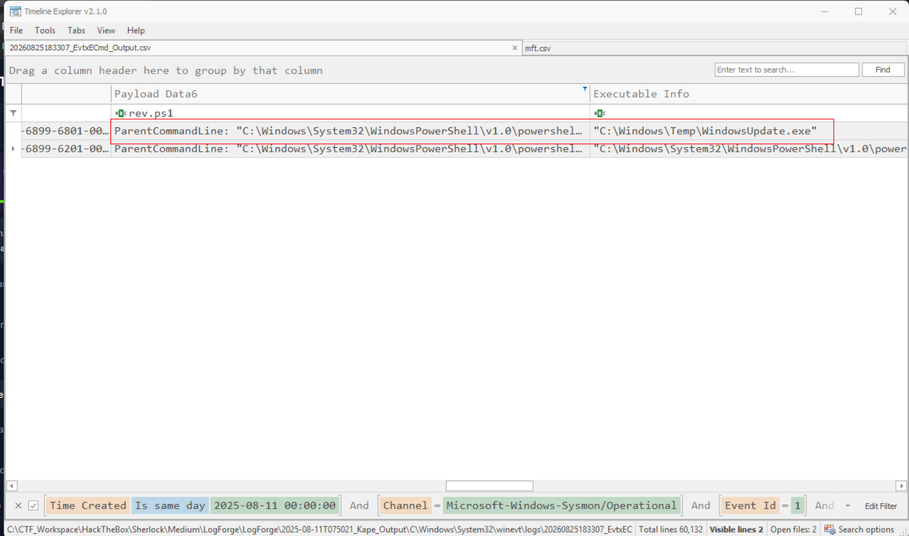

We can see it drops and executes a fake updater here

**Answer: C:\Windows\Temp\WindowsUpdate.exe**

### 8. What is the product name of this malicious file?

See in the Payload data cell (thanks to Sysmon logging the metadata):

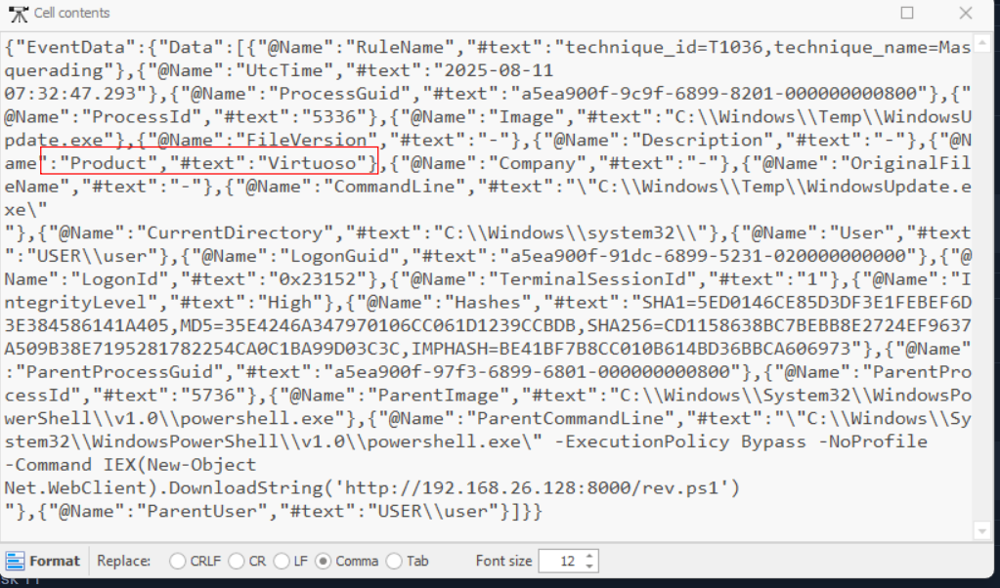

**Answer: Virtuoso**

### 9. The malware created several directories on the system. Under which path were these files created?

Filter for Sysmon ID 11 (File creation) and search for the fake updater, we will see it creates a lot of directories with random name inside Temp folder:

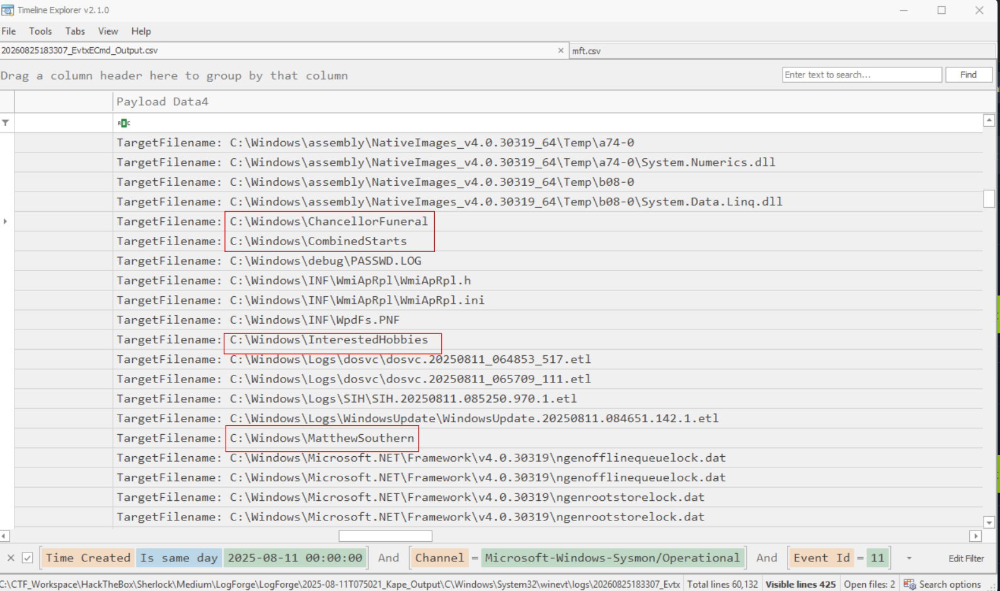

**Answer: `C:\Windows\`**

### 10. A script file was staged on the machine by the malware. What is the full command used to achieve this?

Filter for ID 1 and limit the parent commandline to the fake updater, we will see the copy command:

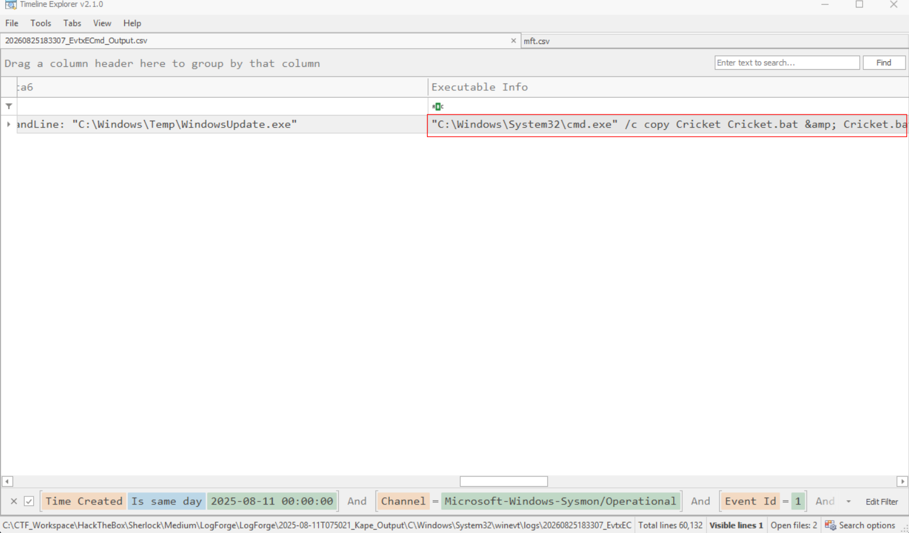

**Answer :"C:\Windows\System32\cmd.exe" /c copy Cricket Cricket.bat & Cricket.bat**

### 11. What is the full path of the staged script file?

See in the parsed MFT

**Answer: C:\Users\user\AppData\Local\Temp\Cricket.bat**

### 12. The attacker dropped an automation utility on the system with a legacy file format. What is the full path of this newly dropped file?

Still with Sysmon ID 1, we search for parent commandline of the Cricket batch script:

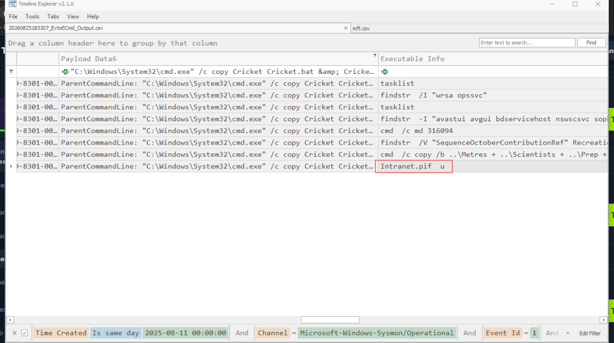

`.pif` is a legacy executable format used in MS-DOS, but now attackers still love it as it can still be used just as regular `.exe` file. We can see its path in the payload data cell:

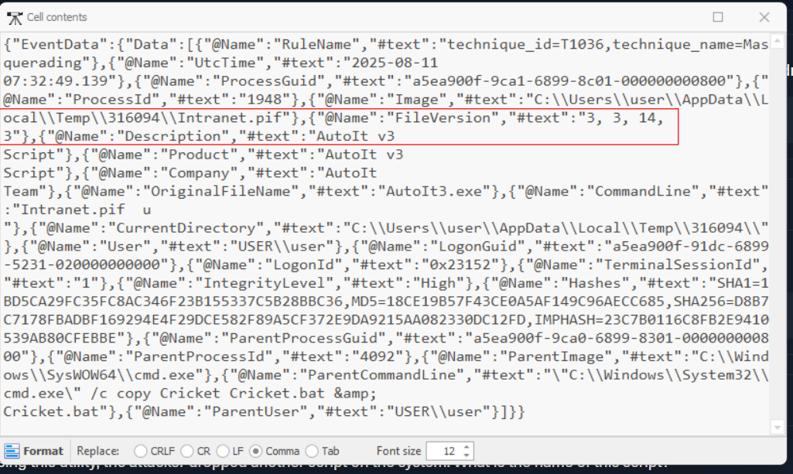

**Answer: C:\Users\user\AppData\Local\Temp\316094\Intranet.pif**

### 13. What is the name and version of the utility?

See in previous snapshot

**Answer: AutoIt 3.3.14.3**

### 14. Using this utility, the attacker dropped another script on the system. What is the name of this script?

Filter for ID 11, then search for `intranet` string, we see the created script here:

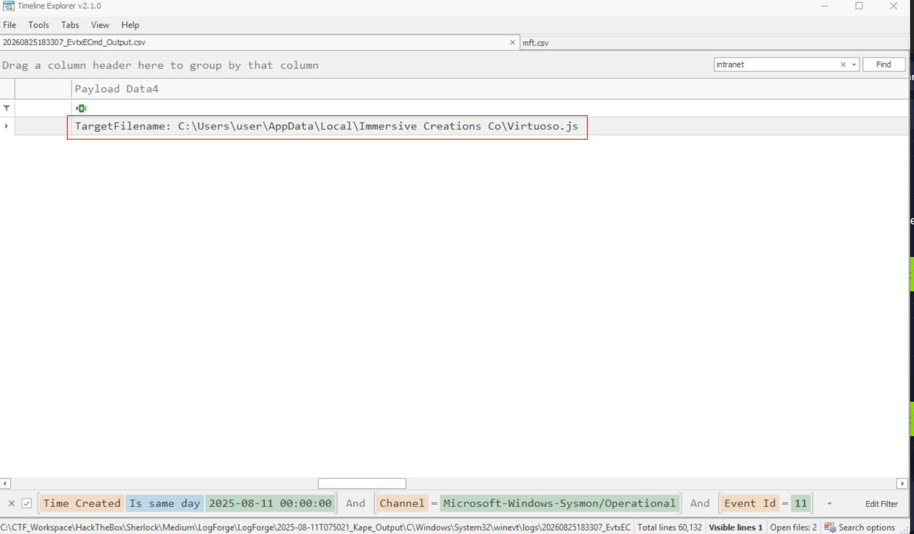

**Answer: Virtuoso.js**

### 15. In order to evade defenses for unattended access, the malware executed commands to look for EDR and antivirus presence on the system. What is the full command line of the second command used to achieve this?

In fact this is run from the batch script, we already see it!

**Answer: findstr -I "avastui avgui bdservicehost nswscsvc sophoshealth"**

### 16. What is the full command used to set up persistence on the system?

Nothing to rely on, I just filter for cmd process:

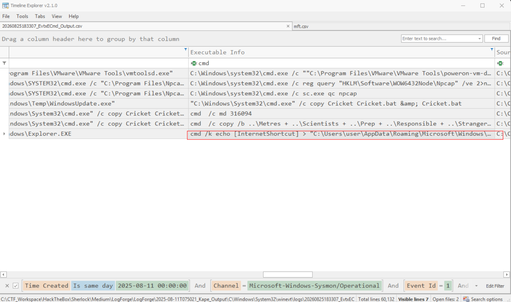

**Answer :cmd /k echo [InternetShortcut] > "C:\Users\user\AppData\Roaming\Microsoft\Windows\Start Menu\Programs\Startup\Virtuoso.url" & echo URL="C:\Users\user\AppData\Local\Immersive Creations Co\Virtuoso.js" >> "C:\Users\user\AppData\Roaming\Microsoft\Windows\Start Menu\Programs\Startup\Virtuoso.url" & exit**

