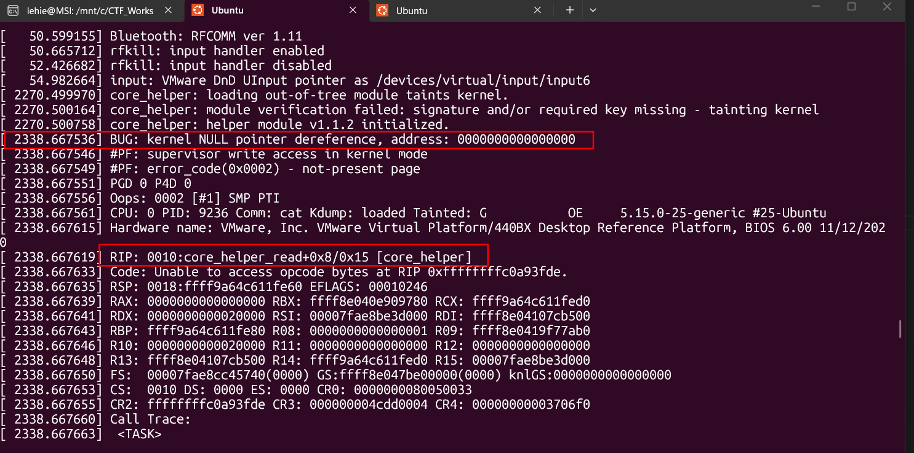
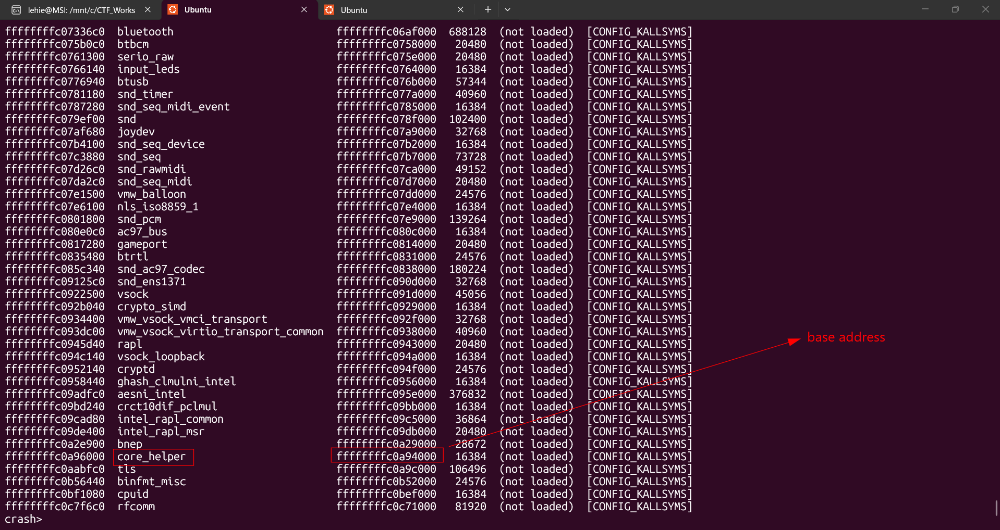
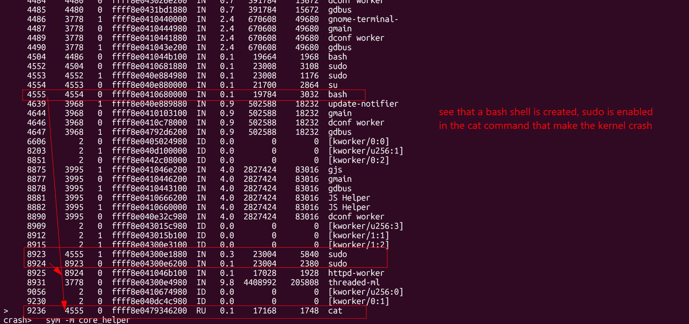

# MidnightCrash


## Sherlock scenario
A production server crashed unexpectedly and rebooted. The crash happened at a strange time, and we doubt it was a simple hardware fault. A kernel crash dump was captured. Your mission is to analyze it to find the real cause of the crash and determine if any other suspicious activity was present on the system.

## Given artefacts


## Foundational knowledge
**Linux Kernel Memory Forensics & `crash` Utility**

When a Linux system encounters a critical, unrecoverable error, it triggers a "Kernel Panic". To aid in post-mortem debugging and forensics, the system can be configured to capture a complete snapshot of the system's volatile memory (RAM) precisely at the moment of the crash. This snapshot is typically referred to as a `kdump` (Kernel Dump) or `vmcore`. To a human or standard text editor, this file is incomprehensible—it is a massive binary blob of 1s and 0s representing the raw physical memory.

To make sense of this raw memory dump, forensic analysts use the `crash` utility, a specialized debugger tailored for the Linux kernel. However, `crash` requires a translation layer to map raw memory addresses into human-readable data types. This is where the Kernel Debugging Symbols (`vmlinux-dbgsym` or simply `vmlinux`) come into play. This file contains the exact layouts of all the kernel's C structs, global variables, and function addresses for the specific version of the kernel that crashed. By combining the `kdump` and the `vmlinux` file, `crash` can rebuild the state of the operating system exactly as it was when it died.

Here is a breakdown of the core commands used in this forensic analysis and the data structures they interact with:

- **`sys` (System Status):** This command queries the global kernel variables that store the system's state. It quickly returns high-level information like the hostname, the OS release, the time of the crash, the number of CPUs, and, crucially, the specific task (process) that was actively executing on the CPU at the time of the panic.
- **`log` (Kernel Ring Buffer):** The kernel maintains a circular memory buffer (often called `log_buf`) where it logs all its internal messages, warnings, and errors. This is the exact same buffer you view when running `dmesg` on a live system. In a memory dump, reviewing this buffer provides the exact technical reason for the crash (e.g., a NULL pointer dereference) and can reveal logs from maliciously loaded kernel modules.
- **`bt` (Backtrace):** This command analyzes a process's stack memory. When functions are called, they are pushed onto the stack. By tracing the stack of the active process, `crash` reconstructs the precise chronological sequence of function calls (the execution path) that led to the crash, helping identify the exact function that caused the fault.
- **`net` (Network Sockets):** This command walks through the kernel's internal linked lists of network socket structures (such as `inet_sock` and `socket`). Since tools like `ifconfig` or `ip` cannot be run on a dead memory dump, iterating through these structs reveals all active network connections and listening ports, effectively allowing analysts to identify the IP address bound to the server's interfaces.
- **`ps` (Process Status):** The kernel tracks every running, sleeping, and zombie process in a massive linked list composed of `task_struct` objects. The `ps` command traverses this list and prints a snapshot of the process tree. This is invaluable for tracking down suspicious processes and visualizing parent-child relationships (like tracing a malicious payload spawned by a hijacked `sudo` command).
- **`cmdline` and `files`:** These commands delve deeper into the `task_struct` of an individual process. 
  - `cmdline` navigates to the process's user-space memory to retrieve the exact raw arguments passed to it upon execution (e.g., revealing that `cat` was used on a specific file).
  - `files` explores the process's open file descriptor (FD) table, translating internal kernel file pointers into absolute paths. This proves which files a process was actively reading from or writing to when the system crashed.
- **`mod` (Modules):** This command parses the list of loaded kernel modules. It provides the names of the modules, their sizes, and their base memory addresses—the exact locations in RAM where the modules' code was injected.
- **`sym` (Symbols):** This command queries the kernel's symbol tables. When applied to a specific module (e.g., `sym -m module_name`), it lists every function and variable that the module registered in memory. This allows analysts to identify specific routines, such as cleanup or initialization functions, without needing to reverse engineer or decompile the module's binary code.

## Questions

### 1. What is the hostname of the crashed server?

Run `crash` on the kdump file and the symbol file, the initial message returns answers for 3 questions, not just this task:

```text
      KERNEL: vmlinux-dbgsym  [TAINTED]
    DUMPFILE: ubuntu22.04-5.15.0-25-generic-202511032103.kdump  [PARTIAL DUMP]
        CPUS: 2
        DATE: Tue Nov  4 02:03:29 UTC 2025
      UPTIME: 00:38:58
LOAD AVERAGE: 0.15, 0.08, 0.12
       TASKS: 548
    NODENAME: ubuntu-2204
     RELEASE: 5.15.0-25-generic
     VERSION: #25-Ubuntu SMP Wed Mar 30 15:54:22 UTC 2022
     MACHINE: x86_64  (2687 Mhz)
      MEMORY: 2 GB
       PANIC: "Oops: 0002 [#1] SMP PTI" (check log for details)
         PID: 9236
     COMMAND: "cat"
        TASK: ffff8e0479346200  [THREAD_INFO: ffff8e0479346200]
         CPU: 0
       STATE: TASK_RUNNING (PANIC)
```

**Answer: ubuntu-2204**

### 2. What is the assigned IP address of the server at time of crash?

Utilize `net` option:

```text
crash> net
   NET_DEVICE     NAME       IP ADDRESS(ES)
ffff8e040258e000  lo         127.0.0.1, ::1
ffff8e0431754000  ens33      192.168.1.135, fe80::7c3a:396b:d8a6:c8a2
```

**Answer: 192.168.1.135**

### 3. When did the server crash? (UTC)

From initial message

**Answer: 2025-11-04 02:03:29**

### 4. The crash was triggered by a specific process. What was the PID of the active process that caused the panic?

Also from initial message

**Answer: 9236**

### 5. Which command-line utility was leveraged by the previous process to trigger the crash?

Still from initial message

**Answer: cat**

### 6. What was the kernel's fatal panic bug message?

The initial message does not fully show what we need, I use `log` option to see all internal messages, scroll to near the end, we can see the bug from aforementioned PID:



We can also see the function currently at the top of the stack (in RIP register)

**Answer: kernel NULL pointer dereference, address: 0000000000000000**

### 7. What is the absolute path of the malicious file that caused the kernel crash?

Running `files` option to see which file was touched by the process at the crash time:

```text
crash> files
PID: 9236     TASK: ffff8e0479346200  CPU: 0    COMMAND: "cat"
ROOT: /    CWD: /root/module
 FD       FILE            DENTRY           INODE       TYPE PATH
  0 ffff8e040c25db00 ffff8e04072300c0 ffff8e0431368780 CHR  /dev/pts/1
  1 ffff8e040c25db00 ffff8e04072300c0 ffff8e0431368780 CHR  /dev/pts/1
  2 ffff8e040c25db00 ffff8e04072300c0 ffff8e0431368780 CHR  /dev/pts/1
  3 ffff8e04107cb500 ffff8e04072d8000 ffff8e0419f77ab0 REG  /proc/jiffies_ext
```

**Answer: /proc/jiffies_ext**

### 8. What is the name of the function at the top of the kernel's call stack at time of the crash?

Covered in task 6

**Answer: core_helper_read**

### 9. This function belongs to a malicious kernel module. What is the base memory address of this module?

We know the function `core_helper_read` belongs to the module `core_helper`, let's run `mod` and grep for that module:



**Answer: ffffffffc0a94000**

### 10. What is the function name in the malicious kernel module that performs cleanup?

Run `sym` command with -m option to see registered function:

```text
crash>   sym -m core_helper
ffffffffc0a94000 MODULE START: core_helper
ffffffffc0a94000 (t) core_helper_read
ffffffffc0a94015 (t) core_helper_exit
ffffffffc0a94015 (T) cleanup_module
ffffffffc0a95024 (?) _note_9
ffffffffc0a9503c (?) _note_8
ffffffffc0a950e0 (?) proc_file_ops
ffffffffc0a96000 (?) __this_module
ffffffffc0a98000 MODULE END: core_helper
```

It's in plain sight now

**Answer: cleanup_module**

### 11. Before the kernel panic, a suspicious process was running with sudo privileges, What was the process name?



Run `ps` to see the running processes

**Answer: httpd-worker**
